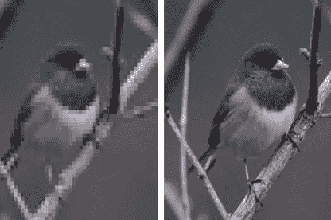
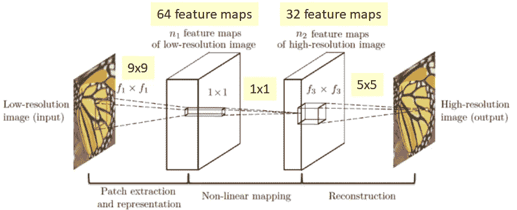
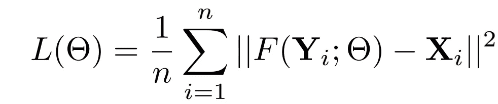

# 超分辨率卷积神经网络-直观指南

> 原文：<https://medium.com/analytics-vidhya/super-resolution-convolutional-neural-network-an-intuitive-guide-2fe9b5277569?source=collection_archive---------16----------------------->

从低分辨率图像中提取高分辨率图像是计算机视觉中的一个经典问题。2015 年发表的 SRCNN 论文是对此问题的现有解决方案的重大改进，因为它简单、高效，并提供了端到端的解决方案。这篇博客旨在让你对此有一个直观的理解。
这篇博文假设你对卷积神经网络的工作原理有一个基本的了解。

# 建模问题

假设输入图像是图像 Y，算法的目标是找到与地面真实高分辨率图像 x 相似的函数 F(Y)。

# 问题解决方法

在 SRCNN 出现之前，一种预先存在的叫做[稀疏编码](https://www.di.ens.fr/willow/pdfs/IASC08.pdf)的方法被用于图像恢复。它使用了一个管道，涉及从图像中提取重叠的补丁，将它们映射到更高分辨率的空间，然后聚合这些高分辨率向量，然后通过聚合这些向量来恢复图像。但是它涉及到复杂的管道和复杂数学技术的使用。SRCNN 的作者聪明地以 CNN 的形式模拟了相同的管道。

## 补丁提取

它包括以重叠的方式从图像中提取或裁剪出各种块，并将它们转换成高维向量以供进一步处理。这可以被认为是在图像的每个像素上滑动的窗口，并且将每个窗口转换成高维向量。

## 非线性映射

将上述提取的高维向量非线性映射到其他高维向量。请记住，在这种情况下，后面的高维向量将是高分辨率图像的一部分。

## 恢复

将上述矢量聚合成高分辨率图像，从而恢复输入图像。

# 电力网设计

*   补丁提取:64 个大小为 9 x 9 x 3 的过滤器用于执行第一阶段，即解决方案管道的补丁提取。第一层可以表示为:
    F1(Y)= W1∫Y+B1
    其中 Y 是图像，
    W1 对应于正在使用的 64 个滤波器，
    B1 对应于正在使用的偏置。
*   非线性映射:先前发现的特征映射然后通过 [relu](/@danqing/a-practical-guide-to-relu-b83ca804f1f7) 激活函数。大小为 64×1×1 的 32 个过滤器用于将先前的激活从 relu 映射到更高分辨率的空间。对其应用了 relu 激活，以确保映射不是线性的。它可以表示为:
    F2(Y) = max (0，W2∫F1(Y)+B2)
    其中 Y 是图像，
    W2 对应于正在使用的 32 个滤波器，
    B2 对应于正在使用的偏差。
*   恢复:然后对高分辨率映射进行大小为 5×5 的 3 个过滤器(因为图像由 3 个通道组成)处理，以便集合前一层中的高分辨率映射。这是一个线性映射，可以表示为:
    F(Y)= W3∫F2(Y)+B3
    其中 Y 是图像，
    W3 对应于正在使用的 3 个滤波器，
    B3 对应于正在使用的偏差。

# 培养

模型的输入是标准的低分辨率图像。而训练它的输出被设置为它的等效高分辨率图像。使用均方误差作为要最小化的损失。在这种情况下，误差仅仅是地面真实高分辨率图像和生成的高分辨率图像之间的差异。

SRCNN 的损失函数，其中 F(Y)表示预测的高分辨率图像，Xi 表示地面实况高分辨率图像。

# 为什么是 SRCNN？

## 简化结构

如上所述，它将早期使用的复杂算法管道的解决技术整合到一个单一的卷积网络中，从而为该问题提供了端到端的解决方案。

## 深度学习的胜利

作者能够证明深度学习在解决经典计算机视觉问题方面是如何有用的，这在当时是有影响的。

## 高效的

使用中等数量的过滤器，网络甚至能够在 CPU 上实现快速处理速度。

## 提高性能

作者还证明了不同的数据集和更多的图层能够提高数据集的性能。

# 结论

将 SRCNN 的结果与 SC(稀疏编码)、A+( [调整锚定邻域回归方法](https://homes.esat.kuleuven.be/~konijn/publications/2014/3926_postprint.pdf))和 ANR( [锚定邻域回归方法](http://people.ee.ethz.ch/~timofter/publications/Timofte-ICCV-2013.pdf))等最先进方法进行比较，在 PSNR ( [峰值信噪比](https://www.ni.com/en-us/innovations/white-papers/11/peak-signal-to-noise-ratio-as-an-image-quality-metric.html))指标方面，SRCNN 显然是赢家。事实证明，这是一个简单、可靠且准确的解决方案。我希望这篇文章对这个算法提供了很好的见解。我强烈建议您浏览原始论文，并进一步研究这个经典计算机视觉问题的其他解决方案。

*原文链接及代码:*[*https://papers with code . com/paper/image-super-resolution-using-deep*](https://paperswithcode.com/paper/image-super-resolution-using-deep)