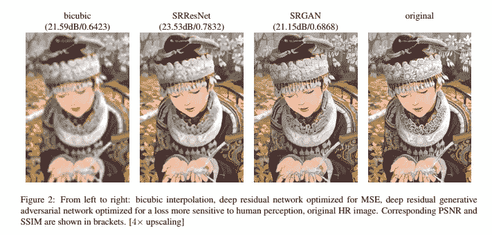
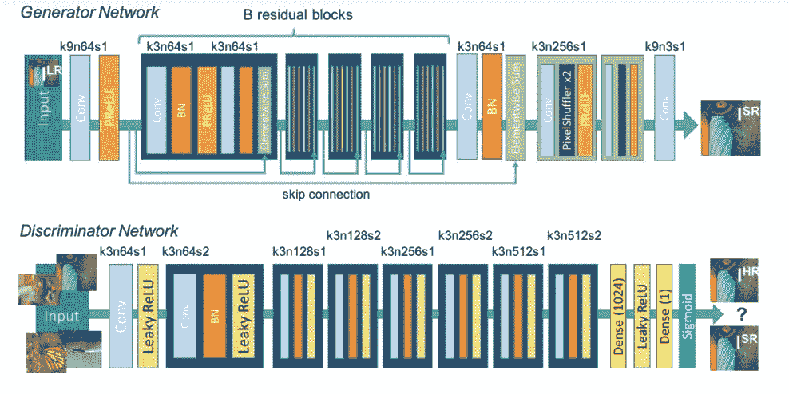
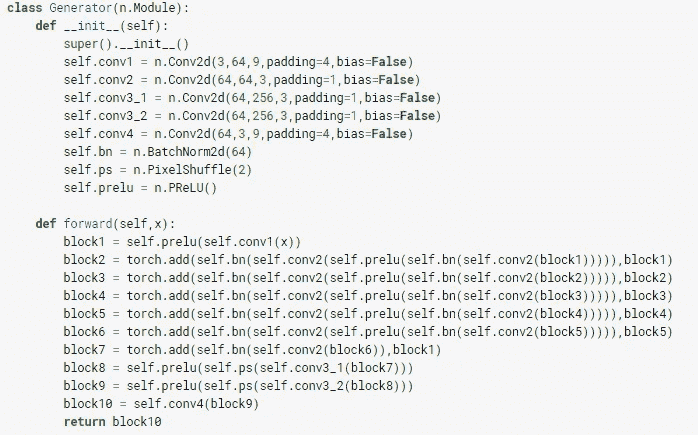
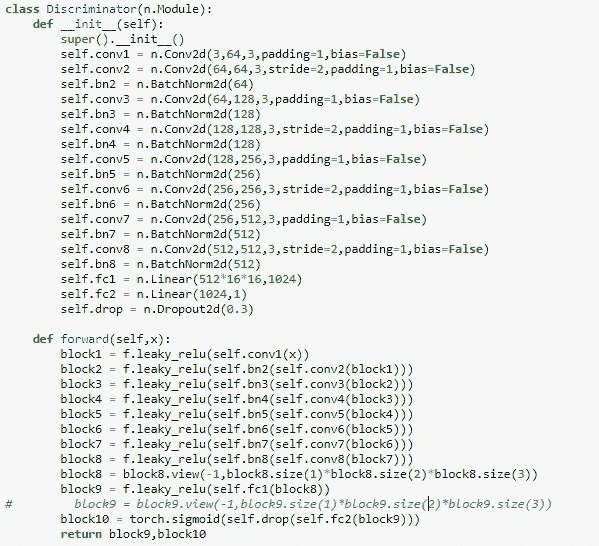
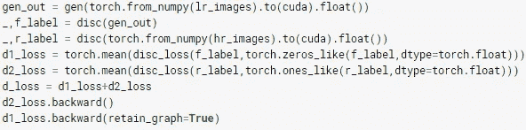
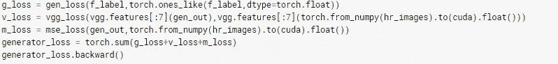

# 超分辨率氮化镓(SRGAN)

> 原文：<https://medium.com/analytics-vidhya/super-resolution-gan-srgan-5e10438aec0c?source=collection_archive---------3----------------------->

这是使用生成式对抗网络实现的纸张[照片级单幅图像超分辨率。在本文中，PyTorch 库被用来实现本文。](https://arxiv.org/abs/1609.04802)

SRGAN 使用 GAN 从低分辨率图像产生高分辨率图像。在该实现中，使用 GAN 的概念将 64×64 图像转换成 256×256 图像。为了训练，使用高斯模糊将高分辨率图像下采样为低分辨率图像，然后将其大小调整为 64 X 64。总的来说，SRGAN 将图像向上采样 4 倍，产生高分辨率图像。生成器用于从 64×64 图像生成 256×256 图像，鉴别器用于将生成的图像与 HR 图像区分开。

[来源](https://arxiv.org/pdf/1609.04802.pdf)

# 网络体系结构

[来源](https://arxiv.org/pdf/1609.04802.pdf)

以上是参考文献中使用的发生器和鉴别器的架构。k9n64s1 表示大小为 9 的内核，64 个通道，步距为 1。在鉴别器中使用残余块。网络架构中使用的两个新概念是 **PRelu** 和 **PixelShuffler。**

> **PRelu** 是一种 leakyRelu，它不是预定义的斜率 0.01，而是神经网络自己决定斜率值的参数。当 x < 0 时 y=ax，当 x > 0 时 y=x，其中 a 是由网络确定的参数。
> 
> P **像素重排**将形状张量(N，C，H，W)重排为(N，C/r*r，H*r，W*r)其中 r 为重排因子。它基本上将深度(通道)转换为空间(高度和宽度)。在生成器中，pixelshuffling 用于对图像大小进行向上采样。

## **发电机**

发电机组

这是实现中使用的生成器模块。首先在构造函数中定义必要的操作，然后在 forword 函数中使用它们来构建网络。块 2 至块 6 是剩余网络，PRelu 用于块 9 和块 10。

## **鉴别器**

鉴别器

这是参考文献中使用的鉴频器网络。增加一个额外的脱落层，以停用一定比例的鉴别器神经元，从而防止鉴别器超过发生器的功率。

# 损失函数

在这个实现中，对于鉴别器正常的反向串行丢失。

## **鉴别器损耗**

鉴频器损耗

这里，LR 图像被传递到生成器中以生成高分辨率图像，然后将这些生成的图像以及原始 HR 图像传递到鉴别器以分别获得伪标签和真标签。然后，通过给原始 HR 图像分别标上 0 和 1 的标签，训练鉴别器来鉴别生成的图像是假图像，而原始 HR 图像是真实图像。disc_loss 实际上是二元交叉熵损失。

## **发电机损耗**

发电机损耗

发生器损耗实际上是 GAN 中使用的正常发生器损耗、内容损耗和像素间平均损耗之和。首先，将生成的图像传入鉴别器得到的假标签作为一个标签。这意味着生成器正在传送鉴别器，该鉴别器正在生成高分辨率图像，而鉴别器认为该图像不是高分辨率图像。

这样就实现了 GAN 的最小-最大博弈规则。同时，还使用了内容损失(vgg 损失)。在这种情况下，生成的图像和 HR 图像通过第二层预训练的 vgg19(用于匹配特征),然后计算平均损失。同时，还计算生成的图像和 HR 图像之间的像素到像素均方误差。所有这 3 个损耗相加，形成 SRGAN 的发电机损耗。

为了优化，Adam optimizer 以 0.0001 的学习率使用。

# 参考

[斯尔根纸业](https://arxiv.org/pdf/1609.04802.pdf)

# 履行

[Github](https://github.com/vishal1905/Super-Resolution)