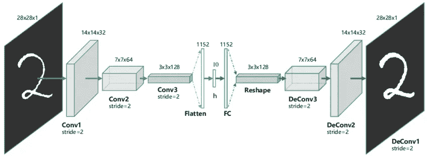
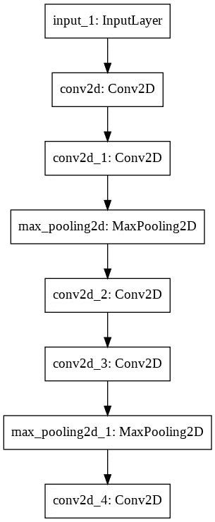
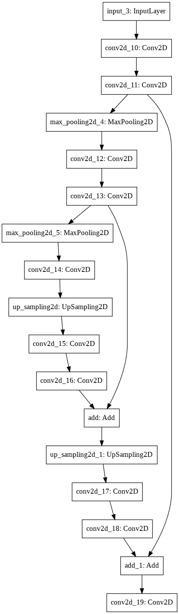
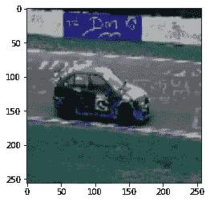
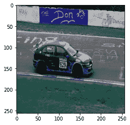

# 使用自动编码器和 TF2.0 的超分辨率

> 原文：<https://medium.com/analytics-vidhya/super-resolution-using-autoencoders-and-tf2-0-505215c1674?source=collection_archive---------7----------------------->



图片来源:[https://www . researchgate . net/figure/The-structure-of-proposed-convolutionary-auto encoders-CAE-for-The-middle-The-there _ fig 1 _ 320658590](https://www.researchgate.net/figure/The-structure-of-proposed-Convolutional-AutoEncoders-CAE-for-MNIST-In-the-middle-there_fig1_320658590)

通过这篇文章，我将展示如何制作一个自动编码器网络，可以将图像超分辨率提高到 4 倍，也可以将图像超分辨率提高到 10 倍，甚至更高。

# 为什么要使用自动编码器？

你可能有很多原因想要使用这种类型的网络，其中一个例子是在聊天应用程序中传输图像。像 WhatsApp 和 Instagram 这样的聊天应用程序使用这种类型的压缩，尽管更复杂，训练时间更长，数据量更多，但他们使用这种压缩是因为由于图像的压缩，上传的数据量下降，使得上传速度上升，并且存储在服务器中的数据量下降，而图像质量没有任何损失。

# 链接到笔记本

[](https://colab.research.google.com/drive/1YXy_9B4h-NC7KU_40aP5U2SgVCVw4H_D) [## 谷歌联合实验室

### 编辑描述

colab.research.google.com](https://colab.research.google.com/drive/1YXy_9B4h-NC7KU_40aP5U2SgVCVw4H_D) 

我正在链接一个 Colab 笔记本，因为这个项目是[在这里](https://colab.research.google.com/drive/1YXy_9B4h-NC7KU_40aP5U2SgVCVw4H_D)。我将使用谷歌 Colab，因为他们为培训提供免费的云 GPU，使得对这些任务的高功率机器的需求变得无用。

# 概观

首先，我将带您逐个构建网络的编码器部分，然后制作编码器和解码器，连接它并用自定义数据对其进行训练，在整个过程中，我还将解释自动编码器神经网络及其改进方法。

# 要导入的库

我们将使用 **Tensorflow 2.0** 构建网络，使用 U **rllib** 模块下载图像，使用 **Numpy** 处理图像数组，使用 **Open-Cv2** 调整图像大小，使用 **Os** 模块加载图像，使用 **Matplotlib** 显示图像。

# 什么是自动编码器？

自动编码器只是一个无监督的神经网络，它通过设计学习如何减少数据并尽可能少地丢失数据来重建数据。

你可能已经猜到了，它由一个编码器和一个解码器组成。编码器的作用是将数据压缩到一个较低的维度，以便只有最有影响的特征像 PCA 一样保留下来，而解码器的作用是从较低维度的表示中重建数据，使其尽可能接近原始数据。

# 构建编码器

这里我们有 2 个 Conv2D 模块，因为我们的图像只有 256 像素的高度和宽度。然而，当使用 1920 X 1080 像素的图像时，我建议使用 4 个以上的 Conv2D 模块，滤波器增加 2 倍。这将确保有足够的参数可以改变，并且有足够的过滤器最终可以用于将图像超分辨率提高到 10 倍。

这是模型总结。

```
Model: "model" _________________________________________________________________ Layer (type)                 Output Shape              Param #    ================================================================= input_2 (InputLayer)         [(None, 256, 256, 3)]     0          _________________________________________________________________ conv2d_5 (Conv2D)            (None, 256, 256, 64)      1792       _________________________________________________________________ conv2d_6 (Conv2D)            (None, 256, 256, 64)      36928      _________________________________________________________________ max_pooling2d_2 (MaxPooling2 (None, 128, 128, 64)      0          _________________________________________________________________ conv2d_7 (Conv2D)            (None, 128, 128, 128)     73856      _________________________________________________________________ conv2d_8 (Conv2D)            (None, 128, 128, 128)     147584     _________________________________________________________________ max_pooling2d_3 (MaxPooling2 (None, 64, 64, 128)       0          _________________________________________________________________ conv2d_9 (Conv2D)            (None, 64, 64, 256)       295168     ================================================================= Total params: 555,328
Trainable params: 555,328 
Non-trainable params: 0 _________________________________________________________________
```

正如你所看到的，我们有 256 个过滤器，我们可以停在 128 或 64，但我们没有太多的图像来训练，而且图像的实际尺寸只有 256X 256，因此，我们必须通过使用大量的过滤器来补偿它。虽然在现实生活中，图像将是 1920 X 1080，因此压缩到 192 X 108 将更加明显。

图像以更好地理解编码器的流程



编码器网络

# 整个模型

如您所见，我们使用的是上采样而不是 Conv2D 转置，这是因为 Conv2D 转置具有可训练的参数，同时有利于我们的任务，它增加了训练时间和我们拥有的少量数据，它不是必需的，但肯定对于生产级模型，Conv2D 转置层而不是上采样 2D 层是必须的。

这是总结，

```
Model: "model_15" _______________________________________________________________
Layer (type)                    Output Shape         Param #
===============================================================
input_21 (InputLayer)           [(None, 256, 256, 3)   0
________________________________________________________________ conv2d_141 (Conv2D)             (None, 256, 256, 64)  1792          ________________________________________________________________ conv2d_142 (Conv2D)             (None, 256, 256, 64)  36928                 ________________________________________________________________ max_pooling2d_36 (MaxPooling2D) (None, 128, 128, 64)   0           ________________________________________________________________ conv2d_143 (Conv2D)             (None, 128, 128, 128  73856           ________________________________________________________________ conv2d_144 (Conv2D)             (None, 128, 128, 128  147584                   ________________________________________________________________ max_pooling2d_37 (MaxPooling2D) (None, 64, 64, 128)    0                       ________________________________________________________________ conv2d_145 (Conv2D)             (None, 64, 64, 256)   295168              ________________________________________________________________ up_sampling2d_21 (UpSampling2D) (None, 128, 128, 256   0                        ________________________________________________________________ conv2d_146 (Conv2D)             (None, 128, 128, 128  295040               ________________________________________________________________ conv2d_147 (Conv2D)             (None, 128, 128, 128  147584                   ________________________________________________________________ add_20 (Add)                    (None, 128, 128, 128   0           ________________________________________________________________ up_sampling2d_22 (UpSampling2D) (None, 256, 256, 128   0                 ________________________________________________________________ conv2d_148 (Conv2D)             (None, 256, 256, 64)  73792               ________________________________________________________________ conv2d_149 (Conv2D)             (None, 256, 256, 64)  36928                      ________________________________________________________________ add_21 (Add)                    (None, 256, 256, 64)   0                      ________________________________________________________________ conv2d_150 (Conv2D)             (None, 256, 256, 3)   1731                   ================================================================ Total params: 1,110,403 
Trainable params: 1,110,403 
Non-trainable params: 0 ________________________________________________________________
```

您可能已经注意到，我们使用编码器和解码器之间的残差连接，这是为了减少最终重建图像的有损结果，根据您的训练数据量，这可能需要也可能不需要，使其成为可选的。

剩余连接在此图中更加明显:



自动编码器网络

您可能已经注意到，我们使用均方误差作为损失函数，这可能是最差的，但也是最快的，这就是我在这里使用它的原因。

不过我建议不要用于生产，而是使用[永久损失](https://arxiv.org/abs/1603.08155)，它比 MSE 好得多。解释损失的研究论文可以在[这里](https://arxiv.org/abs/1603.08155)找到。

# 获取数据和训练方法

我已经使用 Urllib 从 image net 中检索了汽车图像，然后使用 OpenCV 将图像大小调整为其大小的 1/4。使用丢失大量数据的缩放图像作为输入，使用超高分辨率原始图像作为损失比较图像。

通过这种方式，模型将慢慢了解如何通过优化重建图像和原始图像之间的损失，将图像超分辨率为其原始分辨率的 4 倍。

# 决赛成绩



输入图像



重现像

**如你所见，我们的自动编码器做得非常出色！**

# 需要改进的地方

以下是你可以用来将超分辨率提高到 10 倍甚至更多的方法！

1.  最重要的一点将是使用全高清图像来训练模型，也使用超过 5000 张图像。
2.  使用 Conv2D 转置图层，而不是放大图层。
3.  用[感知损失](https://arxiv.org/abs/1603.08155)代替 MSE。
4.  使用 Adam optimizer 而不是 Adadelta。
5.  使用具有动态正则化的[卷积层](https://arxiv.org/abs/1909.11862)。

# 注意

这是我第一次写文章和解释一些东西，所以请让我知道我可以改进的方法，如果你有不明白的地方也告诉我。我非常乐意帮忙。此外，对代码的深入解释可以在这里找到-[https://www . coursera . org/learn/image-super-resolution-auto encoders-keras/](https://www.coursera.org/learn/image-super-resolution-autoencoders-keras/)