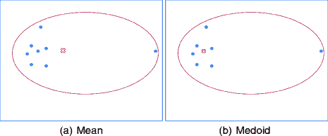
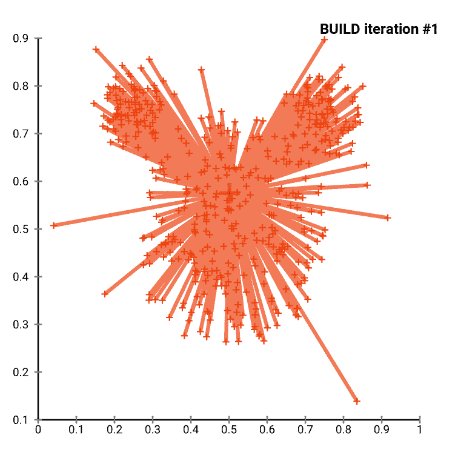
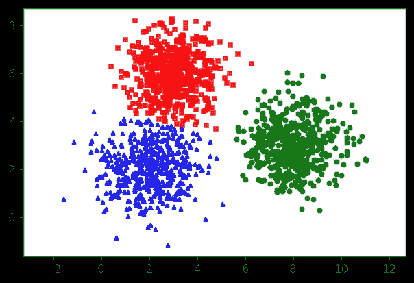

# #超级:K-medoids 聚类

> 原文：<https://medium.com/analytics-vidhya/supernaive-k-medoids-clustering-31db7bfc5075?source=collection_archive---------5----------------------->

## 强力实现

# 一、导言

***聚类*** 是*数据科学*等 AI/ML 领域的核心关注点之一。许多*聚类算法*是用不同的方法和目的发明出来的。在我看来*，基于质心的聚类*是*数据科学新手*最容易掌握的。

***K-表示*** 是其中最受欢迎的。在谷歌上搜索这个词，不到一秒钟你就能找到超过 10 亿个结果。然而， ***K-medoids*** ，一个让人联想到 ***的 K-means*** ，并没有与其“*老大哥”*一样的吸引力。

在本文中，我将谈谈我对该算法的理解，并展示一个用 Python 3 实现的*# superniave*。

热烈欢迎每一个建议和批评。

# II — K-MEDOIDS 聚类

**1。什么是水母？**

根据维基百科:

> **Medoids** 是一个[数据集](https://en.wikipedia.org/wiki/Data_set)或一个[聚类](https://en.wikipedia.org/wiki/Cluster_analysis)的代表对象，其数据集与该聚类中所有对象的平均相异度最小。

换句话说，成为 medoid 有两个条件:

(1)数据集的成员(数据点/对象)

(2)从它到数据集中所有其他数据点的距离总和(简称“平均相异度”)是最小的

条件(1)标志着 *K-means* 和 *K-medoids* 之间的最大差异。



从数据集计算平均值。从数据集中选择 Medoid。

**2。选择 medoids**

成本很高。

因为水母是被选择的，而不是被计算的。从程序上讲，我们必须遍历数据集，在每个数据点停下来，计算“平均相异度”，然后将最小的一个作为 medoid。在我的*#超级*实现中，时间复杂度为 O(n)。

**3。算法**

*K-medoids* 也被称为***PAM——围绕 Medoids*** 分区

> **输入**:一个数据集
> 
> **输出** : k 个簇用它们的 medoids 表示

**步骤 0:初始化**

随机选择 **k** 个数据点作为初始点。

**第一步:关联(标记数据点)**

遍历数据集，计算每个数据点 ***dp*** 到当前 medoids 的距离。将 ***dp*** 关联到最近的 medoid ***m.***

每个 ***dp*** 现在已经被分配了一个标签，这是代表它所属的集群的 medoid 的序号。

**步骤 2:更新 medoids**

在每个聚类中，假设每个 ***dp*** 都是潜在的新 medoid。如果一个 ***dp*** 的“平均相异度”小于当前 medoid 的“平均相异度”，则将其作为新的 medoid。

**第三步:收敛？**

如果我们的聚类是收敛的(medoids 在更新后保持不变)，停止算法并返回结果。反之亦然，回到**步骤 1** 。



(通过维基百科)PAM 选择初始 medoids，然后迭代收敛 k=3 个簇，用 [ELKI](https://en.wikipedia.org/wiki/ELKI) 可视化。

# Python 实现

**K-medoids 类**

**初始化**

**关联**

**更新 Medoids**

为了理解算法，我使用了一种蛮力方法来计算、比较和选择新的 medoids。

**会集？**

**组装在一起**

完整的代码和测试用例可以在这里找到:[https://github.com/briverse17/supernaive-kmedoids](https://github.com/briverse17/supernaive-kmedoids)

**对，测试！**

我们将围绕三个播种点(2，2)、(3，6)和(8，3)生成数据。期望是我们的模型能近似收敛到那个状态。

```
***#SuperNaive K-medoids***
model=k_medoids(k=3)
print('Centers found by your model:')
print(model.fit(X))
pred = model.predict(X)
visualize(X,pred)Centers found by your model:
[[1.98413249 2.04159709]
 [7.93224207 3.0213355 ]
 [2.98493437 5.97312308]]
```



```
***sklearn_extra K-medoids*** Centers found by scikit-learn extra:
[[1.98413249 2.04159709]
 [7.93224207 3.0213355 ]
 [2.98493437 5.97312308]]
```


# **参考文献**

1.  维基百科关于 K-medoids 的文章:[https://en.wikipedia.org/wiki/K-medoids](https://en.wikipedia.org/wiki/K-medoids)
2.  Tri Nguyen 的 K-medoids 实现:[https://towards data science . com/k-me doids-clustering-on-iris-data-set-1931 BF 781 e 05](https://towardsdatascience.com/k-medoids-clustering-on-iris-data-set-1931bf781e05)
3.  scikit learn extra 的 Github 资源库:[https://github . com/scikit-learn-contrib/scikit-learn-extra/tree/master/sk learn _ extra/cluster](https://github.com/scikit-learn-contrib/scikit-learn-extra/tree/master/sklearn_extra/cluster)