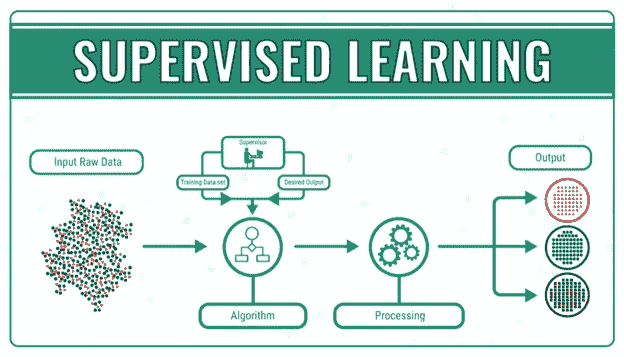
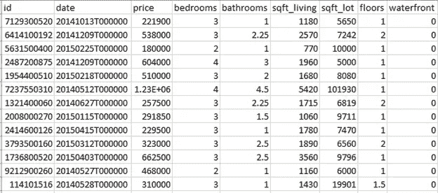
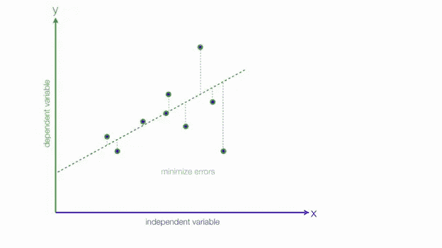
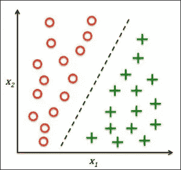
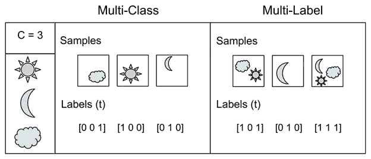
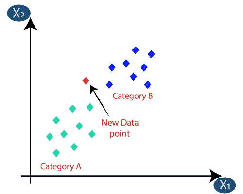
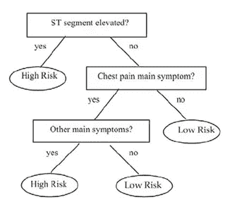
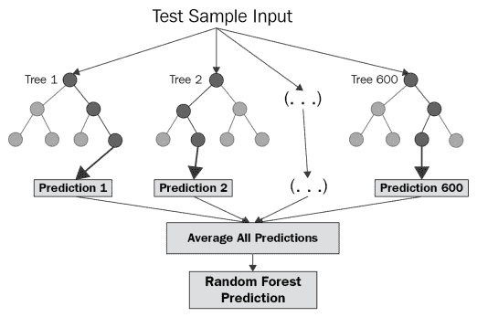

# 监督学习

> 原文：<https://medium.com/analytics-vidhya/supervised-learning-ab5ce3b6a1bf?source=collection_archive---------7----------------------->

顾名思义，这种类型的学习算法需要一个监督人，同时为特定的任务进行训练。我们许多人在不知不觉中应用了一些监督学习算法。喜欢

预测某一天销售额的商人

一个餐馆服务员预测他将为一份订单得到的小费数额。

学生预测某一天的数据消耗量等。

完成本博客后，您将了解到以下内容:

。什么是监督学习？

使用监督学习时出现的问题及其解决方案

监督学习算法的类型

什么是监督学习？

它用于人工智能和机器学习算法。这些算法在给定的数据集上训练自己，以将给定的输入映射到特定的输出。此外，预测新输入的输出。这些类型的算法有助于行业的分类和预测任务。比如股票预测。

**监督学习算法中的关键问题**

**输入空间的维数**:如果输入数据集有很多输入特征，而你需要考虑的特征数量很少。这些额外的特征可能会混淆学习算法。如表 1 所示。

表 1

这里的“id”是一个输入列，每个输入都有唯一的值。每个输入将具有不同的 id，这在预测中没有用，并且混淆了训练算法。

在“海滨”栏中，每个输入都有相同的值。它不会混淆训练算法，但它增加了算法的复杂性和训练的时间消耗。

在某些情况下，会有一些既不属于上述情况也不需要用于预测的特征，这些特征也可能会混淆算法。这些特征必须通过使用特征选择或特征提取技术来移除。

所有输入要素都不应依赖于数据集中的任何其他输入要素。

**输出值中的噪声:**如果给定的训练数据集有错误分类的输入或错误的输入预测。这样会导致训练效果不好。训练时你可能会得到最好的结果，但在测试中你会得到极差的准确性。因为你的模型可能会过拟合。必须识别并消除这些噪声输入。

**函数复杂度:**必须使用半复映射函数来预测输出。复杂函数试图在训练数据中获得 100%的准确性，结果导致测试端的准确性降低。我们称这种情况为过度拟合。简单函数可能会也可能不会在训练数据集上给出更好的准确性。我们称这种情况为不合格。

**监督学习算法的类型:**

回归

分类

**回归**

这些类型的算法预测连续值。比如，预测特定房屋的价格，如表 1 所示。如果我们需要将这些连续值分成不同的类别，我们使用分类技术。

**回归算法**

**线性回归:**这些算法用于找出自变量和因变量之间的关系。必须至少有一个因变量来预测未来的结果。在简单线性回归的情况下，只有一个因变量和一个自变量。随着变量数量的增加，算法的复杂度也随之增加。如果有两个以上的变量，那么它被称为多元线性回归。它试图通过使用均方误差技术来拟合用于预测的最佳拟合线。

它使用梯度下降算法学习模型。正则化有助于防止该算法过拟合。像均方误差这样的损失函数被用来寻找模型的完美性。

**分类**

它用于识别对象。使用的输出函数返回离散值/向量。每个值/向量表示一个对象类别。我们在欺诈交易检测、医疗诊断、对象分离中使用这些类型的算法。

有三种分类监督学习算法:

二进制:只有两个分类时使用这种算法。比如猫或者狗。

二元分类

多类:当有多个分类时，使用这种算法。比如自行车、汽车或公交车检测。

多标签:如果输入属于多个分类，则使用此算法。就像一部电影可能属于惊悚片、动作片、喜剧片等等。

**分类算法**

**逻辑回归:**使用与线性回归相同的技术。但是逻辑回归将预测值分类。比如，我们可以根据房价把房子分为高价房和低价房。

像交叉熵损失这样的损失函数用于寻找模型的完美性。

**回归和分类算法**

**K 最近邻:**这种算法是独特的，因为这种算法不试图找到因变量和自变量之间的关系。它属于非参数学习的范畴，需要对每个测试输入检查整个训练数据集。它为测试输入找到 K 个最近的点。它为回归算法找到 K 个最近点的输出的平均值/平均值/加权平均值，并为分类算法找到 K 个最近点的输出的多数投票。

由于这个算法中没有训练部分，所以不需要学习算法。像均方误差这样的度量用于分类模型的回归和交叉熵损失。

k 个最近邻居

**决策树:**该算法基于决策，根据给定的输入数据集构建一个树状结构。以连续值为输出的模型称为回归树。以离散值为输出的模型称为分类树。这种算法的好处是它只需要很少的训练时间。它不需要像线性回归、逻辑回归等其他算法那样进行多次训练。

但请记住一件事，它试图适应训练数据集，以获得最大的准确性。一些像修剪这样的技术可以解决这个问题。

决策图表

**随机森林:**它是由多个独立的决策树组成的。这是一种集成学习算法，由多个简单/弱学习算法组成。每个决策树的最终输出被发送到一个称为聚合器的功能。在回归决策树的情况下，它取所有结果的平均值/加权平均值。在分类决策树的情况下，它采用大多数结果。

一些技术，如装袋，将有助于提高模型的准确性。

随机森林

**支持向量机:**它最大限度地在数据点类别之间存在的间隙之间创建一个超平面。这个超平面也被称为决策边界。测试输入保存在训练数据点的空间中，并根据它们落在超平面的哪一侧进行分类。该算法还可以对非线性数据集进行分类。

中间边界是超平面

还有许多监督学习算法，如朴素拜耳分类器、高斯过程回归等。

**结论**

每种学习算法都有自己的优缺点。

在考虑数据集的学习算法时，您必须清楚。

必须像处理缺失值一样应用数据预处理技术，以获得更好的结果。

没有算法会给出 100%的结果。

在解决特定问题时，您可能会遇到其他问题。所以要小心。

监督学习就像用勺子喂婴儿。处理这些问题时，你需要很大的耐心。

感谢您花费宝贵的时间阅读本文。