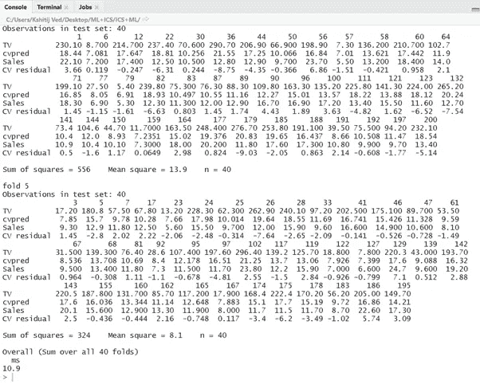

# 监督学习—线性回归(使用 R)

> 原文：<https://medium.com/analytics-vidhya/supervised-learning-linear-regression-using-r-93f48c6c394d?source=collection_archive---------1----------------------->

> 问题陈述:-生成 N 个点的适当的二维数据集。将数据集分为训练数据集和测试数据集。I)用最小二乘法进行线性回归分析。ii)绘制用于训练 MSE 和测试 MSE 的图形，并对曲线拟合和泛化误差进行评论。iii)验证数据集大小和偏差-方差权衡的影响。iv)应用交叉验证并绘制误差图。v)应用子集选择方法并绘制误差图。vi)描述您在每个案例中的发现。

**下面给出了程序和数据集的链接**

图片来源:- [思创资讯科技](https://thinksproutinfotech.com/)

# **什么是线性回归？**

线性回归基本上是一种统计建模技术。但它也广泛用于机器学习。在线性回归中，我们试图借助一些输入值( ***x*** )来预测一些输出值( ***y*** )是标量值。

我们称输入变量为独立变量。这是因为这些值不依赖于任何其他值。在同样的意义上，我们称输出标量值为因变量。这是因为为了找到这些输出标量值，我们依赖于输入变量。

# 线性回归的数学表示

为了知道线性回归的表示，我们必须考虑问题的数学和机器学习方面。但是这真的很容易理解，一点也不花哨。

比方说，我们有一系列标记的例子，

**(xi，易)Ni=1**

其中 N 是数据集的大小或长度，xi 是来自 **i=1，…，N 的特征向量，而 Yi** 是实值目标。为了更清楚起见，你可以把的集合称为自变量，把易的集合称为因变量或目标变量。

我希望现在你对这些符号在机器学习中是如何使用的有所了解。如果我们把上面的简化成文字，那么我们可以说:

*我们要用* ***x*** *中的特征组合建立一个线性模型，并预测****【y】***中的标量值

当我们考虑一个简单的线性回归，即单个 ***x*** 和单个*y 时，那么我们可以写，*

***y=β0+β1x***

*其中，β0 是截距参数，β1 是斜率参数。*

*如果你分析上面的方程，那么你可能会发现它和一条线的方程是一样的:*

***y=mx+c***

*其中 m 是斜率，c 是 y 轴截距。*

*现在，我们只需要记住上面的等式是针对单值 ***x*** 的。我们将再次回到这些，以了解它们在机器学习中实际上是如何使用的。首先我们来讨论一下什么是**一元线性回归**什么是**多元线性回归。***

# *简单线性回归*

*我们知道，在线性回归中我们需要利用自变量( ***x*** )找出因变量( ***y*** )。*

*在简单线性回归中，对于每个观测值 i=1，2，…，N，只有一个 xi 和一个易。这是最简单的线性回归形式。*

# *多元线性回归*

*在多元线性回归中，我们有两个或多个自变量(x)和一个因变量(y)。因此，我们有多个特性列和一个目标列，而不是单个特性列。*

# *均方误差成本函数*

*MSE 是我们从标记集得到的 Yi 值和预测的 y 新值之间的平均平方差。我们必须最小化这个平均平方差，以在给定的数据上得到一个好的回归模型。*

*以下是 MSE 的公式:*

***MSE = 1N∑(yi-(mxi+b))2***

*在上面的等式中，N 是训练数据集中已标记示例的数量，yi 是数据集中的目标值，而(mxi+b)是目标的预测值或者你可以说 y new。*

*最小化上述成本函数将意味着找到尽可能接近训练目标值的新目标值。这将确保我们找到的线性模型也接近训练示例。*

*为了最小化上述成本函数，我们必须找到两个参数 m 和 b 的优化值。为此，我们使用梯度下降法来找到关于 m 和 b 的偏导数。在这种情况下，成本函数如下所示:*

***f(m，b)= 1N∑I = 1N(yi-(mxi+b))2***

*接下来，我们用链式法则求上述函数的偏导数。为了解决这个问题，我们使用斜率和截距的更新值遍历数据，并在这样做的同时尝试降低成本函数。这部分是纯数学的，机器学习的实现显然是通过编码实现的。*

# ***使用广告数据集进行线性回归的程序-***

## *步骤 1:加载所需的数据集。*

## *输入:-*

**

*我们可以在上面的代码中看到如何将数据集导入 RStudio。数据集导入成功后，我们就可以查看数据集了。下图显示了上述代码的输出。*

## *输出:-*

****

## *步骤 2:提取所需的数据。*

## *输入:*

**

*这里的 data1 包含我们需要从主数据集中处理的信息。*

## *输出:*

**

## *步骤 3:将数据集分为训练数据集和测试数据集。*

## *输入:*

**

*这里，值 1:140 被提取用于训练目的，而值 141:200 被提取用于测试目的。*

## *输出:*

****

## *步骤 4:使用 cbind 函数绑定所有列。*

## *输入:*

**

***lm** 用于拟合线性模型。它可用于进行回归、单层方差分析和协方差分析。*

*象征性地指定了`lm`的型号。一个典型的模型具有形式`response ~ terms`，其中`response`是(数字)响应向量，`terms`是指定`response`的线性预测值的一系列项。表格`first + second`中的术语说明表示`first`中的所有术语以及`second`中的所有术语，并去掉重复项。形式为`first:second`的规范表示通过将`first`中的所有术语与`second`中的所有术语进行交互而获得的术语集。规格`first*second`表示`first`和`second`的*十字*。这个和`first + second + first:second`一样。*

## *输出:*

****

## *步骤 5:绘制单个对象的图形。*

## *输入:*

**

## *输出:*

****

## *第六步:预测数据的价值。*

## *输入:*

**

## *输出:*

****

## *步骤 7:最后为训练和测试数据集绘制一个模型*

## *输入:*

**

## *输出:*

****

*点击[此处](https://github.com/kshitijved/Linear_Regression)下载程序和数据集…*