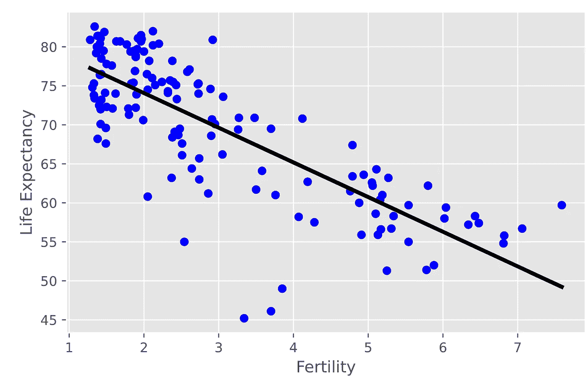

# Scikit-learn 的监督学习

> 原文：<https://medium.com/analytics-vidhya/supervised-learning-with-scikit-learn-df617631216a?source=collection_archive---------12----------------------->

让我们从什么是监督学习开始，它与无监督学习有何不同，它的实际应用是什么，以及如何使用 python 的 Scikit-learn 库实现监督学习。

监督学习是一种创建人工智能的方法，其中我们向监督学习模型提供输入和预期输出结果，并且模型具有检测潜在模式和关系的任务。这有助于模型在以前从未见过的数据上表现良好，并预测输出结果。监督学习的反面是无监督学习，在这种学习中，模型试图在没有任何指导方针和数据预期结果的情况下理解数据本身。无监督学习模型理解数据，尝试检测数据中的相似性和模式，并对其进行分类。

监督学习可以大致分为两个子类-

1.  **回归** -这是一种监督学习算法，其中算法从标记的数据集学习，并且能够为馈送到算法的新数据预测连续值输出。回归算法的示例有-预测房价、预测车价、预测犯罪率等。主要的回归算法有-线性回归和逻辑回归。
2.  **分类** -分类算法是一种学习算法，需要将新数据分类到不同的类别中。与回归不同，它没有连续值输出。它用于我们需要二进制输出的地方，例如-肿瘤是恶性的还是良性的，天气是否晴朗，邮件是否是垃圾邮件等。主要的分类器是决策树、朴素贝叶斯分类器和支持向量机(SVM)。

监督学习在实际世界中被广泛使用。监督学习的主要实际应用如下-

1.  垃圾邮件检测——这是由 Gmail、rediffmail 等使用的。它从邮件中识别单词，这使得它更有可能是垃圾邮件。因此，它通过识别邮件中的可疑单词来对邮件进行分类。它不断学习，并随着时间的推移而进步。
2.  语音识别——这是一个我们在 Alexa、Siri、Google Assistant、Cortana 等网站上看到的应用程序。我们教算法关于我们的声音和如何解释它。每次我们使用它时，它都会不断学习，并变得更有效率。
3.  物体识别——这是一个我们在不同地方都能看到的应用。首先，我们在一大组数据上训练算法，然后算法识别不同的对象。它主要用于交通系统、安全系统等。
4.  生物信息学——这是监督学习算法最广泛的应用之一，它被用于我们的智能手机中的面部识别、屏幕指纹等。它储存我们的生物信息，并利用它来识别我们，而且每次我们使用它时，它都会变得更好。
5.  推荐系统——它被网飞、亚马逊 Prime、Hotstar 等热门网站使用。它根据我们的搜索和以前看过的电影为我们推荐新电影。

现在我们来看看 scikit learn 如何借助一个例题实现监督学习算法。示例问题是“使用 Gapminder 数据集预测预期寿命”。

但是首先，让我们设置一些关于 scikit-learn 的见解。Scikit-learn 是 Python 中最健壮、最有用的机器学习库。它为我们提供了各种高效的统计建模和机器学习工具。它主要是用 python 编写的，构建在其他 python 库之上，如 NumPy、Matplotlib 和 SciPy。

让我们为我们的问题陈述编码，即“**使用 Gapminder 数据集**预测预期寿命”。它属于回归类别，让我们看看如何使用 scikit-learn 来实现监督学习模型

你可以从这里得到关于 Gapminder 数据集的信息- [Gapminder_Dataset](https://www.gapminder.org/data/) 。

我将尝试给出代码的一个概述，而不深入技术定义。以便有助于对 Scikit-Learn 和监督学习有一个整体的了解。

```
import numpy as npimport pandas as pd# Read the CSV file into a DataFrame 'df'df = pd.read_csv('gapminder.csv')y = df['life'].valuesX = df['fertility'].valuesy = y.reshape(-1,1)X = X.reshape(-1,1)
```

在这个代码块中，我们导入了 NumPy、pandas 和 gapminder 数据集。之后，我们将数据集分割成目标变量“y”和特征“X”。然后，我们对它进行了改造，使其符合我们的需求。

```
from sklearn.linear_model import LinearRegression# Create the regressor 'reg'reg = LinearRegression()
```

这里我们从 sklearn.linear_model 模块导入了 LinearRegression。我们已经创建了一个名为“reg”的实例。

```
# Create the prediction space
Here we have preloaded the fertility column in X to numpy array X_fertiity.prediction_space = np.linspace(min(X_fertility), max(X_fertility)).reshape(-1,1)# Fit the model to the datareg.fit(X_fertility,y)# Calculating the predictiony_pred = reg.predict(prediction_space)# Print R^2 errorprint(reg.score(X_fertility,y))# reg score is=0.6192442167740035# Plotting  the regression lineplt.plot(prediction_space, y_pred, color='black', linewidth=3)plt.show()
```

在这里，我们通过使用生育力作为特征来训练和测试我们的回归变量“reg ”,计算精确度，并绘制我们拟合的线性回归线的分布。



```
# Import necessary modules from sklearnfrom sklearn.linear_model import LinearRegressionfrom sklearn.metrics import mean_squared_errorfrom sklearn.model_selection import train_test_split# Creating X_train, X_test, y_train, y_testX_train, X_test, y_train, y_test = train_test_split(X,y, test_size = 0.3, random_state=42)# Create the regressor reg_areg_a = LinearRegression()# Fit the regressor to the training datareg_a.fit(X_train,y_train)# Predict on the test data  'y_pred'y_pred = reg_a.predict(X_test)# Compute and print R^2 and RMSEprint("R^2: {}".format(reg_a.score(X_test, y_test)))#Prints , R^2: 0.838046873142936 rmse = np.sqrt(mean_squared_error(y_test,y_pred)) print("Root Mean Squared Error: {}".format(rmse))# Prints, Root Mean Squared Error: 3.2476010800377213
```

在这个代码块中，我们用整个 X _train 和 y_train 训练了我们的回归器 reg_a，并在 X_test 和 y_test 上进行了测试。我们还打印了模型的 R 误差和准确度分数。我们使用了 sklearn 模块，并导入了 LinearRegression、train_test_split 和 mean_squared_error 模块来完成所有后端计算。所以这个模型可以根据新数据预测预期寿命，准确率接近 84%。

所以我们可以看到使用 Scikit-Learn 实现监督学习模型是多么容易。这就是 Scikit-Learn 的强大之处，它有助于轻松实现任何模型，而无需担心复杂的计算。