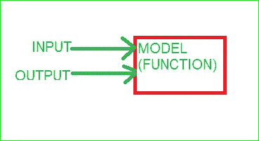

# 监督机器学习(深入)

> 原文：<https://medium.com/analytics-vidhya/supervised-machine-learning-in-depth-92280ee61a97?source=collection_archive---------19----------------------->

凉爽的..！！！机器学习听起来很酷，对吧。如果我们了解得更多，不是更酷吗？如果是的话，那我们就开始吧。

机器学习是一个广阔的领域，其研究和应用在本世纪在世界范围内飞速发展。

从 20 世纪 90 年代它的研究因没有资金而几乎在所有地方停止，到现在它重新出现在世界上，并在我们能想象到的几乎每个领域实践。这不是一个纯粹的后果。相反，由于监督学习和对狭义人工智能的关注，该领域一直在崛起。

嗯，pals 监督学习是机器学习的三种类型之一。另外两种是无监督的和强化的，但这里我们主要讨论有监督的。

所以，让我们深入监督学习的世界，我们也会知道一些简单的算法，不要担心，你很快就会明白。

# **简介:**

监督学习是一种我们人类通过提供输入和输出来监督机器学习的学习类型。在这里，数据集既包含标签(输出),即我们希望从模型中获得的预测，也包含我们提供给模型的要素(输入)。该模型根据输入和输出数据开发自己的函数，并使用该函数对新数据进行预测。

输入(标签)，输出(特征)

伙计，你只是在装模作样，我已经厌倦了这些无聊的概念！！

嗯，是的，我能理解。因此，让我们深入研究监督学习的类型和应用。

基于监督学习的股票价格预测

# **种类**

有两种监督学习，这里是这两种。

1.  **分类**

分类可以是二元的，也可以是多类的。但是，这里我们有固定的输出数量，我们知道可能的输出。

> 示例:
> 
> I .猫和狗分类(这里，模型可以识别给定图像是猫还是狗，并且我们也知道输出是猫还是狗)。所以，它是二元分类(只有两种可能的输出)。
> 
> ii .狗的品种分类(这里我们有将近 120 个品种，模型有 120 个可能的输出)。所以，它是多类分类(多于两个输出)。

**注意:输出也称为类。**

猫 vs 狗

**2。回归**

回归是一种模型预测单一输出的问题。你可能需要一些例子来理解这种监督学习。

> 举例:预测房价是一个回归问题(模型预测房价，是单输出)。
> 
> 一般来说，价格预测属于这个领域，其他奇异输出问题也属于这个领域。

伙计们，这些是监督学习的具体类型，我们讨论了几个例子，但监督学习带来的主要变革是

皮肤癌检测剂、糖尿病视网膜病变检测剂等。

你曾经想象过机器能够非常准确地检测出如此复杂的疾病吗？

嗯，机器学习已经彻底改变了世界的每一个领域，这听起来很酷。

所以，伙计们，你可能是下一个通过机器学习带来世界革命的人。

好吧，伙计们，你们可能想知道我是如何谈论机器学习而不是人工智能的。艾就是那个拿炒作权的人！！！

嗯，机器学习是人工智能的核心，没有一个地方有人工智能但没有机器学习。你必须制作一个模型，训练它，然后进行预测，称之为人工智能代理。

呼呼(我稍稍松了口气😂😂).

所以，朋友们，我猜你们已经学了一点机器学习，尤其是监督学习。

现在，为了执行上述所有应用任务，我们需要使用算法，下面我简单介绍一些算法:

# **算法:**

1.  朴素贝叶斯
2.  逻辑回归
3.  线性回归
4.  k-最近邻
5.  决策图表
6.  集成方法
7.  支持向量机
8.  神经网络

为了更深入地了解监督学习的算法，我将在下一篇文章中描述它们的优缺点，敬请关注。