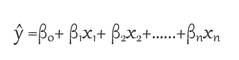
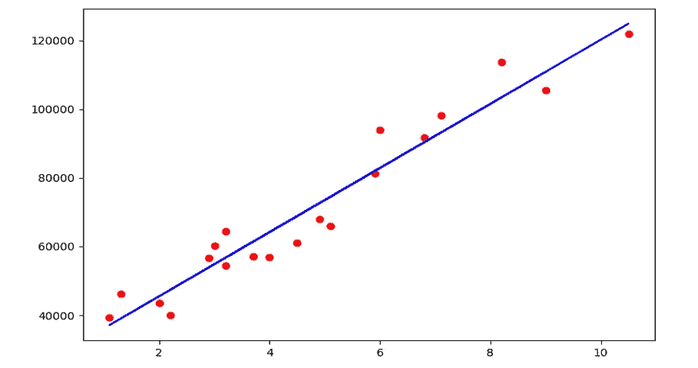
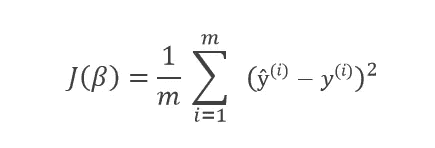
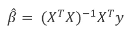
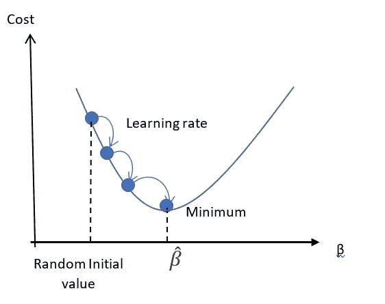
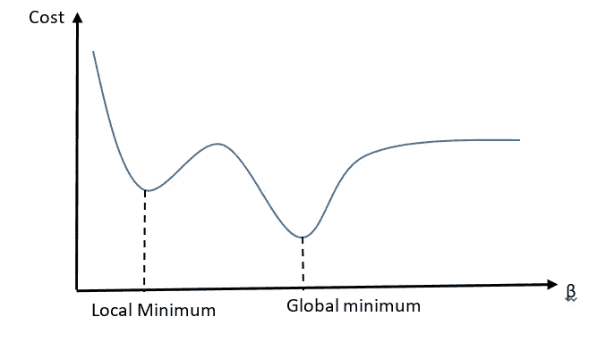

# 监督机器学习—线性回归

> 原文：<https://medium.com/analytics-vidhya/supervised-machine-learning-linear-regression-b6baa9a66cd9?source=collection_archive---------13----------------------->

在*监督式机器学习中，*通过提供贴有正确标签的数据来训练模型。监督机器学习有几种算法，其中一种是线性回归。

在本帖中，您将看到关于线性回归的简介、线性回归的类型、线性回归的假设、线性回归的工作原理、估计系数和截距的方法以及在 python 中实现模型的简要说明。

## **线性回归简介**

在监督机器学习类别下的机器学习中，*线性回归*是最简单的参数化方法之一，您可以将其应用于数据集，以建模因变量(或响应变量)与一个或多个自变量(或解释变量)之间的关系。

在线性回归中，因变量的值本质上是连续的。线性回归用于预测、时序数据、确定因果关系等等。

## **线性回归的类型**

1.  **简单线性回归:**如果只有一个自变量那么就是简单线性回归。
2.  **多元线性回归:**如果有两个或两个以上的自变量，则称为多元线性回归。

## **线性回归的假设**

1.  **线性:**自变量和因变量之间必须存在线性关系。
2.  **同方差或齐性:**残差(或误差项)必须有一个恒定的方差，与自变量无关。
3.  **缺乏多重共线性:**自变量之间一定没有相关性。
4.  **独立于残差(或误差):**残差必须彼此独立，即 t 处的误差不应预测 t+1 处的误差。

## **线性回归的工作原理**

线性回归研究自变量和因变量之间的线性关系，线性关系用线性方程表示如下。



线性回归方程

这里，*为预测值， **n** 为自变量(或特征)个数，*为第 I 个特征(或自变量) **βj** 为第 j 个模型参数。**

**— β0 称为截距(或偏差)。如果数据的范围包括 *x1 = x2 …… = xn = 0* ，那么β0 就是 *y* 在 *x1 = x2 …… = xn* = 0 时的平均值。**

**— β1 至βn 称为系数(或权重或斜率)。参数βj 代表当所有剩余的回归变量*【Xi】*(*I*≦*j*)保持不变时，单位变化 *xj* 的响应(或因变量) *y* 的预期变化。**

**该模型试图用二维空间中的一条线或三维空间中的一个平面来拟合尽可能多的数据点，等等。在下图中，这条线代表一条近似的线，可以解释“x”轴和“y”轴之间的关系。**

****

**线性回归线**

**由于线性回归的目标是拟合通过最接近大多数点的分布的直线，我们需要训练一个线性回归模型*来找到最小化均方误差(MSE)的参数β的值。*均方误差是预测值和真实值之间的平方差之和除以样本数。**

****

***线性回归模型的 MSE 成本函数***

**这里 y^(i)是第 I 个样本的第 I 个预测值，y(i)是第 I 个样本的第 I 个实际值(或真值), m 是样本数。**

## ****估计系数和截距的方法****

****正规方程****

**法线方程是一种分析方法，用于找出最小化成本函数的参数值。正规方程有助于直接或在 go 中找到最优解。**

****

**正规方程**

**这里， **y** 是观测值的 *n* × 1 向量， **X** 是回归变量层次的*n*×p 矩阵， ***β*** 是回归系数的 *p* × 1 向量。**

**如果( *XT X)* 不可逆，则正规方程方法不适用，在这种情况下，我们可以使用梯度下降法。**

****梯度下降****

**梯度下降法是一种寻找参数最优值的迭代方法。**

**假设你迷失在半山腰，只能感觉到脚下地面的坡度。到达山脚的最好方法是向最陡的斜坡方向前进。这就是梯度下降所做的，它测量误差函数关于参数的梯度，它沿着梯度下降的方向前进。一旦梯度下降为零，你就达到了最小值！**

**最初，我们从β的随机值开始(这被称为*随机初始化*)。然后我们逐步改进它，一次一步，每一步都试图降低成本函数，直到算法达到最小值。**

****

**梯度下降**

**在梯度下降中，步长的大小很重要，称为学习率超参数。如果学习率太小，算法可能需要时间来找到最小值，并且可能需要太多的迭代。如果学习率太大，算法可能会错过最佳值。**

**最后，并不是所有的成本函数看起来都像规则的碗形，如下图所示。如果随机初始化从左边开始，那么它收敛到局部最小值。如果从右边开始，可能需要很长时间才能达到全局最小值。**

****

**梯度下降法的局部和全局最小值**

**在线性回归中，MSE 成本函数恰好是凸函数，这意味着如果您在曲线上选取任意两点，连接它们的线段永远不会穿过曲线。这意味着没有局部最小值，只有一个全局最小值。**

## ****用 python 实现****

**下面的代码是使用 python 中的 scikit-learn 库实现线性回归，你可以在这里找到来自[的数据集。](https://github.com/Divyashree-eswar/Linear-Regression/blob/master/Salary_Data.csv)**

```
**#importing the libraries
import pandas as pd
import numpy as np
import matplotlib.pyplot as plt#importing the dataset
dataset = pd.read_csv("Salary_Data.csv")
X = dataset.iloc[:,:-1]
y = dataset.iloc[:,1]#spliting the data into training set and test set
from sklearn.model_selection import train_test_split
X_train, X_test, y_train, y_test = train_test_split(X, y, test_size =1/3, random_state =0)#building the linear regression model
from sklearn.linear_model import LinearRegression
reg = LinearRegression()
reg.fit(X_train,y_train)#performing the prediction on the test set 
y_pred = reg.predict(X_test)#plotting the regressison line.
plt.scatter(X_test, y_test, color = 'red')
plt.plot(X_train, reg.predict(X_train), color = 'blue')
plt.title('Salary vs Experience (Test set)')
plt.xlabel('Years of Experience')
plt.ylabel('Salary')
plt.show()**
```

# **结论**

**我们已经学习了线性回归的概念、假设、正规方程、梯度下降以及使用 scikit-learn 库在 python 中实现。**