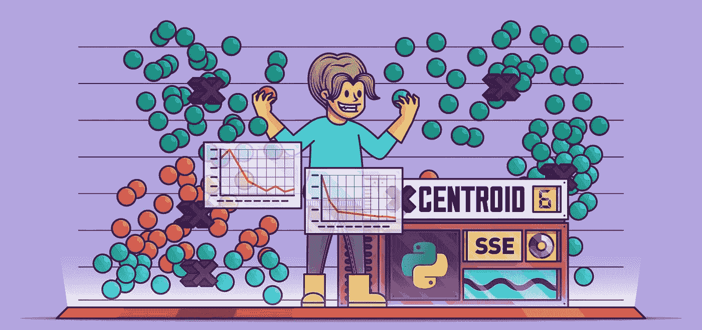
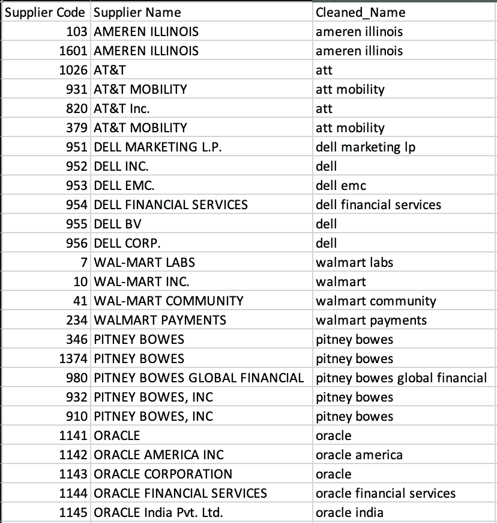
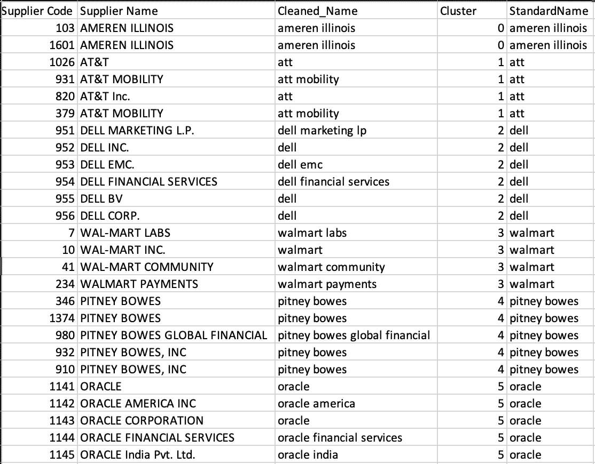

# 使用无监督学习的供应商名称标准化

> 原文：<https://medium.com/analytics-vidhya/supplier-name-standardization-using-unsupervised-learning-adb27bed9e0d?source=collection_archive---------5----------------------->

数据聚类【来源】:[真实 Python](https://www.google.com/url?sa=i&url=https%3A%2F%2Frealpython.com%2Fk-means-clustering-python%2F&psig=AOvVaw22cofltvlqUk5kdp39kx2y&ust=1602098757091000&source=images&cd=vfe&ved=0CAMQjB1qFwoTCPD_o43ZoOwCFQAAAAAdAAAAABAT)

无监督学习在花费分析中的主要应用是供应商名称规范化，由此供应商名称被聚类。许多大公司在您的各种数据系统中拥有不同的名称，这些公司在您的支出中占据了很大一部分。

将这些名称聚合成一个名称很重要，这样可以显示某些供应商花费了多少钱，这样您就可以确定您的主要供应商。

举个例子，

[戴尔金融服务、戴尔营销 LP、戴尔 NV、戴尔 EMC、DMI 戴尔公司巴士]变成了**戴尔**

[甲骨文，甲骨文美国公司，甲骨文公司，甲骨文金融服务，甲骨文美国公司]成为**甲骨文**

如果你想跳过这些麻烦，你可以在这里找到完整的代码:[https://github.com/rahulissar/ai-supply-chain](https://github.com/rahulissar/ai-supply-chain)

# **数据预处理:**

为了实现这一点，我们使用标准的数据预处理技术来清理文本数据并删除不需要的单词。

清理供应商数据后，您将得到类似这样的结果；

数据预处理模块的输出

# **生成词语相似度矩阵**

通常，我们会使用 tdf-idf 或计数矢量器从文本数据中生成矢量。这有助于模型理解一个术语在整个文档中的重要性。然后，我们将使用这些向量来生成一个相似度矩阵，以帮助我们的模型了解单词向量彼此之间有多相似。

对于这个模型，我们使用 Levenshtein 距离作为相似性度量，因为我们的用例需要相似名称的聚合。此指标说明了将一个单词更改为另一个单词所需的最少单字符编辑(插入、删除或替换)次数。

# **聚类**

一旦我们有了相似性矩阵和干净的供应商名称，我们就可以将它输入到一个聚类模型中，以帮助将相似的供应商名称聚集在一起。

对于这个用例，我们使用了相似性传播算法。与其他传统的聚类方法相比，相似性传播不需要您指定聚类的数量。

# **名称标准化**

对于每个识别出的集群，我们传递几对经过清理的供应商名称，以获得最长的公共子字符串。然后，我们取出现次数最多的子字符串(mode ),并将其指定为该集群的标准名称。对数据集中的所有分类重复此过程。

模型的最终输出

# **参考文献**

1.  亲和传播:[https://towards data science . com/unsupervised-machine-learning-affinity-Propagation-algorithm-explained-D1 fef 85 f 22 c 8](https://towardsdatascience.com/unsupervised-machine-learning-affinity-propagation-algorithm-explained-d1fef85f22c8)
2.  levenshtein Distance:[https://medium . com/@ Ethan Nam/understanding-the-levenshtein-Distance-equation-for-初学者-c4285a5604f0](/@ethannam/understanding-the-levenshtein-distance-equation-for-beginners-c4285a5604f0)
3.  供应商名称规范化:[https://medium . com/@ Isma 3il/supplier-names-Normalization-part 1-66 c 91 bb 29 fc 3](/@isma3il/supplier-names-normalization-part1-66c91bb29fc3)
4.  什么是供应商名称规范化:[https://www . sourcing-force . com/en/what-is-Supplier-Normalization-in-spend-analysis/](https://www.sourcing-force.com/en/what-is-supplier-normalization-in-spend-analysis/)
5.  艾在花分析:[https://procureability.com/ai-in-spend-analysis/](https://procureability.com/ai-in-spend-analysis/)