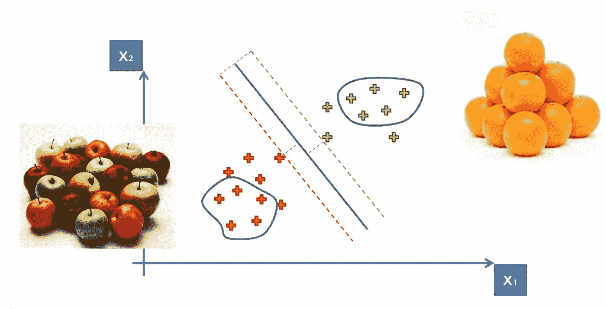
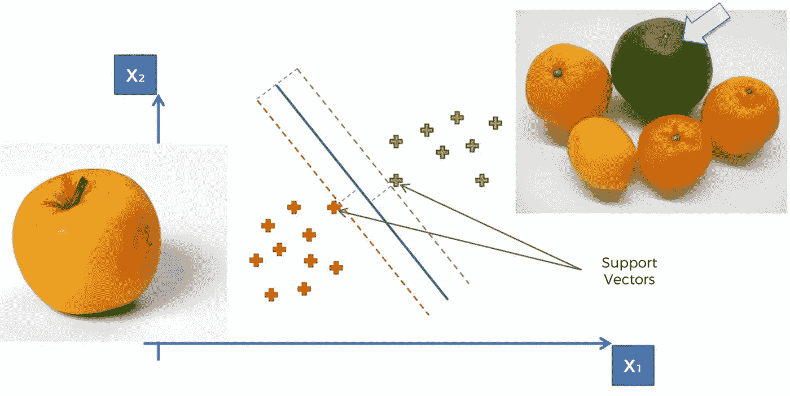

# 支持向量机

> 原文：<https://medium.com/analytics-vidhya/support-vector-machine-498e55e364cb?source=collection_archive---------26----------------------->

支持向量机或简称 SVM 在机器学习中变得非常流行，因为它们非常强大，并且与其他机器学习算法有些不同。我们会发现它们有多特别。

想象一下，你正试图教一台机器如何区分苹果和橘子，如何将一种水果分为苹果和橘子。你告诉一台机器，好吧，我会给你一些火车数据，看看这些苹果和橘子。分析它们。看着它们，看看它们有什么参数，下次我会给你一个水果，要么是苹果，要么是橘子，你要把它分类，告诉我是苹果还是橘子。这是一个标准的机器学习问题。

在我们的例子中，你可以看到，假设右边是橘子，左边是苹果。所以机器学习要做的是看最多的苹果和最多的橙子，这样他们就会看最标准的普通苹果和最标准的普通橙子。机器会试着从与苹果非常相似的苹果中学习，这样它就会知道什么是苹果，对桔子也是一样。这就是大多数机器学习算法的工作方式，然后在此基础上，它将能够对新的数据元素进行一些分类。

在支持向量机的情况下，它有点不同。这个支持向量机不是看最普通的苹果和橘子，而是看非常像橘子的苹果和非常像苹果的橘子。

你可以看到支持向量实际上非常接近边界。苹果或红色标记将非常接近绿色标记或橙子，而绿色标记将非常接近红色标记。SVM 通过最大边距搜索分类器线，这意味着该线与两个支持向量等距绘制，并且从支持向量到该线的边距之和是最大的。所以基本上这两点是支撑这整个算法的。我们在中间有一条线，叫做最大间隔超平面或最大间隔分类器。在二维空间中，它就像一条分类线，但在多维空间中，它是一个超平面。

二维和三维超平面

因此，在这种意义上，你可以认为支持向量机是一种更极端的算法，因为它着眼于非常接近边界的极端情况，并使用它来构建分析。