# 支持向量机简介

> 原文：<https://medium.com/analytics-vidhya/support-vector-machine-86bbcb650e81?source=collection_archive---------20----------------------->

支持向量机是分类问题中最常用的监督学习算法。这篇文章讨论了线性 SVM 算法背后的数学/直觉，简单介绍了用于优化部分的拉格朗日乘子。

# 线性 SVM:

在 2-D 空间中，有 2 组点由它们的坐标(x1，x2)表示，它们的标签由值为 1 或-1 的 y 表示。

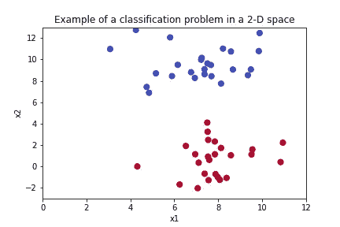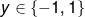

这个问题的目标是找到一个超平面 s.t，它完美地将两组点分类，如下所示。在这种情况下，超平面是分割两组点的直线。

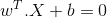

这意味着，位于该超平面任一侧的任何点都满足条件

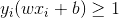

显然，可以有几个这样的超平面来区分这两类。但是我们如何选择正确的超平面呢？

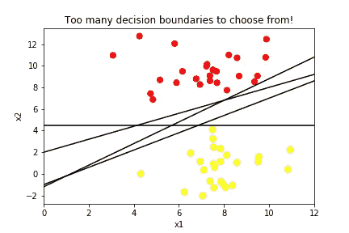

首先让我们理解几何余量的概念:

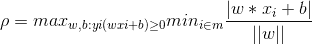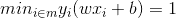

因此，

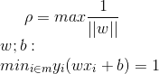

为了找到正确的超平面，我们必须最大化几何余量，如下图所示

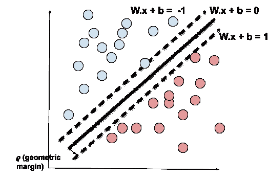

虚线表示边缘超平面，距离边缘超平面最近的点是+1/-1。这些点是支持向量。例如，在下图中，支持向量(最接近边缘超平面的点)用绿色和鲜红色着色。

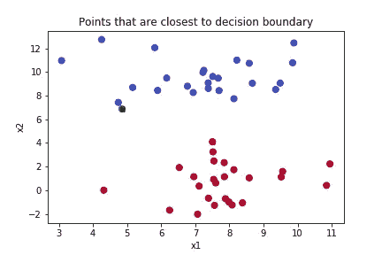

如果这些点的位置被改变，那么优化的决策边界的位置将受到影响。因此，最靠近决策边界的点决定了决策边界的位置。

# 优化线性 SVM:

在寻找超平面的最优解时，我们先前建立了几何余量必须最大化。

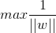

相当于

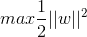

服从于:

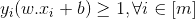

我们可以使用拉格朗日乘数法来解决这个优化问题。

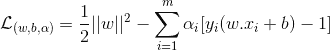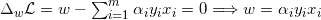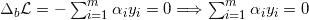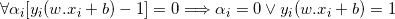

如我们所见，w 代表的权重是训练向量 x1…xm iff 的线性组合

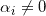

此外，如果满足上述条件，则

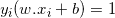

因此，所有的支持向量都位于边缘超平面上。

在 python 上解决这个问题时，我们首先试图找到接近支持向量(满足上述等式的 x1…xms)的超平面，然后通过递增地改变 w 的值来优化最大余量，以找到最佳超平面。结果看起来会像这样。虚线表示次优超平面。

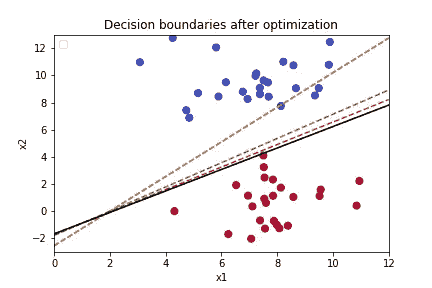