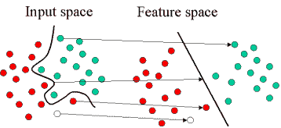
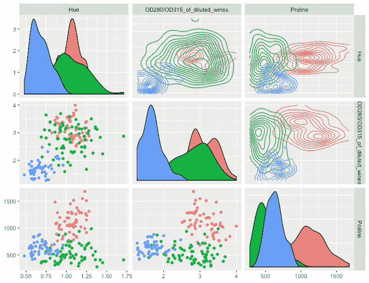
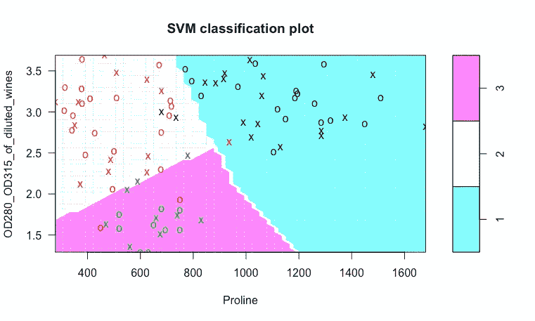
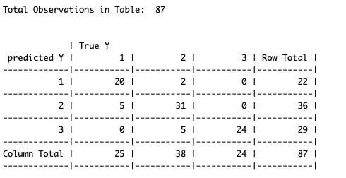
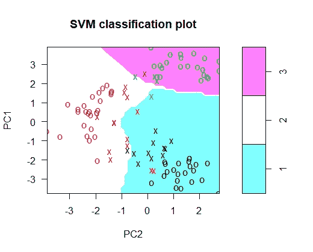
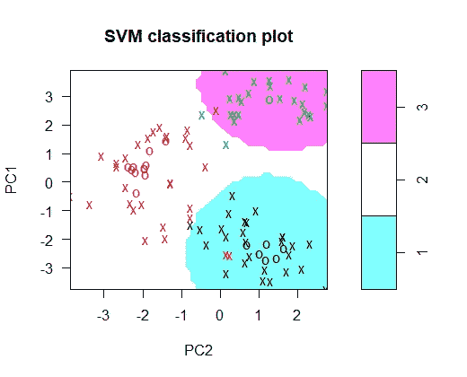
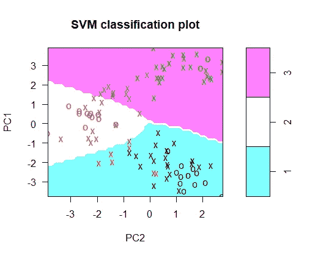

# 面向初学者的 R 语言支持向量机

> 原文：<https://medium.com/analytics-vidhya/support-vector-machine-in-r-for-beginners-94564aa2bb74?source=collection_archive---------3----------------------->

在这篇文章中，我在葡萄酒数据集上使用了支持向量机。数据集已经在我之前的 [***新手数据分析***](/@dar.paharand/data-analysis-for-beginners-ff1a3d9389ae) 的帖子里做了预处理。



来源:谷歌图片

简而言之，SVM 是什么？

它是一种受监督的**机器学习算法**，可用于分类或回归挑战。

主要目标是找到

*   线性可分模式的最佳超平面:
*   对于非线性可分模式，通过将原始数据转换到新空间，扩展到线性可分模式——

更多细节可以在 R. Berwick 的《支持向量机的白痴指南》中找到。

回想一下 [*初学者数据分析*](/@dar.paharand/data-analysis-for-beginners-ff1a3d9389ae) ，这两个特征**色相**、**od 280/od 315 _ of _ 稀释 _ 葡萄酒**和**脯氨酸**揭示了数据的清晰分离，因此它们可能给出良好的聚类结果。因此，我首先将分析限制在这些要素上，然后将其扩展到整个数据集。

**案例 1** :使用两个特征对葡萄酒数据集进行分类:**od 280/od 315 _ of _ delivered _ wine**和**脯氨酸**



图 1

我使用**支持向量机(SVM)** 和**线性激活函数**进行聚类。我将我的数据分为训练集和测试集:在 **178** 个观察值中， **91** 用于训练， **87** 用于测试。

需要以下两个包: **e1070 和 dplyr。**

```
Twofeatures=dplyr::select(redwine,class,OD280_OD315_of_diluted_wines, Proline)
Twofeatures[,-1]=scale(Twofeatures[,-1]) 
data2f=Twofeatures
n=nrow(data2f)
s=sample(n,91)
train=data2f[s,]
test=data2f[-s,]svmfit=svm(class~.,data=train,kernel=”linear”,cost=.1,scale=F,type=”C-classification”)plot(svmfit,test)pred=predict(svmfit,test[,-1],type=”class”)CrossTable(pred,test[,1],prop.c = FALSE,prop.r = FALSE,prop.t = FALSE,prop.chisq = FALSE,dnn=c(“predicted Y”,”True Y”))
```



图 2:在 2 个期货上使用线性激活函数的 SVM

它能够得到几乎 90%的准确率，因此 T42 有 10 %的分类错误。

```
cat(“ The accuracy of SVM classifier is = “,100*mean(pred==test[,1]),” %”)> The accuracy of SVM classifier is = 89.65517 %
```

相应的混淆矩阵如下所示。



让我们在 **svm 函数**中增加 **cos** t 参数

```
svmfit=svm(class~.,data=train,kernel=”linear”,**cost=.3**,scale=F,type=”C-classification”)plot(svmfit,test)pred=predict(svmfit,test[,-1],type=”class”)CrossTable(pred,test[,1],prop.c = FALSE,prop.r = FALSE,prop.t = FALSE,prop.chisq = FALSE,dnn=c(“predicted Y”,”True Y”))
```

结果，精确度增加了 **3%，**

```
cat(“ The accuracy of SVM classifier is = “,100*mean(pred==test[,1]),” %”)> The accuracy of SVM classifier is = 93.10345 %. 
```

因此，拥有正确的参数可以稍微提高精度(**注意，这可以通过使用e1070 包中的**调整**功能在提供的参数范围**内进行网格搜索来调整超参数，从而选择最佳参数集)。

## 案例 2:使用所有数据执行分类

为此，我将**首先应用 PCA** 通过保留占最大可变性的 PCs 进行降维(这一主要步骤在我的帖子中完成)。注意:当我们有一个**高维数据集(p > > n)** 时，这种方法很有用。为了完整起见，我们在这里使用了它。

回想一下我在……上的帖子..PC1 和 PC2 的可变性最大。然后，可以使用第一和第二主成分(PC1 和 PC2)来应用 SVM。为此，我们将数据集分成两部分:**训练:数据的 2/3** 和**测试:数据的 1/3** 。不同的**内核**函数(线性、多项式、径向和 sigmoid)与成本参数集**一起使用。**

```
svm.linear=svm(class~.,data=train,kernel=”linear”,cost=.3,scale=F,type=”C-classification”)
svm.linear %>% plot(test)
pred.linear=svm.linear %>% predict(test[,-1],type=”class”)svm.poly=svm(class~.,data=train,kernel=”polynomial”,cost=.3,scale=F,type=”C-classification”)
svm.poly %>% plot(test)pred.poly=svm.poly %>% predict(test[,-1],type=”class”)svm.radial=svm(class~.,data=train,kernel=”radial”,cost=.3,scale=F,type=”C-classification”)
svm.radial %>% plot(test)
pred.radial=svm.radial %>% predict(test[,-1],type=”class”)svm.sigmoid=svm(class~.,data=train,kernel=”linear”,cost=.3,scale=F,t  ype=”C-classification”)
svm.sigmoid %>% plot(test)
Pred.sigmoid=svm.sigmoid %>% predict(test[,-1],type=”class”)
```



图 4: **线性**核(左)、**多项式**核(右)



图 5: **放射状**内核(左)、**乙状结肠**内核(右)

从这些图中，我们可以看到，具有多项式、**线性和径向**函数的 SVM 比具有 sigmoid 函数的 **SVM 做得更好。事实上，这些言论被其相应的准确性所证实，**

```
cat(“ The accuracy of SVM with linear classifier is = “,100*mean(pred.linear==test[,1]),” %”)cat(“ The accuracy of SVM with polynomial classifier is = “,100*mean(pred.poly==test[,1]),” %”)cat(“ The accuracy of SVM with radial classifier is = “,100*mean(pred.radial==test[,1]),” %”)cat(“ The accuracy of SVM with sigmoid classifier is = “,100*mean(pred.sigmoid==test[,1]),” %”)
```

给

```
The accuracy of SVM with linear classifier is = 98.70%The accuracy of SVM with polynomial classifier is = 90.91%The accuracy of SVM with radial classifier is = 97.40 %The accuracy of SVM with sigmoid classifier is = 85.71%
```

玩得开心……

# 结论

我使用两种方法执行分类任务:

1.  探索数据并提取两个特征(变量),这两个特征给出了类别之间的清晰分离，然后应用 SVM 分类方法。
2.  在 SVM 之前，主成分分析首先应用于降维，尽管这里并不需要，但对未来的工作仍然有好处。

在这两种情况下，结果都相当不错。

仍有问题或意见，请在下面的部分留言。