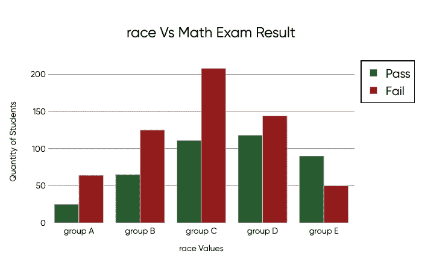

# 支持向量机(SVM)的实际实现

> 原文：<https://medium.com/analytics-vidhya/support-vector-machine-svm-practical-implementation-4b89dfd67706?source=collection_archive---------11----------------------->

你好。

这是我的 ***机器学习实用实现*** 系列的第二篇帖子。本系列的目标是向您展示，即使您没有掌握这些流行算法背后的全部数学知识，您仍然可以从日常分析中受益。

如果你还没有查看这个系列的第一篇文章，我邀请你通过下面的链接查看。

 [## K-means 算法的实际实现

### 你好啊。

medium.com](/@rodrigodutcosky/k-means-algorithm-practical-implementation-1144d068d866) 

在这篇文章中，我将保留上一篇文章中的相同管道。我将首先解释一点算法本身，然后我们将使用 Kaggle 的一些数据做一个实际的实现。

# 支持向量机

SVM 是一种**监督的**机器学习算法，通常用于分类和数值预测。像许多算法一样，SVM 迭代多次，目的是找到某个东西的最佳值。

在这种情况下，*某物*是在对线性数据进行分类时将具有最佳准确度的线的位置。线的位置取决于*支持向量*的位置，这就是该名称的由来。

这些*支持向量*将基于具有最高同质性的数据点边缘边界放置。这里有一张图来表示支持向量的计算位置，后面是创建的线，该线最好地分隔了 A 类和 B 类:

你看图像带来了**超平面**的概念，而不是**线**。这是因为线的创建仅用于二维数据。在现实生活中，您可能会使用 SVM 方法基于多个特征输入(而不是仅两个)进行预测。为此，将根据**超平面**创建您的数据分类。

但是让我们回到二维数据，来讨论 SVM 参数中的另一个很酷的东西。

## 内核技巧

如果您对不可线性分离的数据点使用 SVM，您可以利用*核函数*来映射您的数据，并将它们设置在更高维度的空间中，在该空间中可以找到超平面并正确分离数据。

所以你看到在左边的图中，没有办法设置一条线，对数据点进行高精度的分类。因此放置一个*内核函数*来将数据点设置到三维空间中。现在，超平面可以以一种数据可以被正确分类的方式来设置。这就是所谓的 ***内核绝招*** 。

我见过有人把内核函数称为*数学奇迹，*所以至少理解我们在算法执行过程中在做什么是很酷的。

我向您展示内核技巧是因为有多种类型的内核可用于 SVM 实现。在 Python 中，它们被用作解析模型创建的参数。

# 实际实施

在训练模型时知道发生了什么是非常重要的，这将帮助您解析函数的最佳参数。但是最终，这仅仅代表了几行代码。

我想通过这个实际实现向您展示的是，您要为预测输入的数据的预处理阶段也非常重要，并且比模型训练本身需要更多的编码。

**要实现 SVM，我们要做的是:**

*   选择一组原始数据。
*   设定一个目标。
*   探索我们的数据。
*   为模型准备数据。
*   训练几个不同的模特。
*   使用最高性能模型进行新的预测。

我们开始工作吧！

## 选择一组原始数据

对于这个项目，我选择了来自 *Kaggle* 的数据集，其中包含了学生在三次不同考试中的成绩，以及描述学生本身信息的特征。

该数据集可在以下链接中找到:

 [## 学生的考试成绩

### 学生在各科获得的分数

www.kaggle.com](https://www.kaggle.com/spscientist/students-performance-in-exams) 

以下是数据集功能的外观:

## 设定目标

如您所见，我们的模型没有提供目标特性。所以我们必须创造一个。我们要训练的模型将会预测学生是否会通过数学考试。我设定的最低及格分数是 70 分。

在下面几行代码中，我将这些数据导入到 pandas DataFrame 中，更改特性的名称，并根据每个学生的数学成绩创建一个名为 **math_passed** 的新特性。

***注意:*** *我更改特性名称的唯一原因是因为我不喜欢使用由空格分隔的名称。在我看来，没有这些空间可以帮助你编码，并且是一个好的实践。*

一切就绪。现在我们的数据准备好了，我们的目标特征也创建好了。

## 探索我们的数据

这个当前数据帧有 1.000 个寄存器和 8 个特征(不考虑我们的目标)。

在预处理阶段要做的一些常见事情是检查是否有缺失值、异常值，并探索每个特征值与我们目标的相关性。

我没有发现任何 NaN 值。离群值不会真的出现在这里，因为我们仅有的数值是学生的分数。为了仔细检查这一点，我可以在每个坡度特征上使用 *max() & min()* 函数，但是找到 0 到 100 范围之外的任何坡度是不寻常的。

说到探索性分析，我总是喜欢把我的数据可视化。强烈推荐剧情在那个舞台上帮到你。

为了理解我们的功能之间的关系，我创建了下面的代码块:

这样，我可以简单地为数据集中的每个单独要素更改已创建变量 F 的值，并对其值有一个更清晰的理解。这里有几个输出图的例子:

嗯，我们可以看到女生数学考试的不及格率更高。E 组是唯一一个通过测试的学生多于不及格的学生的组。你明白了。

也许从这个初步分析中得到的最重要的东西是:409 名学生通过了测试，而 591 名学生没有通过测试。

这对学生来说不太好，但这对我们的模型来说是一个绿色的信号，因为我们正在使用**平衡目标特征**。我们不必担心我们的模型从一个类学到的比另一个多！

## 为模型准备数据。

经过一些探索性的分析，我决定做以下事情:

1.  我将把来自编写测试的结果作为一个新的布尔特性(与创建我们的目标的方式相同)。当分析这些特征之间的相互关系时，我发现很多数学考试不及格的学生同时也不及格。
2.  我将把我所有的分类特征转换成数字。我们知道我们的模型需要数字数据。我将使用**s*kle arn*包中的函数 ***LabelEncoder()*** 来实现。**

让我把到目前为止所做的一切都打包到同一个代码块中:

太好了！现在一切都是数字。看，女性变成了零，而男性变成了一，如此下去…

预处理的**第一批**准备建模。请注意粗体字，因为我们不能保证这个数据集将使我们的模型表现良好。我们可能需要回到预处理阶段，重新开始。

**预处理是一个循环！**

## 训练模型

终于到了模特训练阶段。正如我之前告诉你的，这部分只需要几行代码。首先让我们把数据帧分成训练和测试。

**无需以任何方式手动操作！T21 将为我们做繁重的工作。让我们七三分账。**

准备好我们的训练和测试数据集后，我将最终训练我的模型的第一个版本。如果你想检查所有现存的关于 *sklearn* SVM 函数的参数，你可以在这里的官方文档中检查它们:

 [## 1.4.支持向量机-sci kit-学习 0.23.0 文档

### 在高维空间有效。在维数大于…的情况下仍然有效

scikit-learn.org](https://scikit-learn.org/stable/modules/svm.html) 

我将把内核类型解析为线性。然后我将使用 *fit()* 函数训练我的模型，并使用 *predict()* 进行预测。

就是这样。所有"*支持向量创建，超平面设置，bla，bla .. "*从一开始一两秒钟就解决了。请注意，我在代码中导入了一些额外的函数，因此我可以从第一个模型中计算性能。

**精度**表示模型正确标记了多少学生(与及格或不及格无关)。

**Recall** 计算模型通过标记为阳性(或真阳性)而捕获的实际阳性数量。

*最接近的* ***精度****&****回忆*** *参数互为越好。*

准确性可以简单地理解为:100 个预测中有 76 个是正确的。

所以 76%的准确率是吗？让我们使用 *RBF 核函数*训练另一个模型，看看效果是否更好。

好吧。因此，我们通过改变 SMV 的内核参数，将模型精度提高了 1.3%。

如果您想了解更多关于 SVM 内核函数的知识，这里有一篇很好的文章:

 [## 非线性分类中的核函数

### 了解内核函数如何将特性映射到更高维度。

towardsdatascience.com](https://towardsdatascience.com/kernel-functions-in-non-linear-classification-91a6c9ab14d6) 

## 记得预处理阶段是一个循环吗？

嗯，我对 77.3%的准确率不满意。因此，我将一直回到我的初始数据集，并执行以下操作:

1.  还记得实际的写作/阅读分数吗？上次我只保留了一个布尔特征，表示学生在测试中是通过还是失败。现在，我将把两个实际分数(范围从 0 到 100)都考虑进来
2.  我仍然会对所有的分类值进行编码。但是由于我们有两个值范围如此不同的特征，我将使用***standard scaler()***函数缩放我的所有数据。

***非常重要的说明:*** *数据缩放将要发生* ***在*** *之后我把我的数据拆分成 train &测试。请务必注意这一点，因为缩放过程会考虑所有数据值！*

下面你可以查看整个代码和注释:

我们的最终模型版本的准确率为 88.6%。

出于某种原因，我发现 SVM 的似乎表现更好的数据缩放…

## 使用训练好的模型进行新的预测

三号模型有最好的结果，所以我们和他一起去做那些新的预测。

假设我们有一个新学生参加数学考试，她是女性，B 组，有学士学位，用标准的午餐时间，没有准备考试，阅读 72 分，写作 74 分。

现在，非常小心我接下来要说的话:

所有要预测的新输入数据都必须按照首先获取待训练数据的方式提供给训练模型！

没有理由认为我们可以给我们的模型提供原始数据，当用于训练它的数据有一堆转换时，它会像我们测试的那样执行。

这意味着..女的要变成零，B 组要变成第一，等等。除此之外，这个数组的值也必须进行缩放。

为了正确地做出新的预测，我们将这样做:

模型的预测是这个学生不会通过数学考试..太糟糕了。

## 在你走之前

当模型精度达到 88%时，我不再试图达到良好的性能。这意味着这是可以用这些数据创建的最好的 SVM 模型？**不！**

如果你总是试图改进你的模型，试图达到更好的结果，你就永远不会停止预处理和训练。

我在 K-means 上没有得到给出这个建议的机会，因为这是一种无监督的机器学习方法。但是最好专门创建一个以上的模型版本作为比较基础。**不要浪费一整个星期/一个月的时间试图在一个不需要高性能预测的模型上达到最高性能(比如学生通过/未通过数学测试)。**

希望你喜欢阅读。

罗德里戈·德博尼·杜特科斯基。