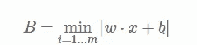

# 支持向量机—数学—第 1 部分

> 原文：<https://medium.com/analytics-vidhya/support-vector-machine-with-math-part-1-df5a4bf69913?source=collection_archive---------8----------------------->

来源:谷歌

SVM 是一种流行的监督机器学习算法。它用于回归和分类任务。这是一种有区别的分类算法。
朴素贝叶斯是一个生成分类器——学习一个模型来描述每个基础类的分布，生成模型用于概率性地为新点生成标签。但是，正如所称的那样，SVM 是一个区别性的分类器，我们不是为每个类别建模，而是找到一条线或曲线(在二维中)或流形(在更高维中)来将类别彼此分开。
如果你能联系到该图，SVM 的正式定义是“SVM 的主要目标是找到最佳线性分离超平面，它最大限度地增加了利润。”

**SVM 背后的直觉:**

考虑分类任务的简单情况，其中两类点被很好地分开

线性判别分类器会试图画一条直线来分隔两组数据，从而创建一个分类模型。对于像这里显示的 2 D 数据，这是一个我们可以手工完成的任务。但是我们立刻看到一个问题，有不止一条可能的分界线，可以完美地区分这两个阶级。

显然，我们简单的直觉“在类之间划一条线”是不够的，我们需要想得更深一点。

支持向量机提供了一种改进的方法。直觉是这样的:不是简单地在类之间画一条零宽度的线，我们可以在每条线周围画一个一定宽度的空白，直到最近的点。

在支持向量机中，最大化这一界限的线是我们将选择作为最佳模型的线。支持向量机就是这种最大间隔估计器的一个例子。

我们现在可以使用 sklearn 的 SVC(支持向量分类器)来进行分类。

在上一行的图表中，我们看到了一条分割线，这条分割线最大化了点集之间的边距。很少有训练点只是触及边缘..这些点是这种拟合的关键元素，被称为支持向量，这就是该算法的名称。在 Scikit-Learn 中，这些点的身份存储在分类器的 support_vectors_attribute 中。

这个分类器成功的一个关键是，对于拟合来说，只有支持向量的位置才是重要的
任何远离边缘、位于正确一侧的点都不会修改拟合。
从技术上讲，这是因为这些点对用于拟合模型的损失函数没有贡献，因此只要它们不越过边界，它们的位置和数量就无关紧要。
因此，当我们选择最优超平面时，我们将在一组超平面中选择一个离最近的数据点(支持向量)距离最高的超平面。如果最佳超平面非常接近数据点，那么余量将非常小，并且它将很好地概括训练数据，但是当看不见的数据到来时，它将不能很好地概括，如上所述。因此，我们的目标是最大限度地提高利润率，使我们的分类器可以很好地推广看不见的实例。

# **SVM 培训工作概述**

因此，在训练阶段，我们固定训练点的子集，从中计算任何测试点的相似性。这些选定的训练点被称为支持向量，因为只有这些点将支持我们选择测试点类别的决策。我们希望我们的训练阶段找到尽可能少的支持向量，以便我们必须计算更少数量的相似性。
现在，一旦我们选择了支持向量，我们就为每个支持向量分配一个权重，这基本上说明了我们在做出决策时希望给予该支持向量多大的重要性。我们不仅仅重视单个训练点，而是给予每个支持向量单独的重要性。
为了做出决定，我们只需计算从测试点到每个支持向量的相似性的加权和，并基于该加权和计算类别。

# **深潜 SVM 前要知道的概念。**

**向量的长度:** 向量 x 的长度称为它的范数，记为||x||。计算向量 x = (x1，x2，…，xn)的范数的欧几里德范数公式为:

向量范数

**矢量的方向:**

向量 x = (x1，x2x1，x2)的方向记为 w，定义为:

向量的方向示例

如果我们看这个图，我们可以看到。

因此，方向向量 w 也可以写成:

方向向量的范数总是 1。因此 w 也称为单位向量。

# **两个向量的点积:**

两个向量的点积返回一个标量。它让我们对这两个向量的关系有了一些了解。
下图显示了两个矢量 x 和 y 以及它们之间的夹角θθ。点积的几何公式定义为:

但是从上图我们可以看到

因此我们得到:

将 cos(θ)代入公式，我们得到:

这是点积的代数公式。一般来说，对于两个 n 维向量，点积可以计算如下:

# **超平面**

我们前面已经看到过术语超平面。但是到底是什么呢？它用于分离更高维度的数据(3D)。
我们先来看二维的情况。二维可线性分离的数据可以用一条线分开。这条线的等式是 y=ax+b。我们用 x1 重命名 x，用 x2 重命名 y，我们得到:

ax1 x2+b = 0

> 如果我们定义 x = (x1，x2)，w = (a，1)，我们得到:
> w⋅x+b=0
> 这个方程是由二维向量导出的。但事实上，它也适用于任何数量的维度。这是超平面的方程。

一旦我们有了超平面，我们就可以使用这个超平面来进行预测。我们将假设函数 h 定义为

超平面之上或之上的点将被分类为类+1，超平面之下的点将被分类为类-1。
因此，基本上，重申 SVM 学习算法的目标是找到一个能够准确分离数据的超平面。可能有许多这样的超平面。我们需要找到最好的一个，它通常被称为最优超平面。

**比较超平面的度量:**

让我们首先考虑超平面 w⋅x+b =0 的方程。我们知道，如果点(x，y)在超平面上，w⋅x+b=0.如果点(x，y)不在超平面上，w⋅x+b 的值可以是正的或负的。对于所有的训练样本点，我们想知道最接近超平面的点。我们可以计算β=|w⋅x+b|(垂直距离)。正式定义问题:
给定一个数据集，我们为每个训练样本计算β，B 是我们得到的最小β。

如果我们有 s 个超平面，每个超平面都有一个 Bi 值，我们将选择具有最大 Bi 值的超平面。

前一个度量的问题是，它可能无法区分好的超平面和坏的超平面。因为我们取 w⋅x+b 的绝对值，我们可以得到一个正确的和一个不正确的超平面的相同值。我们需要调整这个指标。我们可以使用标签 y 的信息。让我们定义 f=y(w⋅x+b)，并且如果点被正确分类，f 的符号将总是正的，如果不正确分类，将是负的。
为了使其形式化，给定一个数据集 D，我们为每个训练样本计算 F，F 是我们得到的最小 F。在文献中，F 被称为数据集的功能裕度。

当比较超平面时，具有最大 F 的超平面将被优先选择。看来我们找到了正确的衡量标准。然而，这种度量存在一个问题，叫做尺度变异。例如，我们有两个向量 w1=(1，4)和 w2=(10，20))。因为它们具有相同的单位向量 u=(0.6，0.8)，所以两个向量 w1 和 w2 表示相同的超平面。然而，当我们计算 F 时，带有 w2 的函数将返回一个比带有 w1 的函数更大的数。我们需要找到一个尺度不变的度量。

现在让我们看看最终的版本，它也是比例不变的:我们将 f 除以向量 w 的长度，我们定义:

为了使它形式化，给定一个数据集 D，我们为每个训练样本计算γ，M 是我们得到的最小γ。在文献中，M 被称为数据集的几何边缘

当比较超平面时，具有最大 M 的超平面将被优先选择。我们现在有了一个比较不同超平面的完美标准。我们的目标是找到一个最优超平面，这意味着我们需要找到最优超平面的 w 和 b 的值。
求 w 和 b 的值的问题叫做优化问题。

在下一部分，我将提出如何推导 svm 优化问题(提示对偶)。

**参考文献:**

 [## 理解支持向量机背后的数学原理

### 支持向量机(SVM)是最强大的开箱即用的监督机器学习算法之一。不像…

shuzhanfan.github.io](https://shuzhanfan.github.io/2018/05/understanding-mathematics-behind-support-vector-machines/)  [## Python 数据科学手册

### 该网站包含 Jake VanderPlas 的 Python 数据科学手册的全文；该内容可在…上获得

jakevdp.github.io](https://jakevdp.github.io/PythonDataScienceHandbook/)