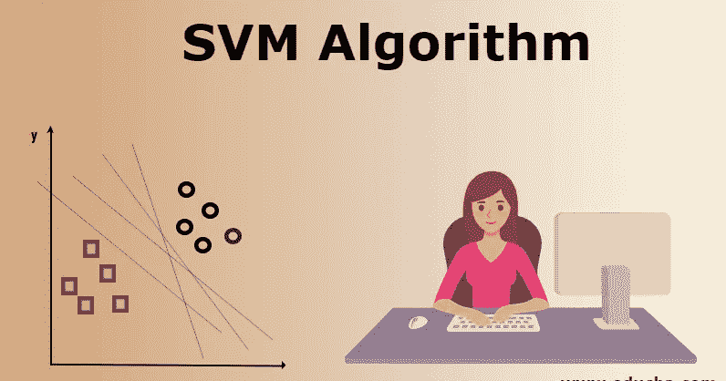

# 支持向量机

> 原文：<https://medium.com/analytics-vidhya/support-vector-machines-6bdee455d519?source=collection_archive---------11----------------------->

## ***直觉背后的 SVM***

在[机器学习](https://en.wikipedia.org/wiki/Machine_learning)中，支持向量**机器**是[监督的](https://en.wikipedia.org/wiki/Supervised_learning)学习模型，具有相关的学习算法，分析用于[分类](https://en.wikipedia.org/wiki/Statistical_classification)和[回归分析](https://en.wikipedia.org/wiki/Regression_analysis)的数据。给定一组训练样本，每个样本被标记为属于两个类别中的一个或另一个，SVM 训练算法建立一个模型，将新的样本分配到一个类别或另一个类别，使其成为一个有效的训练样本