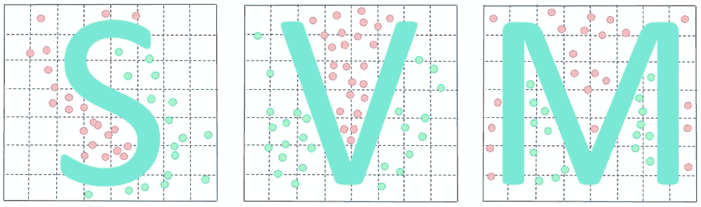
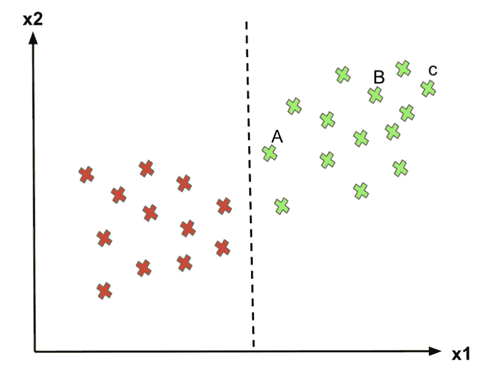
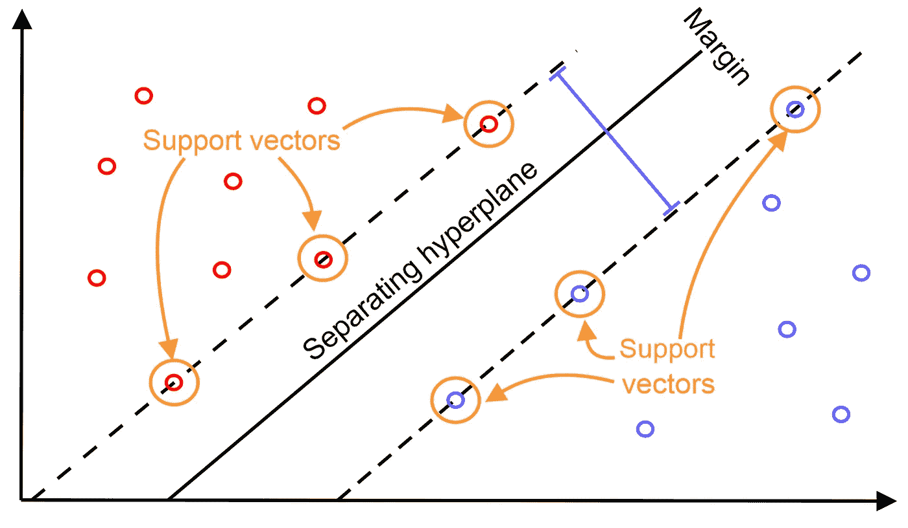
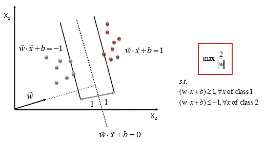
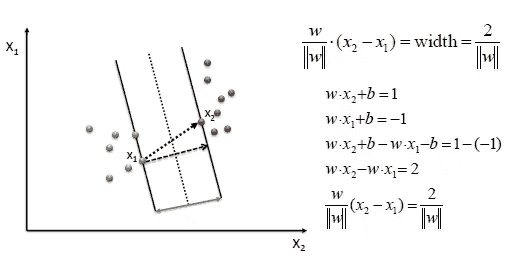
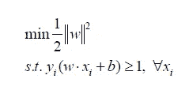

# 支持向量机

> 原文：<https://medium.com/analytics-vidhya/support-vector-machines-805a24507f?source=collection_archive---------26----------------------->

[https://PVS mt 99345 . I . lithium . com/t5/image/server page/image-id/60277 IC 217 f 66 e2ac 54722/image-size/large？v=1.0 & px=999](https://pvsmt99345.i.lithium.com/t5/image/serverpage/image-id/60277iC217F66E2AC54722/image-size/large?v=1.0&px=999)

这是一篇两部分的文章，第一部分我将讨论硬边界支持向量机，下一部分我将讨论软边界和内核。

支持向量机(SVM)是一个非常强大和通用的机器学习模型，能够执行线性或非线性分类，回归，甚至离群点检测，任何对机器学习感兴趣的人都应该在他们的工具箱中有它。

# 当我们有逻辑回归时，支持向量机的需求是什么？

在我之前关于逻辑回归[(查看链接](/analytics-vidhya/logistic-regression-46a0f3cdecef))的文章中，我们已经讨论了如何通过在超平面的帮助下分离类别来帮助解决分类问题，但是可以有无限多个超平面，逻辑回归可以任意选择其中的任何一个。看到下图这个问题会更清楚。

[https://www . vebuso . com/2020/02/a-top-machine-learning-algorithm-explained-support-vector-machines-SVMs/](https://www.vebuso.com/2020/02/a-top-machine-learning-algorithm-explained-support-vector-machines-svms/)

我们的关注点应该是 C 和 A，对于 C，它非常清楚地被分类为 1，因为它远离决策边界，但是对于 A 类，即使它被分类为 1，但是决策边界向右的位置的任何变化都会将 A 分类为 0。因此，随着该点离决策边界越远，我们对自己的预测就越有信心。因此，最佳决策边界应该能够最大化决策边界和所有实例之间的距离。即最大化利润。这就是支持向量机算法重要的原因！。

# 什么是支持向量机？

SVM 算法的目标是创建可以将 n 维空间分成类的最佳线或决策边界，以便我们将来可以轻松地将新数据点放入正确的类别中。它也被称为**最宽的街道入口**。

SVM 选择极值点/向量来帮助创建超平面。这些极端情况被称为**支持向量**，因此算法被称为支持向量机。考虑下图，其中有两个不同的类别，使用决策边界或超平面进行分类:

[https://static . packt-cdn . com/products/9781789345070/graphics/6a 831600-9a0d-429 f-9d 34-d 957 c 45 b 9517 . png](https://static.packt-cdn.com/products/9781789345070/graphics/6a831600-9a0d-429f-9d34-d957c45b9517.png)

它可以被视为一条街道，我们的目标是找到具有最大余量的超平面，因此被命名为**最宽街道方法**。

【https://www.saedsayad.com/support_vector_machine.htm 

假设我们有一些正点(红色)和一些负点(绿色)以及超平面 vec(w)。现在，为了将一个点分类为正或负，我们必须将该点投影到超平面上，如果(w.x+b)≥ 1，我们将它分类为正，否则为负。现在，对于预测，我们只需要知道预测值的符号，即 y_pred = sign(wx+b ),如果它返回+1，则为正，如果返回-1，则为负。

[https://www.saedsayad.com/support_vector_machine.htm](https://www.saedsayad.com/support_vector_machine.htm)

现在，为了找到一个最佳超平面，我们需要最大化宽度(w)。最大化 w 意味着我们需要最小化等式 1/2||w||为了数学上的方便，我们平方该项，现在我们需要找到最小化下面给出的等式的 w 和 b。

[https://www.saedsayad.com/images/SVM_optimize_2.png](https://www.saedsayad.com/images/SVM_optimize_2.png)

这就是所谓的硬边界支持向量机，因为在这种情况下，数据需要完全分离，支持向量机才能很好地工作，但当数据是非线性等其他形式时，或者如果数据有噪声且数据中存在大量异常值，会发生什么情况？出现了对软间隔支持向量机和内核的需求，我们将在本文中的 see 中熟悉它们。

为了学习更多关于支持向量机的知识，这里有一些有用的链接，帮助我更好地理解支持向量机。

 [## 支持向量机

### 地图>数据科学>预测未来>建模>分类>支持向量机一个支持向量…

www.saedsayad.com](https://www.saedsayad.com/support_vector_machine.htm)  [## 应用课程

### 应用机器学习课程 GATE CS 混合课程面试准备课程 AI Workshop AI 案例研究

www.appliedaicourse.com](https://www.appliedaicourse.com/lecture/11/applied-machine-learning-online-course/3047/geometric-intution/4/module-4-machine-learning-ii-supervised-learning-models) 

建议总是受欢迎的。别忘了看看我的其他文章。

[从零开始的线性回归。](https://ak95ml.blogspot.com/2020/06/linear-regression.html)

[美汤刮痧](https://www.blogger.com/blog/post/edit/1004924421828631592/5881650886724527591#)

[我如何开始机器学习爱好者的旅程](https://www.blogger.com/blog/post/edit/1004924421828631592/5881650886724527591#)。