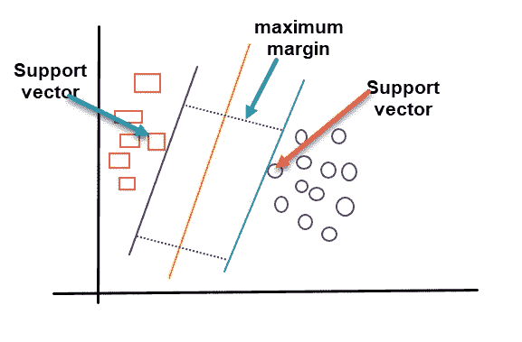
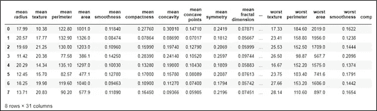

# 支持向量机

> 原文：<https://medium.com/analytics-vidhya/support-vector-machines-c21e4a343082?source=collection_archive---------25----------------------->

# **简介**

在经历了支持向量机的多种定义之后，我明白了:

*“支持向量机是一种监督机器学习算法，主要用于分类目的。在 SVM 算法中，生成一个对新数据点进行分类的最佳超平面。它适用于线性和非线性数据集。”*

这个定义现在对你来说可能没有意义。没事的。

跟着教程走就行了

**支持向量机是如何工作的？**

假设我们有一个形状数据集。我们的数据集有两种形状方形和圆形。我们的目标是画一条线来分开这两个形状。让我们画出所有可能将数据集分成两类的线。

用你最好的直觉来选择哪条线对数据分类最好。绿线垂直地将数据分成两半，而黑线更接近平方值。请记住，我们需要选择一条线，不仅对这些数据进行分类，而且对新的数据点进行很好的归纳。所以我们决定黄线是最安全的选择。要画一个超平面，首先要确定上面数据集中的支持向量。支持向量是最接近黄线的数据点，这些点影响超平面的位置。

确定支持向量，并为这两类绘制边界线。现在我们计算黄线和支持向量之间的距离。这个距离叫做**余量**，我们需要找出**最大余量**。一旦计算出最大余量，黄线就是最佳超平面，它也可以用于新的数据点。

当数据是非线性的，SVM 首先将数据转换成更高的维度。让我们以二维空间中的非线性数据为例。这些数据可以转换成高维的线性可分数据。要转换 3D 数据，请添加 z 轴。z 轴仅仅是原始 2D 数据中点的距离的平方。使用 ***z = x +y*** 等式 ***计算 z 轴。***

通过增加额外的维度，数据变得线性可分，现在我们可以计算最佳超平面。对于高维数据的转换，我们在 Scikit-learn 库中有一个内核的概念。

**与 SVM 相关的术语**

为了实现 SVM，我们将使用 Scikit-learn 库，理解 Scikit-learn 的 SVC 类所使用的参数将会有所帮助。让我们看看 SVC 类中最有用的参数。

**内核:**

核是 SVM 中最重要的参数。它获取低维输入数据，并将其转换为高维数据。内核技巧有助于建立一个准确的分类器。有各种类型的核，如多项式，rbf，线性，sigmoid 和预计算。

**C:**

这是正则化参数，它告诉我们在我们的系统中允许多少错误分类。决策边界实际上是边界覆盖的数据点数量和概化程度之间的权衡。

c 的高值意味着最佳超平面具有较小的边界，并且它正确地分类所有的训练点。小的 c 值意味着最优超平面具有大的裕度，并且其中有很少的误分类数据点。

**程度:**

它仅适用于多项式核函数。其默认值为 3。

**伽玛:**

伽马告诉我们每个数据点的影响达到了多远。较小的伽马值将给出低偏差和高方差，而较大的值将给出较高的偏差和低方差。

**SVM 的实现:**

让我们使用 scikit-learn 库实现支持向量机。在本教程中，我们将使用 scikit-learn 数据集包中的乳腺癌数据集。

首先，让我们导入构建模型所需的基本库

**转换为熊猫的数据帧:**

从数据集模块导入乳腺癌数据集，并将其转换为 pandas 数据框。这种到数据帧的转换是不必要的。它只是帮助初学者更好地理解数据。

让我们为前 8 行调用 header 函数。

根据下面的信息，我们假设数据集由 31 列组成。前 30 列代表数据，最后一列由用于分类的标签组成。这里，标签是良性的，表示为 0，恶性的表示为 1。

特征列和目标列都将用于预测癌症的类型。

**列车测试分割:**

在机器学习中，在一些数据集上测试模型是很重要的。机器学习中的常见做法是将数据集分成两部分，即训练集和测试集。这里，我们使用 80–20 规则，即将 80%的数据用于训练，20%的数据用于测试。

模型选择库提供了将数据分成两半的训练测试分割类。要使用 train-test split 类，首先定义两个变量 x 和 y。x 变量具有数据特征，而 y 变量保存标签。这些变量将用作列车测试分割的参数。

我们将定义测试规模和随机状态参数。遵循 80–20 规则，测试大小被定义为 0.2，而随机状态被设置为 4。

**培训:**

现在，我们将使用支持向量机模型训练我们的数据。为此，我们将使用 scikit-learn SVM 图书馆。RBF 核函数将用于训练我们的 SVM 模型。

**预测:**

我们已经成功地训练了我们的模型，现在我们将使用测试数据集对此进行测试。

**评价:**

用于分类的评估度量是混淆矩阵、准确度分数、F1 度量、精确度、召回率和 Jaccard 指数。让我们将这些评估指标应用到我们的训练模型中。

所以模型的整体准确率是 70%。我们可以通过调整参数和使用交叉验证方法来提高精确度。

**SVM 的应用**

我们正处于一个机器学习概念已经超越理论的时代。像其他机器学习算法一样，支持向量机也在各种现实世界的应用中使用。SVM 的一些常见应用有

**文本分类:**

支持向量机已被广泛用于文本分类。SVM 利用归纳和直推模型。在文本分类中，阈值被定义并被用于基于相似性分数对文本进行分类。

**人脸检测应用:**

如今，人脸检测应用非常普遍。支持向量机在这些应用程序中的作用是通过在面部周围绘制边界来识别面部特征。

**医学研究:**

从癌症预测到特定生物问题的基因分类，都可以使用 SVM。SVM 为蛋白质分类和遗传学研究提供了高精度。

**手写数字识别:**

你在学习机器学习的时候一定用过手写数字数据集。支持向量机可以用来分类这些，并成功地用于现实世界的系统。

与他人分享我对 SVM 的了解。我希望你能理解这个概念。