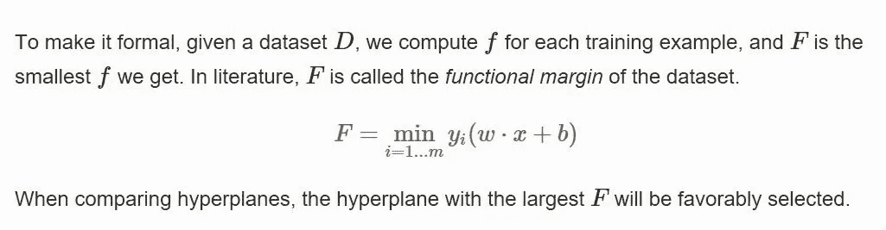
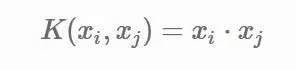

# 支持向量机(SVM)-确保高速公路质量的向量

> 原文：<https://medium.com/analytics-vidhya/support-vector-machines-svm-the-vectors-that-ensure-better-highways-952306f5dfb4?source=collection_archive---------23----------------------->

www.broadhighwayrecovery.com

支持向量机(SVM)或网络(SVN)是在监督学习下分析分类和回归问题数据的算法家族成员。术语“支持向量”定义了作为在超平面的任一侧上延伸的两个或多个类别的前线的向量，其确保了在定义的决策边界上的最大限度。当我们最大化利润时，具有目标函数的 SVM 优化问题出现，从而保持对较高成本和不希望的最大化的惩罚的检查，这可能倾向于导致传统的过度拟合问题。

好吧，让我用稍微不同的方式解释一下，让你暂停一下，想想为什么以及如何让支持向量机在更好的高速公路上运行！！

让我们考虑一条拟在乡村之间的农村地区修建的新公路的问题，该问题需要进行全面规划，以满足以下条件:

1.  最大车道，以避免运营后的交通拥堵，这意味着道路两侧的裕度更大
2.  车辆倾斜角度下平稳驾驶的最小弯曲/曲线
3.  尽量减少对房屋、地块、农田等障碍物的破坏。因为他们需要得到替代方案的补偿
4.  为补偿设置的上限成本阈值
5.  *在施工时拒绝不必要的侵入

**这是指不受欢迎的客人，他们将开始在拟建公路上建造房屋，以获得补偿利益*

既然我们已经了解了在构建高速公路时考虑的优先级，我们需要在实现支持向量机算法时复制同样的优先级。

【https://commons.wikimedia.org/wiki/File:Kernel_Machine.png 号

超平面是维数为 N-1 的子空间，其中 N 是特征空间中的维数。让我们考虑二维特征空间(假设 2 个村庄)中的上述示例，其中中心线是超平面(划分双向交通的道路),该超平面将类分为村庄 1 房屋和村庄 2 房屋。对于非线性可分数据，图 1 显示了一个超平面，它有太多的曲线和弯曲，导致较高的偏差问题，从而导致过度拟合。然而，图 2 显示了一个完整的超平面，该超平面通过两个类别的支持向量(来自两个村庄的邻近房屋)线性分离两个村庄的房屋，确保了适当的边界宽度。这是通过实现新的变量和内核技巧来实现的，这些新的变量和内核技巧以数学方式将原始数据点映射到一个更高维的空间。我们将在后面的章节中详细介绍内核技巧。

首先，我们需要找出最佳超平面和最合适的支持向量。最佳超平面满足“w”和“b”的值，这两个值定义了向量(房屋的坐标位置)和距超平面的距离(距公路的距离)。

[https://shuzhanfan . github . io/2018/05/understanding-mathematics-behind-support-vector-machines/](https://shuzhanfan.github.io/2018/05/understanding-mathematics-behind-support-vector-machines/)

在数学上，通过求解 Wolfe-Dual 问题，包含拉格朗日乘数的向量确定了“w”和“b”的最优超平面求解值以及支持向量的数量。

[https://shuzhanfan . github . io/2018/05/understanding-mathematics-behind-support-vector-machines/](https://shuzhanfan.github.io/2018/05/understanding-mathematics-behind-support-vector-machines/)

随着支持向量、超平面和边缘宽度的数量最终确定，我们满足上面定义的前三个条件，即最大车道数量、最小弯曲和最小破坏家庭或农田。但是，在第三个条件中，我们仍然需要提出补偿成本作为替代方案，我们将在接下来的步骤中讨论。

由支持向量定义的裕度可以被宽泛地分类为“硬裕度”和“软裕度”，这意味着硬裕度假设类在满足所有优化约束的情况下更加线性可分，而软裕度假设类更加非线性可分，导致约束问题更加复杂。

硬边界-线性可分类

软边界——非线性可分类

就公路而言，硬边界是这样一种情况，即公路左侧的所有房屋都被归类为村庄 1，右侧的所有房屋都被归类为村庄 2。(*请注意，分类是在便于公路建设者识别的基础上进行的，补偿是基于两侧的土地价值，而不是村庄名称)

然而，我们从未在现实生活中观察到如此清晰的分类。考虑到上面的非线性可分图中的软边界，我们确实看到村庄 1 和村庄 2 的一些房屋位于定义的支持向量边界的相对侧，使得不可能调整或拟合超平面。因此，需要定义一个变量来处理此类房屋存在的问题。因此，建设当局与这些房屋的业主接触，讨论赔偿和结算金额。

“松弛变量”被添加到先前定义的 Wolfe 对偶问题中，这有助于在优化目标函数时满足约束。我们将松弛变量的下限定义为零，上限没有限制，并且可以选择足够大的值来满足决策边界上的所有约束。

[https://shuzhanfan . github . io/2018/05/understanding-mathematics-behind-support-vector-machines/](https://shuzhanfan.github.io/2018/05/understanding-mathematics-behind-support-vector-machines/)

现在，我们了解到，在 slack 变量的帮助下，建筑公司创建了一个本金基金，确保根据房屋与各自公路边界的距离，没有用于房屋补偿的负支出。然而，我们仍然有一个在赔偿过程中可能出现的问题。如果一些房东/不受欢迎的客人利用这种补偿，开始以更快的速度建造房屋，只是以获得更大的补偿为座右铭，那该怎么办？按照建筑当局的计划，这应该不会很好。

接下来是用于救援的 L1 正则化参数 C，它不仅通过将下限定义为零，还通过将阈值定义为松弛变量的上限来确定松弛变量的重要性。这意味着较小的 C 值强调了松弛变量的重要性，从而导致较宽的容限，对错误分类具有一定的容限，而较大的 C 值降低了松弛变量的重要性，从而使硬容限对违反约束的情况零容限。

[https://shuzhanfan . github . io/2018/05/understanding-mathematics-behind-support-vector-machines/](https://shuzhanfan.github.io/2018/05/understanding-mathematics-behind-support-vector-machines/)

现在，建设当局已经设定了他们应该从本金基金中赔偿多少的限制，而不必担心为有争议的土地所有者或非法建筑商支付巨额奖金。

因此，我们解决了开始时定义的所有 5 个条件，并且很好地实现了我们的目标函数。

“核技巧”处理在类别的较大非线性可分性的情况下特征空间的维度变换。这些技巧有助于根据复杂程度转换数据点。

在 Wolfe-Dual 问题中，我们定义了一个计算点积的核函数，将数据转换到更高维度，从而解决了我们的非线性问题。

[https://shuzhanfan . github . io/2018/05/understanding-mathematics-behind-support-vector-machines/](https://shuzhanfan.github.io/2018/05/understanding-mathematics-behind-support-vector-machines/)

基于数据集的性质，有 3 种类型的核用于分类问题:

1.  线性核:一个简单的向量点积

2.多项式核:具有常数 C 和自由度 d 的向量的点积

3.径向基函数(RBF)核:一种高斯核，在参数的帮助下会产生更复杂的决策边界

这些核心技巧就像建筑领域的技术进步，道路可以简单地用焦油或混凝土手工铺设，也可以用机器人技术进行数字打印。决策取决于建筑公司根据其需求和时间表决定最佳实施方法。

好了，这就结束了支持向量机确保在更好的公路上！！