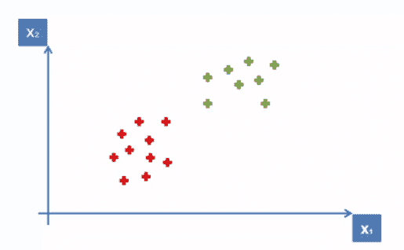
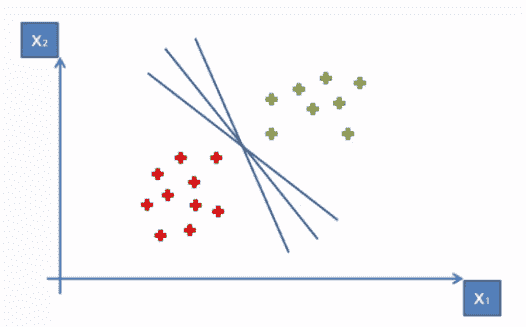
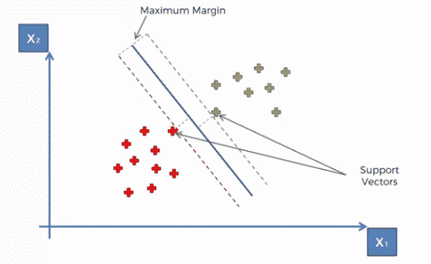
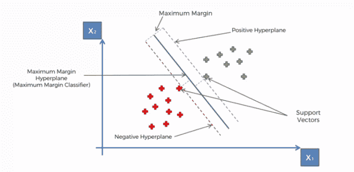
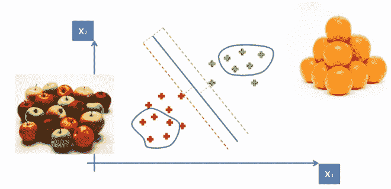
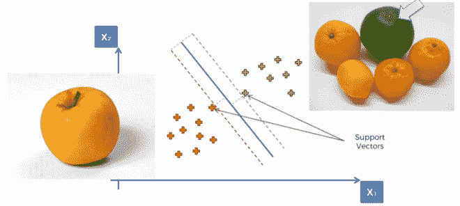

# 支持向量机(SVM)-它们是什么？

> 原文：<https://medium.com/analytics-vidhya/support-vector-machines-svm-what-are-they-72d85f58eeb2?source=collection_archive---------21----------------------->

SVM 的 最初是在 20 世纪 60 年代开发的，然后在 20 世纪 90 年代进行了改进，现在它们在机器学习领域变得非常流行，因为它们证明了它们非常强大，并且不同于其他机器学习算法。

*支持向量机(SVM)是一种受监督的机器学习算法，可用于分类和回归目的。*它们更常用于分类问题。

**SVM 的作品如何？**

考虑具有两列 x1 和 x2 的二维空间上的一些常见点。

现在，我们如何推导出一条线，将这两个不同的点分开，并分别对它们进行分类？这种分离或决策边界是强制性的，因为当我们将来添加新点时，我们想要分类的点还没有被分类。我们将知道它们是落在绿色区域还是红色区域。

那么如何把这些点分开呢？

嗯，有很多方法可以在两者之间画线，达到如图所示的效果。

但是我们想找到最佳路线，这就是 SVM 的全部。“SVM”是关于寻找最佳决策边界，这将有助于我们把空间分成不同的类别。

所以让我们来看看 SVM 是如何寻找它的。通过最大边距搜索所需的行。

我们可以看到一条线将这两类点分开，它有 ***最大边距*** ，这意味着这条线和这些点(接触红色和绿色点)之间的距离是等距的。

现在，这两个距离的和必须最大化，以使这条线成为 SVM。边界点被称为支持向量。为什么这样

基本上这两个向量支持整个算法，其他点对算法的结果没有贡献，只有这两个点有贡献，因此它们被称为支持向量。

**这就是为什么整个算法被称为支持向量机(SVM)。**

现在我们得到了中间的线，叫做最大间隔超平面或最大间隔分类器。在二维空间中，它就像一条线一样的分类器，但在多维空间中，它是一个水平面。

所以接触绿色的边界称为正超平面，接触红色的边界称为负超平面。

现在你的问题可能是..

SVM 有什么特别之处？为什么它们受欢迎，与其他机器学习算法不同？

让我们找出答案

想象一下，你正试图教一台机器如何区分苹果和橘子，也就是如何将一种水果分为苹果和橘子。

所以你告诉一台机器去分析和观察它们，看看它的参数，下一次它会得到一个水果，它必须对它进行分类，并告诉它是苹果还是橘子。

所以这是一个标准的机器学习问题。

在我们的例子中，假设右边是橘子，左边是苹果。

**主要是**机器算法会查看最标准的普通类型的苹果和最标准的普通类型的橙子，机器会尝试从非常像苹果和橙子的苹果中学习。因此，它会知道什么是苹果，什么是橙子，这是大多数机器学习算法的工作方式，基于此，它将能够做出一些预测。

**在 SVM 的例子中，情况有所不同，**SVM 不是看最标准的苹果和橘子，而是看非常像橘子的苹果。

所以这里你可以看到一个不是标准苹果的苹果和一个不是标准橘子的橘子(绿色的)。

现在**这些是支持向量**，你可以看到它们(支持向量)非常接近边界。

SVM 是一种更极端的算法，一种非常危险的类型，因为*它观察非常接近边界的非常极端的情况，并使用它来构建分析。*

这使得 SVM 算法与其他机器学习算法不同。这就是为什么他们支持比不支持向量机算法好得多。

# 支持向量机的利与弊

**优点**

*   准确(性)
*   适用于较小的干净数据集
*   它可以更有效，因为它使用了训练点的子集

**缺点**

*   不适合较大的数据集，因为支持向量机的训练时间可能很长
*   对具有重叠类的噪声较大的数据集效果较差

# SVM 使用

*   SVM 用于文本分类任务，如类别分配、检测垃圾邮件和情感分析。
*   对于图像识别挑战，在基于特征的识别和基于颜色的分类方面表现尤为出色。

SVM 还在许多手写数字识别领域发挥着重要作用，如邮政自动化服务。

你觉得这篇博客有帮助吗？请在下面的评论区分享你的观点/想法。🙂