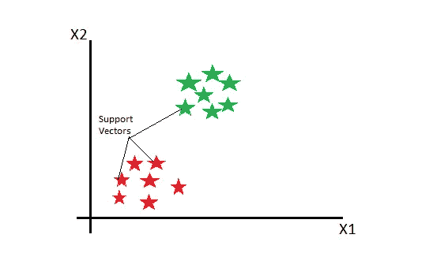
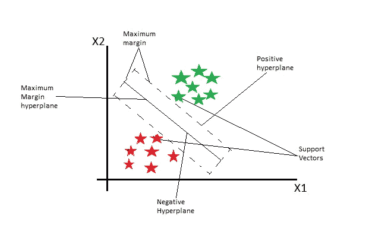
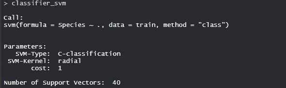
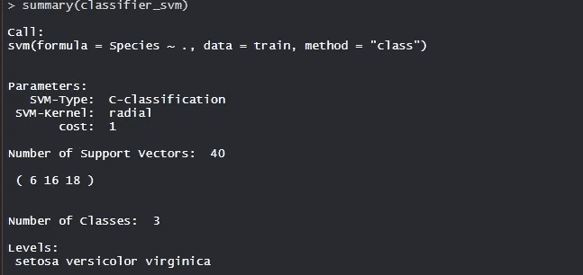
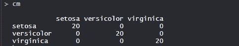
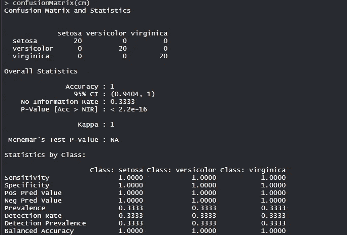

# 支持向量机——像向量一样思考！

> 原文：<https://medium.com/analytics-vidhya/support-vector-machines-thinking-like-vectors-ba75f184c471?source=collection_archive---------23----------------------->

由 [Chiplanay](https://pixabay.com/users/chiplanay-1971251/) 在 [pixabay](https://pixabay.com) 上拍摄的照片

*支持向量机在高维空间中工作良好，具有清晰的边界或分离，从而像向量一样思考。*

支持向量机(SVM)是一种受监督的非线性机器学习算法，可用于分类和回归问题。SVM 用于生成多个分离超平面，使得它划分数据空间的片段，并且每个片段仅包含一种数据。

SVM 技术对于分布未知的数据是有用的，即具有非规律性的数据，即垃圾邮件分类、手写识别、文本分类、说话人识别等中的数据。我用它列举了支持向量机的应用。:)

***这篇文章是关于用一个例子解释支持向量机，在一个数据集上演示支持向量机，并解释生成的演示输出。***

# SVM 背后的例子是什么？

独家创作的图片

在支持向量机中，我们将每个数据绘制为 n 维空间中的一个点(其中“n”是特征的数量)，每个特征的值是特定坐标的值。然后，我们通过找到区分类别的超平面来执行分类。

**例**
考虑一个包含苹果和橘子的数据集。因此，为了对它们进行分类，我们使用支持向量机 ad 标记飞机上的训练数据。

照片由 [Sarah Gualtieri](https://unsplash.com/@sarahjgualtieri) 在 [Unsplash](https://unsplash.com) 上拍摄

支持向量机(SVM)获取这些数据点，并输出最佳分离标签的超平面(这是方程 y = ax + b 的二维线)。这条线被称为**决策边界**，也就是说，落在这条线一边的任何东西都被归类为苹果，落在另一边的任何东西都被归类为橙色。

当超平面(二维线)到每个数据点或标记的最近元素的距离最大时，即在最大边距上指定时，超平面是最佳的。

独家创作的图片

直线 ax+b=0 上的所有点将满足等式，因此，我们为一边绘制两条平行线 ax+b=-1，为另一边绘制 ax+b=1，使得这些线穿过最接近我们的直线的线段中的数据点或标记，然后这两条线之间的距离将是我们的边距。

# 使用数据集进行演示

鸢尾数据集由 3 种鸢尾(鸢尾、海滨鸢尾和杂色鸢尾)的 50 个样本组成，是由英国统计学家和生物学家罗纳德·费雪在 1936 年的论文中引入的多元数据集。分类问题中多重测量的使用。

测量每个样本的四个特征，即萼片和花瓣的长度和宽度，基于这四个特征的组合，Fisher 开发了一个线性判别模型来区分物种。

> #加载数据
> 数据(虹膜)
> 
> #结构
> str(虹膜)

使用 e1071 软件包对包括 11 个人和 6 个变量的数据集使用支持向量机算法。[包装说明参见](https://cran.r-project.org/web/packages/e1071/e1071.pdf)。

> #安装软件包
> install . Packages(" e 1071 ")
> install . Packages(" caTools ")
> install . Packages(" caret ")
> 
> #加载包
> 库(e1071)
> 库(caTools)
> 库(插入符号)
> 
> #将数据拆分成训练数据
> #和测试数据
> 拆分< - sample.split(iris，split ratio = 0.7)
> train _ SV<-subset(iris，split = = " TRUE ")
> test _ SV<-subset(iris，split == "FALSE ")
> 
> #特征缩放
> 训练 _ 缩放< -缩放(训练 _sv[，1:4])
> 测试 _ 缩放< -缩放(测试 _sv[，1:4])
> 
> #将 KNN 模型
> #拟合到训练数据集
> set.seed(120) #设置种子
> 分类器 _svm < - svm(物种~)。，data = train，method = "class")
> 分类器 _svm
> 
> #模型摘要
> 摘要(分类器 _svm)
> 
> # Prediction
> test _ SV $ Species _ Predic<-predict(classifier _ SVM，newdata = test_sv，type = "class ")
> 
> #混淆矩阵
> cm < -表格(test _ SV＄Species，test _ SV＄Species _ Predic)
> cm
> 
> #模型评估
> 混淆矩阵(cm)

# 输出——定义了一切

1.  **模型分类器 _svm:**

独家拍摄的图片

训练的模型是具有 40 个支持向量和径向核的分类模型。

2.**型号概述**:

独家拍摄的图片

训练的模型是具有 40 个支持向量或数据点的分类模型，具有 3 个类别和 3 个级别，即 Setosa、Versicolor 和 Virginica。

3.**混淆矩阵:**

独家拍摄的图片

因此，20 种刚毛藻被正确地归类为刚毛藻。20 云芝被正确归类为云芝。20 海滨锦鸡儿被正确地归类为海滨锦鸡儿。

4.**模型评估:**

独家拍摄的图片

该模型实现了 100%的准确性，P 值小于 1。具有敏感性、特异性和平衡的准确性，模型构建良好。为了提高精度，超参数的调整是以最小的误差完成的，并且包括核、伽马和成本参数。

# 继续学习——永远不要停止学习

这是一个关于支持向量机的教程，支持向量机是一个重要的算法。

我以后也会写更多的帖子。一定要提供反馈或批评。在 [**中等**](/@dhruvaggarwal6) 跟我来。我可以在[T5【推特】T6](https://twitter.com/iam_dAggarwal)上联系到。