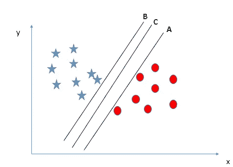
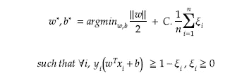
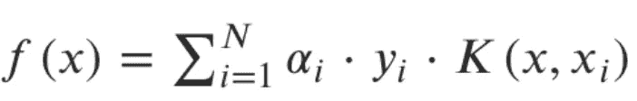
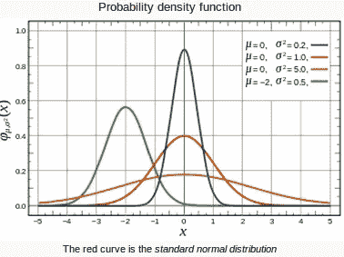
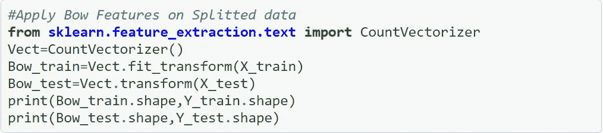

# 基于亚马逊食品评论的支持向量机

> 原文：<https://medium.com/analytics-vidhya/support-vector-machines-with-amazon-food-reviews-9fe0428e09ef?source=collection_archive---------8----------------------->

SVM 是一种监督机器学习算法，用于许多分类和回归问题。它仍然是最常用的稳健预测方法之一，可以应用于许多涉及分类的用例。

# 内容

1.  支持向量机的几何直觉。
2.  支持向量机的数学公式。
3.  支持向量机的损失最小化解释。
4.  支持向量机的对偶形式。
5.  支持向量机中的核技巧。
6.  支持向量机训练和运行时复杂性。
7.  支持向量机—回归(SVR)
8.  支持向量机算法的最佳和最坏情况。
9.  支持向量机与亚马逊食品评论。

## SVM 的核心思想

逻辑回归不关心实例是否接近决策边界。因此，它选择的决策边界可能不是最佳的。如果一个点远离决策边界，我们可能会对我们的预测更有信心。

因此，最佳决策边界应该能够最大化决策边界和所有实例之间的距离。即最大化利润。这就是为什么支持向量机算法很重要！

找到一个尽可能宽的分隔正点和负点的超平面。

支持向量机的工作原理是找到一条称为“超平面”的最佳分隔线，以准确区分分类问题中的 2 个或更多不同类别。目标是通过用 SVM 算法训练可线性分离的数据来找到**最佳超平面**分离。

这里，我们有三个超平面(A、B 和 C)。现在，确定正确的超平面来分类星形和圆形。

我们需要记住一条经验法则来识别正确的超平面。“选择能更好地分隔两个类别的超平面”。在这种情况下，超级飞机“B”出色地完成了这项工作。

这里，我们有三个超平面(A、B 和 C ),并且都很好地隔离了类。现在，我们如何确定正确的超平面？

这里，最大化最近的数据点(任一类)和超平面之间的距离将帮助我们决定正确的超平面。这个距离被称为**裕度**。

从上面可以看出，超平面 C 的裕度比 A 和 b 都高。因此，我们将右超平面命名为 C。选择裕度较高的超平面的另一个原因是鲁棒性。

如果我们选择一个具有低边缘的超平面，那么就有很高的错误分类的机会。

# 支持向量

这些是最难分类的数据点**。一般来说，支持向量之间的余量或距离越大，算法就越容易准确分类。因此，一旦超平面被优化，它就被称为最优分离或最大间隔分类器。**

# 关于支持向量机的另类直觉

在本节中，我们将使用**“凸包”**的概念，以找到利润最大化的超平面**。**

凸包可以定义为最小的凸多边形，使得它的所有点不是在多边形内部就是在多边形上。

凸多边形基本上是这样一种多边形，即连接任意两点(位于多边形内或多边形上)的最短直线上的所有点都位于多边形内或多边形上。

使用凸包的概念寻找边缘最大化超平面的步骤，

*   画出正数据点的凸包。
*   画出负数据点的凸包。
*   然后找到连接船体的最短的线或超平面。
*   最后，画出平分直线或超平面的直线或超平面。获得的这条线或超平面被称为**“边缘最大化超平面”**。

## 支持向量机的数学公式

让我们考虑正超平面和负超平面与分离超平面相距单位距离。

分离超平面的方程由下式给出，

正超平面的方程由下式给出，

负超平面的方程由下式给出，

裕度由下式给出:

那么对于 SVM，我们可以把约束优化问题写成，

这个等式也被称为**硬边界 SVM** 。

只有当给定数据是线性可分的，即所有正的点位于平面的一侧，所有负的点位于平面的另一侧，并且在正负平面之间没有数据点时，上述等式才有效。

由于大多数真实世界的数据不是完全线性可分的，我们将允许发生一些边界违规，这被称为软边界分类。最好有一个大的余量，即使违反了一些约束。边界违规意味着选择一个超平面，这可以允许一些数据点停留在超平面的不正确侧以及超平面的边界和正确侧之间。

从**硬裕度 SVM** 方程来看，我们无法解决这个问题，所以我们可以用其他实现。

分离超平面的方程由下式给出，

正超平面的方程由下式给出，

负超平面的方程由下式给出，

裕度由下式给出:

那么对于 SVM，我们可以把约束优化问题写成，

这个等式也被称为**软余量 SVM** 。

在上面的等式中，等式在“正”符号之前的第一部分被称为**“正则化”**，第二部分被称为**“铰链损耗”**。

c 是超参数。如果 C 增加，那么我们的模型是过拟合或高方差，如果 C 减少，那么我们的模型是欠拟合或高偏差。

对于较大的 C 值，如果超平面在正确分类所有训练点方面做得更好，则优化将选择较小边界的超平面。相反，非常小的 C 值将导致优化器寻找更大边界的分离超平面，即使该超平面错误分类了更多的点。

# 支持向量机的损失最小化解释

在 SVM 算法中，我们希望最大化数据点和超平面之间的间隔。有助于最大化裕量的损失函数是铰链损失。

y 轴称为“铰链损耗”, x 轴表示为

我们需要最小化上述损失函数来找到最大间隔分类器。损失函数的优化问题由下式给出:

本节得到的优化方程和上一节得到的优化方程是一样的。只有 C 和λ彼此反向相关λ=1/C (C 总是用于正则化系数)

第一项，铰链损失的作用是惩罚错误分类。它测量由于错误分类造成的误差。第二项是正则化项，这是一种通过惩罚解向量中的大系数来避免过拟合的技术。

λ(lambda)是正则化系数，其主要作用是确定增加边距大小与确保 xi 位于边距的正确一侧之间的权衡。

# 支持向量机的对偶形式

当我们看到软边界方程的方程时，它看起来像下面这样，我们可以被称为 SVM 的原始形式。

上面的等式等价地写为，

两者是等价的，对于上式，对于非支持向量来说 **α** 为 0，对于支持向量来说 **α** 为> 0。

# SVM 的内核技巧

到目前为止，我们描述的所有算法仅通过内积使用数据。正因为如此，它们可以以非常通用的方式变成非线性的。

听起来不错。然而，当维度越来越多时，空间内的计算变得越来越昂贵。这就是内核技巧发挥作用的时候了。它允许我们在原始特征空间中操作，而不需要计算数据在更高维空间中的坐标。

让我们回顾一下我们所看到的。简而言之，SVM 分类器可以通过计算最大余量 SVM 公式的凸[拉格朗日](http://people.csail.mit.edu/dsontag/courses/ml13/slides/lecture6.pdf) [对偶](http://people.csail.mit.edu/dsontag/courses/ml13/slides/lecture6.pdf)来求解如下:

核是在某些(可能是非常高维的)特征空间中计算两个向量 x 和 y 的点积的一种方式，这就是为什么核函数有时被称为“广义点积”。

对于非线性数据，不是想象每个数据点的原始特征，而是让我们首先考虑到新特征空间的变换，其中数据点具有 N 个特征，每个支持向量一个。

现在考虑一下，如果我们有下图所示的数据会怎么样？显然，在这个 x-y 平面上，没有一条线可以把这两个类分开。那我们该怎么办？

我们应用变换并增加一个维度，我们称之为 z 轴。我们假设 z 平面上的点的值，w = x + y，在这种情况下，我们可以把它操纵为一个点到 z 原点的距离。现在，如果我们在 z 轴上绘图，一个清晰的分离是可见的，可以画一条线。

剩下的就是把它映射回二维，当我们把这条线转换回原始平面时，它映射到圆形边界，如下所示。

内核化的作用是获取“d”维的数据，并使用内核技巧在内部隐式地将数据转换为“d1”维，通常 d1 >d。在“d1”维中，数据变成线性可分的。

如果我们想了解更多关于内核的窍门，可以参考这里的**。**

**请注意，一旦应用了核函数变换，数据点的原始特征现在就无关紧要了。然后，仅用支持向量(基本上是由 SVM 优化算法选择的特殊数据点)的点积来表示。**

**有两种非线性方法被称为**内核函数**或**内核技巧**，可用于转换数据。**

**因此，如果我们有一个函数“K ”,定义如下:**

********

**那么我们只需要知道 *K* 而不是映射函数本身。这个函数被称为**内核函数**，它降低了寻找映射函数的复杂性。因此，**核函数定义了变换空间中的内积。****

**我们必须根据我们的应用选择正确的内核。内核有多种类型:**

********

## **默瑟定理**

**除了这些预定义的内核，哪些条件决定了哪些函数可以被认为是内核？这是由**默瑟定理给出的。****

**第一个条件相当简单，即核函数必须是对称的。由于核函数是*点积(内积)*的映射函数我们可以写成如下:**

****

**Mercer 定理给出了函数是核函数的充要条件。**

****

## **支持向量机训练和运行时复杂性**

**支持向量机的训练时间复杂度约为 O(n)。如果 n 非常大，那么 O(n)也非常大，所以 SVM 没有用于基于低延迟的应用中。**

**运行时间复杂度大约为 O(k.d ),其中**

**k =支持向量的数量**

**d =数据的维度**

## **支持向量机—回归(SVR)**

**支持向量机也可以用作回归方法，保持表征算法的所有主要特征(最大间隔)。支持向量回归机(SVR)使用与 SVM 相同的原理进行分类，只有一些微小的区别。**

**假设给我们训练数据{(x1，y1)，…，(x，y)} ⊂ X × R，其中 x 表示输入模式的空间(例如，X = Rd)。例如，这些可能是随后几天测量的某些货币的汇率以及相应的经济计量指标。**

**在ε-SV 回归中，我们的目标是找到一个函数 f (x ),对于所有的训练数据，它与实际获得的目标 yi 的偏差至多为ε，同时尽可能平坦。换句话说，只要误差小于ε，我们就不在乎，但不接受任何大于ε的偏差。例如，如果你想确保在处理汇率问题时不损失超过ε的钱，这可能很重要。**

**出于教学的原因，我们首先描述线性函数 f 的情况，其形式为**

**f (x) = w，x + b，其中 w ∈ X，b ∈ R**

**然而，主要思想始终是相同的:为了最小化误差，个性化最大化裕度的超平面，记住部分误差是容许的。**

********

**然而，有时情况可能并非如此，或者我们也可能希望允许一些错误。类似于“软边际”损失函数。**

********

**常数 C > 0 决定了“f”的平坦度与容许偏差大于ε的量之间的平衡。**

**这对应于处理所谓的ε不敏感损失函数|ξ |ε，由下式描述**

****

**要了解更多关于 SVR 的信息，请访问 [**这里**](https://alex.smola.org/papers/2004/SmoSch04.pdf) **。****

****

**如果我们不知道使用哪个核，我们总是可以使用 RBF 核来解决问题。**

****

## **调谐参数**

****内核**:我们已经讨论过内核函数有多重要。根据问题的性质，必须选择正确的核函数，因为核函数定义了为问题选择的超平面**

****正则化:**python 的 Scikit-learn C 参数中的正则化参数，用于保持正则化。这里 C 是惩罚参数，它代表错误分类或误差项。错误分类或误差项告诉 SVM 优化可以容忍多少误差。这就是如何控制决策边界和错误分类项之间的权衡。较小的 C 值创建小边缘超平面，而较大的 C 值创建较大边缘超平面。**

****Gamma** :较低的 Gamma 值将松散地适合训练数据集，而较高的 Gamma 值将精确地适合训练数据集，这会导致过度拟合。换句话说，你可以说低 gamma 值在计算分隔线时只考虑附近的点，而 a gamma 值在计算分隔线时考虑所有的数据点。**

## **σ对 RBF 核值的影响**

**当 ***σ = 1*** 给出一个小范围的点将被认为是相似的。**

**当 ***σ = 10*** 被给予相对较多的分数时，没有分数会有彼此相似的机会。当 ***σ非常非常小时，只有附近的几个点会被认为是相似的。*****

**让我们看看下面的图表:通常在高斯分布中定义的适马是标准差。它决定了高斯分布的宽度。**

****

**当我们在软最大 SVM 的对偶形式中使用 RBF 核时，我们得到具有不同σ和 C 值的不同决策边界。σ和 C 都是超参数。**

****多类分类:**对于多类分类，我们通常可以使用一种 v/s Rest 方法。**

****决策面:**决策面是线性(或)超平面。**

****相似度矩阵:**易于从相似度函数核化到 K(Xi，Xj)。**

****异常值影响**:由于使用支持向量，影响较小。**

****大维度:**对于大维度 d 来说很舒服，但是我们要选择合适的核。**

## **支持向量机算法的最佳和最差情况**

1.  **与朴素贝叶斯算法相比，SVM 分类器提供了良好的准确性并执行更快的预测。**
2.  **它们还使用较少的内存，因为它们在决策阶段使用训练点的子集。**
3.  **SVM 工作得很好，有清晰的分离边界和高维空间。**
4.  **SVM 不适合大型数据集，因为它的训练时间很长，而且与朴素贝叶斯相比，它在训练中需要更多的时间。**
5.  **它对重叠类的处理很差，而且对使用的内核类型也很敏感。**

## **基于亚马逊食品评论的支持向量机**

**让我们对来自 Kaggle 的真实数据集 Amazon Fine Food Review 分析应用逻辑回归算法。**

****首先我们想知道什么是亚马逊美食点评分析？****

**这个数据集由亚马逊的美食评论组成。这些数据跨越了 10 多年的时间，包括截至 2012 年 10 月的所有约 500，000 篇评论。评论包括产品和用户信息、评级和明文评论。我们也有来自所有其他亚马逊类别的评论。**

**亚马逊评论通常是最公开可见的消费品评论。作为一个经常使用亚马逊的用户，我对检查亚马逊评论的大型数据库的结构和可视化这些信息很感兴趣，以便成为一个更聪明的消费者和评论者。**

****来源:**[**【https://www.kaggle.com/snap/amazon-fine-food-reviews】**](https://www.kaggle.com/snap/amazon-fine-food-reviews)**

****亚马逊美食点评数据集由来自亚马逊的美食点评组成。****

****评论数:568，454
用户数:256，059
产品数:74，258
时间跨度:1999 年 10 月—2012 年 10 月
数据中的属性/列数:10****

****属性信息:****

1.  ****身份****
2.  ****产品 Id —产品的唯一标识符****
3.  ****UserId —用户的唯一标识符****
4.  ****ProfileName****
5.  ****帮助度分子—认为评论有帮助的用户数量****
6.  ****帮助度分母——表示他们认为评论是否有帮助的用户数量****
7.  ****分数—介于 1 和 5 之间的等级****
8.  ****时间—审核的时间戳****
9.  ****摘要—审核的简要摘要****
10.  ****文本—审阅的文本****

# ****目标****

****给出一个评价，确定该评价是正面的(评分为 4 或 5)还是负面的(评分为 1 或 2)。****

# ****数据预处理****

****数据预处理是一种用于将原始数据转换成干净数据集的技术。换句话说，无论何时从不同来源收集数据，都是以原始格式收集的，这对于分析是不可行的。****

********

****要了解亚马逊食品评论数据集和特征的完整概述，请访问我以前的博客链接 [**这里**](/analytics-vidhya/amazon-fine-food-reviews-featurization-with-natural-language-processing-a386b0317f56) **。******

## ****列车测试分离****

****当机器学习算法用于对不用于训练模型的数据进行预测时，训练-测试分离过程用于估计机器学习算法的性能。****

****如果您有**一个数据集**，您需要首先使用 Sklearn `train_test_split`函数来分割它。****

********

# ****使用单词包的文本特征化****

********

# ****超参数调谐****

****我们要选择最好的阿尔法来获得更好的模型性能，通过使用网格搜索交叉验证来选择最好的阿尔法。****

****我们已经定义了一个 Grid_search 函数，当我们调用它时，它会给出结果。****

********

****在我们使用网格搜索 CV 找到最佳 alpha 值后，我们希望使用测试数据检查性能，在本例研究中，我们使用 AUC 作为性能度量。****

****我们已经定义了一个测试数据的函数，当我们调用它时，它会给出结果。****

********

# ****性能指标****

****绩效指标用于衡量企业的行为、活动和绩效。这应该是在一个范围内测量所需数据的数据形式，允许形成支持总体业务目标实现的基础。****

****要了解机器学习中使用的性能指标的详细信息，请访问我以前的博客链接[**这里**](/@sachin.s1dn/performance-metrics-for-machine-learning-models-80d7666b432e) **。******

****我们已经为性能指标定义了一个函数，当我们调用它时，它会给出结果。****

********

## ****弓上的特征重要性****

****十大重要特性****

********

****类似地，我们建立了一个支持向量机模型，具有 TFIDF，AvgWord2Vec，TFIDF_AvgWord2Vec 特征，也具有内核化。要了解完整代码，请访问我的 [**GitHub**](https://github.com/Sachin-D-N/Amazon_Food_Reviews/blob/main/06.Support_Vector_Machines_Amazon_Food_Reviews/Support_Vector_Machines_Amazon_Food_Reviews_Assignment_.ipynb) 链接。****

# ****结论****

****为了在表格中写入震荡，我们使用了 python 库 PrettyTable。****

****pretty table 是一个简单的 Python 库，旨在使在视觉上吸引人的表格中表示表格数据变得快速而简单。****

********

# ****观察****

1.  ****与词袋特征表示相比，L2 正则化的 TFIDF 特征在测试数据上获得了最高的 93.29% AUC 分数。****

****2.C 和 Gamma 值因型号而异。****

****要了解亚马逊食品评论数据集和特征的完整概述，请访问我以前的博客链接 [**这里**](/analytics-vidhya/amazon-fine-food-reviews-featurization-with-natural-language-processing-a386b0317f56) **。******

****要了解机器学习中使用的性能指标的详细信息，请访问我以前的博客链接[**这里**](/@sachin.s1dn/performance-metrics-for-machine-learning-models-80d7666b432e) **。******

****要了解完整代码请访问我的 [**GitHub**](https://github.com/Sachin-D-N/Amazon_Food_Reviews/blob/main/06.Support_Vector_Machines_Amazon_Food_Reviews/Support_Vector_Machines_Amazon_Food_Reviews_Assignment_.ipynb) 链接。****

# ****参考****

*   ****应用人工智能****
*   ****维基百科(一个基于 wiki 技术的多语言的百科全书协作计划ˌ也是一部用不同语言写成的网络百科全书ˌ 其目标及宗旨是为全人类提供自由的百科全书)ˌ开放性的百科全书****
*   ****Coursera****
*   ****数据营****

****感谢您的阅读和耐心。我希望你喜欢这个帖子，如果我的帖子有错误，请告诉我。如果你发现帖子中有什么错误或者有什么要补充的，就在评论中讨论吧…****

****快乐学习！！****