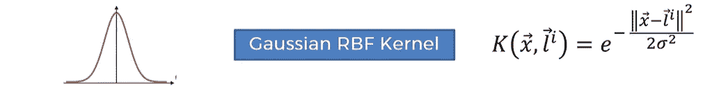

# 机器学习的支持向量回归

> 原文：<https://medium.com/analytics-vidhya/support-vector-regression-for-machine-learning-843978ba6279?source=collection_archive---------19----------------------->

SVR(支持向量回归)实际上是 SVM(支持向量机)的一部分，支持向量机是一种有监督的机器学习算法，它在解决分类和回归问题上都是有用的。

> SVM 的目标是训练一个模型，将新的看不见的物体分配到一个特定的类别中。它通过将特征空间线性划分为两类来实现这一点。基于新的看不见的物体的特征，它将物体放置在分离平面之上或之下，导致分类。

# 线性支持向量回归

支持向量回归机利用 SVM 原理建立回归模型。在 SVR 中，有一条*而不是一条直线或一个**超平面**，并且我们在****-****管*中间有一条回归线。**

**这个管的宽度为**ε**，垂直测量的宽度是沿着轴，不是垂直于管而是垂直的，这个管本身被称为**ɛ-insensitive**，这意味着数据集中落在管内的任何点我们将忽略它们的误差。**

****

**所以基本上这个ɛ-tube 认为它是一个误差范围，这意味着我们允许我们的模型有那些点，而不关心它里面的任何误差。所以点和回归线或者超平面之间的任何差异，或者任何相似的距离，我们不关心面积，因为它落在ɛ-insensitive 管上。**

**对于位于ɛ-insensitive 管外部的点，我们将考虑它们，并通过测量该点和管本身之间的距离来处理它们，这些值/点被称为松弛变量。**

**测量距离/面积的公式为:**

****

# **支持向量**

**位于ɛ-insensitive 管外部的点决定了管的外观以及管的位置。这些点在管外，它们被称为支持向量，帮助形成ɛ-insensitive 管。**

****

**这种方法称为支持向量回归，因为实际上所有的点都可以表示为二维空间中的一个向量，如果数据集中有更多的特征，则可以表示为多维空间中的一个向量。**

# **非线性支持向量回归**

**在非线性支持向量回归中，数据不能用直线或回归线来分离。因此，为了解决这个问题，我们将高维空间，使数据线性分离。**

**在这里，我们将数据的维度空间从 2D 空间增加到 3D 空间，现在我们可以清楚地看到，现在我们可以轻松地分离数据。**

****

**这里我们使用了一个映射函数(一个将低维数据点映射到高维空间的函数)，它将我们的数据点提升到一个高维空间，在那里它们可以线性分离。我们找到一个超平面，它将数据点分成两个不同的类别。**

**在支持向量回归中，我们通过使用核技巧来增加数据的维数空间。有不同类型的内核。一些最常用的核是高斯 RBF 核、多项式核、Sigmoid 核等。**

**这里我们选择高斯径向基函数内核**

# ****内核****

**我们可以假设内核是一个相似性函数，其中**隐含地**将数据映射到一个无限维平面，然后在该平面中找到支持向量，并将向量映射回原始维。**

**核参数选择用于分离数据的超平面的类型。使用“线性”将使用线性超平面(在 2D 数据的情况下是一条线)。“rbf”和“poly”使用非线性超平面。**

********

**SVR 机器学习算法到此为止。敬请关注更多博客。**

***谢谢***

**SVR 算法在工资数据集上的实现**

> ***数据集:* [*薪资*](https://github.com/InternityFoundation/MachineLearning_Navu4/blob/master/Day%209%20:%20SVR/Salary_Data.csv) *数据集***

**链接:[https://github . com/internity foundation/machine learning _ navu 4/blob/master/Day % 209% 20:% 20 SVR/SVR _ on _ salary _ dataset . ipynb](https://github.com/InternityFoundation/MachineLearning_Navu4/blob/master/Day%209%20:%20SVR/SVR_on_salary_dataset.ipynb)**