# 支持向量回归模型:一种基于回归的机器学习方法

> 原文：<https://medium.com/analytics-vidhya/support-vector-regression-svr-model-a-regression-based-machine-learning-approach-f4641670c5bb?source=collection_archive---------6----------------------->

在本文中，我们将简要讨论 SVR 模型。我们将讨论三种类型的支持向量回归机，即 S-支持向量回归机(Scaling-SVR)、Z-支持向量回归机(Z-score-SVR)和 R-SVR (Range-SVR)。随后，我们将讨论它在预测无线传感器网络节点定位过程中的平均定位误差方面的应用。

您可以 [**下载**](https://www.researchgate.net/publication/346008338_A_Machine_Learning_Approach_to_Predict_the_Average_Localisation_Error_with_Applications_to_Wireless_Sensor_Networks) 我们的论文了解更多详情。如果您有任何问题，可以写信给我(abhilash.singh@ieee.org)或访问 [**我的网页**](https://www.abhilashsingh.net?source=svr_medium) 了解更多更新。此外，查看本文末尾的推荐阅读部分，获取最新的研究文章。 [**别忘了订阅我的 YouTube 频道。**](https://www.youtube.com/channel/UC3YYrAOSNRXvG8Tud3XepYA)

## 介绍

广义上，学习算法分为监督学习和非监督学习。此外，监督学习分为分类和回归学习，而无监督学习分为聚类和降维技术。

基于回归的机器学习算法的关键目标是基于映射函数预测预测值。这个映射函数是通过输入一组称为训练数据集的特征和预测数据来建模的。SVR 被用于许多应用中，例如图像处理、遥感和区块链。它具有高超的概括能力和高精度。此外，计算复杂度与输入特征数据集无关。

让我们在下一节看到 SVR 的控制方程；

## 支持向量回归

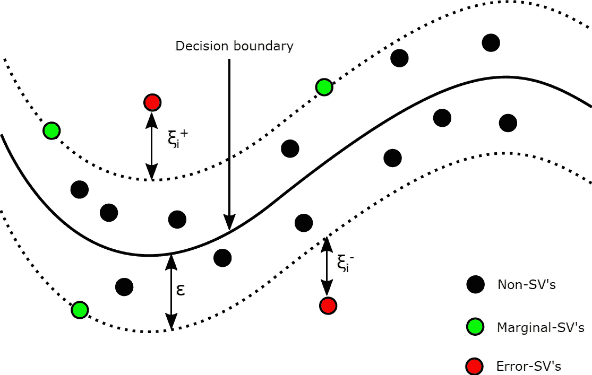

图 1: SVR 结构 [**(Singh et al. 2020，IEEE Access)**](https://www.researchgate.net/publication/346008338_A_Machine_Learning_Approach_to_Predict_the_Average_Localization_Error_With_Applications_to_Wireless_Sensor_Networks)

SVR 最初由 Drucker 等人提出，是一种基于 Vapnik 支持向量概念的监督学习技术。SVR 旨在通过确定超平面和最小化预测值和观察值之间的范围来减少误差。最小化下面给出的等式中的 w 值类似于定义为最大限度的值，如图 1 所示。

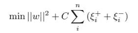

其中求和部分代表经验误差。因此，为了最小化这一误差，我们使用以下等式。

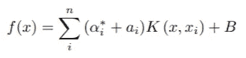

其中α项表示拉格朗日乘数，其值大于等于 1。 ***K*** 表示核函数， ***B*** 表示偏差项。在这项研究中，我们使用了由下式给出的多项式内核:

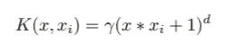

其中 ***d*** 为多项式次数， ***γ*** 为多项式常数。

与线性回归、KNN 和弹性网络等其他算法相比，SVR 的预测性能更好，这是因为它针对大量变量改进了优化策略。此外，它还可以灵活地处理几何、传输、数据概括和内核的附加功能。这一附加功能通过考虑要素的质量来增强模型的预测能力。

训练样本影响 SVR 模型的拟合性能，因为 SVR 算法对训练数据中的干扰敏感。此外，支持向量回归机在解决高维特征回归问题时是有用的，并且在特征度量大于样本量的情况下表现良好。在本研究中，我们从改进的 CS 算法仿真中提取了四个特征，即锚比、传输范围、节点密度和迭代次数。

特征缩放对于 SVR 至关重要，因为当一个函数比其他函数具有更大的幅度时，其他特征将在测量距离时占主导地位。为了避免这种情况，我们使用了各种标准化方法。基于此，我们提出了三种方法，如图 2 所示。

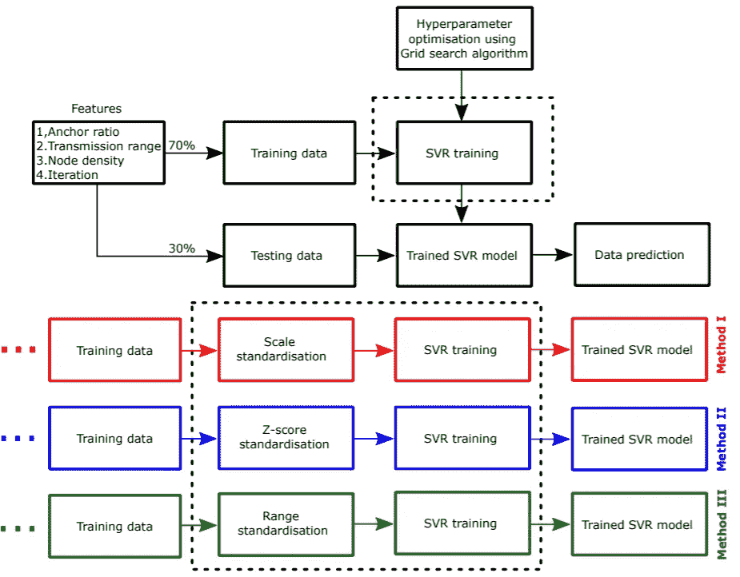

图 2:流程图 [**(Singh et al. 2020，IEEE Access)**](https://ieeexplore.ieee.org/document/9261408)

方法一是 S-SVR(缩放 SVR)。在这种方法中，我们首先使用下面给出的等式标准化特征；

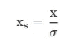

其中 **x** 为特征向量， **xs** 为标准化数据， **σ** 为特征向量的标准差。方法二是 Z-SVR (Z-score SVR)。在这种方法中，我们已经使用下面给出的等式标准化了特征；

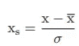

其中 x 条是特征向量的平均值。方法三是 R-SVR(范围 SVR)。在这种方法中，我们已经使用下面给出的等式标准化了特征；

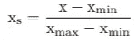

之后，我们以 70:30 的比例训练和测试了 SVR 模型，如图 2 所示。在本研究中，特征向量的维数为 107 × 1。因此，我们使用了 75 个数据进行训练，剩下的 32 个用于测试。

## SVR 预测 ALE 在无线传感器网络节点定位中的应用。

为了模拟 SVR 模型，我们通过网格搜索算法进行超参数调整。为此，我们将其中一个超参数(即***【ε】***)固定在 0.01，并应用网格搜索算法找到另一个超参数(即***【C】***)的值。我们为惩罚因子创建了一个 100 × 100 的网格， ***C*** 。每个网格代表 ***C*** 的一个具体值。在模拟网格搜索算法时，它找到了与最小均方差对应的最优网格。下表给出了所有三种方法的最佳 ***C*** 的范围以及其他模拟参数值。

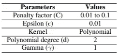

表 SVR 的模拟参数

**结果**

在本节中，我们在相应的小节中介绍了 ALE 预测方法 I、II 和 III 的结果。我们绘制了预测 ALE 和模拟 ALE 之间的线性回归曲线进行比较。

**方法一的性能**

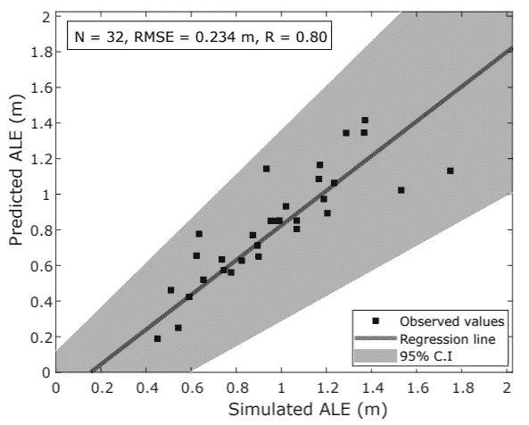

图 3:使用方法 I 的 ALE 预测结果

我们比较了由方法 I 得到的 ALE 预测结果和改进的 CS 算法的模拟结果。我们发现，预测结果与模拟结果非常一致，并且沿着具有轻微散射的直线回归线聚集(图 3)。灰色阴影区域对应于回归线的 95%置信区间(CI ),表明预测结果与 R = 0.80 和 RMSE = 0.23m 有很强的正相关性

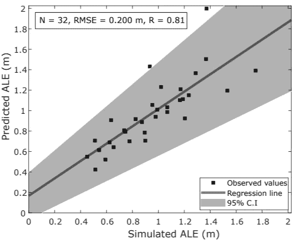

图 4:使用方法 II 对 ALE 的预测结果。

一旦我们通过方法 II 计算了预测的 ALE，我们就用改进的 CS 算法的模拟结果来评估它的性能。在此过程中，我们发现 R = 0.81 和 RMSE = 0.20m 时两者吻合良好(图 4)。然而，由于 SVR 模型高估了 ALE 值，一些观察值位于回归线的置信区间之外。高估可能是由正偏差引起的。这种类型的误差属于系统误差，这主要是由于所使用的模型或方法。

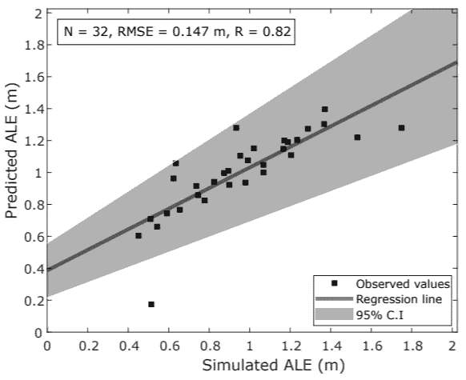

图 5:使用方法 II 的 ALE 的预测结果。

我们将方法 III 的预测 ALE 与通过改进的 CS 算法获得的模拟 ALE 进行了比较。在这种情况下，我们也发现变量之间有很强的相关性(图 5)。在这里，我们发现了 R = 0.82 与 RMSE = 0.15 米的实用相关性

**结论**

在本文中，我们讨论和研究了三个基于支持向量回归机的 ALE 预测机器学习模型。这些方法是根据所使用的标准化方法定义的。在方法 I、II 和 III 中，我们分别使用了标度法、Z 分数法和范围标准化法。之后，我们使用标准化数据训练具有多项式核的 SVR 模型，并使用系数相关性和 RMSE 度量评估其性能。在这样做的过程中，我们发现特征的范围标准化(即方法 III)导致 ALE 预测中较低的 RMSE。此外，方法 III 中的相关系数最高。

**视频(**喜欢视频，订阅频道获取更多此类视频 **)**

**参考文献**

1.  辛格、阿比拉什、瓦伊巴夫·科蒂亚尔、桑迪普·夏尔马、贾普拉卡·纳加尔和程-李骥。"预测平均定位误差的机器学习方法及其在无线传感器网络中的应用." *IEEE 访问*8(2020):208253–208263。
2.  [辛格、阿比拉什、贾普拉卡什·纳加尔、桑迪普·夏尔马和瓦伊巴夫·科蒂亚尔。"预测无线传感器网络入侵检测 k-barrier 覆盖概率的高斯过程回归方法."专家系统及应用 172 (2021): 114603。](https://www.researchgate.net/publication/348648168_A_Gaussian_Process_Regression_Approach_to_Predict_the_k-barrier_Coverage_Probability_for_Intrusion_Detection_in_Wireless_Sensor_Networks)

**数据集可用性**

从 [**UCI 机器学习库**](https://archive.ics.uci.edu/ml/datasets/Average+Localization+Error+%28ALE%29+in+sensor+node+localization+process+in+WSNs) 下载数据集

**建议阅读**

[【1】。Singh Abhilash、Kumar Gaurav、Atul Kumar Rai 和 Zafar Beg“从卫星图像估计表面粗糙度的机器学习”，遥感，MDPI，13 (19)，2021，DOI: 10.3390/rs13193794。](https://www.researchgate.net/publication/354751895_Machine_Learning_to_Estimate_Surface_Roughness_from_Satellite_Images)

[【2】。Singh，Abhilash，Amutha，j .，Nagar，Jaiprakash，Sharma，Sandeep 和 Lee，Cheng-Chi。“LT-FS-ID:基于对数变换的特征学习和特征缩放的机器学习算法，用于预测使用无线传感器网络进行入侵检测的 k 障碍
,《传感器》，第 22 卷，第 3 期，第(2022)1070 页。DOI:10.3390/s22031070。](https://www.researchgate.net/publication/358201341_LT-FS-ID_Log-Transformed_Feature_Learning_and_Feature-Scaling-Based_Machine_Learning_Algorithms_to_Predict_the_k-Barriers_for_Intrusion_Detection_Using_Wireless_Sensor_Network)

[【3】。辛格、阿比拉什、j .阿穆塔、贾普拉卡什·纳加尔、桑迪普·夏尔马和程-李骥。" AutoML-ID:用于无线传感器网络入侵检测的自动机器学习模型."*科学报告* 12，第 1 期(2022):1–14。](https://www.researchgate.net/publication/360974220_AutoML-ID_automated_machine_learning_model_for_intrusion_detection_using_wireless_sensor_network)