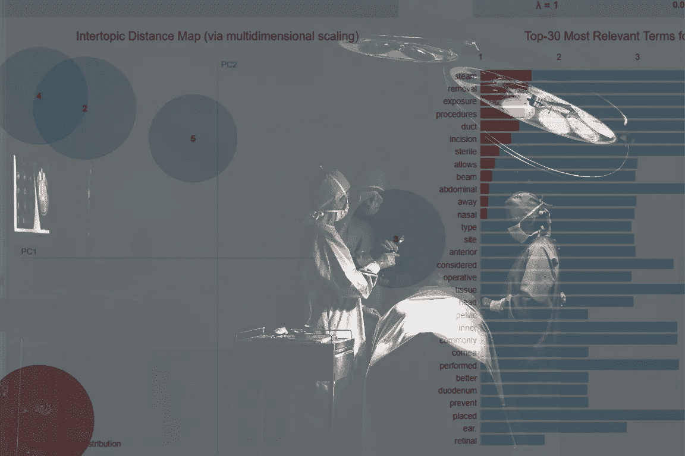
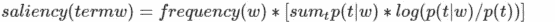
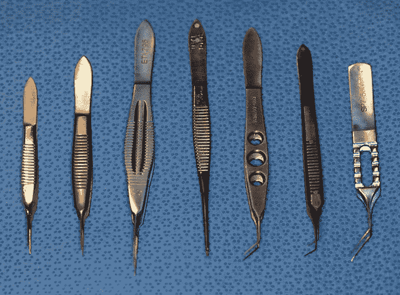
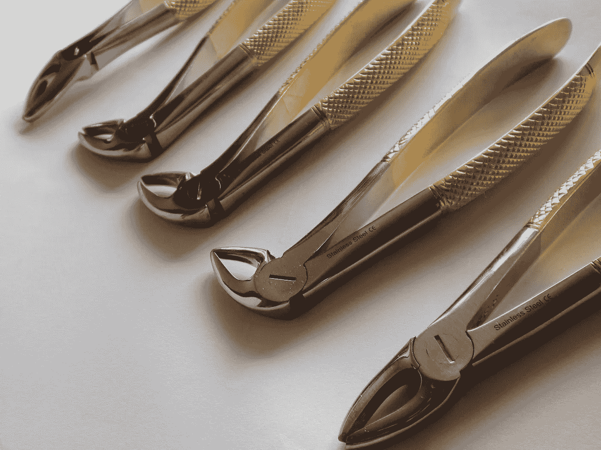
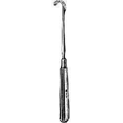
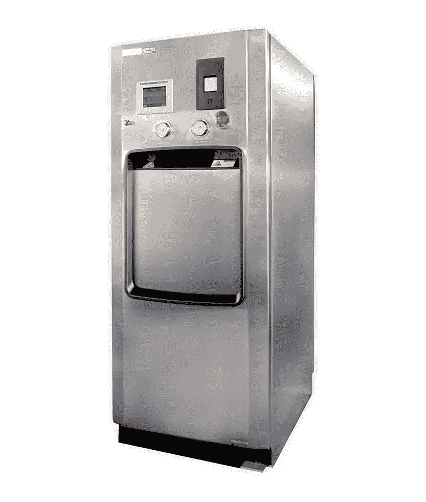
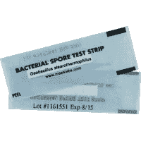
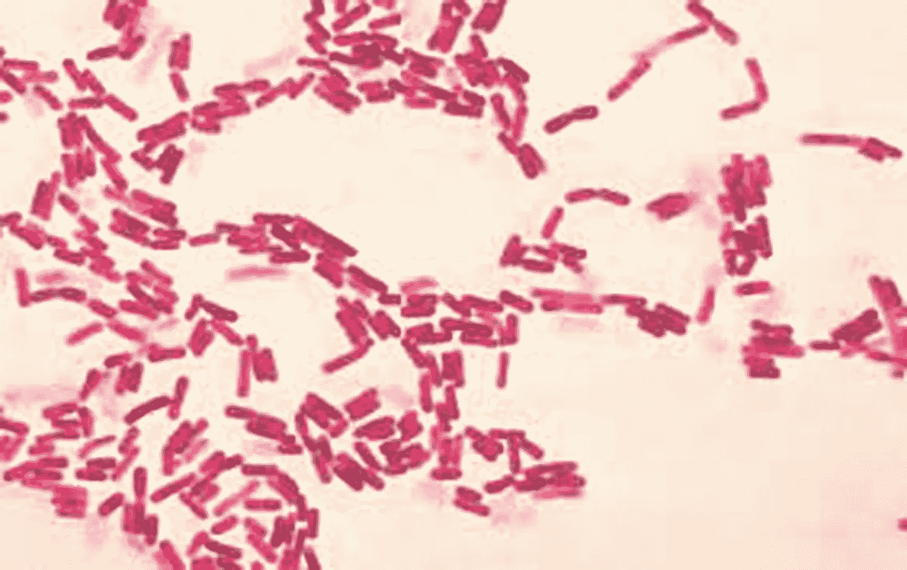

# 外科技术和自然语言处理

> 原文：<https://medium.com/analytics-vidhya/surgical-technology-and-natural-language-processing-7e54f619edec?source=collection_archive---------13----------------------->



原图由[马太·亨利](https://burst.shopify.com/@matthew_henry?utm_campaign=photo_credit&amp;utm_content=Browse+Free+HD+Images+of+One+Surgeon+Passes+Another+A+Scalpel&amp;utm_medium=referral&amp;utm_source=credit)发自[突发](https://burst.shopify.com/hospital?utm_campaign=photo_credit&amp;utm_content=Browse+Free+HD+Images+of+One+Surgeon+Passes+Another+A+Scalpel&amp;utm_medium=referral&amp;utm_source=credit)

外科技术提出了极好的挑战，可以通过机器学习来简化。来自[gotestprep.com](https://gotestprep.com/certified-surgical-technologist-practice-test-1/)的[认证外科技术](https://www.nbstsa.org/cst-first-timeretake-applicants#:~:text=The%20CST%20examination%20consists%20of%20175%20questions%2C%20150,number%20of%20questions%20that%20must%20be%20answered%20correctly.) (CST)实践考试包含 176 个关于外科最佳实践的问题，机器学习可以帮助确定主题出现在实践 CST 考试中的频率。

自然语言处理是利用数据科学来组织杂乱的语言数据。数据科学用于收集、清理和处理来自[gotestprep.com](https://gotestprep.com/certified-surgical-technologist-practice-test-1/)的问题和答案，以便组织一个最常出现的外科术语列表。

外科技术是用于准备手术设备的无菌和无菌外科技术的领域知识。外科技术专家必须获得外科技术专家协会(AST)的许可才能在医院工作。

在 [Github](https://github.com/Bayaniblues/surgical-scraper) 查看这个实验的代码。

# 观众

这篇文章主要是技术性的，因为它是针对两个不同的同行群体，外科技术专家和数据科学家。需要参加或重新参加 CST 考试的外科技术专家可能会从这些结果中发现价值，并应专注于最常出现的问题。数据科学家也可能在这些 NLP 技术及其实现中发现解决现实世界问题的价值。

# 结果

以下 pyldavis 可视化以术语的“显著性”为目标，即:



确定显著性的算法

要查看代码笔，请单击下面的“运行笔”按钮

点击**主题间距离图**下的圆圈，探索互动模式

Codepen 可视化在桌面上以 0.5 倍的尺寸观看效果最佳，在移动设备上以 0.25 倍的尺寸观看效果最佳。

按频率显示的外科术语交互式图表

对上述可视化的推测可能是，CST 考试的大多数问题都是关于**组织去除**和**蒸汽灭菌。**这些可以汇集到我们数据集的矢量表示中，以找到关于组织去除和蒸汽灭菌的常见问题的答案。

## 组织去除

大多数非选择性手术的目标是移除癌变或受感染的组织。

> 扩张滴剂被称为散瞳剂，用于扩大瞳孔以检查视网膜、验光或更容易地摘除晶状体。

白内障手术中使用的工具是小型的专用镊子。常用的工具有波恩钳、Utrata Forcepts 和虹膜钳。



白内障手术钳[爱荷华大学](https://webeye.ophth.uiowa.edu/eyeforum/tutorials/instruments/phaco/index.htm)

> 拔掉一颗或多颗牙齿是拔牙程序。在拔牙之前切除软组织和牙齿周围的骨头被称为牙切除术。

牙切除术是牙科手术，通常用于治疗蛀牙。在这个手术中使用专门的拔牙钳。



拔牙钳[百科](https://en.wikipedia.org/wiki/File:Dental-Extraction-Forceps.jpg)

> 麦克伯尼切口主要用于切除阑尾。

阑尾切除术是用于切除阑尾的常见腹部手术，McBurney 的切口包括切入阑尾切除术的肌肉。在这些手术中，通常使用麦克伯尼牵开器来打开腹部。



麦克伯尼牵开器[医疗用品集团](https://medicalsupplygroup.com/p-4415.aspx?searchEngineName=mcburney-retractor-7-12-57-1475)

## 蒸汽灭菌

其他最常见的术语是关于**蒸汽灭菌**，这是一种更新的技术，可以在更低的温度下更快地对设备进行灭菌。因为蒸汽灭菌的温度较低，所以与传统的干灭菌方法相比，蒸汽灭菌需要更多的注意。

> 蒸汽灭菌的四个因素是压力、温度、湿度和时间。压力用于将蒸汽的温度提高到杀死包括孢子在内的微生物的水平。

蒸汽灭菌器是较新的技术，用于硅胶等热敏设备，因为它在较低的温度下灭菌。手术室里也可以立即使用蒸汽消毒器，以防重要的手术器械掉落。



小型蒸汽灭菌器[灭菌效率](https://www.sterislifesciences.com/)

> 记录读数前，蒸汽灭菌生物指示剂必须培养 24 小时。

生物指标被保存，然后编目，以防感染和医疗事故诉讼。BI 是最佳无菌操作和患者安全不可或缺的一部分。



孢子带

> 生物指示剂(BI)包含嗜热脂肪芽孢杆菌，当暴露于蒸汽灭菌条件时，该芽孢杆菌被杀死。因此，BI 是保证无菌的唯一测试。



嗜热脂肪芽胞杆菌

# NLP 过程

以下是用于创建数据结果的数据科学工具。

## 用 Scrapy 收集数据

数据抓取用于抓取互联网并提取数据。Scrapy 是最快的方式来建立一个网页刮刀时，做得正确。

更多关于如何使用 Scrapy 的信息可以在[这里](https://cortezethridge.medium.com/scraping-amazons-data-scraping-books-with-scrapy-b60a88db5bf7)找到。

## 使用 BeautifulSoup 清理数据

BeautifulSoup 经常用于数据抓取，但它也擅长数据清理。Scrapy 快速有效，但在抓取 HTML 标签时也很混乱。BeautifulSoup 的 html 解析器可以用来移除 html 标签。收集到的数据可以通过以下方式转换:

```
'<div class="su-spoiler-content su-u-clearfix su-u-trim">\xa0<strong><span style="color: #008000;">Correct option: 2<br>\n</span></strong>Sol: The cochlea is a bony spiral canal in the ear.\n</div>',
```

变成这样:

```
'The cochlea is a bony spiral canal in the ear.',
```

## 用 pyLDAvis 进行主题建模

在机器学习和自然语言处理中，主题模型用于发现文档集合中存在多少抽象主题。使用 pyLDAvis 时，**蒸汽灭菌**和**组织去除**主题在本实验中出现最多。

## 使用 sklearn 的矢量表示

向量表示法作为一种搜索算法，可以通过使用特征向量来确定这些问题彼此之间的相关程度。pyLDAvis 的**蒸汽灭菌**和**组织去除**的主题可以输入到向量表示模型中，以便搜索相关的问题和答案。

以下是用于创建矢量表示的方法:

*   [计数矢量器](https://scikit-learn.org/stable/modules/generated/sklearn.feature_extraction.text.CountVectorizer.html)
*   [tfidf 矢量器](https://scikit-learn.org/stable/modules/generated/sklearn.feature_extraction.text.TfidfVectorizer.html?highlight=tfidfvectorizer#sklearn.feature_extraction.text.TfidfVectorizer)
*   [最近邻居](https://scikit-learn.org/stable/modules/generated/sklearn.neighbors.NearestNeighbors.html?highlight=nearestneighbors#sklearn.neighbors.NearestNeighbors)

# 最后

外科技术提出了可以用机器学习解决的优秀的现实世界挑战，主题模型的推测表明，CST 实践考试主要是关于组织切除和蒸汽消毒器。

数据科学工具——用于绘制数据的 Scrapy、用于清理数据的 BeautifulSoup、用于向量表示的 sklearn 和用于主题建模的 pyldavis 都可以用来提供关于 CST 考试的宝贵见解。