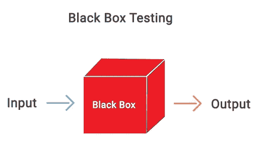
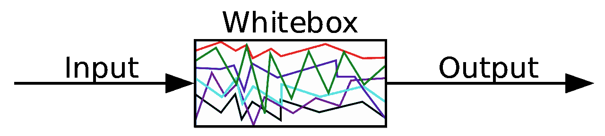
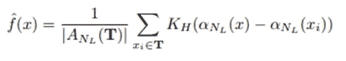
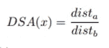
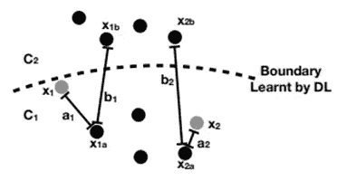
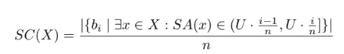
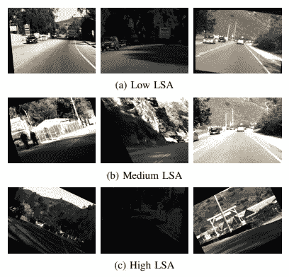
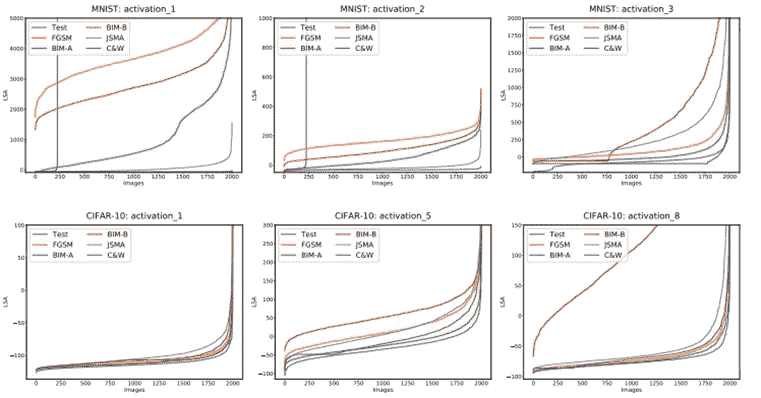
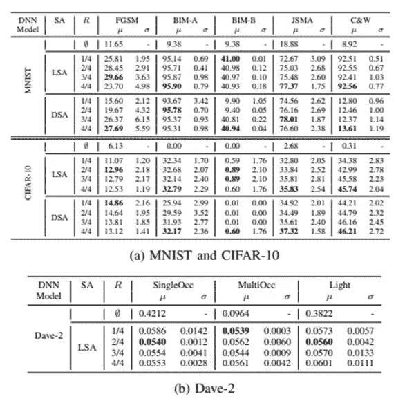
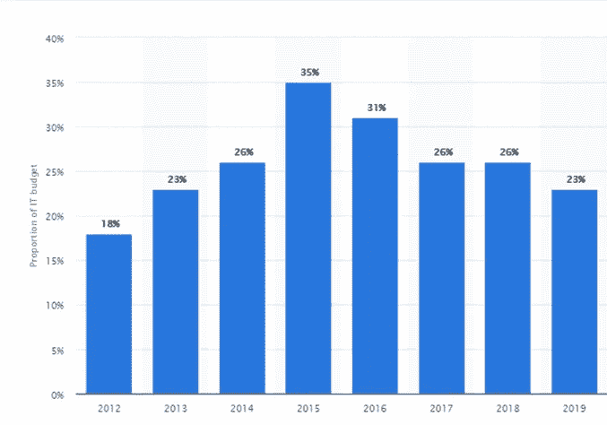

# 深度学习模型的突击测试

> 原文：<https://medium.com/analytics-vidhya/surprise-test-deep-learning-model-f40f36f264c0?source=collection_archive---------26----------------------->

像其他软件一样，机器学习模型容易受到错误输出和敌对攻击的影响。在部署之前，通过各种测试来检查它们的正确性和健壮性是非常必要的。

图片来自 JetRuby.com

## 哪种测试？

一些常见的测试方法是 A/B 测试，这是一种针对特定受众的测试，冒烟测试(构建测试)通常被称为零日测试。另一种测试，健全性测试(发布测试)是在交付软件进行验收测试之前进行的，例如 alpha、beta 和 gamma 测试。以下是这些方法的简单分类。

## 黑盒测试:

像黑盒测试这样的传统方法对于软件测试功能/块来说很常见。在黑盒测试中，我们认为一个盒子是不透明的，我们只是应用几个输入，并检查盒子是否按照设计的方式响应。这种技术也被称为输入输出测试、行为测试和基于规范的测试。主要是因为它决定了块的功能性。这种方法的几种常用方法是等价测试、边界值分析、决策表和状态转换。

## 白盒测试:

与黑盒测试相反，这里的盒子是透明的，我们可以观察每个元素及其对输入的调节。它也被称为结构测试、玻璃盒测试、透明盒测试和开放测试。它主要检查内部代码和安全性。一些流行的方法是路径覆盖、语句覆盖和分支覆盖。

> 那么，我们有了这些技术，为什么我们还需要一些特别的东西呢？

传统技术无法在深度学习系统上正常工作，主要是因为它们包含非常复杂的结构，其中每个神经元都与成千上万的其他神经元相关，这使得它很难可视化。先前用于验证 DL 系统的最新技术最常用的两个假设是:

1.隐喻测试:每个相似的输入必须有相似的输出。《出埃及记》深度测试

2.神经元覆盖率:输入越多样化，测试越有效。《出埃及记》深度探索

在神经元覆盖率[Pei 等人，2019]中，我们采用激活某个输入阈值的神经元的比率。它不完全满足第一个假设，因此另一种方法，deep gauge[马勒等人]提出了 K-多节神经元覆盖。在这种方法中，神经元被分成 k 个桶，并且在神经元对于某些输入被激活的情况下，仅考虑那些桶。更难评估任何触发神经元的输入。

## **深度学习系统的惊人充足性(SADL)**

金瀚·金等人提出的 SADL 测量了输入对一个数字逻辑系统的惊人程度。该方法使用各种方法计算细粒度的测试充分性度量。首先，它对培训期间提供的输入进行评估。它还发现在核密度估计期间外推 pdf 的可能性。最后，它计算每个神经元的轨迹之间的差异。如果难以理解，这里有一个例子。

 [## 硬币/萨德勒

### 一篇论文《使用惊奇充分性指导深度学习系统测试》的代码发布如果你觉得这篇论文有帮助…

github.com](https://github.com/coinse/sadl) 

1.  **惊喜充足(SA):**

假设 X 是来自集合 X 的输入，那么激活轨迹是一个向量，在激活被应用之后，它可以被写成 AT(X) = {α(x) | x ∈ X}。激活追踪旨在基于用于训练的输入来测量给定输入的相对新颖性。似然 SA 使用核密度估计(KDE)来获得关于估计密度的每个输入的惊喜。

方差高于阈值并使用 LSA(x)=-log(ˇf(x))计算的所选层中的神经元。

其次，基于距离的惊奇充分性(DSA)旨在使用欧几里德距离来度量 AT 之间的距离。它适合于利用边界，对于分类任务比 LSA 更有效。

然而，它不适用于无类别边界问题(自动驾驶中的转向角)。

**2。突击报道(SC)**

意外覆盖率通过简单地分成几个部分，使用意外充分性计算一组输入的覆盖率。SC 可以通过离散化以前的方法 LSC 和 DSC 来使用。它可以用预定的上限来测量。

**成绩:**

论文中给出的结果表明，在四个数据集 MNIST，CIFAR-10，戴夫-2 和 Chauffer 上用五种不同的对抗性攻击方法进行了测试。SADL 可以捕捉到相对意外的输入，而较高的 SA 很难正确分类。

图片来自研究论文(Kim 等人)

图片来自研究论文(Kim 等人)

图片来自研究论文(Kim 等人)

这是一个重要的市场领域吗？

根据世界质量报告 19–20。

1.  56%的软件开发公司缺乏合适的测试环境。
2.  19%的软件公司使用自动化测试框架。
3.  27%的开发人员缺乏测试环境和测试数据
4.  12%的软件工程师认为明年将会有专门的人工智能算法测试环境。

下面的图表显示了市场如何随着时间的推移而变化，这是因为更新的更高效、更省时的云测试平台，如 DevOps 和敏捷管理。

图文提供:[https://www . so geti . com/explore/reports/world-quality-report-2019/](https://www.sogeti.com/explore/reports/world-quality-report-2019/)

参考资料:

*   金瀚·金，罗伯特·费尔特，柳信，“使用令人惊讶的充分性指导深度学习系统测试”
*   [Simos Gerasimou](https://arxiv.org/search/cs?searchtype=author&query=Gerasimou%2C+S) ， [Hasan Ferit Eniser](https://arxiv.org/search/cs?searchtype=author&query=Eniser%2C+H+F) ， [Alper Sen](https://arxiv.org/search/cs?searchtype=author&query=Sen%2C+A) ， [Alper Cakan](https://arxiv.org/search/cs?searchtype=author&query=Cakan%2C+A) ，《重要性驱动的深度学习系统测试》，2020，arXiv 预印本，arXiv:2002.03433v1
*   Reuben Feinman，Ryan R. Curtin，Saurabh Shitre，“从文物中检测广告系列样本”，2017 年，arXiv 预印本，arXiv:13.00410 v3
*   ， [Felix Juefei-Xu](https://arxiv.org/search/cs?searchtype=author&query=Juefei-Xu%2C+F) ，[张福元](https://arxiv.org/search/cs?searchtype=author&query=Zhang%2C+F)，“DeepGauge:深度学习系统的多粒度测试标准”，10.1145/32。33361.66666666661
*   [https://en.wikipedia.org/wiki/Software_testing](https://en.wikipedia.org/wiki/Software_testing)
*   [https://github.com/coinse/sadl](https://github.com/coinse/sadl)
*   [https://coinse.github.io/sadl/](https://coinse.github.io/sadl/)
*   [https://www . so geti . com/explore/reports/world-quality-report-2019/](https://www.sogeti.com/explore/reports/world-quality-report-2019/)

感谢您的阅读。