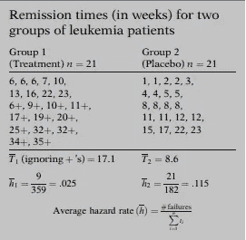

# 生存分析|简介

> 原文：<https://medium.com/analytics-vidhya/survival-analysis-an-introduction-87a94c98061?source=collection_archive---------6----------------------->

## 生存分析的详细介绍。

在逻辑回归中，我们感兴趣的是研究风险因素如何与疾病的存在或不存在相关联。有时，尽管我们对风险因素或治疗如何影响发病时间或其他事件感兴趣。或者我们可能有研究退出，因此我们不确定受试者是否患有疾病。在这些情况下，逻辑回归是不合适的。

生存分析用于分析与事件发生前的时间相关的数据。该响应通常被称为故障时间、存活时间或事件时间。

**什么是生存分析？**

> **生存分析是一组用于数据分析的统计程序，其感兴趣的结果变量是事件发生前的时间。**

通俗地说，我们基本上是在试图分析手头的数据，直到感兴趣的事件发生。

有两个重要术语需要考虑，讨论如下:

**时间和事件**

**时间**也叫**生存时间**可以是月、年、年龄等。，因为它给出了个体在某个随访期内存活的时间。

**事件**通常指失败或死亡(例如，*事件是“患心脏病”，结果是“直到一个人患心脏病的年时间。”*)，它也可以是一个积极事件(例如“手术后回到工作岗位的时间”，在这种情况下，失败是一个积极事件。).*通常情况下，事件可能不只是一个事件，在这种情况下，我们会将它们视为竞争事件。*

生存分析的另一个主要优点是考虑了删失数据。

**审查**

> 当我们有一些关于个体存活时间的信息，但我们不知道确切的存活时间时，就会发生这种情况。

**卡车维护时间研究期间的审查**

为什么会出现审查？

例子:白血病患者接受随访，直到他们脱离缓解期。

*   当患者仍处于缓解期时，研究结束
*   人在学习结束后外出
*   退出研究

一般来说，如果数据被删除，

> 一个人在研究结束前不会经历该事件。
> 
> 研究期间失访的一个人。
> 
> 一个人因死亡而退出研究。

不同类型的审查

**权利审查**

**右删截**:真实存活时间等于或大于观察存活时间。随访失败、退出研究或研究结束但仍未参加活动的人。对于这些数据，我们并不真正了解的完整存活时间区间，已经在观察到的存活时间区间的右侧被截断(即删截)。

**左审查**

**左删截**:真实存活时间小于等于观察存活时间。假设我们一直跟踪人们直到他们变成 HIV 阳性，尽管在某一段时间内当我们测试这个人时显示阳性，我们可能不知道这个人实际上是什么时候首先被感染的。在这种情况下，数据被审查。

**区间删截**

**区间删失:**真实存活时间在已知的时间区间内。一个人进行了两次艾滋病毒测试，其中一次是阴性(时间 t1)，另一次是阳性(时间 t2)，在这种情况下，我们知道他/她感染艾滋病毒的确切时间在(t1，t2)之间。

> *左截尾:t1 = 0，t2 =上界*
> 
> *右删失:t1 =下限，t2 =无穷大*

> 即使删截的观察是不完整的，因为我们不知道一个人的确切生存时间，我们仍然可以使用我们关于删截的人的信息，直到我们失去他或她的踪迹。而不是简单地丢弃我们拥有的信息。

**审查假设**

1.  **独立:**删失是独立的，为其随机提供任何感兴趣的亚群。也就是说，对其中一个的审查不应该依赖于另一个。
2.  **随机:**假设被删截的受试者的失败率等于留在风险集中的未被删截的受试者的失败率。
3.  **无信息:**存活时间 T 的分布没有提供关于时间 c 的审查分布的信息

为了识别它是否是非信息性的，我们必须了解事件时间和审查时间的分布。

> 在一项药物研究中，有些人在服用药物后会产生副作用。因此，许多有副作用的人将停止服药(退出研究)。在这种情况下，有副作用的人的风险与研究中的其他人不同。如果是这样的话，我们高估了存活率。

**术语和符号**

*   t:随机变量
*   t:t 的具体值(例如:癌症治疗后存活> 5 年(t = 5))
*   d:二分变量{0，如果失败(事件已经发生),或者 1，用于删截}
*   幸存者函数 S(T > t):一个人存活时间超过某个时间“T”的概率。

S(t)的性质:

**理论 S(t)**

*   *非递增，随着 t 的增加 S(t)减小。*
*   *最初在 t = 0 时，没有人得到事件，因此 S(t) = 1*
*   *在 t = +Inf 时，学习周期无限制增加，因此没有人会幸存，S(t) - > 0。*

**实用 S(t)**

*   *但实际上，我们获得的图形为阶跃函数，因为研究周期很小。因为不是每个被研究的人都得到这个事件，幸存者函数可能不会一直到 0。*
*   危险函数 h(t):

**危险功能**

*危害函数给出了每单位时间内事件发生的瞬时可能性，假设个体已经存活到时间 t。*

*以汽车的速度表为例，它显示 50 公里/小时。这意味着如果我们保持同样的速度 1 小时，我们将行驶 50 公里，但实际上我们可能会有起伏。因此，显示的速度给出了你看速度计时的瞬时势，也就是说，你此刻有多快(瞬时势/速度)。类似于速度的概念，* ***一个危险函数 h(t)，给出了在时间 t 获得一个事件*** *的瞬时势。*

*h(t)分子:以条件概率 P(A/B)的形式，即假定生存时间大于或等于 T，一个人的生存时间 T 将位于 T 和δT 之间的时间区间内的概率，由于这里给定了符号，所以风险函数有时称为一个* ***条件失效率*** *。*

*h(t)为什么叫速率？*

*我们看到的表达式是两个量的比值，分子是条件概率，分母是很小的时间间隔。通过这种划分，我们获得了单位时间的概率，这不再是概率，而是速率。*

> 特别是，这个比率的范围不是概率意义上的 0 到 1，而是介于 0 和无穷大之间，并且取决于时间是以天、周、月还是年等来度量的。

> 条件故障率/风险函数给出了瞬时故障率，或者风险函数 h(t)给出了单位时间 t 点的瞬时故障可能性，给定了到时间 t 的存活率。

*   危险函数可以指向任何方向。
*   总是非负的。
*   没有上限。

**不同类型的危险功能**

注:图表的 y 轴是 h(t)

> 当生存分析中的 S(t)似乎更适合描述一个研究队列的生存经验时，我们为什么需要 h(t)。
> 
> 这是对瞬时潜力的度量，而生存曲线是对一段时间的累积度量。
> 
> 它用于识别符合数据的特定模型形式，如指数、威布尔或对数正态曲线。
> 
> 通常，幸存者模型是根据风险函数编写的(有助于对数据进行数学建模)。

如果一个知道其中一个值，我们就可以确定另一个

**生存分析的目标**

1.  估计和解释幸存者和/或危险功能。
2.  比较幸存者和/或危险函数。
3.  评估解释变量与存活时间的关系。

**数据布局**

数据可以用两种格式表示

1.  计算机布局
2.  计数过程:适用于复杂数据，其中同一事件可能在同一个人身上发生多次。(比如:拖欠还贷。一个人多次违约。)

**电脑布局**

**CP 格式**

**生存分析的描述性测量**

其中 T1 杠= 359/21，T2 杠= 182/21

*   因为治疗组的几个时间是经过审查的，这意味着第 1 组的真实平均值甚至比我们计算的还要大。因此，从数据来看(我们没有做任何数学分析),就存活率而言，这种治疗比安慰剂更有效。
*   在我们的例子中，治疗组的平均风险小于安慰剂组的平均风险。因此，使用平均风险率，我们再次看到治疗组似乎总体上比安慰剂组做得更好；也就是说，治疗组比安慰剂组更不容易失败。

> 描述性指标(T 形柱和 h 形柱)给出了总体比较。他们没有给出时间上的比较。对于时间-时间分析，我们使用幸存函数/曲线。

> 注:为了比较两组，我们必须考虑混杂和交互作用。
> 
> **混杂**
> 
> 混杂是受一个或多个其他因素影响的暴露和疾病之间真实关系的分布。这些其他因素被称为混杂因素。混杂变量是讨厌的变量，因为它们妨碍了利益关系。因此需要消除它们的影响。

> **交互**
> 
> 一个解释变量对结果的影响取决于另一个解释变量的具体水平。
> 
> 例子:根据白细胞水平的不同，治疗效果可能会有所不同。

*例如，假设对于具有高 log WBC 的人，随着时间的推移，治疗的存活概率始终高于安慰剂。左边的第一张图说明了这种情况。相比之下，第二张图只考虑了低对数白细胞的人，显示了治疗和安慰剂效应随着时间的推移没有差异。在这种情况下，我们可以说 log WBC 相互作用有很强的治疗作用，我们必须根据 log WBC 的水平来确定治疗的效果。*

> 在混杂或相互作用的情况下，其他替代策略包括将数据分层/使用比例风险模型。

**一个简单的例子**

下面显示的是使用 Kaplan meier 生存函数及其生存曲线计算的生命表，将在以后的帖子中详细解释。

# 参考

[1]生物与健康统计系列编辑 M. Gail，K. Krickeberg，J.M. Samet，A. Tsiatis，W. Wong

[2][http://SPH web . bumc . bu . edu/otlt/MPH-Modules/BS/BS 704 _ Survival/BS 704 _ Survival _ print . html](http://sphweb.bumc.bu.edu/otlt/MPH-Modules/BS/BS704_Survival/BS704_Survival_print.html)