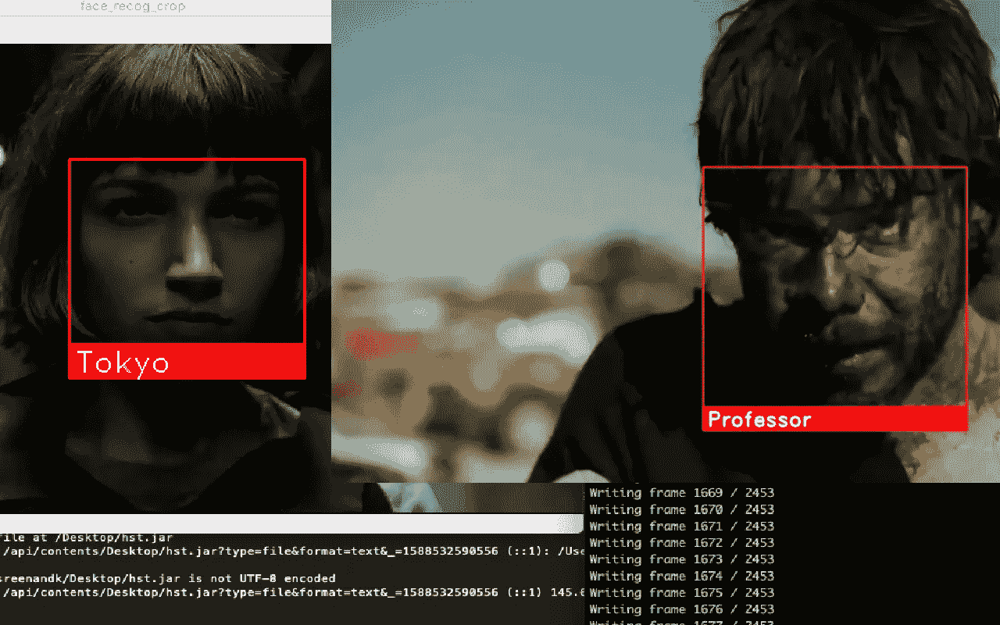

# 基于梯度方向直方图技术和 dlib 库的 SVM 多视角人脸识别。

> 原文：<https://medium.com/analytics-vidhya/svm-based-multi-view-face-recognition-using-hog-histogram-of-oriented-gradients-technique-and-8eddccf6e9ad?source=collection_archive---------8----------------------->

*人脸识别是一种广泛应用于各个领域的检测和识别人脸的方法。尽管面部识别的准确率低于虹膜扫描和指纹等其他生物识别技术，但由于其非接触和非侵入性过程，它被认为是一种安全的方法。据预测，由于 COVID19 场景，未来几年将有更多人开始实施面部识别，并比其他生物识别过程更受欢迎。在过去几年中，开发了许多面部识别库和框架。在这个项目中，我使用了梯度方向直方图技术(HOG)，这种方法是在 2005 年初开发的。由* [*Navneet Dalal 和 Bill Triggs*](http://lear.inrialpes.fr/people/triggs/pubs/Dalal-cvpr05.pdf) *进行的一项研究表明，与小波等现有方法相比，HOG 能够相对更好地检测人类。HOG 方法采用 SVM(支持向量机)对图像进行分类。*

**什么是 HOG，它是如何工作的？**

HOG 是一种特征描述符，用于在梯度的帮助下逐像素提取特征。这主要用于人脸检测、识别和物体检测。HOG 研究灰度图像。每张图像都有特定的梯度方向，这有助于 HOG 从图像中提取独特的特征。

*要求-*

*   *蟒蛇 3*
*   *OpenCv(*[OpenCv-Python 是一个 Python 绑定库，旨在解决计算机视觉问题。](https://docs.opencv.org/master/d0/de3/tutorial_py_intro.html))
*   Dlib ( [Dlib 是一个现代 C++工具包，包含机器学习算法和工具，用于用 C++创建复杂的软件来解决现实世界的问题。](http://dlib.net/))
*   枕头( [Pillow 是由 Alex Clark 和投稿人制作的友好的 PIL 叉。PIL 是由弗雷德里克·伦德和贡献者](https://pillow.readthedocs.io/en/stable/)创建的 Python 图像库。)
*   [实用工具](https://pythonhosted.org/python-utils/python_utils.html)

在这个项目中，我使用了著名的网络系列剧《Money Heist》中的各种视频剪辑，这些剪辑是从不同用户上传的 youtube 上收集的。首先，该算法是用视频中出现的每个角色的单个图像单独标记来训练的。该模型能够在一定程度上识别字符，但不能从多个角度识别。为了创建一个更好的数据集，代码做了一点调整，每次检测到人脸时，模型都会裁剪检测到的人脸，并以适当的文件名 *(character_name+n.bmp)、*将其保存到适当的路径中，然后将收集到的人脸合并到一个图像中，并用作训练数据集，这使得从多个角度检测人脸成为可能。在某些情况下，每个角色的 3000 多个面被合并在一起以创建一个健壮的模型。

我在尝试将图像导出为 png 格式时遇到了 *cv2.imwrite* 的问题，所以图像被保存在。bmp 格式。

结合了角色所有面部的合并图像如下图所示。

最终的输出-

[链接到 github 的代码库。随意叉吧:)](https://github.com/sreenand-kandath/SVM-based-multi-view-face-recognition-using-HOG-Histogram-of-Oriented-Gradients-technique)