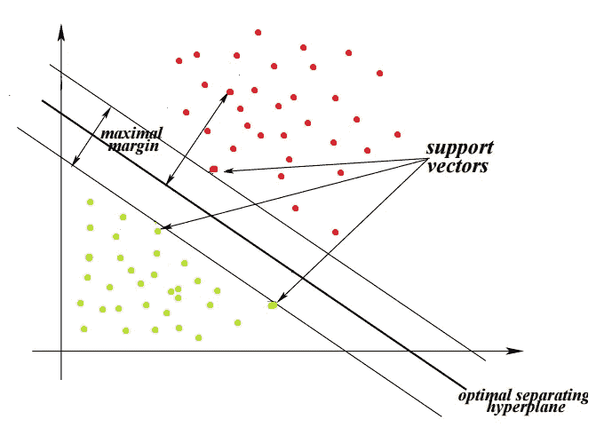
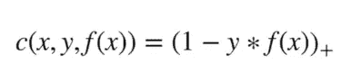
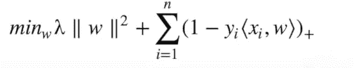
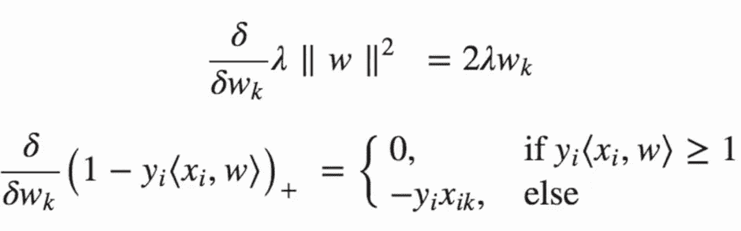
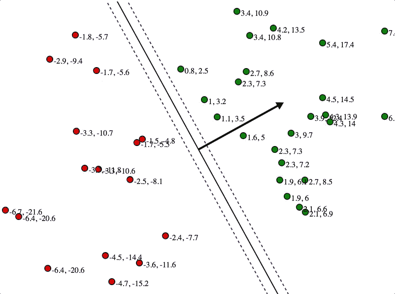

# 最简单的词中的 SVM 线性量词

> 原文：<https://medium.com/analytics-vidhya/svm-linear-classifier-in-simplest-words-6e52a7c84631?source=collection_archive---------11----------------------->

通过这个博客，我只想让我的读者尽可能简单地理解 SVM 分类器是如何工作的。

因此，支持向量机(SVM)被用于通过在由每个类所代表的各种数据点组成的类之间画出判定边界来分离不同类的数据点。在数据点集合之间创建的决策边界被称为**超平面**，SVM 帮助创建它。

我们可以使用 SVM 的问题陈述:—

*   聚类(将数据点分组到 n 维空间中的各个簇)
*   时间序列检测
*   回归(如股票价格预测)
*   异常值检测(检测相似数据点组中异常数据点的存在)
*   分类

SVM 是伟大的，我们有大约 **1000 个数据点**的小数据集，用于鉴别分类器。

我们构建上图中两个类之间的超平面或决策边界的方法是最大化余量，即该线和两组类之间的空间意味着每个类中最接近决策边界的点。如图所示，这些点被称为**支持向量**。之所以这样称呼它们，是因为它们在超平面的创建过程中起支撑作用。

要创建的超平面将总是具有 **n-1 维，其中 n 是数据集中的特征(列)**的集合，例如，在用于分离数据点的 **2D 图**中，我们的超平面将是**2–1 = 1 维**，即一条线。同样，对于 **3D 图形**超平面将是**3–1 = 2 维**超平面。

在 SVM 问题中，我们使用**铰链损耗**函数进行最大裕度分类。

铰链损失函数

其中， ***x*** 是迭代数据点的集合

***y*** 是我们的 x 数据点对应的实际输出组\

***f(x)*** 是预测输出

**+号**表示当我们继续增加损失时，如果我们对 ***(1 — y*f(x))求和后得到负值，那么我们可以保持它不变，否则我们将使它为 0。***

现在我们将为我们的 SVM 类定义我们的**目标函数(就像线性回归中的 y = MX+c)**，它被定义为:

SVM 目标函数

其中， ***min λ ||w||^2*** 称为 ***正则化子*** 。调节器是一个**调谐旋钮**。它告诉我们如何最好地拟合我们的数据。因此，如果正则项太高，我们的模型可能会过拟合我们的数据点，并且不能推广到我们的新数据点，或者如果它的值太低，那么它将会过拟合，并且永远不会收敛。因此，我们需要一个完美的正则项来使我们的模型尽可能地一般化并适合我们的训练数据。**目标** **函数**中的**下一个**项是将产生**总损失的**损失函数**。**

因此，我们将优化这个由**正则项**和**损失函数**项组成的目标函数。我们将通过使用**梯度下降优化器**来实现这一点。所以我们将在训练过程中对我们的**优化**目标**目标**函数**函数**的两个项做**偏导数**。

目标函数中正则项和损失函数项的偏导数

现在，在每个训练过程的迭代期间，我们将根据两种情况更新 ***w(权重)的值:***

***1 —误分类(未正确分类)情况当总损耗值小于 1 时，则 w = w +η(yi*xi -2*λ*w)。***

***2 —正确分类(总损失值为零)那么我们的权重值将更新为 w = w + η( -2*λ*w)因为我们已经正确分类，所以这里不需要更新我们的总损失。***

在这里， ***η是*** 的另一个 ***调谐旋钮，用于调节车型*** 可以学习到的速度 ***。因此，如果η(学习率)太高，它可能会超过并完全跳过最小损失，如果太低，它可能需要太长时间才能达到最小损失，并且永远不会收敛。所以我们需要为我们的η***设定一个最优值

我们还应该记住的一点是**正则项**项 **|| *λ* ||** = (1/(我们训练我们的模型的次数( **Epoch** ))。因此，正则项随着**历元**数量的增加而不断减少。

因此，通过优化我们的目标函数，我们的误差或总损失(**铰链**损失)将随时间减少。从而最大化属于不同类别的数据点之间的空间。从而我们可以绘制最佳超平面，并且我们可以通过将正则项包含在目标函数中来使用正则项来找到其最佳值，从而我们的模型将最适合我们的训练和测试数据。这就是 SVM 模式的运作方式。

我们在训练过程(历元)的每一步获得的损失称为梯度。梯度是其分量由导数组成的向量。所以在所有的微分计算中，我们都有导数。我们之所以要求导，以使训练过程中每一步的损失最小化，是因为我们想知道梯度移动方向的变化率。所以我们也可以说**梯度是一个向量，它的分量由我们所逼近的系数或函数的偏导数组成。**

所以，我希望我的读者对 SVM 的作品有一些直觉。如果你遇到问题，请在评论中告诉我。 ***直到那时才享受学习。***

鸣谢——SIRAJ RAVAL(你管 SVM 分类器上的视频)