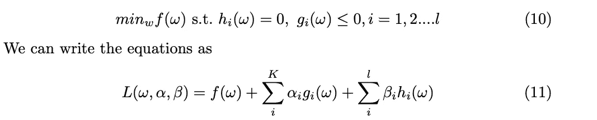

# SVM 客观清楚地解释道

> 原文：<https://medium.com/analytics-vidhya/svm-objective-clearly-explained-fb8552f41ade?source=collection_archive---------11----------------------->

**SVM 原始方程和对偶方程的建立**

**基本直觉**

在我们理解这个算法之前，我们应该理解两个向量的点积的一些好的性质。给定 x，y ∈ Rn，点积定义为

<x>= x_{1}y_{1} + x_{2}y_{2}…..+ x_{n}y_{n}</x>

如果我们在欧几里得空间中，有一条穿过原点的直线 L，那么ω是一个垂直于 L 的单位向量(直线的法线)。如果你带着

任何向量 x，那么如果 x 和ω在 L 的同一边，点积就是正的，否则就是负的。当且仅当 x 正好在线 L 上，包括 x 为零向量时，点积为零。这在许多分类问题中经常被用作决策规则。在右图中，我们可以看到 x = a + b，因此 a 是 x 在ω上的投影。a 的长度正好是点积<x>。</x>

**优化目标的制定**

为此，我生成了由两个分布组成的数据集——一个来自均值为 3 和 sd 为 1 的正态分布，另一个来自均值为 4 和 sd 为 1 的正态分布。如左图所示，位置示例如下

用蓝色表示，反面例子用黑点表示。现在我们需要的是它们之间的直线。可以有多条线穿过它们，但我们不希望它太靠近黑点或蓝点。因此，我们希望有一条线位于两个类之间最小距离的中心。想象这条线是右图所示的线。让黑色的直线和虚线成为一种街道。我们希望这条街尽可能的宽。假设我们垂直于街道ω，使得(u，ω) > C 其中 u 是任何数据点，b 是常数，或者我们可以说我们的决策规则是

现在，这个问题仍然可以有多个解决方案，所以现在我们需要约束。让我们的约束

其中 x+是我们的正训练样本，x-是我们的负训练样本，假设有一个响应变量 y，所有蓝色样本的响应变量 y 为 1，所有黑色样本的响应变量 y 为-1。我们将等式 3 和 4 乘以响应变量 y，得到约束条件

现在让我们回到上图，让 H1 和 H2 是街道上的两点，d1+d2 是它们之间的距离。首先需要找到 d1+d2。这是一个简单的投影，如果我们将 H1 和 H2 之间的差异乘以一个单位法线，我们将使用等式 6 得到街道的宽度。

现在，这是一个带有线性约束的凸目标，可以通过二次规划(内点/梯度投影)来解决，但我们将使用拉格朗日对偶，如下所示。因此，对于上述模拟数据，使用上述目标，我们有以下决策边界。

**非线性可分情况:拉格朗日对偶**

但是如果数据不是线性可分的呢？因此，我们必须想出另一种方法来获得最宽的街道。由于我们的目标是凸的，我们可以使用拉格朗日对偶来得到我们的解决方案。在这个约束优化中，假设我们有下面形式的原始方程。然后我们使用拉格朗日乘子来求解参数。广义拉格朗日量由下式给出

其中α和β是拉格朗日乘数。我们对其求偏导数，求ω，α，β的值。因此，使用上面导出的凸目标的 SVM 的原始方程是

我们现在可以看到我们的公式依赖于<x_i>的点积。我们需要这一点，以便使用核函数，它基本上将点积映射到更高维度，其中数据是线性可分的，以便我们可以找到该维中最宽的街道，然后将其映射回我们的数据。</x_i>

参考资料:

 [## 构建支持向量机优化问题

### 假设和设置这篇博文有一个互动演示(主要在文章结尾使用)。的…

jeremykun.com](https://jeremykun.com/2017/06/05/formulating-the-support-vector-machine-optimization-problem/)