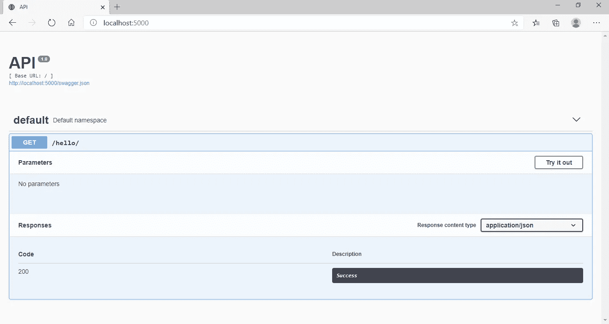
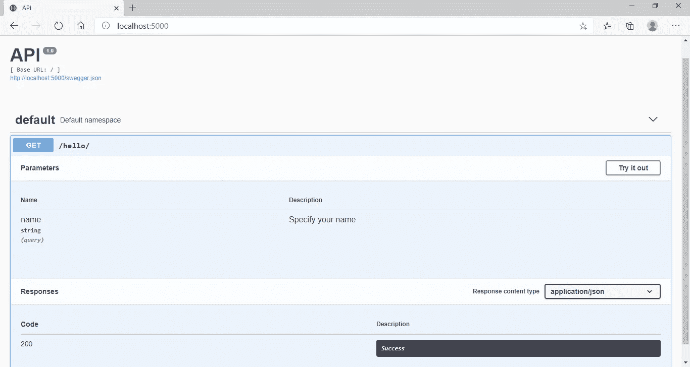
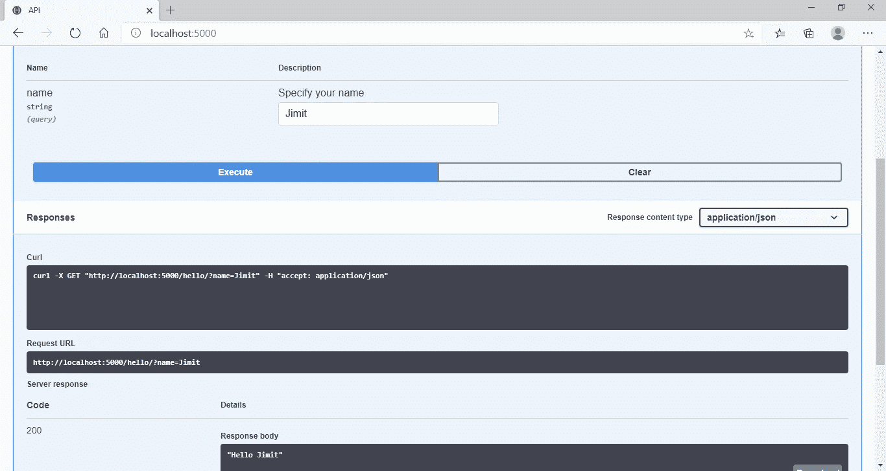
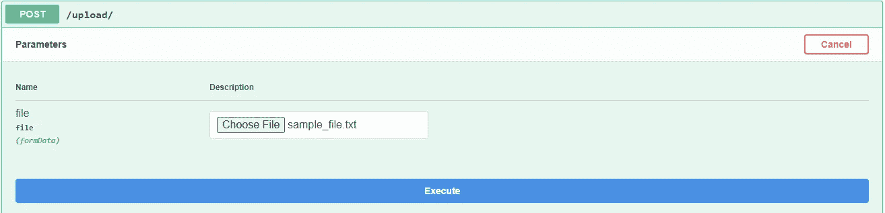
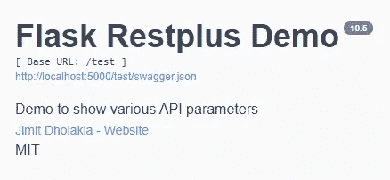

# 用 Flask、Flask-RESTPlus / Flask-RESTX 和 Swagger UI 构建 Python APIs

> 原文：<https://medium.com/analytics-vidhya/swagger-ui-dashboard-with-flask-restplus-api-7461b3a9a2c8?source=collection_archive---------2----------------------->

## 编程；编排

## 如何用 Python 搭建一个交互式 API 仪表盘？


照片由[佩顿·塔特尔](https://unsplash.com/@paytonctuttle?utm_source=unsplash&utm_medium=referral&utm_content=creditCopyText)在 [Unsplash](https://unsplash.com/s/photos/laptop-book?utm_source=unsplash&utm_medium=referral&utm_content=creditCopyText) 上拍摄

# 什么是 Swagger UI？

Swagger UI 是一个可视化和与 API 交互的工具，它是使用 OpenAPI 规范自动生成的。它会生成一个网页，帮助我们记录各种 API 并与之交互。

# 什么是 Flask-RESTPlus？

Flask-RESTPlus 是 Flask 的扩展，它鼓励用最少的设置实现最佳实践。它提供了一组装饰器和工具来描述 API，并使用 Swagger 公开其文档。

> 注:不再维护 Flask-RESTPlus。考虑使用 [Flask-RESTX](https://flask-restx.readthedocs.io/en/latest/index.html) ，Flask-RESTPlus 的一个分支

# 装置

可以用 pip 安装 [Flask-RESTPlus](https://flask-restplus.readthedocs.io/)

```
pip install flask-restplus
```

或者使用 pip 安装 [Flask-RESTX](https://flask-restplus.readthedocs.io/en/stable/index.html) (推荐):

```
pip install flask-restx
```

# 最小 API

```
from flask import Flask
from flask_restplus import Api, Resource

app = Flask(__name__)
api = Api(app)

@api.route('/hello/')
class HelloWorld(Resource):
    def get(self):
        return "Hello World"

if __name__ == '__main__':
    app.run()
```

> **注意:**如果你正在使用 Flask-RESTX，那么将导入`from flask_restplus import Api, Resource`改为`from flask_restx import Api, Resource`。代码的其余部分保持不变。

将此文件保存为`app.py` *(或者你想要的任何其他文件名)*，进入终端，键入`python app.py`(即`python <filename>.py`)启动程序。

如果您在部署时收到以下错误:

```
from werkzeug import cached_property
ImportError: cannot import name 'cached_property'
```

在导入 flask_restplus 之前添加以下行:

```
import werkzeug
werkzeug.cached_property = werkzeug.utils.cached_property
```

现在，启动浏览器并转到`http://localhost:5000`，您应该会看到这个屏幕:



这是 Swagger UI 屏幕。它允许您使用**试用**按钮查看所有端点并测试 API。

您也可以通过访问`http://localhost:5000/swagger.json`来查看 Swagger 文件的内容。为上述代码生成的 Swagger 文件如下:

```
{
    "swagger": "2.0",
    "basePath": "/",
    "paths": {
        "/hello/": {
            "get": {
                "responses": {
                    "200": {
                        "description": "Success"
                    }
                },
                "operationId": "get_hello_world",
                "tags": [
                    "default"
                ]
            }
        }
    },
    "info": {
        "title": "API",
        "version": "1.0"
    },
    "produces": [
        "application/json"
    ],
    "consumes": [
        "application/json"
    ],
    "tags": [
        {
            "name": "default",
            "description": "Default namespace"
        }
    ],
    "responses": {
        "ParseError": {
            "description": "When a mask can't be parsed"
        },
        "MaskError": {
            "description": "When any error occurs on mask"
        }
    }
}
```

# 提取请求参数

您可以使用`reqparse`获取 API 调用期间传递的参数

```
from flask import Flask
from flask_restplus import Api, Resource, reqparse

app = Flask(__name__)
api = Api(app)

parser = reqparse.RequestParser()
parser.add_argument('name', help='Specify your name')

@api.route('/hello/')
class HelloWorld(Resource):
    @api.doc(parser=parser)
    def get(self):        
        args = parser.parse_args()
        name = args['name']
        return "Hello " + name

if __name__ == '__main__':
    app.run()
```

在上面的代码中，`parser.parse_args()`返回一个字典，其中键作为参数的名称，值作为查询中传递的值。

这将生成如下的 Swagger UI:



点击**试用**按钮检查 API。这将导致以下输出:



# 文件上传

要使用文件上传，将位置设置为`files`并键入`FileStorage`

```
from flask import Flask
from flask_restplus import Api, Resource
from werkzeug.datastructures import FileStorage

app = Flask(__name__)
api = Api(app)

upload_parser = api.parser()
upload_parser.add_argument('file', 
                           location='files',
                           type=FileStorage)

@api.route('/upload/')
@api.expect(upload_parser)
class UploadDemo(Resource):
    def post(self):
        args = upload_parser.parse_args()
        file = args.get('file')
        print(file.filename)
        return "Uploaded file is " + file.filename

if __name__ == '__main__':
    app.run()
```

为上述代码生成的 Swagger UI 如下所示:



# API 参数

```
api = Api(app,
          version='10.5',
          title='Flask Restplus Demo',
          description='Demo to show various API parameters',
          license='MIT',
          contact='Jimit Dholakia',
          contact_url='https://in.linkedin.com/in/jimit105',
          doc = '/docs/',
          prefix='/test'
          )
```

`version` → API 版本(用于 Swagger 文档)

`title` → API 标题(用于 Swagger 文档)

`description` → API 描述(用于 Swagger 文档)

`license` →指定 API 的许可(用于 Swagger 文档)

`license_url` →指定许可证页面 URL(用于 Swagger 文档)

`contact` →指定联系人(用于 Swagger 文档)

`contact_email` →指定联系人的电子邮件地址(用于 Swagger 文档)

`contact_url` →指定联系人的 URL(用于 Swagger 文档)

`doc` →指定 Swagger UI 文档的路径。默认为`'/'`

`prefix` →为 URL 的所有端点指定前缀

为上述代码生成的 Swagger UI 如下:



## 参考

*   [https://flask-restplus.readthedocs.io/en/stable/](https://flask-restplus.readthedocs.io/en/stable/)
*   [https://flask-restplus.readthedocs.io/en/stable/index.html](https://flask-restplus.readthedocs.io/en/stable/index.html)

## 资源

这篇文章的所有代码片段都可以在我的 GitHub 页面上找到。

## 推荐阅读

[使用 Flask 和 Python 创建 RESTful Web API](/p/655bad51b24)

## 让我们连接

领英:[https://www.linkedin.com/in/jimit105/](https://www.linkedin.com/in/jimit105/)GitHub:[https://github.com/jimit105](https://github.com/jimit105)推特:[https://twitter.com/jimit105](https://twitter.com/jimit105)