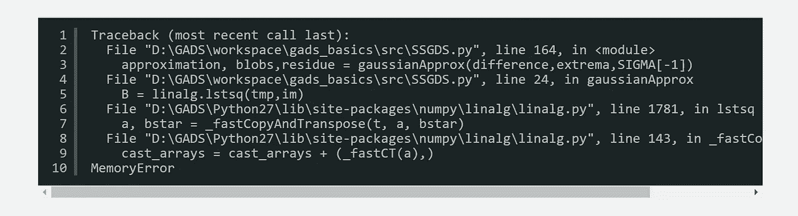
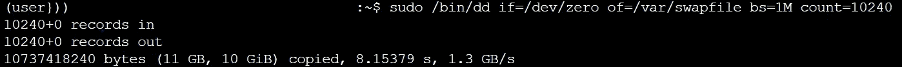
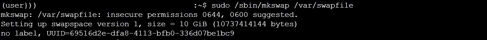
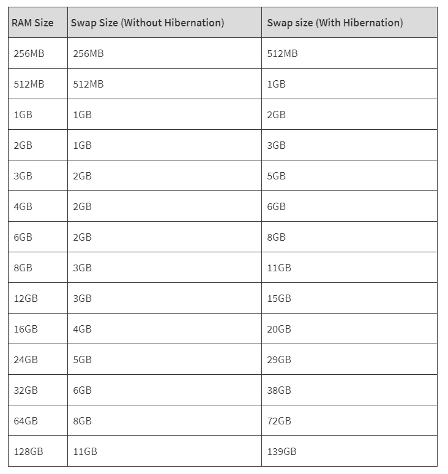

# 交换空间和 RAM 内存扩展

> 原文：<https://medium.com/analytics-vidhya/swap-space-ram-memory-extension-c7d371bdc2f0?source=collection_archive---------10----------------------->


你有没有遇到过这个 python 错误:



太棒了。你来对地方了。

当你不知道如何在其他地方运行你的脚本时，这可能是一个真正的问题。幸运的是，有些解决方案很容易应用:

*   买一台更大的机器:(如果你有更多的钱花，如果你不在当地的电脑限制)；
*   代码优化:这包括为您的流程使用正确的 python 对象和大小，尽可能重用 python 变量或尝试释放内存中的变量。

如果所有这些技术都不能解决问题，我们可以尝试最后一种:e **扩展 RAM 内存大小**。

是的，主流操作系统提供了永久或不永久扩展内存使用的可能性，这种技术就是调用交换。

## **1。什么是 swap？**

交换内存是计算机硬盘中的一个空间，操作系统将使用它来存放实际在 RAM 中的信息，以便为另一个应用程序释放它。当系统需要更多的内存来运行一个新的进程而又没有内存时，就应该这样做，所以我们可以看到，如果我们的系统有足够的内存，它可能就不需要交换内存了。物理内存和交换空间的组合大小就是可用的虚拟内存量。

Linux 有两种形式的交换空间:**交换分区**和**交换文件**。交换分区是硬盘的一个独立部分，专门用于交换；没有其他文件可以驻留在那里。交换文件是文件系统中的一个特殊文件，位于系统和数据文件之间。

在这个故事中，我们将关注交换文件。

## **2。如何激活交换**

在这个例子中，我们将重点关注[亚马逊 EC2](https://aws.amazon.com/fr/ec2/pricing/on-demand/) 计算机器。交换文件的主要优点是，您不需要找到一个空分区或磁盘的重新分区来添加额外的交换空间。

为了完成这个任务，我们首先需要运行这个命令



该命令创建一个 10GB 交换文件。详细来说:

*   **/bin/dd** :创建了一个空文件；
*   **if=/dev/zero** :指输入文件；
*   **of=/var/swapfile** :创建输出文件名 swapfile。它将是我们交换文件的名称；
*   **bs** 是块大小。我们将其设置为 1 兆字节；
*   **计数**是指我们想要的块数。

交换文件大小是通过计算计数值和块大小的乘积获得的(1M x 10240 = 10 GB)。

如果您需要超过 10GB，那么将 count 变量更改为更高的值。如果运行此命令时出现错误，请首先运行

```
sudo mount /dev/xvda2 /mnt
```

下一步是使用 mkswap 准备交换文件，就像准备分区一样，并给予 chmod 权限。我们将使用 chmod 600 文件(读写)权限。与分区类似，使用 swapon 命令挂载它。



最后，我们将在/etc/fstab 目录中添加一个新行。要做到这一点:打开/etc/fstab，添加这一行并重新启动您的机器。


重新启动后，我们可以通过键入以下命令来检查交换是否处于活动状态:

```
free -m 
```

或者对于 EC2 实例

```
cat /proc/meminfo
```

仅此而已。你赢得了 10GB 的内存，而没有支付任何额外的费用。

## 阅读更多:我的交换空间应该有多大？

我们在这个故事中发现，在大量内存使用的情况下，可以扩展物理内存来避免系统崩溃。但主要问题是我们应该分配多少空间？

根据[**itsfoss**](https://itsfoss.com/swap-size/) 网站，我们可以使用这个表格。



该表简要概述了如何根据物理内存大小定义交换文件的大小。这表明了 RAM 大小和相应的交换分配大小之间的关系。

## **结论**

如果您遇到内存错误，您可能需要通过在其他内存中添加交换内存文件来扩展物理内存，从而解决问题。如果在所有这些技术之后，问题仍然是一样的，你肯定需要一个计算能力更强的机器。

## 不要做数据等待，开始编码！