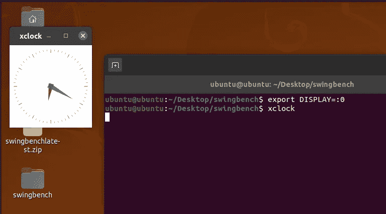
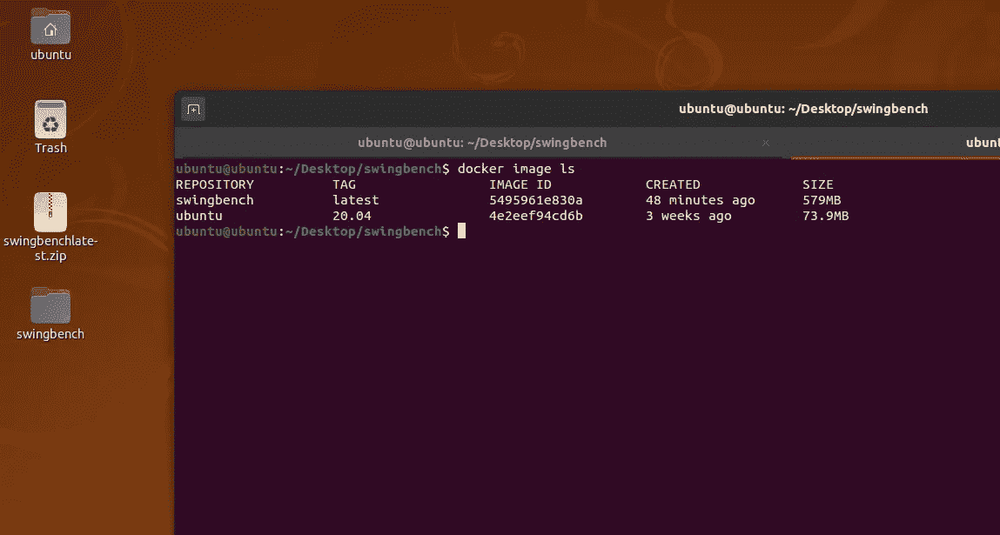
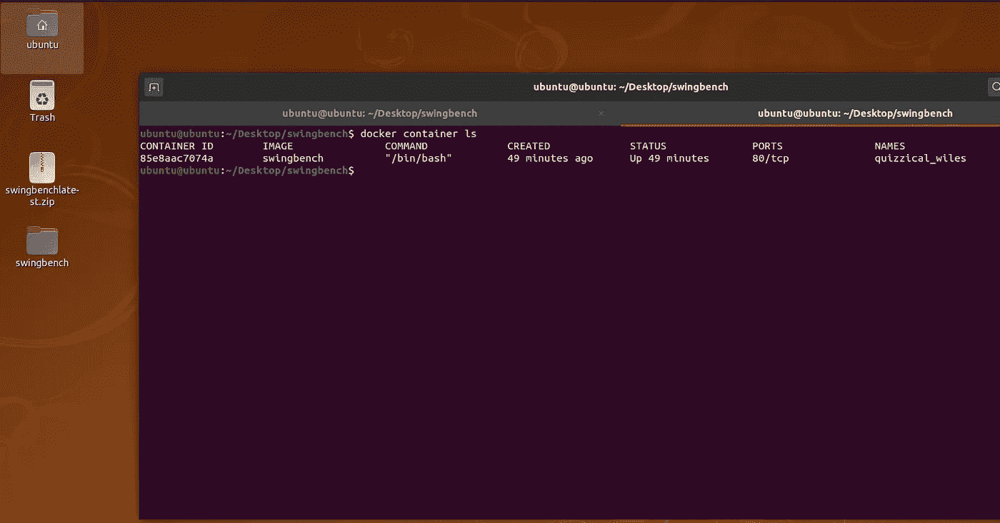
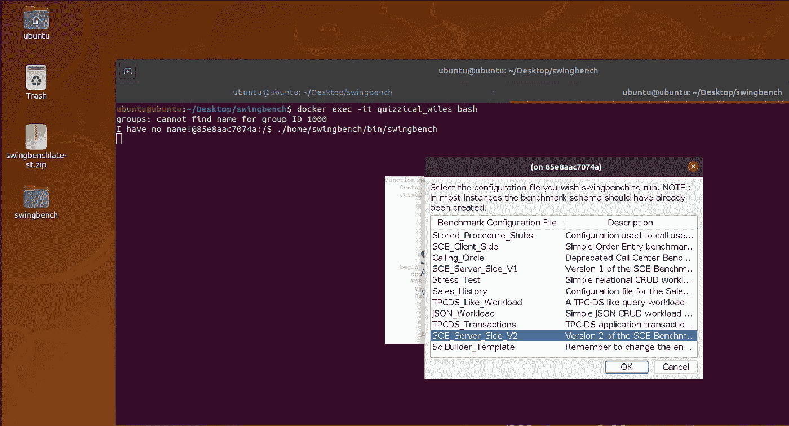
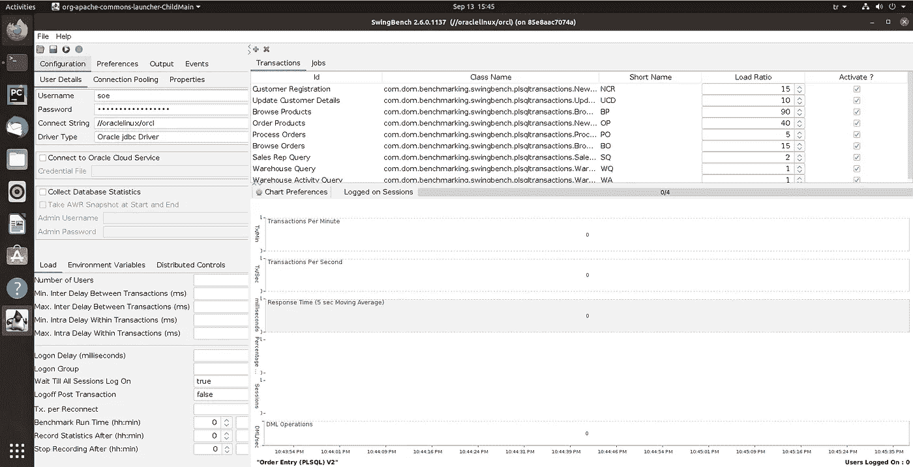

# 码头集装箱中的摇摆台

> 原文：<https://medium.com/analytics-vidhya/swingbench-in-docker-container-81910042974d?source=collection_archive---------22----------------------->

Swingbench 是专门针对 12c、18c 和 19c 对 Oracle 数据库进行压力测试的工具。

它可以在 UNIX(GUI)和 Windows 操作系统上运行，但今天我将展示我们如何在基于 Ubuntu 的 docker 容器上运行它。

在启动 docker 设置之前，最好确保我们能够从本地主机获取显示。

为了安装 OpenSSH-server 和 xauth，如果你还没有运行的话(我现在用的是 Ubuntu-20.04)

```
sudo apt-get install openssh-server xauth
```

将 X11Forwarding 和 X11UseLocalhost 参数的值更改为 yes，或者在/etc/ssh/sshd_config 中取消对它们的注释。这些行应该是这样:

```
X11Forwarding yesX11UseLocalhost yes
```

重新启动 sshd 守护程序:

```
sudo systemctl restart sshd
```

然后检查授权用户及其信息以连接 X 服务器:

```
xauth list
```

输出应该是这样的:

```
ubuntu/unix: MIT-MAGIC-COOKIE-1 a965803579f6f9624bb2ba75a66e3f3e
```

如果你对……Xauthority 文件，则以下链接可能会有所帮助:

[](https://superuser.com/questions/806637/xauth-not-creating-xauthority-file) [## 扩展验证没有创建。权威文件

### 当我 ssh 到一个无头的 Linux Mint 17 系统时，它不创建更新/创建。x 权限文件。此外，当…

superuser.com](https://superuser.com/questions/806637/xauth-not-creating-xauthority-file) 

最后检查 xclock:

*   xclock



现在，我们可以继续到 docker 部分，在你想要的地方创建一个 docker 文件。我在我的桌面上创建的。粘贴下面的行并保存文件:

```
vi Dockerfile
```

###########################################

#首先获取 ubuntu 作为基础 OS。如果不指定“:20.04”标识符，docker 将获取最新的 ubuntu 映像。

```
FROM ubuntu:20.04
```

#为了向前显示指定环境变量。

```
ENV DISPLAY :0
```

#安装必要的操作系统更新和其他软件包。

```
RUN \apt-get update && \apt-get -y install default-jre xauth unzip
```

#将最新的 swingbench 版本下载到/home 目录。

```
ADD [https://github.com/domgiles/swingbench-public/releases/download/production/swingbenchlatest.zip](https://github.com/domgiles/swingbench-public/releases/download/production/swingbenchlatest.zip) /home
```

#如果您的/tmp 目录中有 swingbenchlatest.zip 文件，那么您可以复制命令以将文件迁移到未来的 docker 容器中。注释以 ADD 命令开始的上一行，取消对下一行的注释。

```
#COPY /tmp/swingbenchlatest.zip /home# Unzip swingbenchlatest.zip fileRUN unzip /home/swingbenchlatest.zip -d /home# Change permissionsRUN chmod -R 755 /home/swingbench
```

###########################################

我们可以建立自己的码头工人形象，为此:

```
docker build -< Dockerfile — tag swingbench
```

这里，dockerfile 指的是您的 Docker 文件的路径，而“— tag swingbench”指的是我们的 Docker 图像的名称。

检查我们刚刚构建的图像:

```
docker image ls
```



通过运行以下命令，从该映像创建 docker 容器:

```
docker run -itd — user=$(id -u):$(id -g) -e DISPLAY=$DISPLAY -v /tmp/.X11-unix/:/tmp/.X11-unix swingbench
```

这一步是至关重要的一点。如果我们不指定“— user==$(id -u):$(id -g)”参数，Docker 会用 root 用户创建一个容器。为了从 container X 中获取 GUI，服务器授权应该与基本的 UNIX 操作系统相匹配，在我的例子中是 Ubuntu。

检查我们开始的容器:

```
docker container ls
```



使用以下命令执行容器:

```
docker exec -it quizzical_wiles bash
```

然后运行命令变魔术:

```
./home/swingbench/bin/swingbench
```

哒哒！



编辑 2020.09.16

我刚刚把我的图片放到了我的公共 docker hub 上。现在，您可以随时使用:

```
docker pull umuttekin/swingbenchdocker run -itd umuttekin/swingbench
```