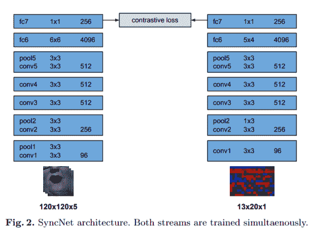
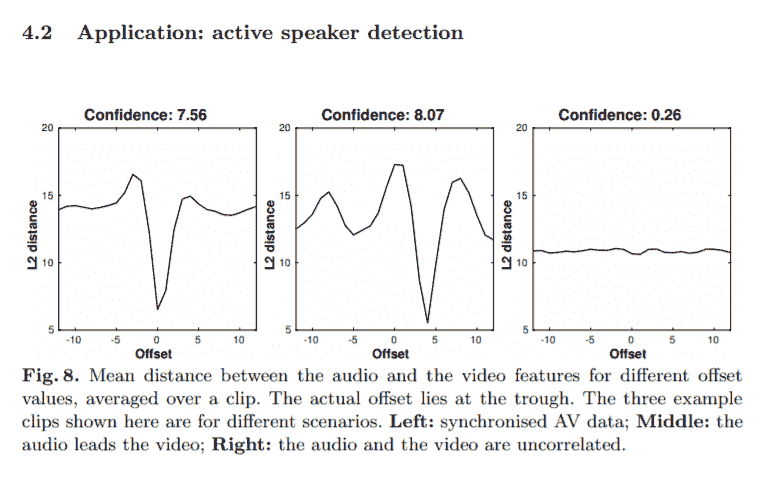
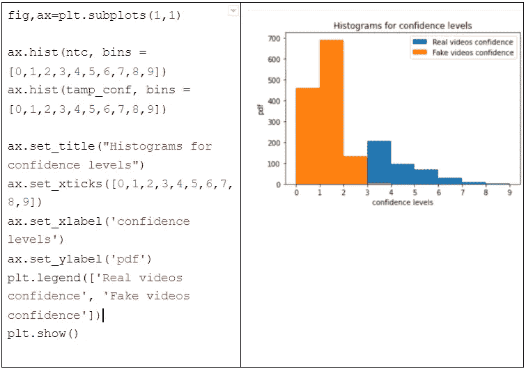
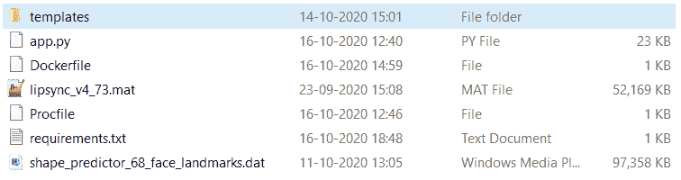
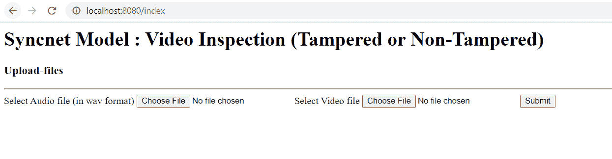
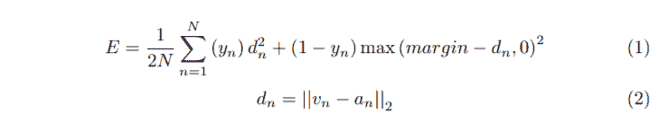
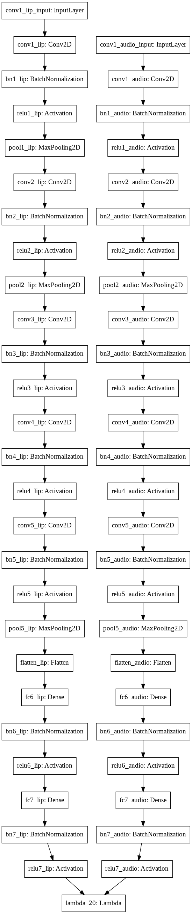

# 具有 VidTIMIT 数据集的 Syncnet 模型

> 原文：<https://medium.com/analytics-vidhya/syncnet-model-with-vidtimit-dataset-dd9de2cb2fb5?source=collection_archive---------5----------------------->

## 预测视频是真是假

找到项目的 [GitHub 链接](https://github.com/Neha13022020/Syncnet_model_VIDTIMIT_dataset)。LinkedIn [简介](https://www.linkedin.com/in/neha-sikerwar-785514113/)。

# 介绍

视频处理技术有了很大的进步。而且制作篡改视频要容易很多，可以糊弄人眼。这样的内容导致假新闻或误传。会影响到人民和国家。

所以在这个项目中，我试图检测视频是否被篡改，或者你可以说，是真的还是假的？我在整个项目中参考了[这篇](https://www.robots.ox.ac.uk/~vgg/publications/2016/Chung16a/chung16a.pdf)研究论文。他们专注于确定视频中嘴部动作和语音之间的音频-视频同步。他们将音频-视频同步用于电视广播。但是这里我使用了 VidTIMIT 数据集。这真的是一篇很好的研究论文，他们开发了一个独立于语言和独立于说话人的解决方案来解决唇形同步问题，没有标记数据。

有更多关于同样问题的最新研究论文。像，[这个](https://arxiv.org/pdf/1706.05739.pdf)和[这个](https://www.eurasip.org/Proceedings/Eusipco/Eusipco2018/papers/1570439304.pdf)。而且他们的成绩也不错。但我选择应用 syncnet 模型，因为它非常容易，模型结构简单，并且我们已经为该模型提供了预训练的权重。因此，让我们更多地了解 syncnet 模型及其架构。

# 关于 Syncnet 及其架构

网络接收音频和视频输入的剪辑。双流 ConvNet 架构，支持从无标记数据中学习声音和嘴部图像之间的联合嵌入。

## 音频数据

输入音频数据是 MFCC 值。你可以在这里阅读更多关于 MFCC 的信息。梅尔频率倒谱系数是自动语音和说话人识别中广泛使用的特征。它识别音频信号中有利于识别语言内容并丢弃所有其他内容的成分。每个时间步长使用 13 个 Mel 频带。层架构基于 VGGM，但修改了滤波器大小，以接收非常规维度的输入。

## 视频数据

视觉网络的输入是一系列嘴部区域，作为 5 帧的 111×111×5(宽×高×高)尺寸的灰度图像。下面是研究论文中架构的截图。

关键思想是音频和视频网络的输出对于未被篡改或真实的视频是相似的，而对于被篡改或伪造的视频是不同的。因此，我们可以计算网络输出之间的欧几里德距离。距离越大，相似度越小，意味着视频是假的。

# 关于 VidTIMIT 数据集

[VidTIMIT](http://conradsanderson.id.au/vidtimit/) 数据集由 43 个人的视频和相应的录音组成，背诵短句。每人 10 句话。每个人的视频被存储为 JPEG 图像的编号序列。相应的音频存储为 WAV 文件。要解压缩文件夹:

因为我们有 43 个用户，每个用户有 10 个音频，所以我从他们各自的图像和音频中创建了 430 个未被篡改的视频。然后，为了创建篡改的视频，我用来自同一个 VidTIMIT 数据集的 3 个错误音频替换了每个正确的音频。基本上，我创建了 3 个对应每个真实视频的假视频。因此，在我们最终的数据集中，篡改和非篡改视频的比例为 1:3。我用 cv2.VideoWriter 创建了视频。我正在展示创建非篡改视频的代码。同样，你也可以创建被篡改的视频。

# 音频和视频处理

在本节中，我们将为音频和视频文件创建功能。我从[这里](https://github.com/voletiv/syncnet-in-keras/blob/master/syncnet_params.py)得到的所有加工参数和从[这里](https://github.com/voletiv/syncnet-in-keras/blob/master/syncnet_functions.py)得到的功能。他还实现了相同的 syncnet 模型。而且所有的功能都很清晰。我们一个一个来看。视频文件是. mp4 格式，音频文件是。wav 格式。

## 视频处理:

在视频处理中，我们首先检测帧和嘴。将嘴部图像转换成灰度并调整大小。然后取嘴部的矩形坐标，并以此准备视频特征。然后将 5 帧的特征堆叠在一起。所以我用了一个以视频为输入的函数。如果有人不想处理视频，而是有帧/图像要处理，他们可以使用其他功能进行特征化。所有功能都存在于我的 GItHub repo 中。

## 音频处理:

对于音频处理，首先，我们使用 scipy (scipy.io.wavfile)读取 wav 音频文件。然后，speechpy.feature.mfcc 为每 0.2 秒的剪辑创建 mfcc 特征。我们考虑了 MFCC 的 12 个特征。然后将特征整形为(N//20，12，20，1)，其中 N 为 len(mfcc_features)。请找到下面的代码。

# 建模

在建模部分，我们将创建两个流的结构，如架构部分所示。一个流处理嘴部帧，另一个流处理音频特征。在 Keras 中实现，2 个顺序模型。然后我们有函数来加载我从 Vikram Voleti 和他的 GitHub [库](https://github.com/voletiv/syncnet-in-keras)中获得的预训练权重。我只从他的回购中获得了建模的所有功能。任何人都可以参考他的演示文件，清楚地了解完整的管道。我们有不同的模式，像“唇”，“音频”或“都有”。如果我们选择“lip”模式，那么只有 lip 序列模型将被加载。如果选择了“音频”模式，则只会加载音频序列模式。如果选择了“both”模式，那么 lip 和音频模型都将被加载到一个列表中，如下面的代码所示。

## Syncnet lip 模型:

在嘴唇模型层中，我们将形状输入为(嘴部框架的高度、嘴部框架的宽度、视频通道的数量)。这里我们有 7 块层。第一、第二和第五块由卷积和最大池层组成。第三和第四区块为 conv 层。第 6 和第 7 块是致密层。

## Syncnet 音频模型:

在音频模型层中，我们的输入形状为(音频 MFCC 通道= 12，音频时间步长= 20，1)。这里我们也有 7 块层。第 2 块和第 5 块由卷积层和最大池层组成。第一、第三和第四区块为 conv 层。第 6 和第 7 块是致密层。

# 评估和结果

根据这篇研究论文，“为了找到音频和视频之间的时间偏移，我们采用了滑动窗口方法。对于每个样本，计算一个 5 帧视频特征和 1 秒范围内的所有音频特征之间的距离。”所以我们在这里也实现了同样的。

同样在论文中，他们实现了置信度得分来寻找主动说话者。但在我们的例子中，所有视频中只有一个扬声器。他们还举了配音视频的例子，其中嘴唇的动作与音频不匹配。所以我用置信度找到了音频和视频之间的关联。高置信度意味着音频和视频之间的相关性更高。所以那段视频更有可能是真的。而如果置信度得分较低，则意味着音频和视频之间的相关性较低，因此视频被伪造或篡改的可能性较大。

这里我考虑标签 1 为非篡改或真实的视频。对于篡改或伪造的视频，标记为 0。在建模部分之后，我们可以从模型中预测音频和视频阵列。然后用那些数组，我要计算它们之间的欧氏距离(函数参考 GitHub repo)。从距离函数中，我们将得到一个 31 值的距离数组。然后，利用这些值，我们可以计算每个音频-视频对的置信度得分。置信度可以通过距离数组的中值和最小值之间的差来计算。最后根据置信度得分，我们可以预测视频的真假。

我找到了所有视频的置信度得分，并绘制成图，如图所示。橙色代表假视频的置信度值，蓝色代表真视频的置信度值。正如我们所看到的，较低的置信度得分值用于篡改/伪造的视频，而较高的置信度得分值用于真实/未篡改的视频。所以我们可以在置信度值的基础上明确地将它们分为真的或假的。

因此，我们必须从置信度得分中选择一个阈值来分类视频是真的还是假的。从图中，我们可以看到 3.5 是一个很好的分类阈值。或者，我们可以从 2 到 4 个置信度值运行循环，并选择一个度量(precision_score，因为我们想要更低的假阳性)。然后，我们可以检查在什么置信度分数作为阈值时，我们会获得最高的精度。在我的例子中，以 3.5 为门槛，我得到了相当好的结果。我的 roc-auc 值为 0.8461231275184763。在精确度和召回率之间总是有一个权衡。可以根据自己的要求选择。

# 来自实时视频的片段

如果您使用的是视频直播，您可以创建 4 秒的视频块。然后可以像我们之前所做的那样处理这些块，然后检查视频/块是否被篡改。

为了创建 4 秒的块，FFmpeg [命令](/@taylorjdawson/splitting-a-video-with-ffmpeg-the-great-mystical-magical-video-tool-️-1b31385221bd)如下。

# 部署

现在我们可以在云中部署模型，因为我们已经保存了权重和模型。我参考了这些([这个](/analytics-vidhya/how-to-deploy-your-machine-learning-model-in-the-cloud-87d3451a466d)和[这个](https://pythonise.com/series/learning-flask/flask-uploading-files#related))关于部署的好文章。为了进行部署，我们需要在像 AWS 或 heroku 这样的云平台中设置环境。但是首先我们需要使用 Flask 创建一个简单的 web API。因此，我创建了一个 app.py 文件，我们必须将它放在与所有其他文件相同的文件夹中。也是一个 HTML 表单，可以接受 2 个输入文件，一个音频文件。wav 格式)和一个视频(. mp4 格式)和提交按钮。当提交表单时，它将向'/predict' route 发出 post 请求，我们应该能够获得表单页面的数据。这个 HTML 文件我们必须放在模板文件夹中。所以文件夹的结构应该是这样的。

所有这些之后，我们将检查它是否在我们的本地系统中工作。唯一的挑战是为 dlib 设置虚拟环境。我用了 anaconda 提示。按照此处[或此处](https://www.learnopencv.com/install-opencv-3-and-dlib-on-windows-python-only/)[的步骤](https://www.codesofinterest.com/2019/12/build-and-install-dlib-anaconda-windows.html)设置 dlib。然后，我们只需在 anaconda 提示符下运行 3 个命令:

1.  cd C:\Users\Neha\Desktop\deploy

(将目录更改为您的路径)

2.conda 激活环境 _dlib

(“env_dlib”是我的虚拟环境)

3.python app.py

然后我们用“[http://localhost:8080/index](http://localhost:8080/index)”在浏览器中打开 localhost(根据你的改变端口号)。然后，上传文件并获得您的视频预测。太好了！

点击这里查看演示

对于云中的部署，我们需要一个深度学习 AMI 实例(所以我们不需要安装所有的深度学习库)，它不符合 AWS 中免费层的条件。所以我没有做。如果您打算尝试在普通实例中部署，那么 dlib 安装将是一个真正的挑战。因此，如果您有适当的资源，那么您可以继续在云中部署该模型。祝你好运！

# 未来的改进

在本节中，我尝试用 syncnet 模型进行迁移学习。为了创建数据集，我尝试将 tf.data.Dataset 直接用于音频和视频功能，但由于深度并不是对所有视频都是固定的，所以它会给出 ValueError。所以我用了 tf-records。经过处理或特征化的音频和视频，我把它们写入 tfrecords 文件。代码如下所示。

然后，我们可以轻松地创建数据集。要读取 tf-records 文件以及如何从中创建数据集，请参考我的 GitHub [链接](https://github.com/Neha13022020/Syncnet_model_VIDTIMIT_dataset)。

这里我就不计算置信度得分了。相反，我将使用对比损失函数，它将 y_true 和 y_pred 作为输入，并计算它们之间的损失。所以 y_pred 将是音频和视频之间的距离数组，y_true 将是 0(代表假)或 1(代表真)的数组。以下是研究论文中的损耗和距离公式。

现在我们有了数据集和函数。我们需要训练模型。因此，在培训部分，我将介绍两种方法。第一种方法是，我们可以用以前模型的所有层创建一个新模型，并添加一个定制层来计算距离，并将使用对比损失作为模型的损失函数。第二种方法是冻结前一个模型的顶层，仅用您的数据训练最后的密集层，然后调用距离函数和损失函数。我们可以使用 TensorFlow 的 GradientTape()函数进行训练。第一种方法的模型如下:

所以现在结构看起来像这样:

对于第二种方法，我想从两个顺序模型中只训练完全连接的第 6 层和第 7 层。如果有人想训练更多的层，可以用下面的代码来完成，只要让这些层可训练。

然后，我列出了两个模型的可训练变量，并展示了如何使用 GradientTape()函数进行训练。比如:

这里我使用了定制的距离函数和损失函数。因此，由于梯度问题，我不能训练模型。因为不是所有的函数都是可微的。但是如果有人使用适当的 TensorFlow 实现，它完全是可微分的和可训练的。所以我把它留给以后的工作。这是任何人在未来参考这种笔记本可以做的改进。

**注意:**这个案例研究的所有代码都可以在项目的 [Github repo](https://github.com/Neha13022020/Syncnet_model_VIDTIMIT_dataset) 中获得。

# 参考

*   [https://www . robots . ox . AC . uk/~ vgg/publications/2016/chung 16a/chung 16a . pdf](https://www.robots.ox.ac.uk/~vgg/publications/2016/Chung16a/chung16a.pdf)
*   [http://conradsanderson.id.au/vidtimit/](http://conradsanderson.id.au/vidtimit/)
*   [http://www . practical cryptography . com/miscellaneous/machine-learning/guide-Mel-fr](http://www.practicalcryptography.com/miscellaneous/machine-learning/guide-mel-fre)频率-倒谱-系数-mfccs/
*   [https://gitlab.idiap.ch/bob/bob.paper.eusipco2018](https://gitlab.idiap.ch/bob/bob.paper.eusipco2018)
*   【https://github.com/voletiv/syncnet-in-keras 号
*   【https://github.com/joonson/syncnet_python 
*   [https://github.com/CMU-Perceptual-Computing-Lab/openpose](https://github.com/CMU-Perceptual-Computing-Lab/openpose)
*   [https://www . tensor flow . org/API _ docs/python/TF/keras/Optimizer/Optimizer](https://www.tensorflow.org/api_docs/python/tf/keras/optimizers/Optimizer)
*   [https://stack overflow . com/questions/59731667/why-training-using-TF-gradient tape-in-tensor flow-2-have-different-behavior](https://stackoverflow.com/questions/59731667/why-does-training-using-tf-gradienttape-in-tensorflow-2-have-different-behavior)
*   [https://www.tensorflow.org/api_docs/python/tf/GradientTape](https://www.tensorflow.org/api_docs/python/tf/GradientTape)
*   [https://keras.io/examples/keras_recipes/tfrecord/](https://keras.io/examples/keras_recipes/tfrecord/)
*   [https://stack overflow . com/questions/47861084/how-to-store-numpy-arrays-as-TF record？rq=1](https://stackoverflow.com/questions/47861084/how-to-store-numpy-arrays-as-tfrecord?rq=1)
*   [https://stack overflow . com/questions/30008859/how-to-create-a-video-with-raw-images-RGB-format-and-add-audio-to-it-in-pytho](https://stackoverflow.com/questions/30008859/how-to-create-a-video-with-raw-images-rgb-format-and-add-audio-to-it-in-pytho)
*   [https://stack overflow . com/questions/7833807/get-wav-file-length-or-duration](https://stackoverflow.com/questions/7833807/get-wav-file-length-or-duration)
*   [https://theailearner . com/2018/10/15/creating-video-from-images-using-opencv-python/](https://theailearner.com/2018/10/15/creating-video-from-images-using-opencv-python/)
*   [https://zulko . github . io/movie py/getting _ started/getting _ started . html](https://zulko.github.io/moviepy/getting_started/getting_started.html)

谢谢你读到这里。

有意见、问题或补充吗？下面评论！您也可以通过[电子邮件](mailto:nehasinghsikerwar@gmail.com)直接与我联系，或者通过 [LinkedIn](https://www.linkedin.com/in/neha-sikerwar-785514113/) 与我联系。