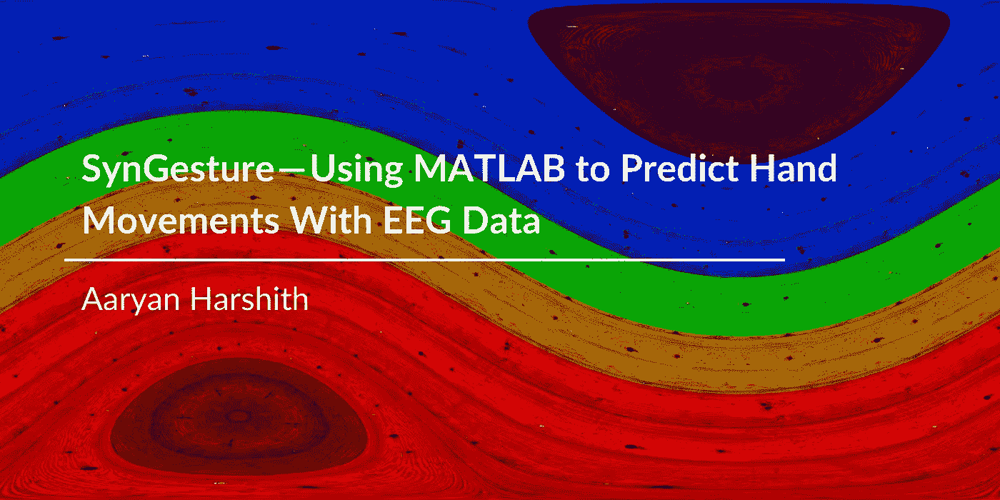
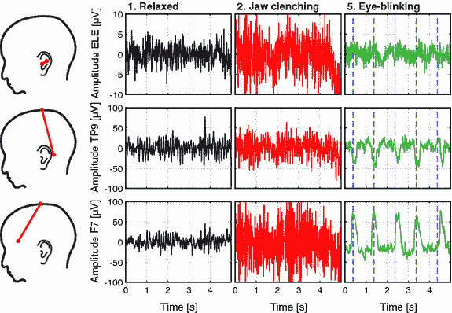
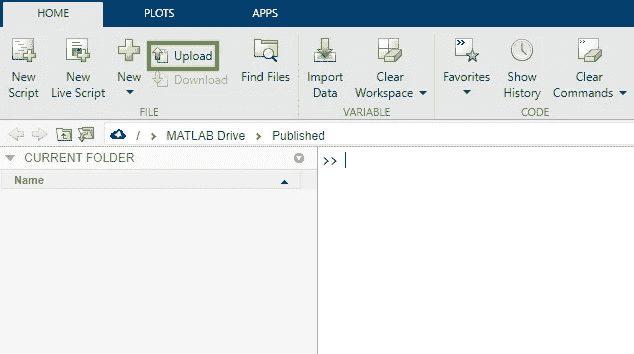
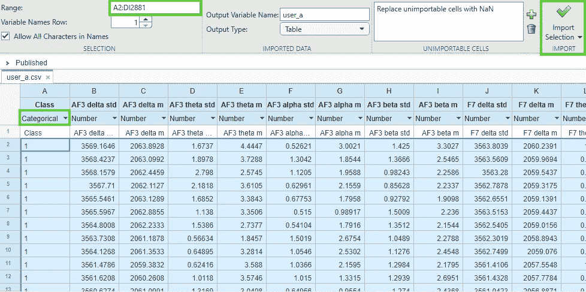
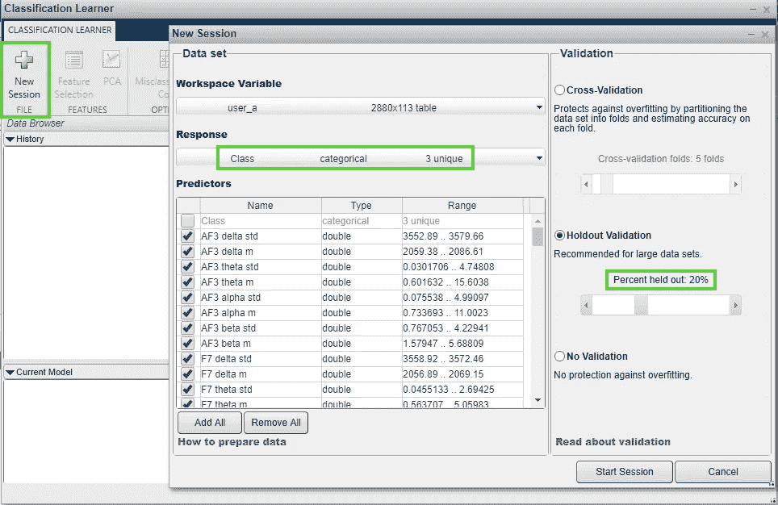
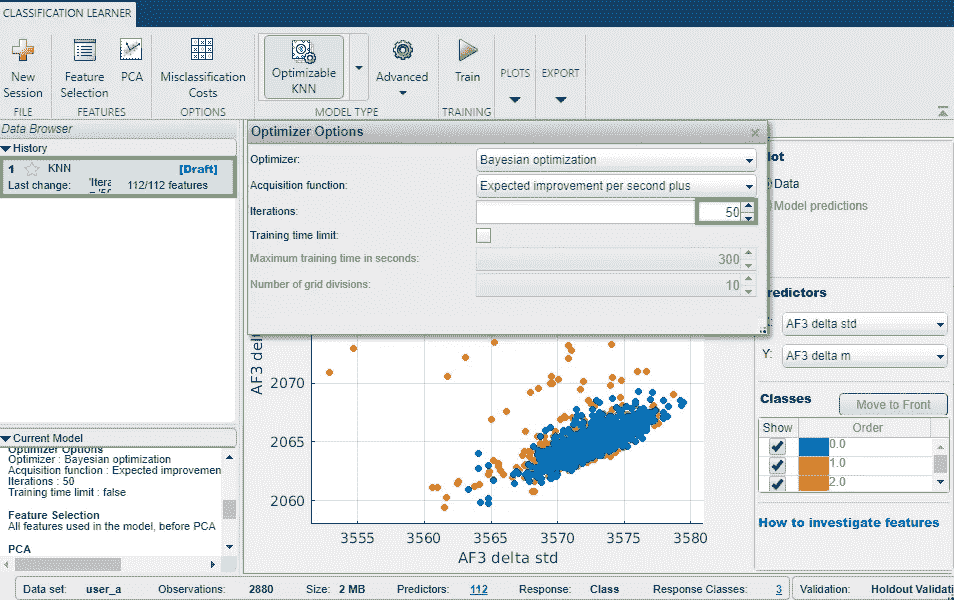
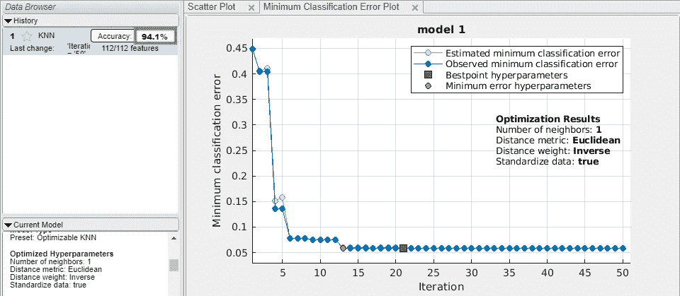

# syn gesture——使用 MATLAB 通过脑电图数据预测手部运动

> 原文：<https://medium.com/analytics-vidhya/syngesture-using-matlab-to-predict-hand-movements-with-eeg-data-a46831b157be?source=collection_archive---------6----------------------->

一个伯克哈特人是普通的大学新生。他在俄亥俄州立大学学习视频制作，找到了一份工作，甚至还执教了一支曲棍球队。每个人都知道，伊恩前途光明。

那是在他大学一年级的时候，伊恩和他的朋友去北卡罗来纳州的一个废弃海滩度过了一个暑假。当他投身于汹涌的海浪中时，意识到他也扔掉了四肢的*已经太晚了。*

*伊恩被诊断为四肢瘫痪，并被告知他永远不能移动脖子以下的肌肉。2017 年，当所有希望都破灭的时候，伊恩被选中参加一个来自一家名为 ***NeuroLife*** 的公司的神秘试验。*

*伊恩·伯克哈特讲述了他作为一名四肢瘫痪者的挣扎，以及他对神经生活的体验*

*NeuroLife 原来是一家旨在彻底改变大脑和身体失去联系的人的治疗方法的公司。NeuroLife 的直接系统能够绕过伊恩与他的手之间断裂的神经连接。伊恩，一个四肢瘫痪的人，现在已经能够 ***捡积木******开坛子*** ，甚至 ***弹吉他*** 。*

*这篇文章将涵盖 NeuroLife 和其他未来公司如何开发他们的系统，以及如何在不到 ***十分钟*** 的时间内开发一个系统。*

# *利用脑电图数据预测手部运动*

*你知道你做的每一个动作，你的大脑都要提前一秒钟准备吗？*

> *当有人打算做一个动作时，神经元簇会产生特定水平的电位，并将其发送到所需的运动位置。*

*对于像伊恩这样的人来说，这些信号被阻止到达 C5 椎骨以下的任何地方。在 ***脑-机接口(BCIs)*** 领域，这个问题是通过直接从源(大脑)读取电位并在感兴趣的区域重建该信号来解决的。利用***【ECoG】******脑电图*** 等技术，我们可以分析某人的大脑信号，以检测其移动的意图。*

*在我的[上一篇文章](/analytics-vidhya/using-ml-to-detect-blinks-54f55e1b86ac)中，我提到了这些测量系统的高灵敏度。像眨眼这样无害的行为可能会导致相当于核爆炸的大脑信号，并可能完全阻碍重要数据的分析。*

**

*显示各种人为因素对电极读数的影响的 EEG 信号图*

*现在，我们的目标不是删除不必要的数据，而是开发一个机器学习程序来*“读取某人的想法”——完全基于他们的脑电图信号。**

**众所周知，在机器学习中，数据为王。为了开发一个可以准确分类一个人的思想的模型，我们需要一个大的标记脑电图记录数据集。出于本教程的目的，我们将使用 Kaggle 上的脑电图[手部运动数据集](https://www.kaggle.com/fabriciotorquato/eeg-data-from-hands-movement)。这是一个压缩文件，包含总共四名患者大约 23MB 的脑电图记录。每个病人的数据都记录在一个单独的。CSV 文件，并细分为三类运动。使用 14 通道 Emotiv EEG 耳机，数据被标记为一个 ***零(右手运动)*** 、一个 ***一(左手运动)*** 或一个 ***二(无运动)*** 。**

**现在我们有了数据，我们可以开始上传到 MATLAB 在线。MATLAB 是一个可访问的接口，您可以使用它来创建健壮的机器学习模型 ***，而无需一行代码*** 。**

**解压文件后，首先打开 MATLAB 在线工作区。在“主页”选项卡中，单击“上传”按钮并为“用户 a”选择 CSV 文件。这是我们将在本教程中分析的文件。**

****

**打开 MATLAB Online，点击以绿色突出显示的上传按钮**

**如果操作正确，该文件应该显示在当前文件夹选项卡上。双击图标会显示一个 ***可视化*** 的数据。数据的第一列，标签为 Class，是我们的标签列。选择此列的下拉菜单，并将列类型设置为分类。将该列设置为分类向 MATLAB 的自动系统显示这是需要预测的变量。**

**接下来，在 CSV 的导入部分，将数据范围设置为 ***A2:DI2881*** 。这样做将使列名无法注册为模型中的数据点。使用范围选择数据点后，单击导入选择图标在 MATLAB 工作空间中创建一个表格。**

****

**通过在 MATLAB 中以 CSV 格式查看数据，我们可以选择一个数据范围，并将我们的文件作为可用的表导入**

**现在我们的数据准备充分了，现在可以开始使用 MATLAB 的集成 ML 开发系统构建一个 ***分类模型*** 。实质上，我们已经完成了这个项目最困难的部分——接下来的一切都是小菜一碟。**

**切换到你工作区的应用部分，选择 MATLAB 的 ***内置的*** 分类学习程序。这将打开一个新窗口，提示您开始一个新的会话。只需点击“新会话”即可开始您的机器学习之旅。**

**这样做将打开另一个选项卡，描述数据集的 113 个预测变量。由于您将标签列设置为分类，MATLAB 已经知道该类是我们的 ***响应变量*** 。**

**在您开始训练不同的模型之前，请确保选择维持验证并将其设置为 ***20%*** 。对于这种规模的数据集，维持验证似乎可以产生最佳结果，但是您可以通过试验不同的设置来尝试使该项目成为您自己的项目。**

****

**在此示例中，选择了维持变化并将其设置为 20%；然而，尝试尽可能多的设置**

**现在，您可以继续单击“启动会话”按钮。点击这个按钮将会出现一个窗口，可以从几十个可用的机器学习模型中选择一个。经过多轮严格的测试，一个 ***可优化的 KNN*** 模型被证明对该数据集表现最佳；但是，您可以随意使用您喜欢的任何型号。在 KNN 的优化设置中，将迭代次数设置为 ***50*** ，其余设置保留默认值。**

****

**为了这个实验的目的，模型被设置为 50 次迭代来优化自己，而不是默认的 30 次迭代。所有其他参数都保留默认值。**

**我们的模型终于完成了——你已经创建了一个与 NeuroLife 等公司不相上下的机器学习模型——所有这些都在不到十分钟的时间内完成了！最后，点击 ***训练按钮来评估*** 你的模型的准确性。**

****

**一个简单的 KNN 模型可以达到 94.1% 的精确度，真是太惊人了！我们的模型也非常快速地成功优化和收敛。这个指标与一些最好的神经修复公司的系统相当，目前准确率约为 96%，最重要的是，制作这个模型不需要一行代码。**

**既然您已经创建了这个高度健壮和高效的模型，想象一下您还可以用 EEG 数据做什么。诸如此类的系统帮助像伊恩这样的人希望有一个更光明的未来。光明的未来不会自己到来，我们应该去创造它。通过阅读和理解这篇文章的信息，你离创造一个更光明的未来又近了一步，我希望你对接下来的事情感到兴奋。**

**感谢您的阅读！**