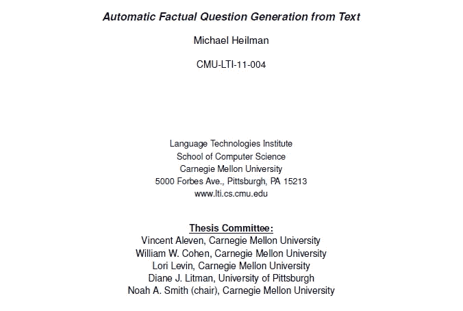
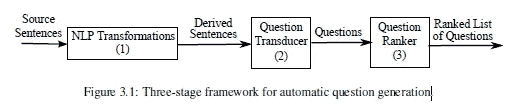
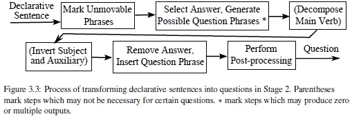
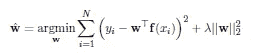

# 用于阅读评估的事实问题自动生成简介

> 原文：<https://medium.com/analytics-vidhya/synopsis-of-michael-heilman-automatic-factual-question-generation-for-reading-assesment-d060ede4d2a8?source=collection_archive---------10----------------------->

来源—[https://LTI . cs . CMU . edu/sites/default/files/research/thesis/2011/Michael _ heil man _ automatic _ factual _ question _ generation _ for _ reading _ assessment . pdf](https://lti.cs.cmu.edu/sites/default/files/research/thesis/2011/michael_heilman_automatic_factual_question_generation_for_reading_assessment.pdf)

作者

*注意:这个概要是第一次迭代。将在接下来的迭代中更新更好的解释。* ***《实干》写得非常漂亮，强烈推荐通读。*** *本概要的目的是给出 QG 系统流程的高级要点。这个大纲不会太专业，主要目的是介绍整个过程。*

# 目标:

创建一个问题生成系统(QG)，该系统可以将一篇文本文章(例如，教师可能选择用来补充教科书中的材料的网页或百科全书文章)作为输入，并创建一个事实问题的排序列表作为输出。

这项工作的驱动力是创建工具来帮助教师生成教学内容。

本文只关注基于事实的非虚构和信息丰富的文本，可能不是记叙文和主观文章的好选择。

# 工作流程:

QG 系统分为 3 个阶段-

## 阶段 1 — NLP 转换

将复杂的陈述性输入句子转换成简单的事实陈述。

提取保留意义的简单句的方法依赖于两种语言现象:语义蕴涵和预设。

**语义蕴涵** —当且仅当对于 A 为真的每种情况，B 也为真时，A 在语义上包含 B。

**语义蕴涵的转换**:

1.去除话语标记(其功能是将话语组织成片段的单词或短语，例如，well，However 等。)和从句、动词短语和名词短语中的附属修饰语(在中心名词前添加一些东西)。

2.分句和动词短语的分离连接词

**预设** —是关于语境的隐含假设，或者假设为真但没有语义上的必然。该算法采用这些预设触发器的子集来提取简化的句子

对于每个例子，我们的方法将提取句子杰斐逊是第三任美国总统:

*   非限制性同位语(如杰斐逊，美国第三任总统，。。。)
*   非限制性关系从句(如杰斐逊，美国第三任总统，。。。)
*   分词修饰语(如杰斐逊，美国第三任总统，。。。)
*   时态从属从句(例如，在杰斐逊是第三任美国总统之前。。。)

这组预设触发器是我们的方法在简化句子时移除的附属修饰语的子集。

**代词解析-**

有可能会收到模糊的问题。避免这些，代名词用它们第一次出现的先行词代替。ARKref 会议系统用于为输入文本中提到的所有名词短语构建会议图。

代词替换步骤的示例

3 是指弗雷德，所以我们可以看到他在最后被改成了弗雷德

约翰给自己买了一本书。[弗雷德]3 发现[约翰]1 也给自己买了一台[电脑] 4。接下来，[他]3 发现[约翰]1 没有给他买 3[任何东西] 5。

**阶段 2——问题传感器**

将陈述性语句转换成一组候选问题。该系统最初识别可能针对 WH 运动的回答阶段，并将它们转换成问题阶段。回答阶段可以是名词短语(如托马斯)，介词短语(如在 1801 年)和从属阶段(一个依赖于主句，如托马斯是第三任美国总统)。系统不会生成任何关于动词短语的问题。系统用下列词语生成问题:谁、什么、哪里、什么时候、谁的和多少。

更广泛的步骤-

1.  标记由于例如 WH 运动约束、避免不合语法的问题的约束而不能回答的短语。
2.  借助 18 个树形搜索表达式选择一个答案短语，并为其生成一组问题短语。
3.  分解主要动词。
4.  颠倒主语和助动词。
5.  删除答案短语，并在主句的开头插入一个问题短语。
6.  后处理以确保格式正确。

**第三阶段——问题排名**

基于源句子、输入句子、问题和使用的转换对问题进行分级。QG 系统使用最小二乘线性岭回归对问题质量进行建模。根据语言因素，如语法、模糊性和适当的 WH 词，较高的数字表示较高水平的问题可接受性。

问题 x 的可接受性 y

“f”是以问题 x 为输入的特征函数。“w”是每个特征的实值权重参数的向量。

该系统总共使用 179 个特征。

特征类型-

1.  长度特征
2.  WH 词汇特色
3.  否定特征
4.  n 元语言模型特征
5.  语法特征
6.  转换功能
7.  模糊特征
8.  代词替换