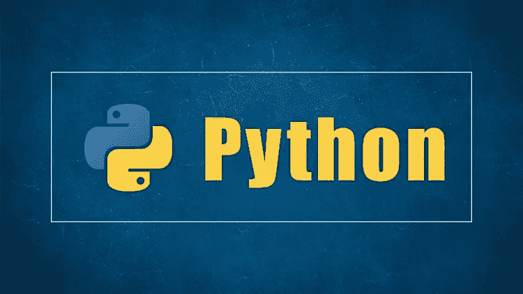

# Python 中的语法糖

> 原文：<https://medium.com/analytics-vidhya/syntactic-sugar-in-python-3e61d1ef2bbf?source=collection_archive---------2----------------------->



H 你听说过 python 中的语法糖吗？可能是，也可能不是，但可以肯定的是，每次你写一行代码时，你都在使用它。简而言之，语法糖是一种允许开发人员以“甜蜜”的方式更容易地编写代码的语法，因此，它给了你不知道系统如何工作的奢侈。你最好知道语法糖不仅仅与 python 相关，更多信息请参考( [ref](https://en.wikipedia.org/wiki/Syntactic_sugar) )。

在继续之前，我们需要先看看魔法方法。

## 神奇的方法

魔术方法(有时也称为*特殊方法*)是具有预定义名称的方法，以开头和结尾的双下划线(__init__)为特征。它们是“神奇的”,因为这些方法是间接调用的，你不需要直接调用它们，一切都是在幕后完成的。例如，当你实例化一个类 *x = MyClass()，* Python 会对 __new__ 和 __init__ 进行必要的调用。一个小例子:

```
x = 'Hello World!'print(x)
*# Hello World!*x.**__repr__()** *# Hello World!*
```

我们可以看到， **__repr__()** 方法被绑定到我们著名的 **print()** 。这里还有一些例子:

```
‘name’ in my_list      ->      my_list.__contains__(‘name’)
len(my_list)           ->      my_list.__len__()
print(my_list)         ->      my_list.__repr__()
my_list == “value”     ->      my_list.__eq__(“value”)
my_list[7]             ->      my_list.__getitem__(7)
```

考虑到我们在这一章中没有深入地关注魔法方法，如果你还想知道更多，看看文档吧( [ref](https://docs.python.org/3/reference/datamodel.html) )。因此，对于这个问题，神奇的方法是语法糖，我们可以自由地回答是！

## 装修工

装饰器只不过是 Python 中函数的包装器。它将感兴趣的函数作为参数，在调用它之前和之后执行某些任务并返回结果。

```
def **my_decorator**(func):
    def **wrapper**():
        print("Before the function is called")
        **func**()
        print("After the function is called")
    **return** wrapper

def **say_hello_world**():
    print("Hello World!")

x = **my_decorator**(say_hello_world)x()
*#* *Before the function is called
# Hello World!
# After the function is called*
```

我们将一个引用`say_hello_world`传递给我们的装饰器，装饰器然后返回一个`wrapper.`,我们使用这个包装器来调用我们的函数。

当你需要一个通用的函数，可以在你的项目中调用，而不需要编写重复的代码时，Decorators 是很有用的。事实上，多亏了 Python 语法糖，我们可以通过特殊字符“ **@** ”后跟装饰者的名字来调用我们的装饰者。

```
**@my_decorator**
def **say_hello_world**():
    print("Hello World!")**say_hello_world**()
*#* *Before the function is called
# Hello World!
# After the function is called*
```

这虽然简单，却大大简化了我们的工作。

## 更多句法糖的例子

```
**1 < x < 10** # equivalent to 1 < x and x < 10 **[x for x in range(10)]** # List comprehension **{key: value for key, value in d.items()}** # Dict comprehension **x = something if condition else otherthing** # python ternary **big_number = 1_000_000_000** # equivalent to big_number = 1000000000 **a += 1** # equivalent to a = a + 1
```

## **结论**

正如我们所见，句法糖让我们的生活变得更容易，很多时候我们甚至没有注意到甚至不知道我们正在使用它们，但无论如何，详细了解它的工作原理总是有用的，因为我们迟早需要深入了解它是如何工作的，以成功完成一项复杂的任务。一个很好的例子可能是扩展“默认”python 语法糖，在这里可以找到关于如何扩展的很好的阅读和例子( [ref](/better-programming/adding-sugar-to-the-python-syntax-e89248ce6e72) )。

跟我来:

github.com/pbuzulanGitHub @

领英@【linkedin.com/in/petru-buzulan 

> *多谢！*