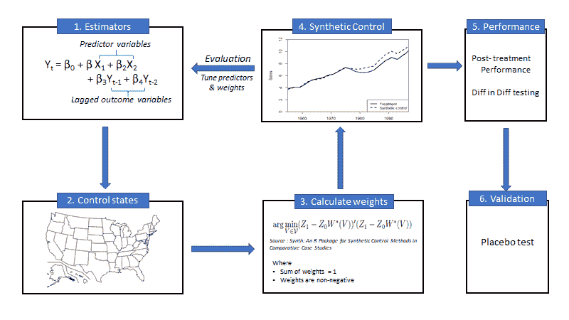

# 综合控制方法

> 原文：<https://medium.com/analytics-vidhya/synthetic-control-method-5c01f72da4e?source=collection_archive---------1----------------------->

综合控制方法(SCM)是一种数据驱动的方法，用于在比较案例研究中研究治疗的效果。这种方法具有汇总的结果，广泛应用于各行业，尤其是无法进行 A/B 测试的地方。在开始这个方法之前，这里有一个关于 A/B 测试的快速介绍，以及在哪里不能使用它。

**A/B 测试:**

一种常用的实验技术，用于测量具有可比性的不同部门的绩效。测试的完整指南可在[这里](https://vwo.com/ab-testing/)获得。测试的一个基本假设是，治疗组和对照组是随机选择的，两组之间没有溢出效应。

来源—[https://cliparts.zone/](https://cliparts.zone/)

举个例子:假设你负责美国一家连锁超市。随着全国各地销售额的下降，您决定推出新的优惠活动，在每周二和周四对所有产品进行 10%的折扣。在每个州推出这项服务之前，必须对优惠的有效性进行盈利能力测试。为了进行测试，必须有一个治疗组和对照组。由于逛商店的顾客不能被分成这些组，所以必须选择某些邮政编码或州作为测试的治疗组和对照组。A/B 测试在这种情况下没有帮助，原因如下:

*   随机选择是不可能的，导致实验中的偏差；我们无法事先准确确定顾客购物的时间和地点
*   目标和控制之间的溢出效应；来自控制邮政编码的客户可以选择只在提供的邮政编码中购物，从而夸大了治疗后的读数

换句话说，当客户或用户不知道正在进行的治疗时，A/B 测试更理想。这就是 SCM 发挥作用的地方。

**SCM 简介&方法论**

合成对照，顾名思义，创造了一个看起来相似的对照群体，基于该群体可以测量治疗的结果。在上面的例子中，让我们假设整个德克萨斯州在周二和周四都有 10%的优惠。在这里，美国所有其他州都是控制人口的潜在候选人。但并非每个州都有类似 TX 的销售模式，因此运行优化算法来选择各州的权重，以匹配 TX 商店在预处理期间的销售。这作为新的质控品，用于后处理期间的测量。

综合控制方法的逐步可视化

详细的分步解释可在[这里](https://www.urban.org/sites/default/files/publication/89246/the_synthetic_control_method_as_a_tool_0.pdf)找到。我试图将所有步骤与上面提到的超市例子联系起来。

1.  列出导致结果变量的预测变量。在这里，利益的结果是销售，那么是什么推动了销售呢？有两种变量定义任何时期的销售额→ ***预测值*** 是定义销售额的变量(*示例-所在地区 HH 的收入范围、该地区的人口密度等。*)； ***滞后结果变量*** 表示前 *n* 期的销售额。如果消费者在 2 月份大量购买并囤积，那么 3 月份的销售额可能会下降。同样，年底前后的假期也是高销售额的良好指标
2.  控制池应该由什么组成？控制不应该以任何方式受到治疗的影响。对于这个例子，除了 TX 之外的每个状态都可以被认为是控制。住在州边界附近的顾客可能会被优惠商店吸引，但是考虑到结果是汇总的，这种影响的结果是最小的。
3.  计算控制池中每个状态的权重。有多种方法可以做到这一点，但最常用的方法是运行一种算法，使结果变量和综合控制之间的误差最小化。注意:权重之和应为 1，且所有权重均为非负。
4.  这提供了合成控制。必须对预处理阶段的拟合优度进行评估。回顾哪些预测变量最合适，并帮助更好地定义结果。
5.  使用合成控制，可使用[差异差异](/@sadhaverajasekar/diff-in-diff-testing-python-f24835330bc8)测试方法测量后处理性能。
6.  标准误差不可用。所以安慰剂测试被用来衡量显著性。

**挑战:**

*   识别构成综合控制的相关控制单元
*   在选择预测值时，重要的是选择与处理单元具有相似性能的控制单元，即 TX 和所选控制状态之间的平均群体密度(和其他预测值)应该相似。这提供了治疗组和对照组之间的比较
*   需要相对较长的预处理时间
*   这些结果是汇总的。我们无法测量用户级别的影响

**实施:**

最初发布的合成代码实现主要在 R、Stata 和 Matlab 中可用。Python 中也有几个(但未注册的)版本。以下是代码和包源代码的编译列表:

*   点击[此处](https://github.com/sadhave2511/Synthetic-Control-Method-)查看 R 代码
*   点击[这里](https://github.com/gnazareths/synth)，点击[这里](https://github.com/jehangiramjad/tslib)，点击[这里](http://peerunreviewed.blogspot.com/2019/11/a-short-tutorial-on-robust-synthetic.html)获取 Python 代码

**安慰剂试验:简介**

综合控制方法不提供标准误差，这使得更难获得性能结果的显著性。对此进行评估的一种方法是进行安慰剂测试。

安慰剂测试更常用于医学实验。在药物试验期间，服用药物的患者往往表现出积极的康复，因为他们相信新药会使他们康复。这种差异是心理状态影响实验的实际结果。为了避免这种情况，在实验中引入了安慰剂(糖丸或无效药物)。因此，药物的实际影响将通过使用和不使用安慰剂的治疗之间的差异来衡量。这里是关于安慰剂效应的详细解释的链接。

这种实践也可以用来衡量供应链管理的有效性。再次重复上述相同的步骤，但是这一次，治疗状态数据(TX)被替换为控制状态之一，并且为该控制(非 TX)状态生成合成控制。并且对所有控制状态重复该过程。期望生成的合成控制和相应的状态应该遵循相同的模式。这将证明治疗对对照没有可识别的影响。

**参考文献:**

1.  比较案例研究中综合控制方法的 R 包
2.  [使用合成控制的因果干扰](https://towardsdatascience.com/causal-inference-using-synthetic-control-the-ultimate-guide-a622ad5cf827)
3.  [综合控制方法](https://economics.mit.edu/files/11859)用于比较案例研究:评估加州烟草控制项目的效果
4.  包[合成](https://cran.r-project.org/web/packages/Synth/Synth.pdf)在 R
5.  [安慰剂效应](https://www.statisticshowto.com/placebo-effect/)