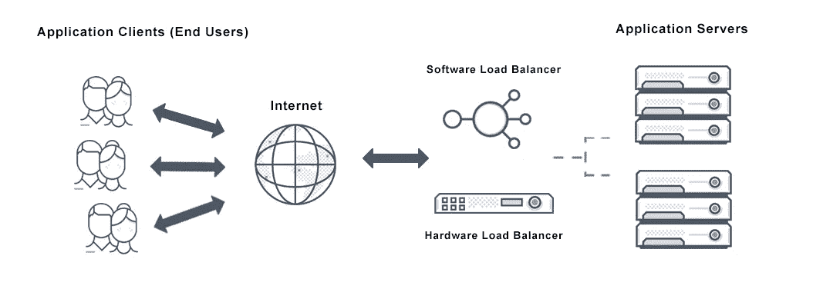
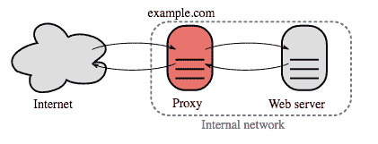
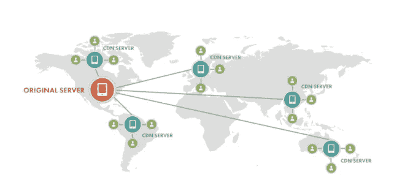
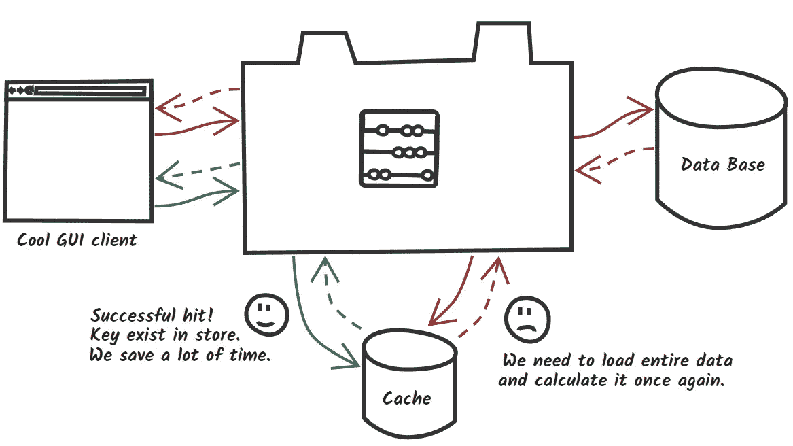
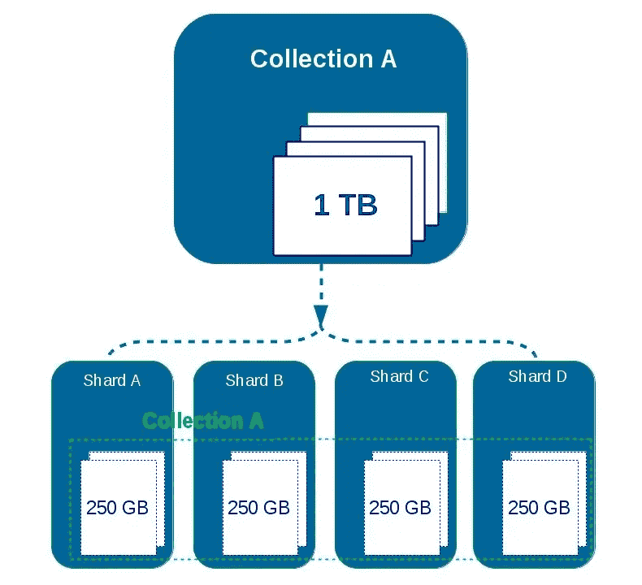

# 系统设计基础 101

> 原文：<https://medium.com/analytics-vidhya/system-design-101-3905a69cbc55?source=collection_archive---------9----------------------->

1.  负载平衡
2.  反向代理服务器
3.  内容交付网络
4.  贮藏
5.  数据库分片/分区

## 负载平衡:

负载平衡是在多台服务器之间分配网络流量的过程。这确保了没有一台服务器承担过多的需求。

**负载平衡器的类型:**

*硬件负载均衡器*:作为负载均衡器工作的硬件。非常昂贵，大多数应用程序仅将它们作为第一接触点。

*软件负载均衡器*:混合方法，HaProxy 是一款开源软件负载均衡器。Nginx 和 Linux 虚拟服务器是其他的例子。

**负载均衡算法:**

*   一系列
*   带加权服务器的圆形罗冰
*   最少连接
*   最短响应时间
*   源 IP 哈希
*   URL 哈希

## 反向代理服务器

**反向代理服务器**是一种代理服务器，通常位于私有网络的防火墙之后，将客户端请求定向到适当的后端服务器。

**好处:**

*   缓存:直接返回缓存请求的响应。
*   SSL 终止:解密传入的请求并加密响应。(无需在后端服务器上安装 X.509 证书)
*   安全:IP 黑名单，过滤等。
*   静态内容:直接服务器静态 Html、js、CSS、图片等。

**负载平衡器 vs 反向代理**

*   如果您有多个 web 服务器，请使用负载平衡器。
*   由于其他好处，反向代理甚至在一个 web 服务器上也很有用。
*   HaProxy 和 Nginx 都提供了反向代理功能。

## 内容交付网络

内容交付网络(CDN)是指地理上分布的一组服务器，它们协同工作，从离用户较近的位置快速交付互联网内容。通常，HTML/CSS/JS、照片和视频等静态文件是由 CDN 提供的，尽管一些 CDN(如亚马逊的 CloudFront)支持动态内容。

**好处**

*   用户在离他们很近的数据中心接收内容
*   您的服务器不必服务于 CDN 满足的请求

**类型**

*拉 CDN* :当第一个用户请求内容时，拉 CDN 从您的服务器获取新内容。您将内容保留在服务器上，并重写 URL 以指向 CDN。这导致请求速度较慢，直到内容缓存在 CDN 上。

*推送 CDN:* 每当你的服务器发生变化，推送 CDN 就会接收新的内容。你全权负责提供内容，直接上传到 CDN 和重写 URL 指向 CDN。您可以配置内容何时过期以及何时更新。只有当内容是新的或发生变化时，才上传内容，从而最小化流量，但最大化存储。

## 贮藏

参考位置原则:最近被请求的数据可能会被再次请求。

缓存是存储数据的硬件或软件组件，以便将来对该数据的请求可以得到更快的服务；存储在缓存中的数据可能是早期计算的结果，或者是存储在其他地方的数据的副本

**类型:**

*   进程内缓存:诸如 Guava、JCF、Ehcache 之类的内存缓存充当应用程序和数据源之间的快速对象存储。
*   分布式缓存:应用程序外部。使用一致散列分布在多个节点上。例如:Hazelcast，Memcached，Redis，Cassandra，Elasticache(由亚马逊提供)。
*   CDN:可以直接缓存和服务静态内容。

**缓存更新策略**

*   读/写通过:应用程序使用缓存作为主要的数据存储，读取和写入数据，而缓存负责读取和写入数据库。
*   后写:在后写中，应用程序在缓存中添加/更新条目，并将条目异步写入数据存储，从而提高写入性能
*   提前刷新:在任何最近访问的缓存条目过期之前自动刷新。

**缓存驱逐策略**

*   LRU:最近最少使用
*   LFU:最不常用
*   MRU:最近使用的
*   先进先出

## 数据库分片

分片将数据分布在不同的数据库中，因此每个数据库只能管理数据的一个子集。分片= =数据分区

**分片方法**

水平分区:基于范围的分片例如:根据用户的字母名称或 id 范围，将不同的行放在不同的数据库中。

垂直分区:基于特性，将表分成多个特性，并将一个特性存储在一个分片上。例如:一个分片上的用户数据，第二个分片上的图像数据，等等。

基于目录的分区:查询目录服务器，它保存每个元组键和它的 shard DB 服务器之间的映射。

## 向前

在第 2 部分中，我们将探讨可伸缩性、可用性、一致性、网络分区和 CAP 定理等主题。查看第二部分[这里](/@rajagoyal815/system-design-basics-101-2-453c9fd7fa64)。