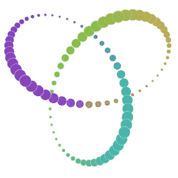
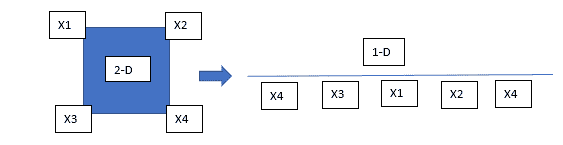

# T-SNE 直觉

> 原文：<https://medium.com/analytics-vidhya/t-sne-intuition-7d373819088c?source=collection_archive---------16----------------------->

像 PCA 一样， **t-SNE** ，或 t-分布式随机邻域嵌入，是一种可视化和降维算法。然而，与 PCA 不同，t-SNE 是一种高度先进的艺术状态(SOTA)算法，它将高维数据完美地总结成可解释的可视化，这是 PCA 很难实现的壮举，尤其是在聚类数据上。

礼貌用语:distill.pub

t-SNE 是 2008 年制定的一种相对较新的算法，因此使用了非常先进的数学方法，涉及内核和统计分布。为了能够理解 t-SNE 背后的数学直觉，一个非常清晰的高等数学概念是强制性的。因此，在本文的范围内，t-SNE 架构背后的数学将被避免，并将在另一篇文章中处理。

PCA 试图保持数据点的全局结构(参考本文:)PCA 的主要目标不在于保持点之间的相对距离，而在于沿轴的总体方差。

另一方面，t-SNE 的目标是保护当地的结构。这意味着它更关心点之间的相对距离，而不是总体方差。

t-SNE 的工作原理是将高维空间中的点嵌入到低维空间中(2 维空间用于可视化)。由于它的主要目标是保护当地的结构，它有效地照顾了居民区，但未能保持不同居民区之间的距离。此外，SNE 霸王龙也无法保护邻近区域的整体结构/大小。

反对 SNE 霸王龙概念的主要证据是拥挤问题。当点分布在正方形、立方体或超立方体的角上时，就会出现这个问题。考虑一个正方形，其中两个相对的点是不同的邻域，并且两个同时发生的角在相同的邻域中，我们的目标是将维数从二维降低到一维。

为了实现这一点，我们成功地放置了三个点。但是，当我们尝试放置第四个点(X4)时，第四个点与其两个邻居(X2、X3)之间的距离无法保留，因为这些邻居由相对的角点(X1)共享，因此被放置在 X1 的任一侧。

因此，它证明了当数据点如上放置时，有时不可能保持邻域中的距离。

随机邻域嵌入的设计引起了拥挤问题，t 分布被用来解决这个问题。它不保证问题的完全解决，但试图达到最好的结果。

t-SNE 是一种迭代算法，这意味着它不断调整嵌入，直到在所需的维度上实现稳定的结构。

# t-SNE 的两个最重要的参数是:

I)困惑:这大致是在改变维度时需要保留的邻居的数量。

低困惑:结果不明确，没有用。

逐渐增加:结果改善并且在嵌入结构中实现了一定的稳定性。

高度困惑(大于样本数):情节混乱，无法提供见解

ii)步骤:运行 t-SNE 算法的迭代次数。

这两个参数都需要调整几次才能得到一致的结果。参考[这个](https://distill.pub/2016/misread-tsne/)t-SNE 的实例，直观地了解这些参数的功能。

t-SNE 是一种概率算法，这意味着每次运行它时，它都会给出稍微不同的结果。

# SNE 霸王龙与聚类分析的不相容性；

在 t-SNE 代表中，v 星团的大小并不意味着什么

原始维度中的稀疏和密集集群可能最终在较低维度中具有相似大小的集群表示。这是因为收缩稀疏点和扩展密集点是 t-SNE 算法的特性。

因此，观察聚类的 t-SNE 表示，人们不能对聚类大小甚至聚类之间的距离得出任何结论(t-SNE 不保持不同邻域之间的距离)

# 总结:

*   永远不要在使用固定的困惑度或步长参数只运行一次 t-SNE 后得出结论。
*   困惑参数必须始终介于 2 和样本/点数之间。
*   由于算法的概率性质，每次运行时，预期特征结果会变化，但保持一致。
*   在进行图像处理时，该算法基于视觉相似性对点进行分组。
*   t-SNE 不能用来解释集群大小和集群内的距离。