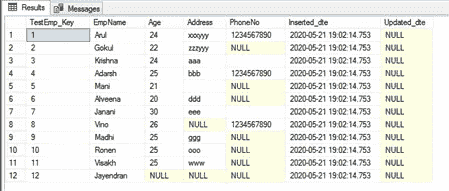
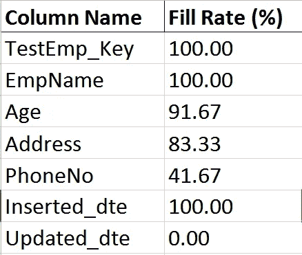
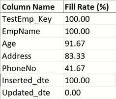
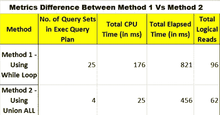

# T-SQL:查找表的填充率

> 原文：<https://medium.com/analytics-vidhya/t-sql-finding-fill-rate-of-table-908b67220ea?source=collection_archive---------14----------------------->

填充率是许多业务相关决策中最重要的指标之一。因此，了解填充率是业务流程中数据分析和决策的基本任务之一。在本文中，我们将解释如何使用 T-SQL 查询来查找表的填充率。

观察填充率是了解和提高数据质量的关键因素，这为我们的管理层和最终用户创造了满足感。需要找到一个表的填充率，怎么做？

# 填充率是什么意思？

**填充率**被定义为每一列级别的填充条目数除以表中的总行数。根据表中的总行数，我们可以很容易地计算出填充率。

# 挑战

像下面这样的 ***模式变化*** 使得我们的填充率方法比实际几乎没有困难。

*   表名更改
*   列名更改
*   数据类型更改
*   删除现有列
*   添加新列

由于上述挑战，我们不能简单地用静态解决方案来寻找表格的填充率。相反，我们需要类似动态方法的东西来避免我们未来的返工。

# 先决条件

在下面的示例中，我们将使用一个名为' ***Get_FillRate*** '的存储过程进行演示。如果任何一个在数据库中有相同的对象名，请确保更改下面的存储过程名。

# 使用数据加载脚本创建示例表

`--dropping temp table if exists`

`IF OBJECT_ID('TempDb..#TestEmp') **IS**` `NOT` `NULL`

`**DROP**` `**TABLE**` `#TestEmp;`

`**CREATE**` `**TABLE**` `#TestEmp`

`(`

`[TestEmp_Key] **INT**` `IDENTITY(1,1) NOT` `NULL,`

`[EmpName] **VARCHAR**(100) NOT`

`[Age] **INT**` `NULL,`

`[Address] **VARCHAR**(100) NULL,`

`[PhoneNo] **VARCHAR**(11) NULL,`

`[Inserted_dte] DATETIME NOT` `NULL,`

`[Updated_dte] DATETIME NULL,`

`**CONSTRAINT**``[PK_TestEmp] **PRIMARY**``**KEY**`

`(`

`TestEmp_Key **ASC**`

`)`

`);`

`GO`

`**INSERT**` `**INTO**` `#TestEmp`

`(EmpName,Age,[Address],PhoneNo,Inserted_dte)`

`**VALUES**`

`('Arul',24,'xxxyyy','1234567890',GETDATE()),`

`('Gokul',22,'zzzyyy',NULL,GETDATE()),`

`('Krishna',24,'aaa','',GETDATE()),`

`('Adarsh',25,'bbb','1234567890',GETDATE()),`

`('Mani',21,'',NULL,GETDATE()),`

`('Alveena',20,'ddd',NULL,GETDATE()),`

`('Janani',30,'eee','',GETDATE()),`

`('Vino',26,NULL,'1234567890',GETDATE()),`

`('Madhi',25,'ggg',NULL,GETDATE()),`

`('Ronen',25,'ooo',NULL,GETDATE()),`

`('Visakh',25,'www',NULL,GETDATE()),`

`('Jayendran',NULL,NULL,NULL,GETDATE());`

`GO`

`**SELECT**`T31`#TestEmp;`

`GO`

**临时表— #TestEmp**

# 在表中查找填充率的 SQL 过程—动态方法

输入参数

这两个输入参数都是必需的。

1. *@p_TableName* —用于此输入参数的数据类型为 NVARCHAR(128)，可空性不为 NULL。

2.*@ p _ Include _ BlankAsNotFilled*—用于此输入参数的数据类型为 BIT，可空性不为 NULL，需要给出 0 或 1。默认为 0，0 表示关闭。1 为开(当给定为 1 时—空白条目将被视为未填充数据)。

输出列

有两个输出列。这两个都是不可空的输出列。

1.*【列名】* —用于此输出列的数据类型为 sysname，可空性不为 NULL。用户给定表名的所有列名将作为行值出现。

2.*[填充率(%)]* —用于此输出列的数据类型为 DECIMAL(5，2)，可空性不为 NULL。从 0.00 到 100.00 的值将以各自的列名出现在结果中。

信息注册存储过程

*   创建了名为—'***Get _ FillRate***'的存储过程。
*   为了避免返回的行数，请将 NOCOUNT 设置为 ON。
*   Try，Catch 块是为错误处理添加的。
*   若要读取未提交的修改，请将事务隔离级别设置为 read Uncommitted。
*   还包括参数嗅探概念。
*   对表名输入参数进行了一些处理，以支持用户键入表名格式，如。表名'，'..表名'，'…表名'，'表名'，'[表名]'，' dbo .表名'，' dbo。'[表名]'，'[数据库]。[table_name]'等。,
*   开始时包括验证，当用户给出的不是“表名”时，存储过程将抛出“*表不在此数据库*中”作为错误消息。
*   名为 SYS 的系统表。对象和系统。名为 INFORMATION_SCHEMA 的列和系统视图。列在存储过程中使用。
*   INFORMATION_SCHEMA 的 ORDINAL_POSITION。COLUMNS 用于返回与表结构已有的列顺序相同的结果集。
*   来自信息架构的排序规则名称。列是用来支持条件的，像空白是要么需要考虑要么不需要，作为未填充的条目。
*   信息架构中的 COLUMN_NAME。列来显示具有各自填充率的最终结果集。
*   使用动态查询来支持动态方法，这将避免静态解决方案中出现的所有挑战，如模式更改。
*   方法 1(使用 WHILE 循环的动态查询)和方法 2(使用 UNION ALL 的动态查询)产生相同的结果集，并具有相同的功能，其中一些指标(如 CPU 时间、运行时间、逻辑读取)在方法 2 中更好。

# 方法 1-使用 WHILE 循环

`**CREATE**``OR``**ALTER**``**PROCEDURE**`

`(`

`@p_TableName NVARCHAR(128),`

`@p_Include_BlankAsNotFilled **BIT**` `= 0 -- 0-OFF(Default); 1-ON(Blank As Not Filled Data)`

`)`

`**AS**`

`**BEGIN**`

`**BEGIN**` `TRY`

`**SET**`

`**TRANSACTION**` `**ISOLATION**` `**LEVEL**` `**READ**` `**UNCOMMITTED**;`

`--Parameter Sniffing`

`**DECLARE**`

`@Include_BlankAsNotFilled **BIT**,`

`@ColumnName NVARCHAR(128),`

`@R_NO **INT**,`

`@DataType_Field **BIT**,`

`@i **INT**, --Iteration`

`@RESULT NVARCHAR(**MAX**);`

`**SELECT**` `@TableName = @p_TableName,`

`@Include_BlankAsNotFilled = @p_Include_BlankAsNotFilled,`

`@i = 1;`

`--To Support some of the table formats that user typing.`

`**SELECT**`

`--validation`

`IF NOT``EXISTS(**SELECT**``1 **FROM**``SYS.OBJECTS **WHERE**``[TYPE]='U'``AND``[**NAME**]=@TableName )`

`**BEGIN**`

`**SELECT**``Result = 1 , Reason ='Table not exists in this Database'`

`**RETURN**` `1;`

`**END**;`

`--dropping temp table if exists - for debugging purpose`

【T2`NOT``NULL`

`**DROP**` `**TABLE**` `#**Temp**;`

`IF OBJECT_ID('TempDb..#Columns') **IS**` `NOT` `NULL`

`**DROP**` `**TABLE**` `#Columns;`

`--temp table creations`

`**CREATE**` `**TABLE**` `#**Temp**`

`(`

`[R_NO] **INT**` `NOT` `NULL,`

`[ColumnName] NVARCHAR(128) NOT` `NULL,`

`[FillRate] **DECIMAL**(5,2) NOT`

`**PRIMARY**` `**KEY**` `CLUSTERED (ColumnName)`

`);`

`**CREATE**`T31`#Columns`

`(`

`[R_NO] **INT**`

`[**Name**] [sysname] NOT` `NULL,`

`[DataType_Field] **BIT**` `NOT` `NULL`

`**PRIMARY**` `**KEY**` `CLUSTERED ([**Name**])`

`);`

`**INSERT**``**INTO**`

`**SELECT**`

`COLUMN_ID,`

`[**Name**],`

`IIF(collation_name **IS**` `NULL,0,1)`

`**FROM**` `SYS.COLUMNS **WHERE**` `OBJECT_ID = OBJECT_ID(@TableName);`

`WHILE @i <= ( **SELECT**` `**MAX**(R_NO) **FROM**` `#Columns) --Checking of Iteration till total number of columns`

`**BEGIN**`

`**SELECT**` `@DataType_Field=DataType_Field,@ColumnName=[**Name**],@R_NO=[R_NO] **FROM**` `#Columns **WHERE**` `R_NO = @i;`

`**SET**` `@RESULT =`

`'INSERT INTO #Temp ([R_NO],[ColumnName], [FillRate]) '` `+`

`'SELECT '`

`'''` `+ @ColumnName + ''',`

`CAST((100*(SUM(`

`CASE WHEN '`

`CASE`

`**WHEN**` `@Include_BlankAsNotFilled = 0`

`**THEN**`T34`+ @ColumnName + '] IS NOT NULL'`

`**WHEN**` `@DataType_Field = 0`

`**THEN**`T39`+ @ColumnName + '] IS NOT NULL'`

`**ELSE**``'ISNULL(['``+ @ColumnName + '],'''')<>'''' '``**END**`

`' THEN 1 ELSE 0 END)*1.0 / COUNT(*)))`

`AS DECIMAL(5,2))`

`FROM '` `+ @TableName;`

`--PRINT(@RESULT); --for debug purpose`

`**EXEC**(@RESULT);`

`**SET**`

`**END**;`

`--Final Result Set`

`**SELECT**`

`ColumnName **AS**` `[**Column**` `**Name**],`

`FillRate **AS**` `[Fill Rate (%)]`

`**FROM**` `#**TEMP**`

`**ORDER**` `**BY**` `[R_NO];`

`**RETURN**` `0;`

`**END**`

`**BEGIN**` `CATCH --error handling even it is fetching stored procedure`

`**SELECT**`

`ERROR_NUMBER() **AS**` `ErrorNumber`

`,ERROR_SEVERITY() **AS**` `ErrorSeverity`

`,ERROR_STATE() **AS**` `ErrorState`

`,ERROR_PROCEDURE() **AS**` `ErrorProcedure`

`,ERROR_LINE() **AS**` `ErrorLine`

`,ERROR_MESSAGE() **AS**` `ErrorMessage;`

`**RETURN**`

`**END**` `CATCH;`

`**END**;`

**通过传递如下表名来执行存储过程方法 1**

如果我们需要单独将空值视为未填充，则执行如下

`**EXEC**` `[Get_FillRate] @p_TableName='#TestEmp',@p_Include_BlankAsNotFilled=0;`

如果我们需要将空值和空值都视为未填充，则按如下方式执行

`**EXEC**` `[Get_FillRate] @p_TableName='#TestEmp',@p_Include_BlankAsNotFilled=1;`

方法 1-输出

# 方法 2 —使用 UNION ALL

`**CREATE**` `OR` `**ALTER**` `**PROCEDURE**` `[dbo].[Get_FillRate]`

`(`

`@p_TableName NVARCHAR(128),`

`@p_Include_BlankAsNotFilled **BIT**`

`)`

`**AS**`

`**BEGIN**`

`**BEGIN**`

`**SET**` `NOCOUNT **ON**;`

`**SET**` `**TRANSACTION**` `**ISOLATION**` `**LEVEL**` `**READ**` `**UNCOMMITTED**;`

`--Parameter Sniffing`

`**DECLARE**` `@TableName NVARCHAR(128),`

`@Include_BlankAsNotFilled **BIT**,`

`@RESULT NVARCHAR(**MAX**);`

`**SELECT**` `@TableName = @p_TableName,`

`@Include_BlankAsNotFilled = @p_Include_BlankAsNotFilled,`

`@RESULT = '';`

`--To Support some of the table formats that user typing.`

`**SELECT**` `@TableName =REPLACE(REPLACE(REPLACE(REPLACE(REPLACE(REPLACE(@TableName,'[',''),']',''),'dbo.',''),'...',''),'..',''),'.','');`

`--validation`

【T9`EXISTS(**SELECT**``1 **FROM**``SYS.OBJECTS **WHERE**``[TYPE]='U'``AND``[**NAME**]=@TableName )`

`**BEGIN**`

`**SELECT**` `Result = 1 , Reason ='Table not exists in this Database'` `;`

`**RETURN**` `1;`

`**END**;`

`--dropping temp table if exists - for debugging purpose`

`IF OBJECT_ID('TempDb..#Columns') **IS**` `NOT` `NULL`

`**DROP**` `**TABLE**` `#Columns;`

`--temp table creations`

`**CREATE**`T32`#Columns`

`(`

`[ORDINAL_POSITION] **INT**``NOT`

`[COLUMN_NAME] [sysname] NOT` `NULL,`

`[DataType_Field] **BIT**` `NOT` `NULL,`

`[TABLE_NAME] [sysname] NOT` `NULL`

【T2`**KEY**``CLUSTERED ([ORDINAL_POSITION],[COLUMN_NAME])`

`);`

`**INSERT**` `**INTO**` `#Columns ([ORDINAL_POSITION],[COLUMN_NAME],[DataType_Field],[TABLE_NAME])`

`**SELECT**`

`[ORDINAL_POSITION],`

`[COLUMN_NAME],`

`CASE``**WHEN**``COLLATION_NAME **IS**``NOT``NULL``**THEN**``1 **ELSE**`

`[TABLE_NAME]`

`**FROM**` `INFORMATION_SCHEMA.COLUMNS **WHERE**` `TABLE_NAME =@tablename; --Using System_View`

`--Final Result Set`

`**SELECT**` `@RESULT = @RESULT+ N'SELECT '''+C.COLUMN_NAME+''' AS [Column Name],`

`CAST((100*(SUM(`

`CASE WHEN '`

`CASE`

`**WHEN**` `@include_blankasnotfilled = 0`

`**THEN**`T34`+ C.COLUMN_NAME + '] IS NOT NULL'`

`**WHEN**` `C.[DataType_Field]=0`

`**THEN**`T39`+ C.COLUMN_NAME + '] IS NOT NULL'`

`**ELSE**``'ISNULL(['``+ C.COLUMN_NAME + '],'''')<>'''' '``**END**`

`' THEN 1 ELSE 0 END)*1.0 / COUNT(*)))`

`AS DECIMAL(5,2)) AS [Fill Rate (%)]`

`FROM '+C.TABLE_NAME+' UNION ALL '`

`**FROM**`

`**SET**`

`--PRINT(@RESULT); --for debug purpose`

`**EXEC**(@RESULT);`

`**RETURN**`

`**END**` `TRY`

`**BEGIN**`

`**SELECT**`

`ERROR_NUMBER() **AS**` `ErrorNumber`

`,ERROR_SEVERITY() **AS**`

`,ERROR_STATE() **AS**` `ErrorState`

`,ERROR_PROCEDURE() **AS**` `ErrorProcedure`

`,ERROR_LINE() **AS**` `ErrorLine`

`,ERROR_MESSAGE() **AS**` `ErrorMessage;`

`**RETURN**` `1;`

`**END**` `CATCH;`

`**END**;`

**通过如下方式传递表名来执行存储过程方法 2**

如果我们需要单独将空值视为未填充，则执行如下

`**EXEC**` `[Get_FillRate] @p_TableName='#TestEmp',@p_Include_BlankAsNotFilled=0;`

如果我们需要将空值和空值都视为未填充，则按如下方式执行

`**EXEC**` `[Get_FillRate] @p_TableName='#TestEmp',@p_Include_BlankAsNotFilled=1;`

方法 2-输出

# 方法 1 与方法 2 之间的指标差异

为了了解方法 1 与方法 2 之间的区别，需要考虑以下四个指标

*   执行查询计划中查询集的数量
*   总 CPU 时间(毫秒)
*   总运行时间(毫秒)
*   逻辑读取总数

总之，我们已经看到了如何使用 T-SQL 查询来查找表的填充率，该查询适用于在 AZURE 和本地 SQL 数据库中运行。因此，它将帮助我们有效且迅速地做出商业决策。

# 未来范围

作为未来的范围，我们可以做更多的增强(下面提到的一些想法),并可以做更多的事情，如支持填充率

*   数据库中表的必需列列表(使用 exclude/include 选项和 column_list 作为输入参数)
*   数据库中必需的列列表(通过为列名引入单独的输入参数并支持表名中的 null)
*   数据库中所需的表列表(通过更改输入参数中的数据长度)
*   数据库中的所有表(通过删除表名过滤器)

# 参考

*   [在 AZURE 和本地的表格中查找填充率—数据分析中的关键指标](https://arulmouzhi.wordpress.com/2019/11/22/to-find-fill-rate-in-a-table-on-both-azure-and-on-premise-key-metric-in-data-analysis/)