# T5:详细说明

> 原文：<https://medium.com/analytics-vidhya/t5-a-detailed-explanation-a0ac9bc53e51?source=collection_archive---------0----------------------->

## 鉴于当前 NLP 迁移学习的情况，**T**ext-**T**o-**T**ext**T**transfer**T**transformer(T5)旨在探索什么最有效，以及我们可以在多大程度上利用我们已经拥有的工具。

近年来，出现了许多用于自然语言处理的迁移学习技术。但是一些技术可能几乎是相同的——只是使用不同的数据集或优化器——但是它们获得不同的结果，那么我们能说结果更好的技术比另一种更好吗？鉴于当前 NLP 迁移学习的情况，**T**ext-**T**o-**T**ext**T**transfer**T**transformer(T5)旨在探索什么最有效，以及我们可以在多大程度上利用我们已经拥有的工具。

# 基线模型

## T5 框架

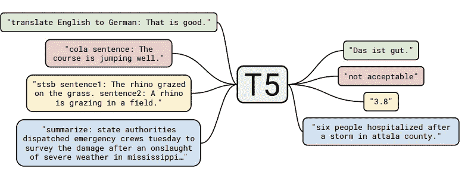

T5 框架的示意图。资料来源:T5 [纸](https://arxiv.org/pdf/1910.10683.pdf)。

许多任务都被投射到这个框架中:机器翻译、分类任务、回归任务(例如，预测两个句子有多相似，相似性得分在 1 到 5 的范围内)，其他序列到序列任务，如文档摘要(例如，从 CNN 每日邮报语料库中总结文章)。

## T5 模型结构

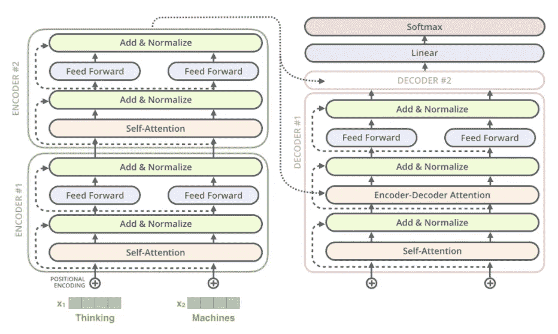

模型结构。来自:[杰伊·阿拉玛的博客](http://jalammar.github.io/illustrated-transformer/)

模式结构只是一种标准的普通编码器-解码器转换器。

## 预训练数据集

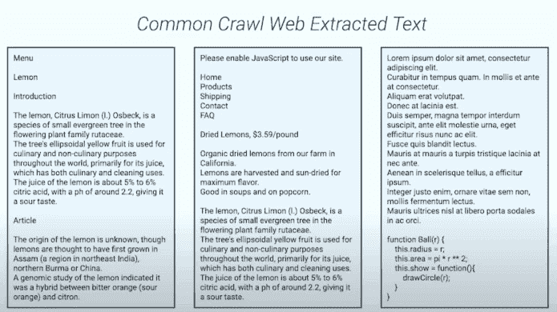

T5 清理数据集。来源:来源:[科林·拉弗尔视频](https://www.youtube.com/watch?v=eKqWC577WlI&list=UUEqgmyWChwvt6MFGGlmUQCQ&index=4)

T5 使用[普通抓取网页摘录文本](https://commoncrawl.org/)。作者应用了一些非常简单的启发式过滤。T5 删除所有不以标点符号结尾的行。它还删除了带有单词 javascript 的行和任何带有花括号的页面(因为它经常出现在代码中)。 ***它通过取 3 个句子组块的滑动窗口对数据集进行重复数据删除，这样只有其中一个出现在数据集*** 中。例如，在 3 页以上，中间页的最后一段被删除，因为相同的内容出现在第一页。最终得到 750 千兆字节的干净的英文文本。数据集在 [tensorlow.text.c4](https://www.tensorflow.org/datasets/catalog/c4) 上公开。

## 无人监管的目标

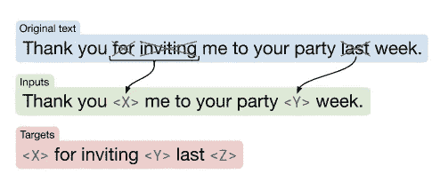

无人监管的目标。来源 T5 [论文](https://arxiv.org/pdf/1910.10683.pdf)。

有了框架、模型架构和未标记的数据集，下一步是寻找无监督的目标，该目标为模型提供了一些从未标记的数据中学习的方法。在原文中，一些单词用一个唯一的 sentinel 标记去掉了。单词被独立地均匀地随机丢弃。该模型被训练来预测基本上标记记号，以描绘被丢弃的文本。

## 工作流程

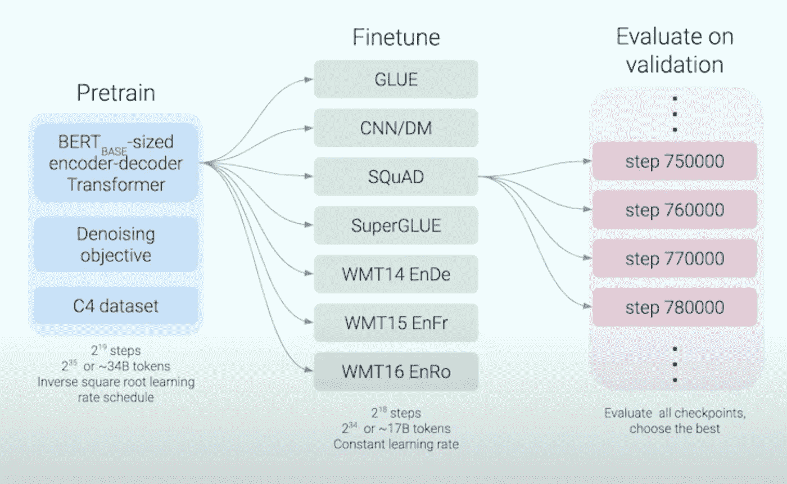

预训练、微调和评估步骤。来源:[科林·拉弗尔视频](https://www.youtube.com/watch?v=eKqWC577WlI&list=UUEqgmyWChwvt6MFGGlmUQCQ&index=4)

因此，该模型以去噪目标和 C4 数据集为基础，基于 Bert 基大小的编码器-解码器变换器进行预处理，在 2 个⁵或约 348 个令牌上训练 2 个⁹步骤，学习速率为平方根倒数。微调任务包括[胶水、](https://gluebenchmark.com/) [CNN/DM](https://arxiv.org/abs/1506.03340) (CNN /每日邮报)、[小队](https://rajpurkar.github.io/SQuAD-explorer/)、[强力胶](https://super.gluebenchmark.com/)、[翻译任务](https://nlp.stanford.edu/projects/nmt/) : WMT14 EnDe、WMT14 EnFr、WMT14 EnRo。

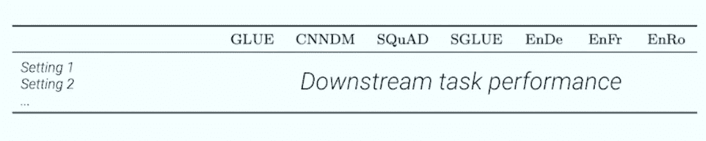

表格结构。

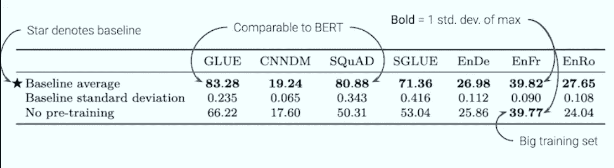

基线模型性能。来源:T5 [论文](https://arxiv.org/pdf/1910.10683.pdf)。

接下来，在不同的环境中尝试不同的策略来测试它们如何影响表现。

# 策略比较

## 结构

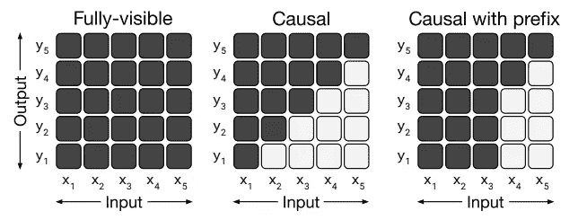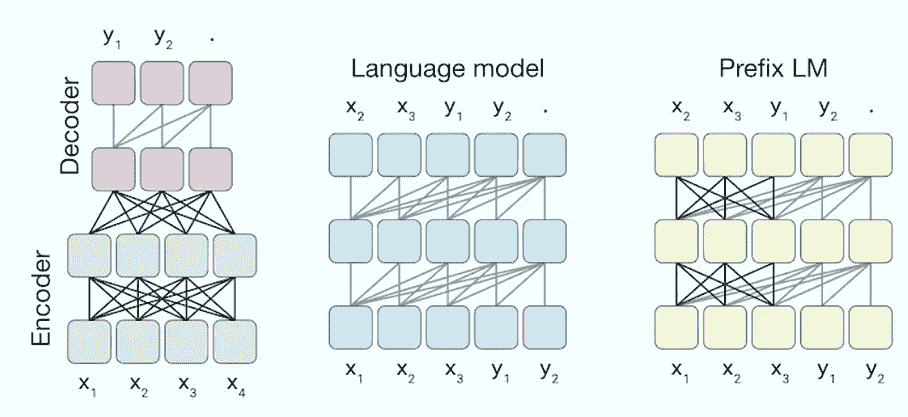

不同的注意掩蔽模式(左)及其对应的模型(右)。来源:T5 [论文](https://arxiv.org/pdf/1910.10683.pdf)。

完全可见的掩码，其中每个输出条目都可以看到每个输入条目。在中间，由于模型不允许预测未来，所以有一个适合预测序列的临时掩码。带前缀的因果掩码允许模型将输入序列的第一位视为完全可视，然后开始预测输入序列中随后出现的内容。结果表明**给定模型输入上的双向上下文是有价值的。**

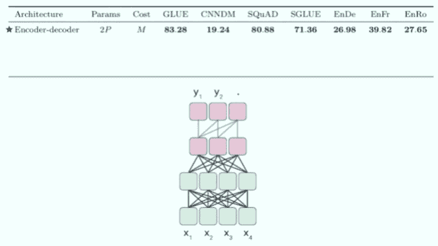

模拟不同任务的表现。来源:[科林·拉弗尔视频](https://www.youtube.com/watch?v=eKqWC577WlI&list=UUEqgmyWChwvt6MFGGlmUQCQ&index=4)

## 目标

涉及三个目标:**语言建模(预测下一个单词)、BERT 式目标(用随机不同的单词屏蔽/替换单词并预测原文)，以及去混洗(随机混洗输入并尝试预测原文)。**

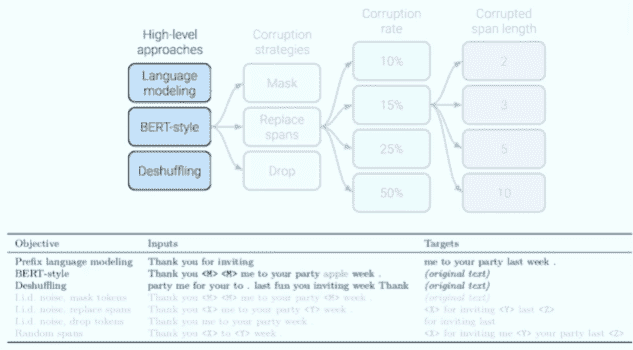

不同的目标及其表现。来源:[科林·拉弗尔视频](https://www.youtube.com/watch?v=eKqWC577WlI&list=UUEqgmyWChwvt6MFGGlmUQCQ&index=4)

**腐败策略有 3 个选项:** **只屏蔽令牌，不交换令牌；屏蔽令牌并用单个标记令牌替换它们；和移除令牌。**性能显示**“替换损坏的跨度”策略效果最佳**。此外，应用了不同的损坏率，结果显示**除非采用较大的损坏率(s.t. 50%)，否则此设置对性能不敏感**，因为损坏率为 10%、15%和 25%的模型性能相似。

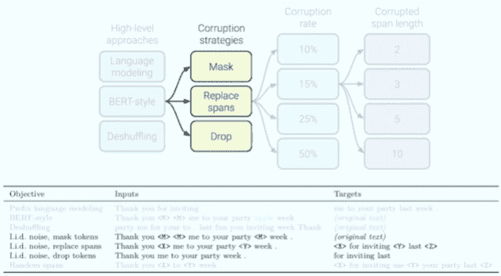

不同的腐败策略及其绩效。来源:[科林·拉弗尔视频](https://www.youtube.com/watch?v=eKqWC577WlI&list=UUEqgmyWChwvt6MFGGlmUQCQ&index=4)

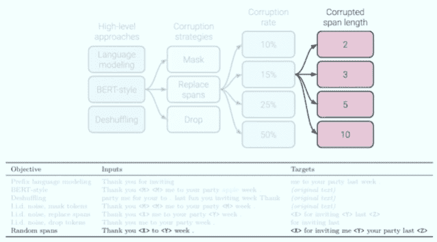

不同的跨距长度及其性能。来源:[科林·拉弗尔视频](https://www.youtube.com/watch?v=eKqWC577WlI&list=UUEqgmyWChwvt6MFGGlmUQCQ&index=4)

给定一个好的损坏率，如果整个区间被丢弃，而不是对每个令牌进行 iid 判决(IID 判决:一致随机地决定我们是否应该损坏该字)，会发生什么？基本上，在输入中的每个位置，应该丢弃一个范围的标记吗？这个范围应该有多长？与损坏率设置类似，**该设置不会对性能产生太大影响，除非丢弃大量令牌**(如 10 个令牌)。

这一客观实验的亮点是 **word 腐败目标往往效果最佳。**模型往往在不同的损坏率下非常相似地工作，鉴于这一事实**，建议使用产生短目标序列的目标，因为较短的序列做预训练更便宜。**

# 数据集

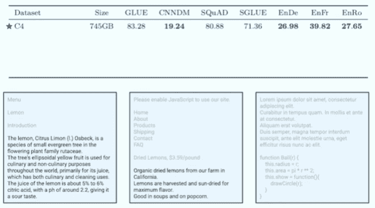

不同数据集的附属和他们的表现。来源:[科林·拉弗尔视频](https://www.youtube.com/watch?v=eKqWC577WlI&list=UUEqgmyWChwvt6MFGGlmUQCQ&index=4)

除了干净的 C4 数据集，没有任何过滤的相同数据也进行了尝试。结果表明，**滤波确实有助于模型更好地运行。**其他具有较小数量级的数据集(这意味着在一些约束域上更多)也适用。结果表明**对领域数据的预训练有助于下游任务的执行。**例如，在 RealNews-like 数据集上预训练的模型在记录上表现得更好(新闻文章上的问答数据集)——在新闻上预训练的模型往往在新闻问答任务上表现得更好。在维基百科和 TBC 数据集(Tronoto 图书语料库)上训练的模型在 multiRC 数据集(包括一些小说数据的问答数据集)上效果更好。

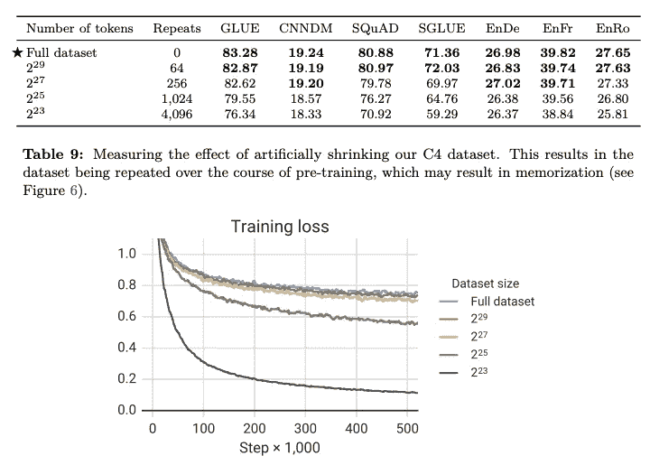

不同的训练步骤及其表现。来源: [T5 论文](https://arxiv.org/pdf/1910.10683.pdf)

如果**训练数据集是有限的，并且在训练**期间被重复，该怎么办？设置这些训练步骤怎么样？如果你不打算这么长时间，你可能不需要担心这个。**但是，如果您开始多次重复您的数据集，模型会开始记忆您的相关数据集**(因为较大的训练步长会导致较小的训练损失)**，这会导致下游任务的性能显著下降**

## 多任务

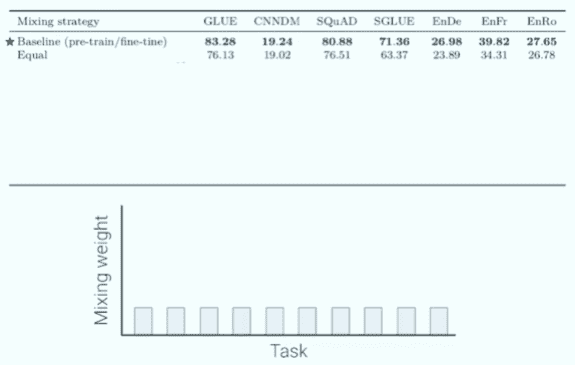

不同的混合策略及其性能。来源:[科林·拉弗尔视频](https://www.youtube.com/watch?v=eKqWC577WlI&list=UUEqgmyWChwvt6MFGGlmUQCQ&index=4)

该模型不是进行无监督的预训练和微调，而是在多任务上进行训练。有几种混合策略**。任务可以平均训练**。下一个选项是**根据数据集**中的示例数量对每个数据集进行加权，因为我们不想让小数据集过拟合而让大数据集过拟合。因为无人监督的任务是如此之大，以至于**我们需要设定一个人为的限制**来限制我们在这项任务上的训练量。这就是多语言 BERT 所做的——从不同的语言中取样。我们也可以**采用这些数量的示例比例，并对其应用温度，使其更加接近均匀**。在多项任务上同等训练会导致更差的表现。正确设置阈值和温度与预调整和微调设置的性能有些相似。特别是在 GLUR、SQUAD 和 superGLUE 上，当试图一次训练一个模型完成所有这些任务时，性能会显著下降。

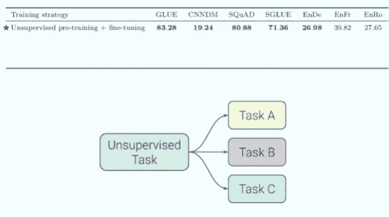

不同的训练策略及其表现。来源:来源:[科林·拉弗尔视频](https://www.youtube.com/watch?v=eKqWC577WlI&list=UUEqgmyWChwvt6MFGGlmUQCQ&index=4)

除了**多任务训练**，还有其他训练策略。最初的一个是**对无监督的任务进行预训练，并对每个单独的下游任务进行微调。MT-DNN **提供了另一种选择:多任务混合训练，然后对每个单独的任务进行微调。**该策略缩小了无监督附属和微调之间的差距。**留一项多任务训练是关于多任务混合，然后对一项在训练中不使用的任务进行微调。**结果表明，该策略仍能生成相当好的预训练模型。最后一个选项是**，仅与监督任务相关，并对同一组监督任务进行微调**，这与计算机视觉非常相似。然而，这种策略极大地损害了性能。**

# 缩放比例

如何放大模型？如果给你四倍的计算能力，你会如何使用它？你应该训练模型更长时间，或者使用更大的批量，或者训练更大的模型，或者训练四个模型并集成它们？**训练模型的时间越长，性能越好**，这也是 [Roberta](https://arxiv.org/abs/1907.11692) 所做的主要事情之一(与模型相关的时间越长)。通过使模型变得更深更宽来使它变得更大，并将它的长度训练为原来的两倍，这也会产生相当大的收益。 **训练四个模型，组装起来也很有帮助。**

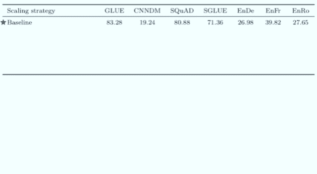

不同的扩展策略及其性能。来源:[科林·拉弗尔视频](https://www.youtube.com/watch?v=eKqWC577WlI&list=UUEqgmyWChwvt6MFGGlmUQCQ&index=4)

# 把所有的放在一起

在将所有这些想法结合在一起并按比例放大后，作者训练了 5 种变体:小模型、基本模型、大模型和具有 30 亿和 110 亿参数的模型(通过使前馈层变宽)。除了翻译，他们都取得了不错的成绩。*对于翻译来说，作为这些最先进成果的一个非常重要的组成部分，反向翻译似乎比仅提供英语的预培训效果更好*。值得注意的是，强力胶被设计成对伯特来说很难，但对人类来说很容易。T5 的表现非常接近人类水平。

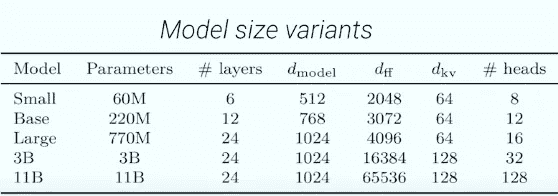

T5 型号尺寸变化。来源: [T5 纸。](https://arxiv.org/pdf/1910.10683.pdf)

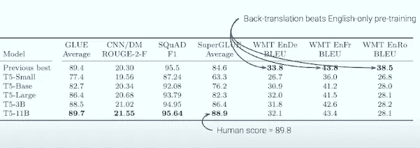

T5 车型性能。来源:[科林·拉弗尔视频](https://www.youtube.com/watch?v=eKqWC577WlI&list=UUEqgmyWChwvt6MFGGlmUQCQ&index=4)