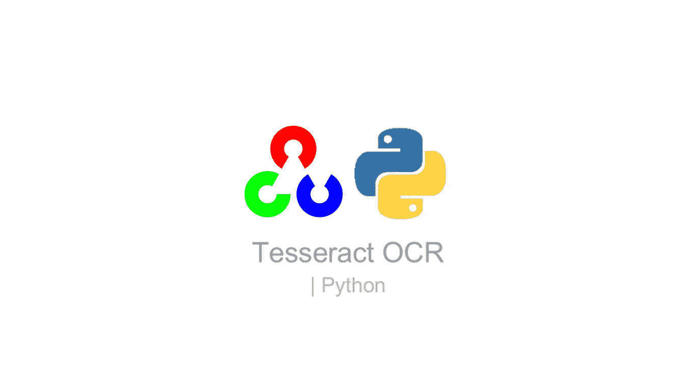
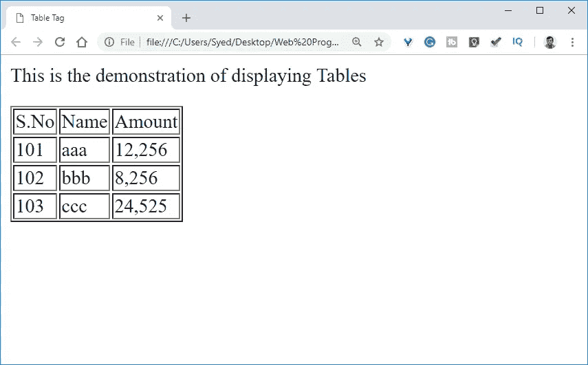
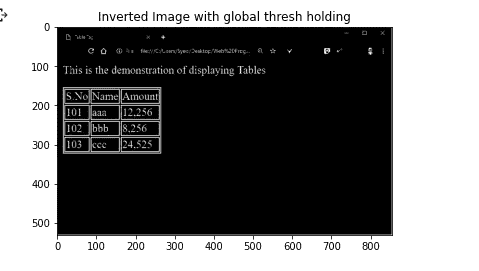
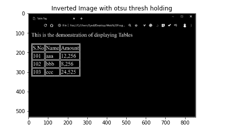
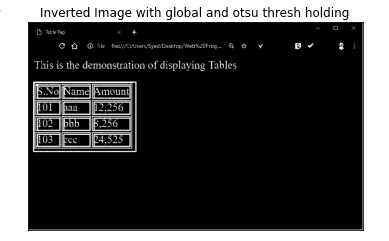
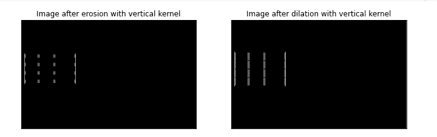
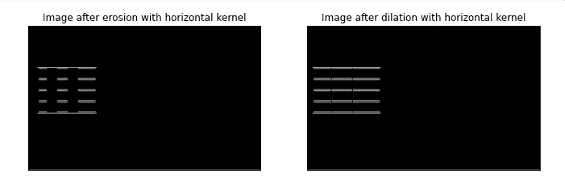
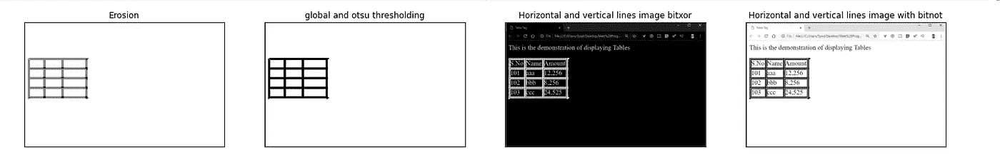
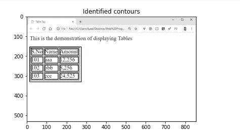
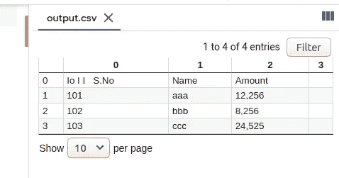

# 表格检测和文本提取— OpenCV 和 Pytesseract

> 原文：<https://medium.com/analytics-vidhya/table-detection-and-text-extraction-5a2934f61caa?source=collection_archive---------0----------------------->



图片来自[https://nanonets.com/blog/ocr-with-tesseract/](https://nanonets.com/blog/ocr-with-tesseract/)

给定一个包含随机文本和表格的图像，目标是只从表格中提取数据。这是我在一组图片上尝试了文档和文章中的几种不同方法后得出的结果。

[pytesserac](https://pypi.org/project/pytesseract/)和[tesserac-ocr](https://pypi.org/project/tesseract-ocr/)用于图像到文本的转换。

首先，我们需要识别图像中包含表格的部分。为此，我们将使用 [openCV](https://pypi.org/project/opencv-python/) 。

从下载一个包含表格的图像开始。这张图片是从[这里](http://softlect.in/index.php/html-table-tags/)下载的。



[http://softlect.in/index.php/html-table-tags/](http://softlect.in/index.php/html-table-tags/)

上传图片到谷歌实验室。

[](https://colab.research.google.com/) [## 谷歌联合实验室

### 编辑描述

colab.research.google.com](https://colab.research.google.com/) 

首先，必须将图像转换为二进制，即如果像素值大于某个值，则为其分配一个值，如果小于某个值，则分配另一个值。这里，可以为不同类型的阈值处理指定不同的参数。

**cv2.threshold()** :第一个参数是源图像，其中**应该是灰度图像**。第二个参数是用于对像素值进行分类的阈值。第三个参数是 maxVal，它表示当像素值大于阈值时给出的值。OpenCV 提供不同风格的阈值处理，它由函数的第四个参数决定。

**全局阈值处理:**在全局阈值处理中，任意值被用作阈值。全局，因为相同的值被应用为所有像素的阈值。

```
thresh,img_bin = cv2.threshold(img,128,255,cv2.THRESH_BINARY)img_bin = 255-img_binplotting = plt.imshow(img_bin,cmap='gray')plt.title("Inverted Image with global thresh holding")plt.show()
```



图片由作者提供，使用合作实验室生成

**Otsu 阈值化:**如果需要自动选择阈值的过程，可以尝试 Otsu。Otsu 将很好地用于双峰图像，即所有像素值的直方图将具有两个峰值。对于该图像，otsu 选择大约在两个峰值中间的值作为阈值。所以，Otsu 对双峰图像很有效。

```
img_bin1 = 255-imgthresh1,img_bin1_otsu = cv2.threshold(img_bin1,128,255,cv2.THRESH_OTSU)plotting = plt.imshow(img_bin1_otsu,cmap='gray')plt.title("Inverted Image with otsu thresh holding")plt.show()
```



使用协同实验室生成的图像

如果都 cv2。THRESH_BINARY 和 cv2。THRESH_OTSU 在第四个参数中传递，该函数执行全局和 OTSU 阈值处理。

```
img_bin2 = 255-imgthresh1,img_bin_otsu = cv2.threshold(img_bin2,128,255,cv2.THRESH_BINARY | cv2.THRESH_OTSU)plotting = plt.imshow(img_bin_otsu,cmap='gray')plt.title("Inverted Image with otsu thresh holding")plt.show()
```

以下是之后的图像:



使用协同实验室生成的图像

基于图像的形状对图像执行形态学操作。它接受图像和一个结构化元素或内核。

**cv2 . getstructuringelement()**:这里内核的形状和大小可以作为参数传递，并相应地生成一个矩阵。

这是使用的格式，因为这可能很难记住:

```
**cv2.getStructuringElement(shape,(num_of_columns,num_of_rows))**
```

*   第一个参数指定了您想要的内核形状，可以是矩形、圆形甚至椭圆形。
*   第二个参数是 tuple，表示所需内核的形状、宽度和高度。

```
kernel = cv2.getStructuringElement(cv2.MORPH_RECT, (2, 2))
```

np.array(image)。形状用于获取图像尺寸。首先，矩形垂直核定义为 1 行和 1 列，即图像的 numpy 数组的长度除以 150。它看起来会像这样:

[1

1

1

1 ]

这里，我们将使用垂直内核对二值图像执行腐蚀。它将删除所有水平线。

# 提取垂直线

垂直核由矩形矩阵组成，该矩阵由等于原始图像像素阵列中的列数除以 150 的一行和多列组成。

## 侵蚀

对这个图像进行腐蚀会发生什么？

在图像上移动的垂直核，只有当垂直核下的所有像素都为 1 时，才会考虑像素。这样，水平线被侵蚀了，因为只有每列中的像素保留下来。

```
import numpyvertical_kernel = cv2.getStructuringElement(cv2.MORPH_RECT, (1, np.array(img).shape[1]//150))eroded_image = cv2.erode(binary_image, vertical_kernel, iterations=5)
```

## 扩张

现在，让我们在图像上执行膨胀。如果内核下的像素中至少有一个是 1，膨胀将使像素为 1。这使得竖线更加突出。

```
vertical_lines = cv2.dilate(eroded_image, vertical_kernel, iterations=5)
```

腐蚀和膨胀用于去除噪声。

执行腐蚀和膨胀后，图像如下所示:



使用协同实验室生成的图像

# 提取水平线

## 侵蚀

在图像上移动的水平核，只有当水平核下的所有像素都为 1 时，才会考虑像素。这样，水平线被侵蚀了，因为只有每列中的像素保留下来。

水平内核看起来像这样:

[1 1 1 1 1 1 1 ]

## 扩张

这使得水平线更加突出。

```
image_2 = cv2.erode(img_bin, hor_kernel, iterations=5)hor_kernel = cv2.getStructuringElement(cv2.MORPH_RECT, (np.array(img).shape[1]//150, 1))horizontal_lines = cv2.dilate(image_2, hor_kernel, iterations=5)
```



使用协同实验室生成的图像

水平线和垂直线以相等的权重相加，以创建混合图像。

加权图像=第一个图像的权重*第一个图像+第二个图像的权重+ gamma(其为任意常数)。

```
vertical_horizontal_lines = cv2.addWeighted(vertical_lines, 0.5, horizontal_lines, 0.5, 0.0)vertical_horizontal_lines = cv2.erode(~vertical_horizontal_lines, kernel, iterations=3)
```

对包含垂直线和水平线的图像应用阈值处理。

```
thresh, vertical_horizontal_lines = cv2.threshold(vertical_horizontal_lines,128,255, cv2.THRESH_BINARY | cv2.THRESH_OTSU)b_image = cv2.bitwise_not(cv2.bitwise_xor(img,vertical_horizontal_lines))plotting = plt.imshow(b_image,cmap='gray')plt.show()
```



使用协同实验室生成的图像

安装 pytesseract 并将其导入 colab:

```
!pip install pytesseract!sudo apt install tesseract-ocrimport pytesseract
```

# 轮廓

图像上的轮廓连接具有相同强度的像素。这对二进制图像更有效。

对具有水平线和垂直线的图像执行阈值处理。

接下来，用 **cv2.findContours()** 识别轮廓。

```
contours, hierarchy = cv2.findContours(vertical_horizontal_lines, cv2.RETR_TREE, cv2.CHAIN_APPROX_SIMPLE)
```



使用协同实验室生成的图像

# 边界框

为各个轮廓创建边界框。

```
boundingBoxes = [cv2.boundingRect(c) for c in cnts](contours, boundingBoxes) = zip(*sorted(zip(cnts, boundingBoxes),key=lambda x:x[1][1]))
```

获得表格中每个单元的所有边界框的高度列表和高度平均值。

图像上的轮廓被绘制并存储在列表**框**中。它被存储为一个列表(x，y，w，h) : x 和 y 是左上角的边界坐标，w 和 h 分别是盒子的宽度和高度。

```
boxes = []for contour in contours: x, y, w, h = cv2.boundingRect(contour) if (w<1000 and h<500): image = cv2.rectangle(img,(x,y),(x+w,y+h),(0,255,0),2) boxes.append([x,y,w,h])plotting = plt.imshow(image,cmap='gray')plt.title("Identified contours")plt.show()
```

## 要存储行和列:

*   现在行列列表被初始化为空。
*   计算所有盒子的平均高度。
*   最初，第一个框被追加到列列表中。
*   列列表本质上是一个临时列表。
*   前一个框也被分配给第一个框。
*   遍历剩余的边界框列表。
*   在每次迭代中，检查当前框左上角的 y 坐标是否小于前一个框的 y 坐标加上所有高度平均值的一半。

**如果是:**

*   当前框被追加到列列表中。
*   当前框被分配给上一个框。
*   接下来检查我们是否在最后一个索引处。如果是:
*   整列被追加到行列表中。

**如果没有:**

*   列列表被追加到行中。
*   列列表被指定为空，因为这将启动一个新的空列列表。
*   当前框被赋给前一个框变量。
*   当前框被追加到我们刚刚创建的空列列表中。

```
rows=[]columns=[]heights = [boundingBoxes[i][3] for i in range(len(boundingBoxes))]mean = np.mean(heights)print(mean)columns.append(boxes[0])previous=boxes[0]for i in range(1,len(boxes)): if(boxes[i][1]<=previous[1]+mean/2): columns.append(boxes[i]) previous=boxes[i] if(i==len(boxes)-1): rows.append(columns) else: rows.append(columns) columns=[] previous = boxes[i] columns.append(boxes[i])print("Rows")for row in rows: print(row)
```

## 让我们获取每行中的总单元格数:

```
total_cells=0for i in range(len(row)): if len(row[i]) > total_cells: total_cells = len(row[i])print(total_cells)
```

*   单元格到左下角 x 坐标的宽度被加到单元格中心的 x 坐标上。

```
center = [int(rows[i][j][0]+rows[i][j][2]/2) for j in range(len(rows[i])) if rows[0]]print(center)center=np.array(center)center.sort()print(center)
```

现在我们创建一个盒子的坐标列表:

```
boxes_list = []for i in range(len(rows)): l=[] for k in range(total_cells): l.append([]) for j in range(len(rows[i])): diff = abs(center-(rows[i][j][0]+rows[i][j][2]/4)) minimum = min(diff) indexing = list(diff).index(minimum) l[indexing].append(rows[i][j]) boxes_list.append(l)for box in boxes_list: print(box)
```

## 使用 Pytesseract 从图像的单元格中提取文本

*   从图像中提取感兴趣区域。
*   调整单元的大小，然后对提取的单元区域执行形态学操作以去除噪声。
*   最后，使用 pytesseract 将图像转换为字符串。
*   字符串被附加到每一行，首先是带有空格的临时字符串，然后我们将这个临时字符串附加到最终的数据帧。

```
dataframe_final=[]for i in range(len(boxes_list)): for j in range(len(boxes_list[i])): s='' if(len(boxes_list[i][j])==0): dataframe_final.append(' ') else: for k in range(len(boxes_list[i][j])): y,x,w,h = boxes_list[i][j][k][0],boxes_list[i][j][k][1], boxes_list[i][j][k][2],boxes_list[i][j][k][3] roi = bitnot[x:x+h, y:y+w] kernel = cv2.getStructuringElement(cv2.MORPH_RECT, (2, 1)) border = cv2.copyMakeBorder(roi,2,2,2,2, cv2.BORDER_CONSTANT,value=[255,255]) resizing = cv2.resize(border, None, fx=2, fy=2, interpolation=cv2.INTER_CUBIC) dilation = cv2.dilate(resizing, kernel,iterations=1) erosion = cv2.erode(dilation, kernel,iterations=2) out = pytesseract.image_to_string(erosion) if(len(out)==0): out = pytesseract.image_to_string(erosion) s = s +" "+ out dataframe_final.append(s)print(dataframe_final)
```

## 从生成的数据帧创建 numpy 数组

```
arr = np.array(dataframe_final)arr
```

# 从数组创建数据帧

*   该数组被重新整形为具有行数和列数的数据帧。
*   打印出各列并检查！

```
import pandas as pddataframe = pd.DataFrame(arr.reshape(len(rows), total_cells))data = dataframe.style.set_properties(align="left")#print(data)#print(dataframe)d=[]for i in range(0,len(rows)): for j in range(0,total_cells): print(dataframe[i][j],end=" ")print()
```

## 最后一项任务是将这些数据保存为 csv 格式，以备将来使用。

*   google colab 中会生成一个 output.csv 文件，可以下载。

```
dataframe.to_csv("output.csv")
```

这就是 csv 的样子！



使用 colaboratory，output.csv 生成的图像

这里有一个链接，链接到一个包含所有代码的 colab 笔记本。如果你觉得这个有用，请在我的 github 上留个星吧！

[](https://github.com/Soumi7/Table_Data_Extraction/blob/main/medium_table.ipynb) [## Soumi7/Table_Data_Extraction

### GitHub 是超过 5000 万开发人员的家园，他们一起工作来托管和审查代码，管理项目，以及…

github.com](https://github.com/Soumi7/Table_Data_Extraction/blob/main/medium_table.ipynb) 

这是我的 github！

[](https://github.com/Soumi7) [## Soumi7 -概述

### 在 GitHub 上注册您自己的个人资料，这是托管代码、管理项目和构建软件的最佳地方…

github.com](https://github.com/Soumi7) 

下面是下一部分的视频，使用 Flask 创建 web 应用程序:

[发票数据提取|表格数据提取|图像到表格 API | Flask — YouTube](https://www.youtube.com/watch?v=flZiBg4wd5k&t=10s)

## 参考

[](https://docs.opencv.org/master/) [## OpenCV: OpenCV 模块

docs.opencv.org](https://docs.opencv.org/master/) [](https://pypi.org/project/pytesseract/) [## 宇宙魔方

pypi.org](https://pypi.org/project/pytesseract/) [](https://towardsdatascience.com/a-table-detection-cell-recognition-and-text-extraction-algorithm-to-convert-tables-to-excel-files-902edcf289ec) [## 一个表格检测、单元格识别和文本提取算法，将表格转换为 excel 文件。

### 如何使用 OpenCV 和 pytesseract 将表格截图转换成可编辑的数据

towardsdatascience.com](https://towardsdatascience.com/a-table-detection-cell-recognition-and-text-extraction-algorithm-to-convert-tables-to-excel-files-902edcf289ec)