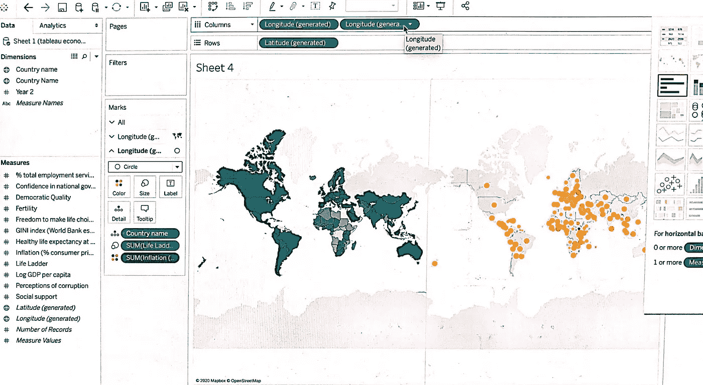

# Tableau:解密数据怪物的逐步过程

> 原文：<https://medium.com/analytics-vidhya/tableau-a-step-by-step-process-in-decrypting-the-data-monster-e23d6f1d466b?source=collection_archive---------20----------------------->

## 从数据清理到可视化

去年八月中旬，我第一次尝试 Tableau。当我可以在几周后从 Excel 中处理数据和制作图表时，我开始感到困惑和断断续续的抱怨，不得不从头开始学习全新的东西，当我意识到数据混合和表示过程是多么直观时，这变成了一种顿悟。我不仅可以在几下点击中清除数千个单元格中的未清除数据，而且我的图表变得生动起来，可以在同一页面上向观众讲述同样的故事。经过 6 个月的初步努力，我完全相信了它的好处，并成功地将我几乎所有的数据操作转移到 Tableau。

让大多数人困惑的是，当他们第一次在 Tableau 上打开电子表格时，这些函数看起来是多么稀疏。与 Excel 不同，它缺乏从排序和过滤、表格格式化和合并等一系列明确显示在工具栏上的操作，Tableau 在你第一次使用时似乎几乎什么都没有。然而，有一种方法可以打破这种沉默的困惑。

点击**连接>微软 Excel** ，然后将你想要的电子表格拖到主页上(如果你有多个电子表格)。

为了去掉空白单元格，点击位于页面右上角的**添加** **过滤**功能。选择您选择的计算字段，然后选择您要浏览的值范围。如果希望消除空单元格，请排除空值。

对其他字段重复这一过程，然后单击数据解释器选项来帮助您再次清理电子表格。

**将多个电子表格组合在一起**

但是，如果您希望将多个电子表格合并在一起，则需要创建一个通用的一对一函数，以将一个数据集的范围与另一个数据集的范围相匹配。比方说，您打算在一个预先存在的世界幸福数据表中插入一个关于 GDP 百分比变化的列。首先，将 GDP 电子表格转换成数据透视表(字符串形式)。这可以通过点击列，然后右键点击**枢轴**来完成。

确保所有变量在字段类型中相互对应(例如，如果世界幸福报告中的年份被注册为数字(整数)，请确保 GDP %增长数据中的年份也被表示为数字(整数)。函数的任何不匹配都会阻碍两个数据的合并。

接下来，将另一个数据集上传到 Tableau。创建主子句**“国家名称”**，然后添加联合子句**“年份”**。GDP %变化数据集已成功纳入世界幸福数据集。

**数据可视化:在同一页面上创建多个情节故事**

既然你已经处理完了数据，下一步做什么呢？你创造视觉效果。Tableau 最独特的卖点之一是，它允许您通过仪表板探索不同的变量，并整合不同类型的图表，以便将一个大的想法联系在一起。假设你有兴趣找出 log 人均 GDP 和通货膨胀率与一个国家整体幸福感的关系。你将需要创建 3 个可视化，前两个是人均 GDP 对数和通货膨胀率与幸福之间的一般趋势，以找出这种相关性是否首先存在，第三个是一个连接所有 3 个变量的地理地图，以便你能够更好地看到:

1.  GDP 和通货膨胀的综合效应及其对幸福的影响
2.  如果国家和这三个变量之间存在地理模式。

假设您已经将两个变量(% GDP 变化和幸福)之间的数字数据配对，并且您正在尝试确定两者之间的关系，以查看人均 GDP 对数以及国民收入分配的幅度是否是幸福的主要原因，最好使用散点图来说明相关性。

将(对数人均 GDP)分类到**列**并将(生活阶梯)分类到**行**后，点击**分析>趋势线**以获得最佳拟合线及其相关系数。

你可以继续用散点图来表示通货膨胀率和幸福度的关系，或者换个方式，用气泡图。

要将所有 3 个变量组合到一张地图上，我们需要创建两种不同类型的地图，填充地理地图和符号地图。让我们从绘制人均 GDP 对数到生活阶梯开始，点击**地图**下**标记**和**颜色**获得**人均 GDP 对数**(颜色越深，人均 GDP 对数越高)。

接下来，将**经度(生成的)选项**从**度量**侧栏拖到**列**上，以创建该图的副本。

然后，将低经度栏中的人均 GDP 对数函数转换为通货膨胀率(%消费者价格)。

接下来，对通货膨胀地理数据使用不同类型的地理表示法(在本例中为圆形)。将圆圈的颜色改为与蓝色形成对比的颜色，以便更好地观察。

最后，右键点击**双轴**将第二张地图插入第一张地图。

最后，创建一个仪表板，将所有 3 个想法连接在一起！

尽管已经经历了几次可视化，但值得注意的是，这些图形表示只是 Tableau 所能做的一小部分。您还可以使用堆积条形图、面积图、树形图和瀑布图来帮助您描述数据。我很想和你一起详细地完成创建这些地图的过程，但是我们现在看到的数据集并不适合。这让我想到了我的最后一点，数据可视化是艺术和科学之间的微妙平衡——它需要*的判断力和直觉来选择合适的视觉表示类型，并将其转换为既可读又美观的东西，以取悦读者。*

我希望你从阅读这篇文章中学到一些东西，并祝你在 Tableau 的旅程中一切顺利。