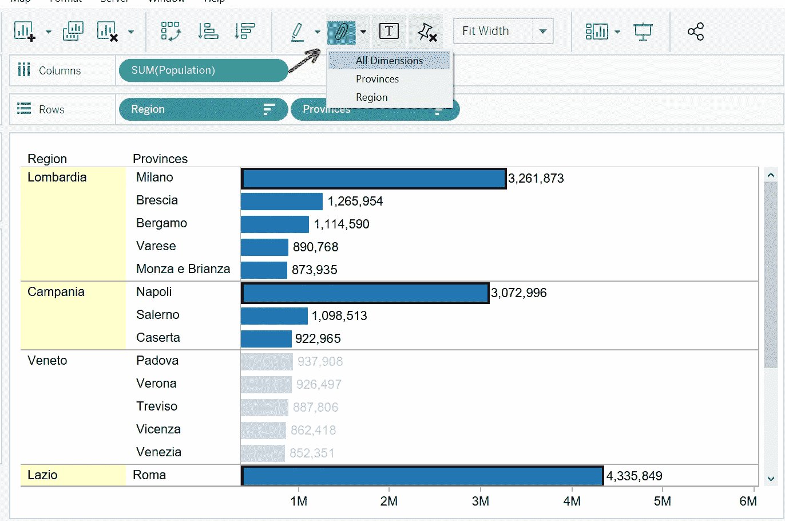
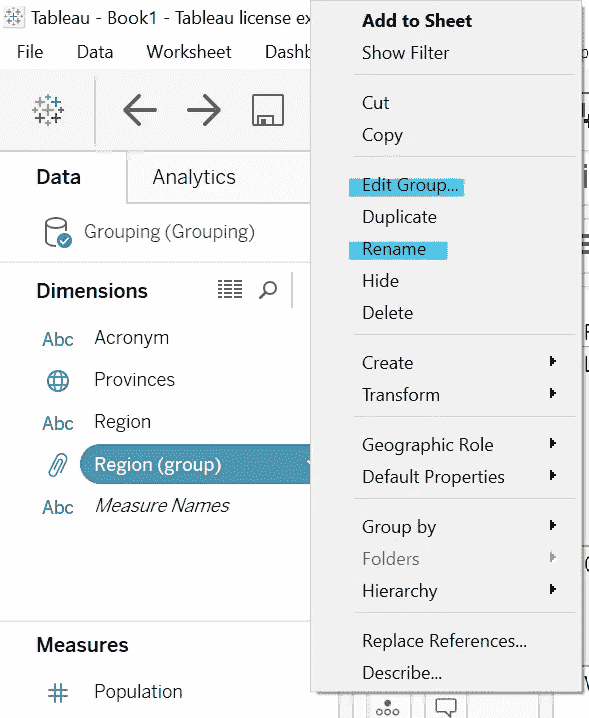

# Tableau:分组数据

> 原文：<https://medium.com/analytics-vidhya/tableau-grouping-data-e444f65ff11c?source=collection_archive---------13----------------------->

## 如何使用不同的方法有效地对数据进行分组

照片由[梅尔·普尔](https://unsplash.com/@melipoole?utm_source=medium&utm_medium=referral)在 [Unsplash](https://unsplash.com?utm_source=medium&utm_medium=referral) 拍摄

在处理大型数据库时，我们经常需要对数据进行分组，以增强我们的可视化和信息。

对 Tableau 中的数据进行分组有几种方法，我们将使用一个由意大利地区、省份及其各自人口组成的数据库来探索这些方法。

# (1)使用数据窗格进行分组

假设我们希望根据总体对数据进行分组:

*   Pop > 5M
*   5M > Pop > 1M
*   Pop < 1M.

After sorting the data by population volume, we can see that Lombardia, Lazio, and Campania all have a population higher than 5 million; therefore, they are part of the first group — Pop > 5M。

我们来分组吧！

右键单击数据窗格中的尺寸，并选择**创建>组** …

将会打开一个新窗口，我们可以在其中选择需要分组的元素； **CTRL +点击**他们(在我们的例子中是伦巴第、拉齐奥和坎帕尼亚)，然后点击**组**。

在这里，我们可以重命名该组:

一旦我们对该组满意，点击**确定**。

# (2)使用视图进行分组

在图表视图中，使用 **CTRL +单击**突出显示我们想要分组的元素，然后单击工具栏中的**分组图标**:

我们可以在突出显示的元素上右键单击而不是选择组图标:

# (3)分组采用视觉分组

在我们有其他维度的情况下——例如`Provinces`，它是`Region` 的一个子类——我们可以在不丢失标签的情况下对元素进行分组。

让我们假设我们想要在`Region`内创建一组具有更高人口数量的`Provinces`。

从图表中， **CTRL +单击**那些元素(在我们的示例中，米兰、那不勒斯和罗马是人口较多的元素)，然后单击**组图标** > **所有维度**。

新组显示在**尺寸**中，并放置在**颜色(标记)**中，而其他元素分组在*其他*中。

右键点击突出显示的元素并选择**组>所有尺寸**可以获得相同的结果。

创建新组后，它将出现在**数据窗格**中。在这里，我们可以通过右键单击来重命名或修改该组。

**分组**在创建仪表板时，数据通常与**层次结构**结合使用。如果你想了解更多关于层级的信息，点击这里。

感谢您的阅读！