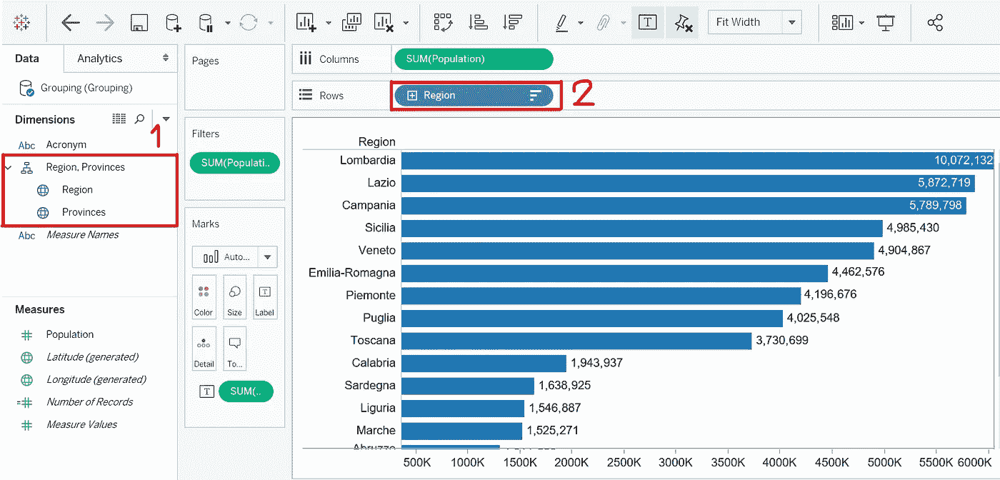

# 表格:层次结构

> 原文：<https://medium.com/analytics-vidhya/tableau-hierarchies-ee9cf482b328?source=collection_archive---------23----------------------->

## 通过创建层次结构来组织数据和简化可视化

由[Edvard Alexander lvaag](https://unsplash.com/@edvardr?utm_source=medium&utm_medium=referral)在 [Unsplash](https://unsplash.com?utm_source=medium&utm_medium=referral) 上拍摄的照片

Tableau 中通常使用层次结构来组织数据和简化数据可视化过程。

一个典型的例子是当我们处理地理数据时，我们需要创建一个层次结构来定义国家、地区和省份之间的关系。

我们正在使用的数据库由意大利的地区、省份及其各自的人口组成。

创建层次结构的一种方法是**将一个元素拖放到另一个元素中。在我们的例子中，`Provinces`是`Region`的子类。因此，我们点击`Provinces`和**并拖拽**到`Region`。**

选择层次结构的名称后，我们刚刚创建了…

…我们可以在**数据窗格(1)** 和**行字段(2)** 中看到它。

通过点击**行字段**中的(+)或(-)，我们可以在不同层级之间移动。

在我们使用更高级别的 **(+)** 的情况下:

如果我们需要更多的粒度 **(-)** :

我们可以用来创建层次结构的另一种方法是使用 **CTRL +单击**突出显示我们想要包含在层次结构中的维度，并选择**层次结构>创建层次结构…**

在构建仪表板时，我一直在使用**层次结构**和**组**批次！如果您想了解更多关于分组的信息，请点击此处。

我希望你喜欢它！！