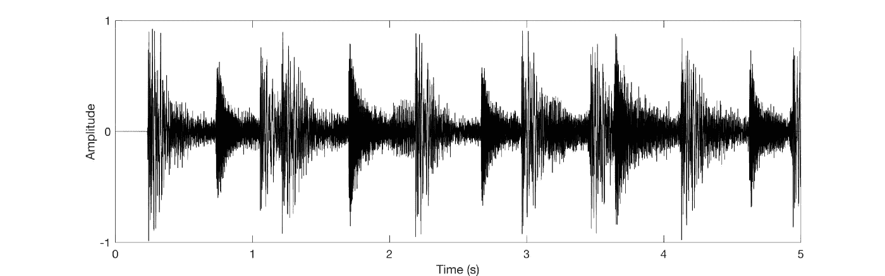
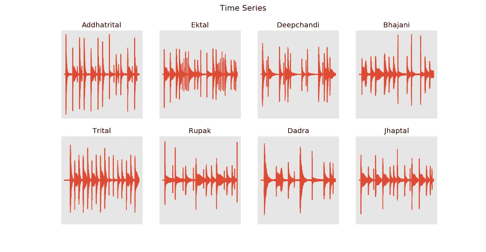
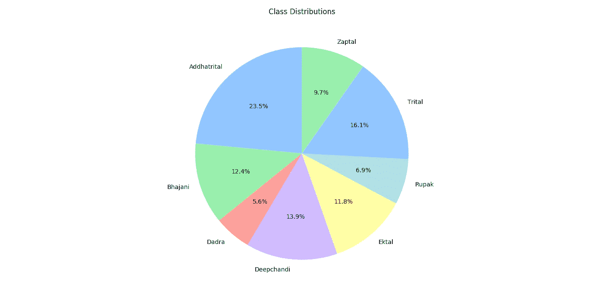
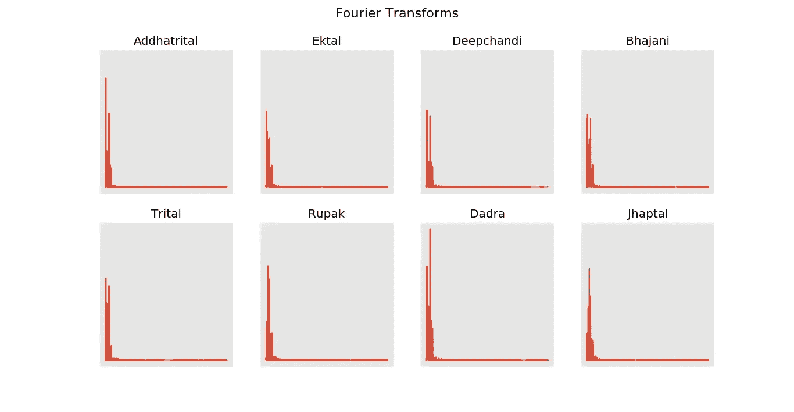
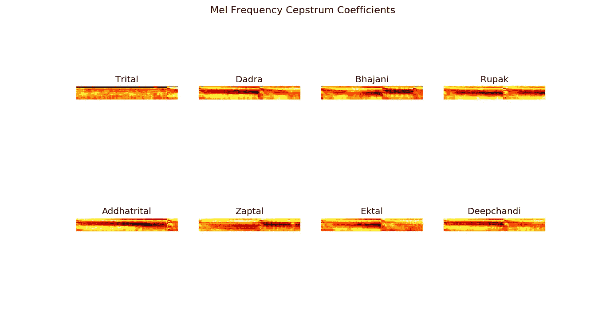

# 用这个解决几乎任何音频分类的挑战！

> 原文：<https://medium.com/analytics-vidhya/tackle-almost-any-audio-classification-challenge-with-this-34a1d0ac82b9?source=collection_archive---------0----------------------->

## 音频分类问题的最终解决方案。



## 介绍

在大学期间，我偶然发现了深度学习和 T2 学习的迷人世界，并决定在这个领域开始我的主要项目。虽然深度学习技术通常有助于解决像图像分类、语言翻译这样的问题，但是不存在用于音频分类的健壮技术，因为它们存在于上述问题中。本文将以我的主要项目***为例，对任何音频分类挑战给出一个健壮的解决方案，该项目名为印度古典音乐*** 中的[***Tabla***](https://en.wikipedia.org/wiki/Tabla)*[***taala***](https://en.wikipedia.org/wiki/Tala_(music))***的自动检测和分类。****

***Nota 受益人:***

*Tabla →是一种印度打击乐器，一般用来为印度古典音乐伴奏。*

*Taala →是印度古典音乐中的一个术语，指的是一个音乐[节拍](https://en.wikipedia.org/wiki/Metre_(music))。*

## *一切都与数据有关！*

*使用的数据集是定制的。taala 是使用 [iOS 应用](https://apps.apple.com/in/app/itablapro-lite/id919001492)和舒尔 SM58S 话筒录制的。数据集可以在[这里](https://github.com/pranav6670/Detection-Classification-of-Tabla-taals/tree/master/wavfiles)找到。数据集包含 10 类 taala，每类 70-80 个样本。记录的音频具有 44.1 kHz 的采样率。制作了一个 CSV 文件，其中包含所有样本及其对应的类名。*

*使用以下工具实时录制音频:*

**

*每类随机样本的时域图。*

*数据预处理包括:*

1.  *下采样至 16 kHz →下采样是指降低信号的采样速率。由于数据的采样率为 44.1 kHz(音频信号的通用采样率)，因此[奈奎斯特频率](https://en.wikipedia.org/wiki/Nyquist_frequency)将约为 22 kHz。如同在语音或乐器音频中一样，变化发生在较低的频带中，即高达 8 kHz，音频被下采样到 16 kHz。进行这种下采样大大减少了数据/信息。但是由于在 8kHz 左右的频率之后没有相关数据，下采样没有导致数据丢失。*
2.  *音频清理→记录数据时，数据的某些部分(开头或结尾)没有声音。为了消除零幅度数据，实现了一种包络检测算法，该算法将寻找无声部分并消除它们。*

*数据降采样和清理:*

**

*数据集的类别分布*

*使用以下方法获得如上饼图:*

```
*fig, ax = plt.subplots()
ax.set_title('Class Distribution', y=1.08)
ax.pie(class_dist, labels=class_dist.index, autopct='%1.1f%%', shadow=False, startangle=90)
ax.axis('equal')
plt.show()*
```

*`class_dist`是一个变量，它是一个[熊猫](https://pandas.pydata.org/)序列，包含所有同类样本长度的平均值，由下式得到:*

```
*class_dist = df.groupby(['label'])['length'].mean()*
```

## *终极解决方案:*

*音频是快速变化的数据。我们从时域图中注意到音频样本的变化。为了获得数据的相关表示，我们对原始(记录的)音频数据应用傅立叶变换。*

**

*但正如我们所见，在频域中，数据无法以可区分的方式表示。现在，为了表示数据，以便分类算法能够稳健地检测类别，我们需要从音频数据中提取特征。在这种情况下，提取音频数据的梅尔频率倒谱系数(MFCC)。*

*使用`python_speech_features`库，我们从音频中提取了 [MFCC](http://practicalcryptography.com/miscellaneous/machine-learning/guide-mel-frequency-cepstral-coefficients-mfccs/) s。*

**

> *但主要的诀窍就在于这一步。从数据中提取特征时，会使用一个窗口。这里的窗口意味着只考虑 0.1 秒的音频并对其采取行动。*

```
*n_samples = 2 * int(df['length'].sum()/0.1)*
```

> *使用这样的窗口可以从单个样本创建大量样本。想法是使用样本长度的 1/10 秒，提取该部分的特征，并以同样的方式进行。该窗口继续滚动，直到样品结束，以生成大量样品。这种技术允许使用深度学习，而不管数据集中的样本数量。*

*瞧😉搞定了！！*

*此外，CNN/RNN 可以用于对音频进行分类。*

*我的 CNN 和 RNN 的项目实施:-*

***结论:***

*使用上述技巧，卷积神经网络(具有 50 个时期)提供了大约 80%的准确度。*

> *纪元 50/50
> 58597/58597[= = = = = = = = = = = = = = = = = = = = = = = = = = =]—313s 5 ms/step—loss:0.4587—ACC:0.8283—val _ loss:0.7678—val _ ACC:0.7354*
> 
> *纪元 00050: val_acc 从 0.74213 开始没有改进*

*然而，LSTM 提供了大约 60%的准确度(10 个时期)。*

> *epoch 10/10
> 58597/58597[= = = = = = = = = = = = = = = = = = = = = = = = = =]—125s 2 ms/step—loss:1.0737—ACC:0.5969—val _ loss:1.0558—val _ ACC:0.6117*
> 
> *Epoch 00010: val_acc 从 0.58762 提高到 0.61173，将模型保存到 models/rec.model*

***资源:***

1.  *[https://www . analyticsvidhya . com/blog/2017/08/audio-voice-processing-deep-learning/](https://www.analyticsvidhya.com/blog/2017/08/audio-voice-processing-deep-learning/)*
2.  *[http://practical cryptography . com/miscellaneous/machine-learning/guide-Mel-frequency-ceps tral-coefficients-mfccs/](http://practicalcryptography.com/miscellaneous/machine-learning/guide-mel-frequency-cepstral-coefficients-mfccs/)*
3.  *【https://keras.io/getting-started/functional-api-guide/ *

*本文中使用的所有代码都可以在这里找到:*

*[](https://github.com/pranav6670/Detection-Classification-of-Tabla-taals) [## pranav 6670/检测分类表

### 这个项目工作的目的是开发一个系统，能够首先从一个混合(一首歌)和一个…

github.com](https://github.com/pranav6670/Detection-Classification-of-Tabla-taals) 

取得联系！

[Github](https://github.com/pranav6670) [邮件](https://mail.google.com/mail/u/0/?view=cm&fs=1&tf=1&source=mailto&to=pranavnat24@gmail.com)我的[作品集](https://pranav6670.github.io/)*