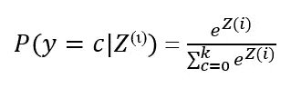
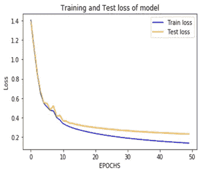

# 通过聊天机器人用机器学习解决抑郁症

> 原文：<https://medium.com/analytics-vidhya/tackling-depression-with-machine-learning-via-chatbot-1e5f5546f36a?source=collection_archive---------0----------------------->

照片由 [Jayberries](https://commons.wikimedia.org/wiki/User:Jayberries) 拍摄，在[知识共享](https://en.wikipedia.org/wiki/en:Creative_Commons)署名下获得许可

抑郁症是一个沉默的杀手。人们抑郁的原因有很多，比如失去亲人、失业、看到令人不安的事情、骚扰等等。如果不能以健康的方式解决抑郁症，它会严重影响我们的活动表现和对生活的兴趣。

在这篇文章中，我提出了一种机器学习可以用来治疗抑郁症的方法。想象一下，与聊天机器人或语音服务交谈，它检测你语气中的情绪，如愤怒、恐惧或悲伤，并基于此，语音服务试图让你开心。这正是我想出利用机器学习开发抑郁症助手聊天机器人的想法的原因。

# 数据:

为了开发聊天机器人，我使用了可在[http://saifmohammad . com/网页/emotion intensity-shared task . html](http://saifmohammad.com/WebPages/EmotionIntensity-SharedTask.html)获得的 Tweet 情感分类数据集。在这个链接中有 4 种不同情绪的数据，即愤怒、恐惧、快乐和悲伤。在每一行数据中都有推文，然后是推文表达的情绪，然后是情绪的强度。数据集的外观示例如下所示:

> 我的血液沸腾愤怒 0.875

但并非愤怒数据集中的每条推特都表达了愤怒，比如:

> @someoone 夸张地大笑起来。愤怒 0.067

尽管上面的推文出现在愤怒数据集中，但它并没有表达愤怒。这条推文末尾所附的愤怒程度也很明显。只是 0.067，意思是，推文没有表达愤怒。其他情感的数据集也是如此

 [## DDI 编辑推荐:5 本让你从新手变成专家的机器学习书籍|数据驱动…

### 机器学习行业的蓬勃发展重新引起了人们对人工智能的兴趣

www.datadriveninvestor.com](https://www.datadriveninvestor.com/2019/03/03/editors-pick-5-machine-learning-books/) 

为了开发一个完整的数据集，我下载了 4 种情绪的推文，并使用 0.5 的阈值解析它们，以便只有那些“强烈”表达分类情绪的推文保留在我的数据集中。

# 预处理:

在训练数据中，我们总共有 3751 条推文，938 条测试数据，以及总共 7578 个包含表情符号的独特单词。在自然语言处理(NLP)任务中使用的标准预处理技术被实现如下:

1.  删除推文中出现的标点符号和特殊字符，包括@和#。
2.  使推文小写。
3.  标记每条推文。
4.  对每个单词进行词干分析，以获得每个单词的最短可能形式。例如“检索”、“被检索”、“检索”简化为词干“检索”。
5.  构建一个单词包模型和一个热编码。我们得到一个由 7578 个独特单词组成的单词包。我们对我们的数据使用一个热编码方法，即我们有长度为 7578 的向量，我们将 1 放在 tweet 中与单词包中的单词匹配的地方，将 0 放在其他地方。
6.  最后，我们重组数据集，将数据分成 80:20 的训练集和测试集。

# 机器学习模型:

对于这个任务，我选择了使用神经网络，这是一个机器学习模型，并在不使用库的情况下从头设计了一个。我使用了一个单隐层神经网络，隐层有 100 个神经元，输出层有 4 个神经元，因为有 4 个基于 4 种情绪(愤怒、恐惧、快乐或悲伤)的类。下图给出了我们的神经网络模型的样子，为了便于理解，显示了所有数据矩阵的大小。

在隐含层，我们将在每个神经元内部进行如下计算:
***Z1=W1*X + b1***

其中“W1”是 100(隐藏层中的神经元)x 7578(单词)，而“X”是我们的输入，其大小为 7578(唯一单词)x 3751 (tweets)。“b1”是偏差为 100(神经元)x 1。实际上，在训练集中 X 是 3751 (tweets) x 7578(唯一单词),但在上面的图片中，我故意显示了输入 X 的转置维度，以使矩阵乘法有意义，因为 W1 不会给出与 X 的点积，否则，因为矩阵乘法发生时，矩阵 1 的行应该等于矩阵 2 的列，反之亦然。

因此，“Z1”将具有 100×3751 的大小，其将被 ReLU 激活函数视为，

其中“A1”是用 ReLU 激活函数公式处理的“Z1”。“A1”将与“Z1”具有相同的大小，即 100x3751。

在输出层，我们将在每个神经元中进行以下计算。我们将“A1”乘以权重向量“W2 ”,

***Z2 = W2*A1+b2***

其中“Z2”是“W2”和“A1”加上大小为 4(输出层中的神经元)×1 的偏置向量“b2”的点积。最后，“Z2”的大小为 4x3751，因为“W2”的大小为 4(输出层中的神经元)x 100(隐藏层中的神经元)，而“A1”的大小为 100x3751。因此，他们的点积加上偏差“b2”将得到尺寸为 4x3751 的“Z2”。

最后，我们应用 softmax 激活函数来确定 tweet 的类别，

简言之，softmax 函数告诉我们输入属于特定类的可能性。我们预测概率比其他类高的类，作为预测输出类。

(很抱歉如此强调维度，但要让神经网络工作，理解这一点很重要)

# 培训流程:

该模型经过 50 个历元的训练，学习率保持在 0.1。在训练和验证之后，观察到集合丢失。可以看出，我们的模型收敛得很好。

下面的曲线显示了我们的模型的精度，它对所有的类都非常好。

# 工作中的聊天机器人

训练完模型后，现在我们可以使用聊天机器人了。为此，我简单地在 jupyter notebook 中使用 Python 的输入命令，然后用户输入他/她的情感。该模型通过已训练的模型运行它，并告诉存在什么情绪以及该情绪在其他情绪中占主导地位的程度。

如果用户情绪表达了愤怒/恐惧/悲伤，则聊天机器人向用户提供一个笑话。下图显示了这一过程。

如果用户继续要求另一个笑话，它会继续下去。大约有 70 个笑话(实际上很搞笑)从一个文本文件加载并显示给用户。当用户写“否”时，聊天机器人退出。

# 结论:

这个简单的推文情绪分类扩展到抑郁症助手聊天机器人，可以证明是一个生命的救星，或者是一个为有困难的人打气的人。我希望我没有失去《黑客帝国》的读者

未来的工作将包括一个比热编码方法更好的技术来建立一个健壮的模型。

这是我第一篇关于 Medium.com 的文章。希望这个项目对机器学习、NLP、神经网络的学习者有所帮助。代码和所有数据都在我的 GitHub 个人资料中，网址是 https://GitHub . com/shayanalibhatti/Depression-Assistant-Chatbot。

如果你喜欢这个实现，不要忘了给一些掌声:)