# 解决 Kaggle 任务:印度太阳能电池板站点的描述性分析

> 原文：<https://medium.com/analytics-vidhya/tackling-kaggle-tasks-descriptive-analytics-on-solar-panel-sites-in-india-9b0a926a3e97?source=collection_archive---------18----------------------->

勇敢的读者们，你们好，欢迎来到我的新系列“解决 Kaggle 任务”。在这个系列中，我将探索 Kaggle 必须提供的海量数据，并完成每个数据集所有者提出的与他们提交的数据集相关的各种任务。在本期节目中，我们将介绍一个由 Ani Kannal 提交的名为“太阳能发电数据”的数据集。该数据集包括印度两个太阳能电池板工厂 34 天的数据记录。总共有 4 个数据文件，每个工厂有 2 个文件。一个文件包括该工厂的发电数据，另一个文件包括该工厂的传感器数据，如温度和辐射水平。数据集可以在[这里](https://www.kaggle.com/anikannal/solar-power-generation-data)找到。数据集的创建者要求 Kaggle 用户完成四项任务中的任何一项，包括描述性分析、可视化和进一步探索、竞争和讲故事。在这篇文章中，我将概述我在完成四个任务中的第一个，描述性分析的过程。

**第 1 部分—加载数据，简要探索每个数据集，并理解和探索数据中的潜在模式**

我首先为提供给我的四个文件创建单独的数据框架，然后分析每个文件的基本探索和统计数据。为此，我创建了一个基本函数，它打印出传入数据帧的前五行数据、数据帧中的列名、数据帧中的行数和列数，以及数据帧的统计摘要，包括数字和非数字列。

我创建的输出基本数据帧探索和统计的函数

我通过上面创建的函数运行每个数据帧得到的输出，从左上到右下:plant_1_generation_df，plant_1_sensor_df，plant_2_generation_df，plant_2_sensor_df

然后，我列出了数据框架中的每一列，从作者提供的信息中提取了一些信息，并做了一些自己的小调查。

在 plant_generation 数据中找到的列名及其描述

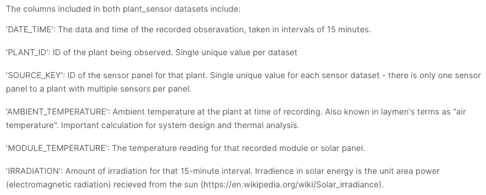

在 plant_sensor 数据中找到的列名及其描述—底部的链接是[这里是](https://en.wikipedia.org/wiki/Solar_irradiance)。

接下来，我为我的每个数据框架创建了配对图，观察了结果，得出了一些基本结论和假设。首先，给定两个电厂发电机组的配对图，我确定 DC 电力与交流电力呈现出近乎完美的正相关关系。这是有道理的，因为逆变器使交流电源依赖于 DC 功率的数量——它的工作是将 DC 转换成交流。此外，我可以看到 DC 和交流电源都有助于日产量和总产量的实例，这在直觉上是有意义的，因为日产量和总产量应该是交流/DC 电源的直接结果。

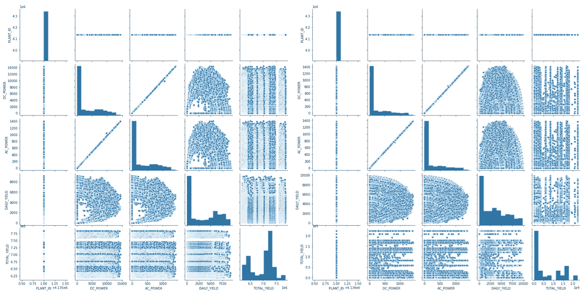

工厂世代数据帧的配对图，工厂 1(左)和工厂 2(右)

第二，给定两个设备传感器组的配对图，我确定环境温度的增加与模块温度的增加和辐照水平的增加密切相关，并且模块温度的增加与辐照水平的增加密切相关。这使我们得出结论，增加从太阳接收的能量具有增加模块温度以及周围空气(环境)温度的效果。这在直觉上是有道理的，因为来自太阳的更高能量会导致温度上升。

值得注意的一件有趣的事情是环境温度和模块温度之间的相关性，尽管这在可视化中显得微不足道。在某一点之前，每个特性看起来都以相当正的速率增加，然后我们看到随着环境温度继续增加，模块温度开始略微降低。正如我提到的，这只是轻微的，可能没有什么，但它也可能是一个可能的温度调节系统的标志，该系统防止模块上升到某一水平以上，或者可能是用于创建模块的材料(太阳能电池板)。关于这一点的最后一个想法，考虑到热量和能量是如何工作的，这也可能是由模块将能量从太阳下游转移到逆变器，然后转移到其他能量存储或管理系统引起的。环境温度本身不在受控环境中，因此随着从太阳获得的能量的增加，将继续获得热量。模块温度将能量转移走，在某种意义上调节其时刻温度。

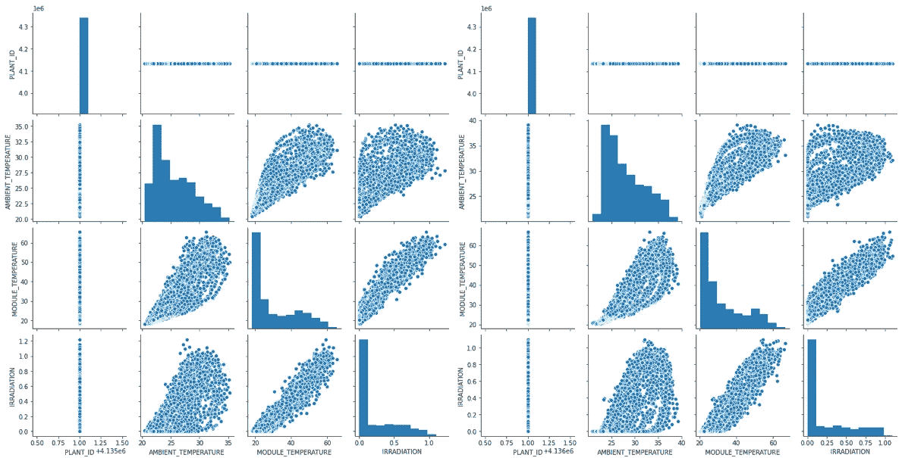

工厂传感器数据帧的配对图，工厂 1(左)和工厂 2(右)

接下来，我将“DATE_TIME”列从“object”数据类型转换为 datetime 格式，这使得它在比较和特性工程中非常有用。

用于将每个数据帧中的“日期时间”列转换为日期时间格式的代码

在此之后，我快速查看了按年份排列的数据帧实例，决定从“DATE_TIME”列中设计几个新列，即“month”列、“day”列、“hour”列和“minute”列。所有的例子都发生在 2020 年，所以我决定忽略这一年。

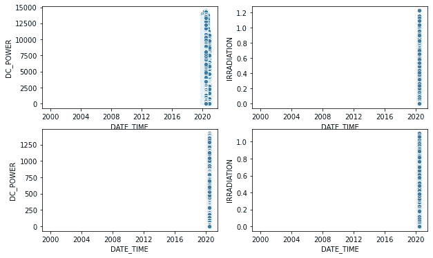

按年份查看每个数据框架中的实例

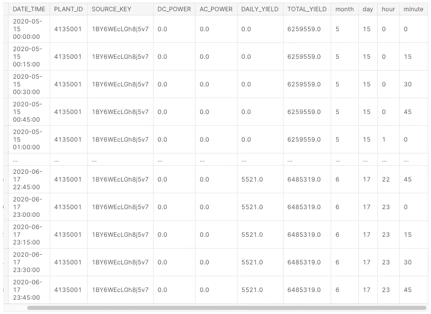

一些日期时间特征工程后的我的数据帧

在特征工程之后，我又看了一眼 pairplots，想确定我能看到什么新趋势。鉴于这一新观点，许多新的观察结果变得清楚了。首先，给定植物世代数据帧对图:

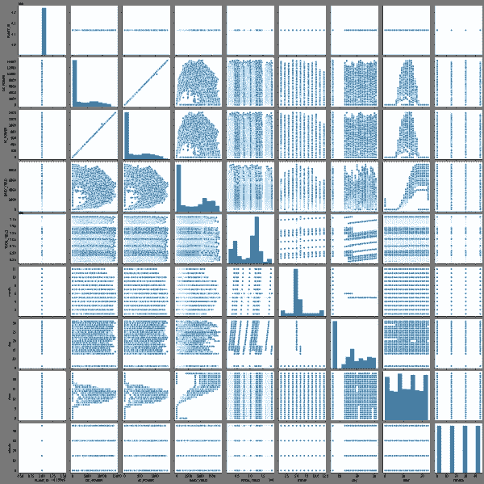

具有新设计特征的 plant_1_generation 数据框架的成对图

*   从第 1 天到第 12 天或第 13 天左右，所有特征似乎都缺少数据。进一步研究将会得出更准确的数字。可能是因为暂停收集观察结果？
*   年中前后，日产量似乎略有上升。这可能是因为一个阳光更加充足的季节。

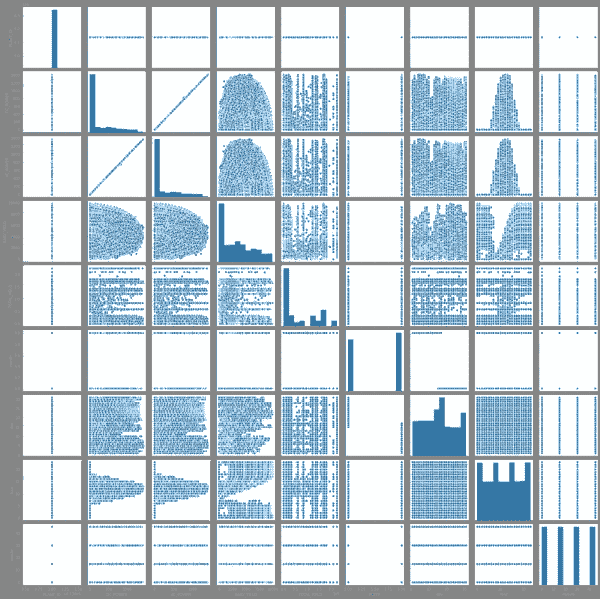

具有新设计特征的 plant_2_generation 数据框架的成对图

*   正如我们直觉预期的那样，总发电量在过去的每个月都呈现出缓慢的正增长趋势。
*   大多数数据似乎是在第 5 个月和第 6 个月(5 月和 6 月)内收集的。为什么？更长的太阳辐射期有利于更好的数据收集？
*   DC 和交流功率随着一天中时间的增加而快速增加，直到某一点，然后随着时间的增加而开始下降。这可能是由于太阳全天的运动。中午有更多的太阳，早上和晚上没有太阳。
*   随着时间的增加，日产量开始逐渐增加，然后开始显著增加到某一点(大约在 DC 和交流功率开始下降的同一点)，然后随着 DC 和交流功率回落到较低的点而变得平稳。这也可以用太阳全天的运动来解释。日产量将开始低，然后随着一天中的时间带来更多的阳光，从而更多的交流/DC 电力，日产量将开始增加。随着时间的推移，日照量的减少，这种增长将开始放缓，从而降低 DC 和交流功率水平。最终，这种增长变得如此之小，以至于变得过时，我们看到每日增长持平。
*   随着今年晚些时候以及当天晚些时候的到来，总产量显示出稳定的增长，这再次从直觉上讲是有道理的。总产量应该不断增加久而久之，收集更多的电力。
*   2 号电厂似乎只有 5 月和 6 月(5 月和 6 月)两个月的记录。
*   在工厂站点 2，日产量和一天中的时间之间的相关性初看起来有很大的不同；然而，我们可以看到，它经历了与我们在工厂现场 1 看到的相同的正相关。这里的主要区别在于，在 2 号电厂，我们似乎以高水平的日发电量开始了一天的工作。对此的一种可能解释是，这是前一天结转的超额收益。

我还能够从新的植物传感器数据帧对图中确定一些观察结果:

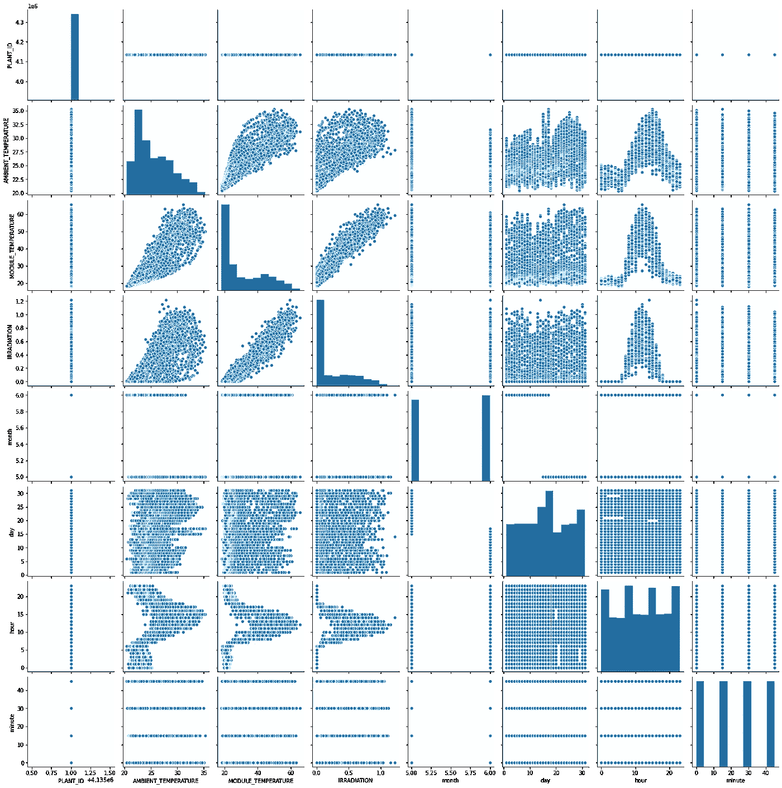

具有新设计特征的 plant_1_sensor 数据帧的成对图

*   我们可以立即看到 plant_1_generation 数据帧与所有其他数据帧之间的显著差异。在 month 列中，前者有 12 个值，但所有其他列都有两个值(5 和 6 ),表明似乎只有这两个月的观察记录。碰巧的是，这两个月也是在 plant_1_generation 数据框架中观察到最重要实例的两个月。

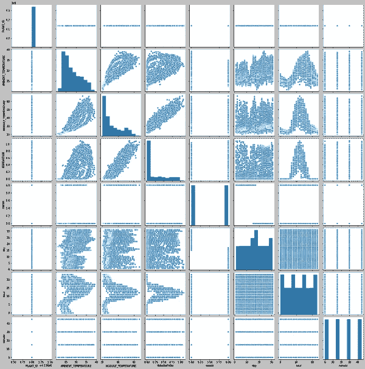

具有新设计特征的 plant_2_sensor 数据帧的成对图

*   正如我们所料，随着时间的增加，我们可以看到环境温度、模块温度和辐射之间的正相关关系，直到某个点，然后我们看到一个负相关关系，其中上述特征随着时间的增加开始下降。这可以用与我们第一次观察相同的方式来解释:太阳全天穿过天空的运动。
*   或许重要的一点是，或许不是:我们在 plant_1 数据框中看到缺失的天数，大约是第 2-14 天，在 plant_2 数据框中似乎没有缺失。

P **艺术二——深度数据探索**

完成了一些基本的观察后，我的下一个目标是对我创建的每个数据框架进行更深入的探索。在这里，我将研究并解决一些问题，如日产量的平均值、每天的总辐射量、环境和模块温度探测、一些逆变器探测和交流/DC 功率探测。

我从寻找每日收益的平均值开始。我创建了两个新的数据帧，并且只包含了任何给定一天的最后 15 分钟内记录的实例。因为“DAILY_YIELD”列是一天中每日产量的总和，所以这将给出任意给定一天的每日总产量。我发现了以下内容:

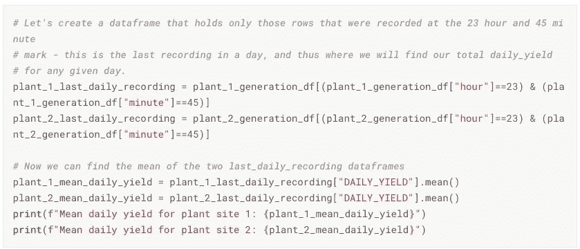

计算每个电厂的平均日发电量(底部)及其相应代码(顶部)的输出

接下来，我确定了每个工厂每天的总辐射量。为了做到这一点，我将植物传感器数据帧分为五月的数据和六月的数据。然后，我计算了总天数，即每个数据帧的值计数长度(按月分隔)并根据工厂地点将它们加在一起，得出 34 天的计数——该信息由数据集的作者提供给我，但是我选择接近它，就好像它没有提供给我一样。然后，我对主电厂发电数据帧中的所有辐照记录进行了汇总，因为该列并不是每次经过 15 分钟间隔后辐照的汇总，而是自上次记录以来记录的辐照量。使用这些总和，我将它们划分为每个数据框中计算的总天数，得出以下每天辐射量计算值:

计算各工厂每天总辐照量的输出(下图)及其相应的代码(上图)

为了探究环境温度和模块温度，我选择找出两者的最大值并进行比较。我用两种方法来处理这个问题:首先，我创建了一系列四个图表，将每个工厂数据帧的环境温度和模块温度与一个月中的某一天进行比较。我通过按月分离数据来进一步细分。

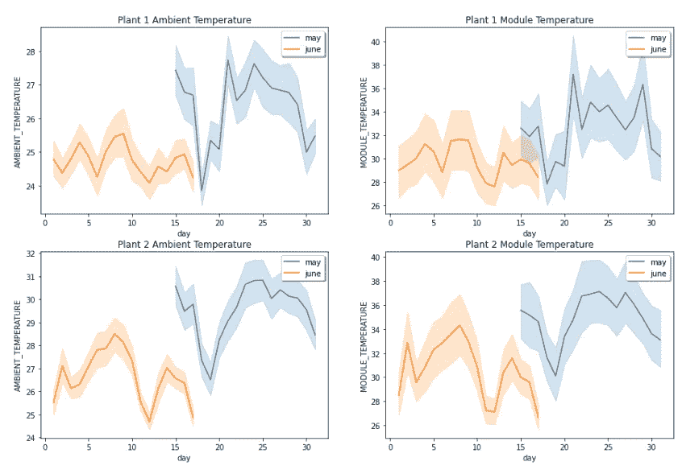

环境温度和模块温度与一天中的时间和一个月中的时间相比较的图形表示。

然后，我通过简单地在“环境温度”和“模块温度”列中找到每个数据帧的最大值来量化这些观察结果。

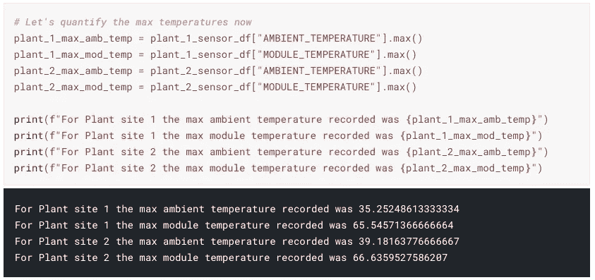

为每个设备记录的最高环境温度和模块温度(底部)及其相应的代码(顶部)

每个工厂都有特定数量的逆变器与成排的模块或太阳能电池板相连。我想知道每个工厂有多少逆变器。为此，我找到了每个电厂发电数据帧中的所有唯一值，然后我找到了该列表的长度，得出每个电厂站点共有 22 个逆变器。

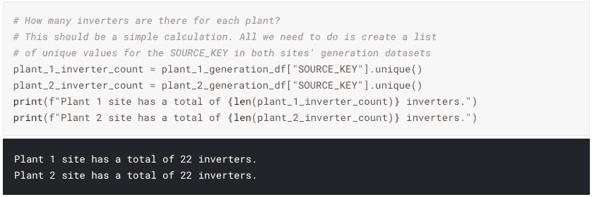

每个工厂的逆变器数量(底部)和计算它们的源代码(顶部)

接下来的几次探索要花更多的时间。首先，我想找出每天时间间隔内产生的最大功率。我使用了一系列 python 图(字典)和 for 循环来拆分我之前按月创建的 last_daily_recording 数据帧，并以“day”-“daily _ yield _ sum”对的形式创建键值对。

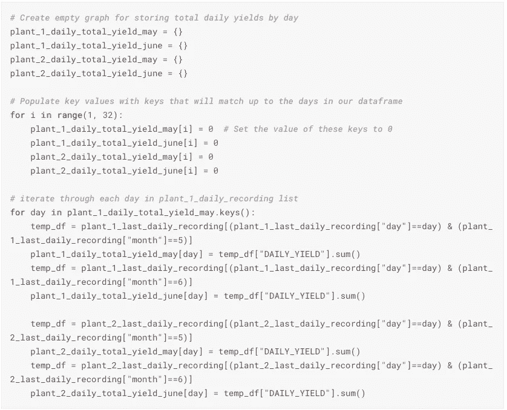

用于将 last_daily_recording 数据帧分成字典的源代码，这些字典将“day”作为关键字，将数据帧的“DAILY_YIELD”总和作为值

为了找到每月的最大日总和，我采用了上述结果并使用了 for 循环，将当前迭代与设置为最大值的迭代进行比较，最终以一组四个变量结束，这些变量保存了五月和六月每个工厂的最大值。

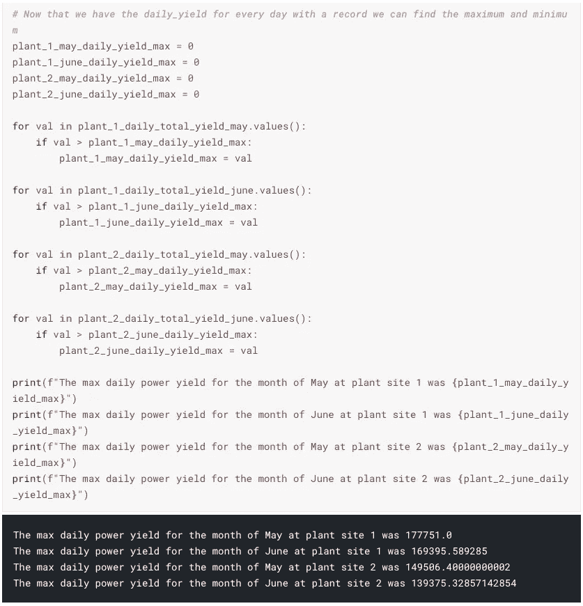

每个电厂站点每月的最大日发电量及其对应的代码。

最后，我使用这些最终结果来计算每个电厂的绝对最大日发电量。我以图形化的方式查看这些结果，结束了这次探索。

每个工厂的绝对最大日产量及其相应的代码。

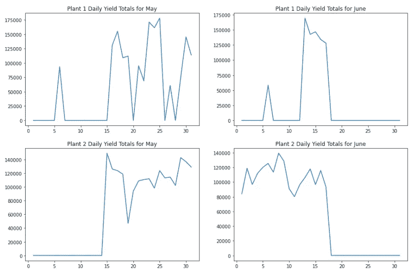

每个工厂每月最高日产量的图形表示。

早些时候，我计算过每个工厂有多少逆变器。我决定这将有助于探索每个逆变器的交流/DC 功率产量。我首先根据唯一的“SOURCE_KEY”值对数据帧进行排序，并通过一系列 python 图(字典)和 for 循环找到每个逆变器的日收益率总和。利用这些结果，我更多地使用 for 循环来找出哪个逆变器产生的功率最大，以及每个电厂站点对应的功率值是多少。

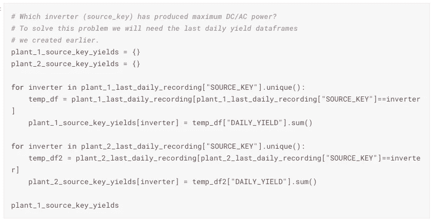

源代码分离的数据由逆变器 ids 和他们的日产量和

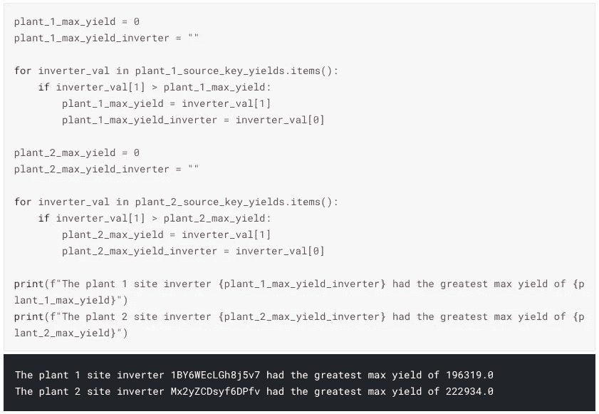

每个工厂产量最高的逆变器及其产量值(底部)和计算源代码(顶部)

最后，我按照最高日产量到最低日产量的顺序组织了每个工厂的逆变器。

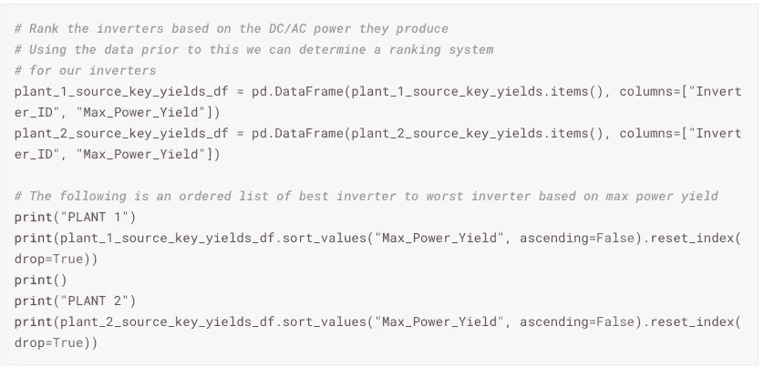

根据最大日发电量订购逆变器的源代码

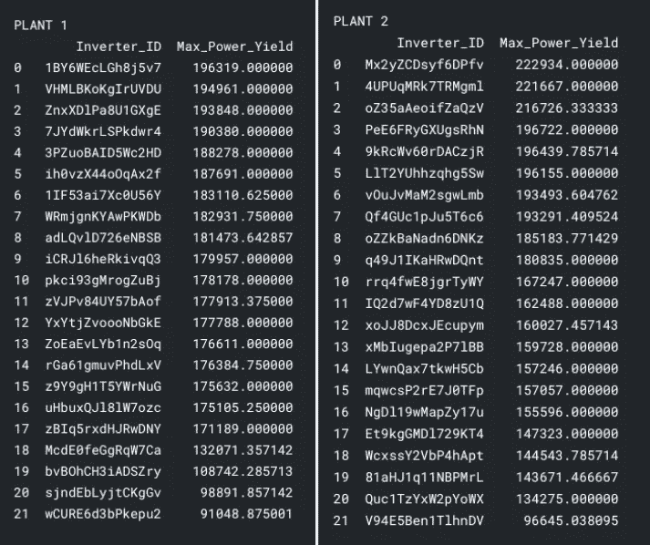

两个工厂中每个逆变器的最佳日产量的有序列表

最后，我仔细研究了为什么我们的一个数据框似乎包含了五月和六月以外的月份的数据。我查看了该数据框架的“日”值计数，只包括小于 5(5 月)和大于 6(6 月)的月份。然后，我只查看了 5 月份的数据和 6 月份的数据。我能够确定每年每个月的第 6 天在计划站点 1 收集数据，但仅用于发电计算，在第 6 天之外获得数据的月份只有 5 月和 6 月。我断定这可能是出于测试的目的，也许是对那个特定工厂长达一年的研究，或者甚至是用于确定工厂生产率的每月所需的检查。

谢谢你陪我走过这段漫长而艰辛的旅程。我希望你至少喜欢一些分析，我希望你能继续和我一起进行下一次安装，在那里我将使用相同的数据集来扩展我们对几个可视化和图形的探索。下次见，勇敢的读者。继续写，快乐编码。