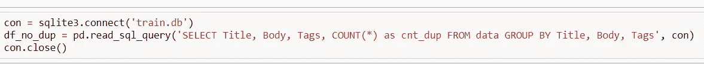

# 标签预测器

> 原文：<https://medium.com/analytics-vidhya/tag-predictor-fae407274fa0?source=collection_archive---------21----------------------->

如果你是开发人员，那么这个问题陈述会让你兴奋。由于我是一个 android 开发者和机器学习爱好者，我总是搜索一些我忘记的功能，stack overflow 将在这方面帮助我。你想过堆栈溢出是如何预测标签的吗？标签是必不可少的，因为它会根据标签发送问题给专家。


**什么是堆栈溢出？**

Stack-overflow 是一个平台，学生和专业人士可以在这里发布问题并回答有关编程的问题。这是一个展示他们知识的平台。它属于堆栈交换网络。答案是基于它对社区的有用性来投票的。用户也可以使用堆栈溢出来推进他们的职业生涯。这是一个拥有 700 多万程序员的社区。

**问题陈述**

我们必须预测堆栈溢出的问题。

**业务目标和约束**


假设任何一个用户问“如何改变 android 中按钮点击时的颜色”这个问题。现在我们希望通过给定的问题和描述来预测一些标签。在上面的图片中，标签是 android，因此堆栈溢出生态系统所做的是，它将这个问题发送给已经回答了许多与 android 相关的问题的人。

现在你认为如果预测的标签与问题无关，那么它将被发送给错误的人，因此它将影响用户体验。标签的错误分类可能会对业务产生巨大影响。

没有如此严格的延迟限制意味着我们可以花时间来预测。我们的主要目标是正确预测数据点。

**机器学习问题陈述**

这是一个多标签分类问题。


多类分类问题和多标签分类问题是有区别的。

**多类分类**指两个以上类的分类任务；例如对一组水果图像进行分类，这些水果可以是橙子、苹果或梨。多类分类假设每个样本被赋予一个且仅一个标签:水果可以是苹果或梨，但不能同时是两者。

**多标签分类**为每个样本分配一组目标标签。这可以被认为是预测一个数据点的不相互排斥的属性，例如与一个文档相关的主题。一条短信可以同时涉及宗教、政治、金融或教育中的任何一个，也可以什么都不涉及。


**绩效指标**

**F1 得分**为 2*(精度*召回)/(精度+召回))

精度基本在所有预测的标签之外，有多少属于正确的类。召回是指每一类的所有正确标签中，有多少被正确分类。


**数据集**

Id —每个问题的唯一标识符

标题—问题的标题

正文—问题的正文

标签—以空格分隔的格式与问题关联的标签。


## **探索性数据分析**

这是任何机器学习问题中最重要的部分。由此，我们可以更深入地了解我们的数据，并从旧特征中提取一些新特征。

***使用 Pandas 配合 sqlite 加载数据:***



**标签分析**

标签列中有一些 Nan 值，我们必须替换它们。为了简化，我用空字符串替换。

代码片段

```
df_no_dup.fillna(" ",inplace=True)
```

重复行数-> 1827881

我们必须删除重复，因为它使我们的模型偏差。

创建非重复数据库


唯一标签数量-> 1827881


我们在上面的图中看到，一些标签比其他标签更频繁。让我们看看经常出现的标签。


大多数标签都是编程语言。我在引言中已经提到，堆栈溢出被开发人员广泛使用。一些操作系统也在那里，如 windows，Linux。

**有问题的标签数量**


大多数问题有 2 或 3 个标签。

**数据预处理**

1.  从问题中移除 html 标签，就像
    等。

代码片段


2.从主体中移除所有代码。

3.除了 C 语言之外，删除停用词，因为它是编程语言。

4.将所有字符转换成小写，并删除问题中的特殊字符。

5.使用雪球去梗器或波特去梗器去梗。

代码片段


预处理后，数据集看起来像这样


**机器学习模型**

这是多标签分类问题，现在我们将尝试将多标签转换为单标签。

**二元相关技术**

它基本上将每个标签视为一个单独的单个类别分类问题。


x 是数据点，Y1、Y2、Y3、Y4 是标签。如果 X2 和 Y1 等于 1，则意味着 X2 具有标签 Y1。


现在问题变成了 X 是数据点，Yi 是标号。所以问题归结为二元分类器。

**逻辑回归(一分类器对其余分类器)**


实际上，在一个与其余分类器中，我们训练 n-二进制分类器，并通过置信区间或多数表决算法来预测数据点的类别标签。

多标签算法接受多个标签上的二进制掩码。每个预测的结果将是一个由 0 和 1 组成的数组，用于标记哪些类标签适用于每个行输入样本

代码片段


你也可以尝试各种其他技术，如分类器链，标签幂集。

**结论:**

1.  我把大部分时间花在文本的预处理上。
2.  我取前 15%最常用的标签，并将这些标签用于机器学习模型。
3.  我在预处理过程中创建了三个不同的数据库，否则再次运行 Jupyter notebook 将需要 3-4 个小时。

**参考文献**

[](https://towardsdatascience.com/journey-to-the-center-of-multi-label-classification-384c40229bff) [## 深入探讨多标签分类..！(附有详细的案例研究)

### 有毒-评论分类。

towardsdatascience.com](https://towardsdatascience.com/journey-to-the-center-of-multi-label-classification-384c40229bff) [](https://www.analyticsvidhya.com/blog/2017/08/introduction-to-multi-label-classification/) [## 解决多标签分类问题(包括案例研究)

### 由于某种原因，回归和分类问题最终在机器中占据了大部分注意力…

www.analyticsvidhya.com](https://www.analyticsvidhya.com/blog/2017/08/introduction-to-multi-label-classification/) [](https://towardsdatascience.com/multi-class-text-classification-with-scikit-learn-12f1e60e0a9f) [## 使用 Scikit-Learn 进行多类文本分类

### 文本分类在商业领域有很多应用。例如，新闻故事通常是…

towardsdatascience.com](https://towardsdatascience.com/multi-class-text-classification-with-scikit-learn-12f1e60e0a9f) [](https://www.kaggle.com/c/facebook-recruiting-iii-keyword-extraction/data) [## 脸书招聘 III -关键词提取

### 从数百万个文本问题中识别关键词和标签

www.kaggle.com](https://www.kaggle.com/c/facebook-recruiting-iii-keyword-extraction/data)